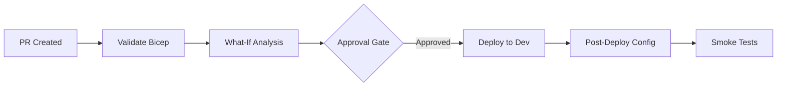

# PRP: Microsoft Fabric POC - Casino/Gaming Industry Demo Environment

## Executive Summary

Build a comprehensive, production-ready Microsoft Fabric demonstration environment showcasing:
- **Medallion Architecture** (Bronze/Silver/Gold) with Lakehouse
- **Real-Time Intelligence** for casino floor monitoring
- **Direct Lake** Power BI integration
- **Purview** data governance
- **Infrastructure as Code** (Bicep/ARM) for rapid deployment
- **Complete tutorials** with step-by-step documentation

**Primary Focus**: Casino/Gaming industry (MVP)
**Future Expansions**: Tribal/Sovereign nations, Federal government (DOT, FAA, USDA, NOAA)
**Target SKU**: F64 (P1 equivalent)
**Repository**: Public GitHub on personal Microsoft account

---

## 1. Repository Structure

```
Supercharge_Microsoft_Fabric/
├── README.md                              # Project overview, quick start
├── CLAUDE.md                              # Claude Code project configuration
├── .gitignore                             # Exclude .env, secrets, temp/
├── .env.sample                            # Environment variable template
│
├── .claude/                               # Claude Code project config
│   ├── prp.md                             # This file - Project Requirements Plan
│   └── settings.json                      # Project-specific settings
│
├── .github/
│   ├── workflows/
│   │   ├── deploy-infra.yml               # Main IaC deployment
│   │   ├── deploy-infra-pr.yml            # PR validation (what-if)
│   │   ├── validate-bicep.yml             # Bicep linting
│   │   └── run-tests.yml                  # Integration tests
│   ├── CODEOWNERS
│   └── dependabot.yml
│
├── infra/                                 # Infrastructure as Code
│   ├── main.bicep                         # Root orchestration
│   ├── main.bicepparam
│   ├── modules/
│   │   ├── fabric/                        # Fabric capacity
│   │   ├── governance/                    # Purview account
│   │   ├── storage/                       # ADLS Gen2
│   │   ├── security/                      # Key Vault, managed identity
│   │   ├── networking/                    # VNet, private endpoints
│   │   └── monitoring/                    # Log Analytics
│   └── environments/
│       ├── dev/
│       ├── staging/
│       └── prod/
│
├── docs/                                  # Main documentation
│   ├── ARCHITECTURE.md                    # High-level architecture
│   ├── DEPLOYMENT.md                      # Deployment guide
│   ├── SECURITY.md                        # Security & compliance
│   ├── PREREQUISITES.md                   # Setup requirements
│   └── diagrams/                          # Mermaid + architecture images
│
├── tutorials/                             # Step-by-step tutorials
│   ├── 00-environment-setup/
│   ├── 01-bronze-layer/
│   ├── 02-silver-layer/
│   ├── 03-gold-layer/
│   ├── 04-real-time-analytics/
│   ├── 05-direct-lake-powerbi/
│   ├── 06-data-pipelines/
│   ├── 07-governance-purview/
│   ├── 08-database-mirroring/
│   └── 09-advanced-ai-ml/
│
├── poc-agenda/                            # 3-Day POC specific content
│   ├── README.md
│   ├── day1-medallion-foundation.md
│   ├── day2-transformations-realtime.md
│   ├── day3-bi-governance-mirroring.md
│   └── instructor-guide/
│
├── data-generation/                       # Data generators
│   ├── generators/
│   │   ├── base_generator.py
│   │   ├── slot_machine_generator.py
│   │   ├── table_games_generator.py
│   │   ├── player_generator.py
│   │   ├── financial_generator.py
│   │   ├── security_generator.py
│   │   ├── compliance_generator.py
│   │   └── streaming/
│   ├── schemas/
│   ├── config/
│   └── notebooks/
│
├── notebooks/                             # Fabric-importable notebooks
│   ├── bronze/
│   ├── silver/
│   ├── gold/
│   ├── real-time/
│   └── ml/
│
├── validation/                            # Data quality & testing
│   ├── great_expectations/
│   ├── unit_tests/
│   ├── integration_tests/
│   └── deployment_tests/
│
└── future-expansions/                     # Placeholder for future work
    ├── tribal-healthcare/
    ├── federal-dot-faa/
    └── retail-ecommerce/
```

---

## 2. Infrastructure as Code (Bicep)

### 2.1 Core Components to Deploy

| Component | Resource Type | Purpose |
|-----------|--------------|---------|
| Fabric Capacity | `Microsoft.Fabric/capacities` | F64 SKU for POC |
| Purview Account | `Microsoft.Purview/accounts` | Data governance |
| Storage Account | `Microsoft.Storage/storageAccounts` | ADLS Gen2 landing zone |
| Key Vault | `Microsoft.KeyVault/vaults` | Secrets management |
| Log Analytics | `Microsoft.OperationalInsights/workspaces` | Monitoring |
| Virtual Network | `Microsoft.Network/virtualNetworks` | Private endpoints |
| Managed Identity | `Microsoft.ManagedIdentity/userAssignedIdentities` | Automation |

### 2.2 Deployment Pipeline (GitHub Actions)



### 2.3 Security Requirements

- **Zero Trust**: All resources use private endpoints
- **No Secrets in Repo**: Use .env files + Key Vault references
- **OIDC Authentication**: Federated credentials for GitHub Actions
- **RBAC**: Least privilege role assignments

---

## 3. Tutorial Curriculum Structure

### 3.1 Learning Path Overview

```
LEVEL 1: FOUNDATION (4 hours)
├── Environment Setup (Workspace, Lakehouse, Capacity)
├── Medallion Architecture Concepts
└── Bronze Layer Fundamentals

LEVEL 2: CORE IMPLEMENTATION (8 hours)
├── Bronze Layer - All Casino Data Domains
├── Silver Layer Transformations
├── Data Quality Implementation
└── Gold Layer Aggregations

LEVEL 3: ADVANCED ANALYTICS (6 hours)
├── Real-Time Intelligence (Eventstreams, KQL)
├── Direct Lake Semantic Models
├── Power BI Reports
└── AI/ML Notebooks

LEVEL 4: ENTERPRISE FEATURES (6 hours)
├── Purview Governance Integration
├── Database Mirroring (SQL Server, Snowflake, Cosmos DB)
├── Security & Compliance (RLS, DLP)
└── Production Deployment Patterns
```

### 3.2 Casino/Gaming Data Domains

| Domain | Bronze Table | Silver Table | Gold Table |
|--------|-------------|--------------|------------|
| Slot Machines | `bronze_slot_telemetry` | `silver_slot_cleansed` | `gold_slot_performance` |
| Table Games | `bronze_table_games` | `silver_table_enriched` | `gold_table_analytics` |
| Player/Loyalty | `bronze_player_profile` | `silver_player_master` | `gold_player_360` |
| Financial/Cage | `bronze_financial_txn` | `silver_financial_reconciled` | `gold_financial_summary` |
| Security/Surveillance | `bronze_security_events` | `silver_security_enriched` | `gold_security_dashboard` |
| Compliance | `bronze_compliance_filings` | `silver_compliance_validated` | `gold_compliance_reporting` |

### 3.3 Sample Notebooks (Fabric-Importable)

**Bronze Layer:**
- `01_bronze_slot_telemetry.py` - IoT streaming data ingestion
- `02_bronze_player_profile.py` - Player profile with PII handling
- `03_bronze_financial_txn.py` - Financial transactions
- `04_bronze_compliance.py` - Regulatory data (CTR, SAR, W2G)
- `05_bronze_table_games.py` - Table game transactions
- `06_bronze_security_events.py` - Surveillance/access logs

**Silver Layer:**
- `01_silver_slot_cleansed.py` - Data quality, deduplication
- `02_silver_player_master.py` - SCD Type 2 implementation
- `03_silver_table_enriched.py` - Table games enrichment
- `04_silver_financial_reconciled.py` - Reconciliation patterns
- `05_silver_security_enriched.py` - Security correlation
- `06_silver_compliance_validated.py` - Compliance validation

**Gold Layer:**
- `01_gold_slot_performance.py` - KPIs: Theo, Hold %, Coin-in
- `02_gold_player_360.py` - Player LTV, churn scoring
- `03_gold_compliance_reporting.py` - NIGC/FinCEN reports
- `04_gold_table_analytics.py` - Table games analytics
- `05_gold_financial_summary.py` - Financial summary
- `06_gold_security_dashboard.py` - Security dashboard

**Real-Time:**
- `01_realtime_slot_streaming.py` - Eventstream configuration
- `02_kql_casino_floor.kql` - KQL queries

**Machine Learning:**
- `01_ml_player_churn_prediction.py` - Churn prediction model
- `02_ml_fraud_detection.py` - Fraud detection model

---

## 4. Data Generation Strategy

### 4.1 Volume Recommendations

**Demo Environment (POC):**
| Domain | Records | Period | Storage |
|--------|---------|--------|---------|
| Slot Telemetry | 500K | 30 days | ~500 MB |
| Table Games | 100K | 30 days | ~100 MB |
| Players | 10K | Static | ~10 MB |
| Financial | 50K | 30 days | ~50 MB |
| **Total** | **~900K** | **30 days** | **~1 GB** |

### 4.2 Data Sources

1. **Custom Synthetic Generators** (Python/Faker)
   - Slot machine telemetry with SAS protocol patterns
   - Compliance data (CTR, SAR, W2G) with threshold logic
   - Player profiles with PII masking

2. **Microsoft Sample Datasets**
   - AdventureWorks (customer dimension patterns)
   - Contoso (financial transaction patterns)
   - Links to download in tutorials

3. **Streaming Generators**
   - EventHub producer for real-time scenarios
   - 50-100 events/second for slot telemetry

### 4.3 Compliance-Specific Data

- **CTR Threshold**: Transactions >= $10,000
- **SAR Patterns**: Structuring detection ($8K-$9.9K x 3+)
- **W2G Generation**: Jackpots >= $1,200
- **PII Handling**: Hashed SSN, masked card numbers

---

## 5. 3-Day POC Agenda (Consolidated)

### Day 1: Medallion Foundation (8 hours)

| Time | Session | Audience | Activities |
|------|---------|----------|------------|
| 9:00-10:30 | Environment Setup | Data Architects (4) | Workspace, Lakehouse, Capacity settings |
| 10:45-12:30 | Bronze Layer Part 1 | Data Architects (4) | Slot telemetry, table games ingestion |
| 13:30-15:00 | Bronze Layer Part 2 | Data Architects (4) | Player, financial, compliance data |
| 15:15-17:00 | Silver Layer Start | Data Architects (4) | Data cleansing, schema enforcement |

### Day 2: Transformations & Real-Time (8 hours)

| Time | Session | Audience | Activities |
|------|---------|----------|------------|
| 9:00-10:30 | Silver Layer Complete | Data Architects (4) | SCD Type 2, deduplication |
| 10:45-12:30 | Gold Layer | Data Architects (4) | Aggregations, KPI calculations |
| 13:30-15:00 | Real-Time Analytics | Data Architects (4) | Eventhouse, Eventstreams, KQL |
| 15:15-17:00 | Real-Time Dashboards | Data Architects (4) | Casino floor monitoring |

### Day 3: BI, Governance & Mirroring (8 hours)

| Time | Session | Audience | Activities |
|------|---------|----------|------------|
| 9:00-10:30 | Direct Lake + Power BI | Architects + BI (6) | Semantic models, DAX measures |
| 10:45-12:30 | Power BI Reports | Architects + BI (6) | Executive dashboard, floor ops |
| 13:30-15:00 | Purview Integration | All teams (10+) | Governance, lineage, compliance |
| 15:15-17:00 | Database Mirroring | All teams (10+) | SQL Server, Snowflake demos |

---

## 6. Compliance Frameworks

### 6.1 Gaming Industry

- **NIGC MICS**: Minimum Internal Control Standards
  - Drop count variance < 1%
  - Jackpot verification (W-2G >= $1,200)
  - Meter reconciliation (soft/hard within 0.1%)

### 6.2 Financial

- **FinCEN BSA**: Bank Secrecy Act compliance
  - CTR for cash >= $10,000
  - SAR for suspicious activity
- **PCI-DSS**: Payment card security
  - No full card numbers stored
  - SSN stored as hash only

### 6.3 Healthcare (Future: Tribal)

- **HIPAA**: Protected health information
  - Encryption at rest and in transit
  - Access audit logging

---

## 7. AI/ML Advanced Tutorials

### 7.1 Progressive Depth

1. **Conceptual + Architecture**: Diagrams, patterns
2. **Working Notebooks**: Deployable Spark/Python
3. **Full MLOps Pipeline**: Training, deployment, monitoring

### 7.2 Use Cases

- **Fraud Detection**: Anomaly detection on player behavior
- **Churn Prediction**: Player lifetime value modeling
- **Threat Analytics**: Security incident classification
- **Jackpot Forecasting**: Time-series prediction

---

## 8. Testing Strategy

### 8.1 Test Types

| Type | Tool | Purpose |
|------|------|---------|
| Unit Tests | pytest | Generator logic validation |
| Data Quality | Great Expectations | Schema, completeness, rules |
| Integration | pytest + Fabric API | End-to-end pipeline testing |
| Deployment | Bicep what-if | IaC validation |

### 8.2 Validation Checkpoints

Each tutorial section includes:
- [ ] Table creation verification
- [ ] Row count validation
- [ ] Schema verification
- [ ] Data quality score check

---

## 9. Implementation Phases

### Phase 1: Foundation (Week 1-2) ✅ COMPLETE
- [x] Initialize GitHub repository
- [x] Create Archon project for tracking
- [x] Set up repository structure
- [x] Implement Bicep IaC modules
- [x] Create GitHub Actions workflows

### Phase 2: Data Generation (Week 2-3) ✅ COMPLETE
- [x] Implement base generator class
- [x] Build all domain generators
- [x] Create streaming producers
- [x] Generate sample datasets

### Phase 3: Tutorials - Bronze/Silver/Gold (Week 3-4) ✅ COMPLETE
- [x] Write environment setup tutorials
- [x] Create Bronze layer notebooks
- [x] Create Silver layer notebooks
- [x] Create Gold layer notebooks

### Phase 4: Advanced Features (Week 4-5) ✅ COMPLETE
- [x] Real-time analytics tutorials
- [x] Direct Lake + Power BI tutorials
- [x] Purview governance tutorials
- [x] Database mirroring tutorials

### Phase 5: AI/ML & Polish (Week 5-6) ✅ COMPLETE
- [x] Fraud detection notebooks
- [x] MLOps pipeline examples
- [x] Complete all documentation
- [x] Create architecture diagrams

### Phase 6: Testing & Validation (Week 6) ✅ COMPLETE
- [x] Unit test coverage
- [x] Integration test suite
- [x] Deployment validation
- [x] End-to-end demo walkthrough

---

## 10. Verification Plan

### 10.1 Deployment Verification

```bash
# Validate Bicep
az bicep build --file infra/main.bicep

# What-if deployment
az deployment sub what-if --location eastus2 \
  --template-file infra/main.bicep \
  --parameters infra/environments/dev/dev.bicepparam

# Deploy and verify
az deployment sub create --location eastus2 \
  --template-file infra/main.bicep \
  --parameters infra/environments/dev/dev.bicepparam
```

### 10.2 Data Pipeline Verification

1. Run Bronze ingestion notebooks
2. Validate row counts and schemas
3. Run Silver transformation notebooks
4. Run Gold aggregation notebooks
5. Verify Direct Lake semantic model loads

### 10.3 End-to-End Demo Checklist

- [ ] IaC deploys successfully (< 30 min)
- [ ] Sample data generates (500K records)
- [ ] Bronze tables populated
- [ ] Silver transformations complete
- [ ] Gold aggregations accurate
- [ ] Real-time dashboard updates
- [ ] Power BI report renders
- [ ] Purview shows lineage
- [ ] Mirroring active (if source available)

---

## 11. Critical Files Summary

| File | Purpose | Priority | Status |
|------|---------|----------|--------|
| `infra/main.bicep` | Root IaC orchestration | P0 | ✅ |
| `infra/modules/fabric/fabric-capacity.bicep` | F64 deployment | P0 | ✅ |
| `.github/workflows/deploy-infra.yml` | Deployment automation | P0 | ✅ |
| `generators/slot_machine_generator.py` | Core data generator | P0 | ✅ |
| `generators/compliance_generator.py` | CTR/SAR/W2G logic | P0 | ✅ |
| `notebooks/bronze/01_bronze_slot_telemetry.py` | Bronze pattern | P0 | ✅ |
| `notebooks/silver/02_silver_player_master.py` | SCD Type 2 | P1 | ✅ |
| `notebooks/gold/01_gold_slot_performance.py` | KPI calculations | P1 | ✅ |
| `tutorials/04-real-time-analytics/README.md` | Streaming | P1 | ✅ |
| `docs/ARCHITECTURE.md` | High-level diagrams | P1 | ✅ |

---

## 12. Architecture Diagram (Mermaid)

```mermaid
flowchart TB
    subgraph Sources["Data Sources"]
        SAS[Slot Machines<br/>SAS Protocol]
        TG[Table Games<br/>RFID/Terminals]
        LMS[Loyalty System]
        CAGE[Cage Operations]
        SEC[Security/Surveillance]
        COMP[Compliance Systems]
    end

    subgraph Ingestion["Ingestion Layer"]
        ES[Eventstreams<br/>Real-Time]
        DF[Dataflows Gen2<br/>Batch]
        PIPE[Data Pipelines]
    end

    subgraph Bronze["Bronze Layer<br/>Raw Data"]
        B_SLOT[bronze_slot_telemetry]
        B_TABLE[bronze_table_games]
        B_PLAYER[bronze_player_profile]
        B_FIN[bronze_financial_txn]
        B_SEC[bronze_security_events]
        B_COMP[bronze_compliance]
    end

    subgraph Silver["Silver Layer<br/>Cleansed"]
        S_SLOT[silver_slot_cleansed]
        S_TABLE[silver_table_enriched]
        S_PLAYER[silver_player_master]
        S_FIN[silver_financial_reconciled]
        S_SEC[silver_security_enriched]
        S_COMP[silver_compliance_validated]
    end

    subgraph Gold["Gold Layer<br/>Business Ready"]
        G_SLOT[gold_slot_performance]
        G_TABLE[gold_table_analytics]
        G_PLAYER[gold_player_360]
        G_FIN[gold_financial_summary]
        G_SEC[gold_security_dashboard]
        G_COMP[gold_compliance_reporting]
    end

    subgraph Analytics["Analytics & BI"]
        DL[Direct Lake<br/>Semantic Model]
        PBI[Power BI<br/>Reports]
        RTD[Real-Time<br/>Dashboards]
    end

    subgraph Governance["Governance"]
        PV[Microsoft Purview]
        CAT[Data Catalog]
        LIN[Lineage]
    end

    Sources --> Ingestion
    Ingestion --> Bronze
    Bronze --> Silver
    Silver --> Gold
    Gold --> Analytics
    Bronze & Silver & Gold --> Governance

    style Bronze fill:#CD7F32
    style Silver fill:#C0C0C0
    style Gold fill:#FFD700
```



---

## Appendix: Future Expansions

### A. Tribal/Sovereign Nation Healthcare
- HIPAA-compliant data handling
- Indian Health Service (IHS) integration patterns
- Tribal gaming commission reporting

### B. Federal Government (DOT, FAA, USDA, NOAA)
- FedRAMP compliance considerations
- Public dataset integration
- Transportation/aviation analytics

### C. Retail/E-commerce
- Customer 360 patterns
- Supply chain analytics
- Recommendation engines

---

*Generated: 2026-01-21*
*Version: 1.1.0*
*Target: Microsoft Fabric F64 POC*
*Status: IMPLEMENTATION COMPLETE*
