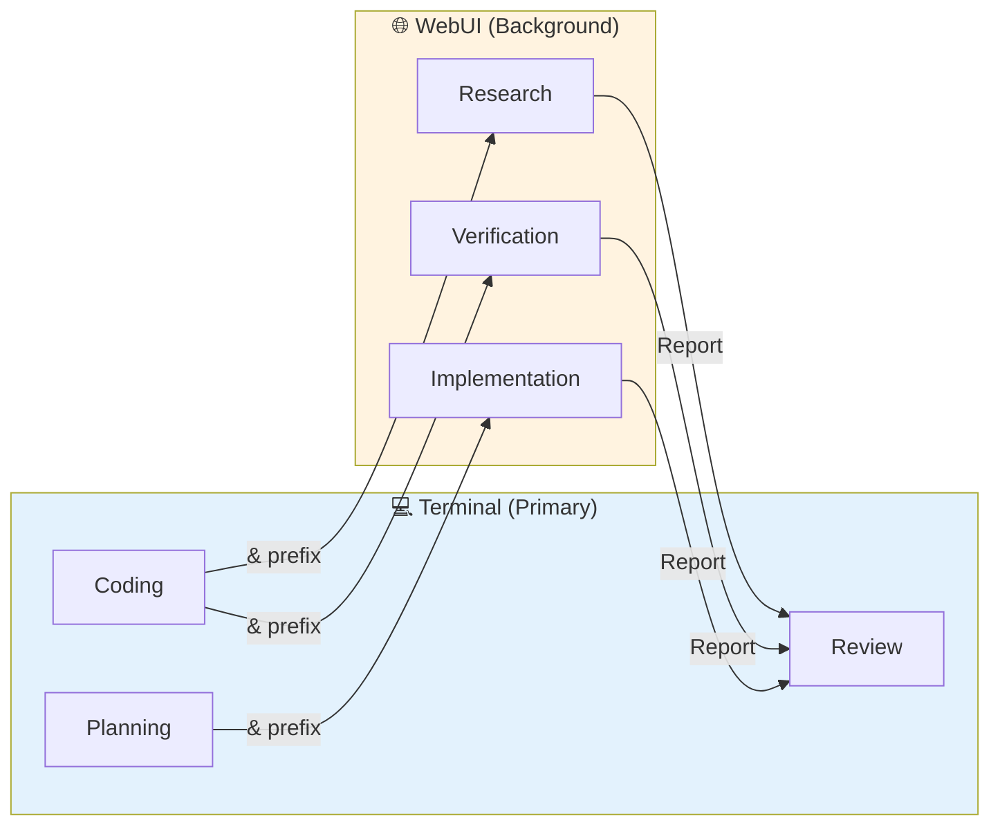
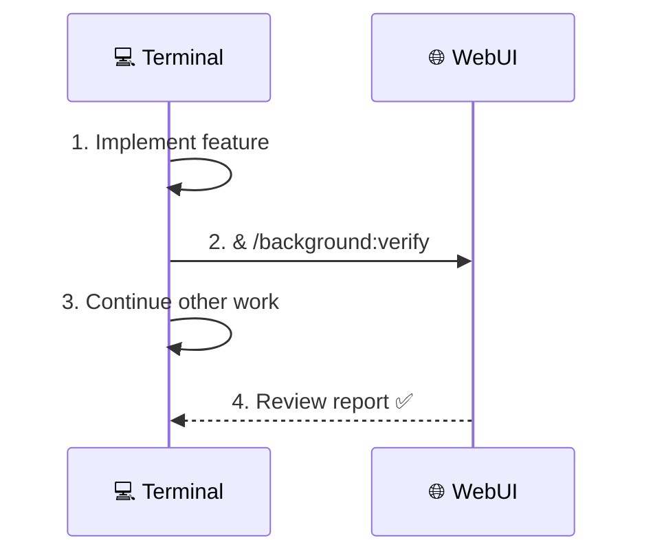
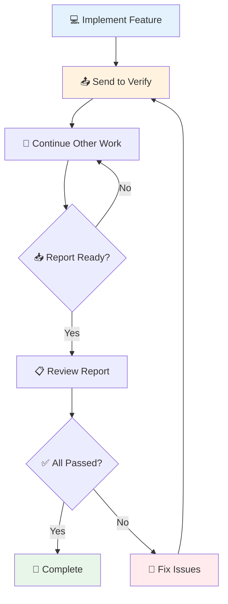
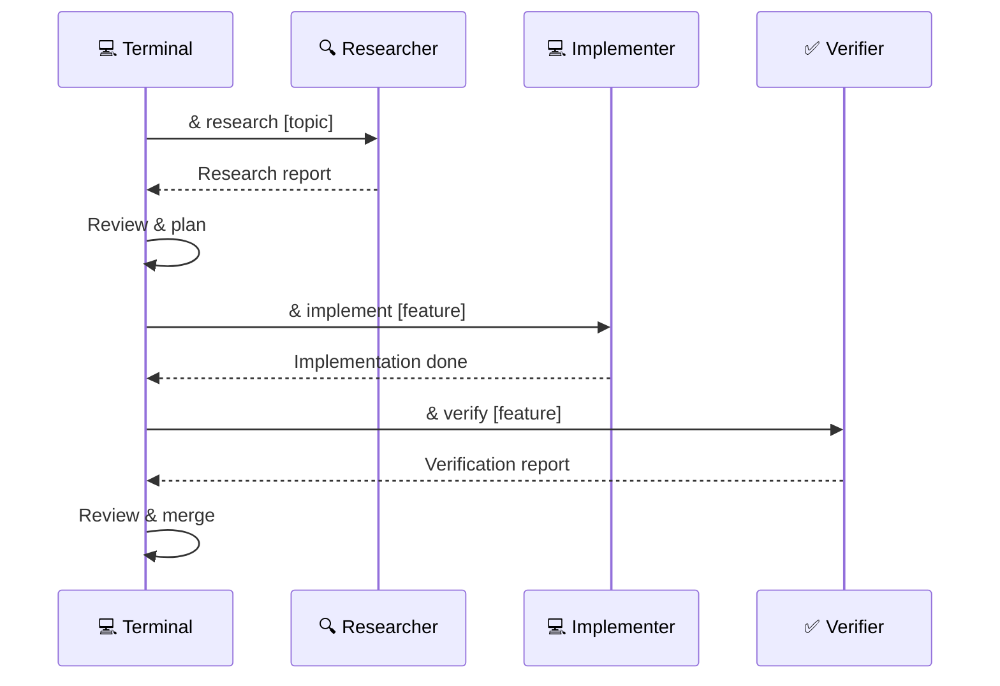
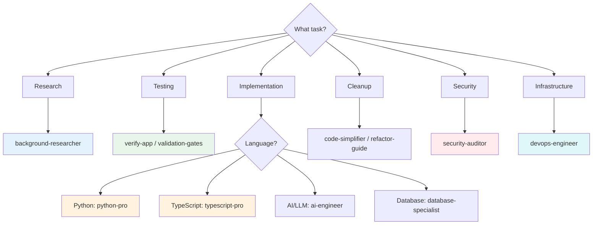
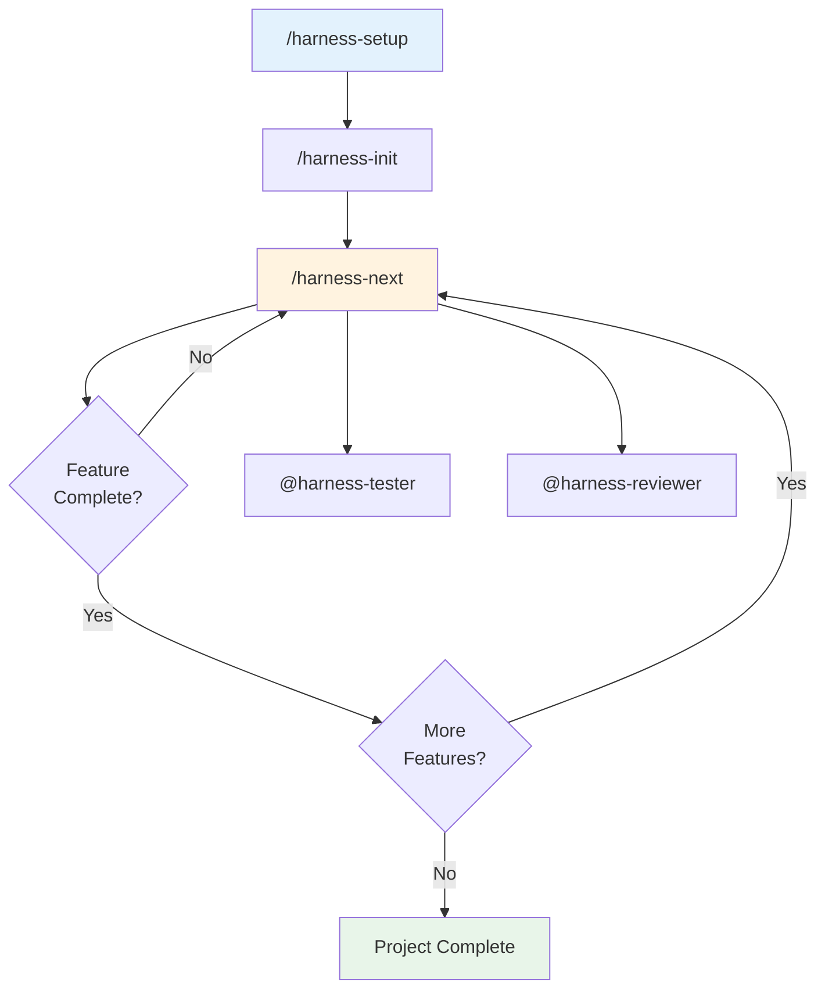
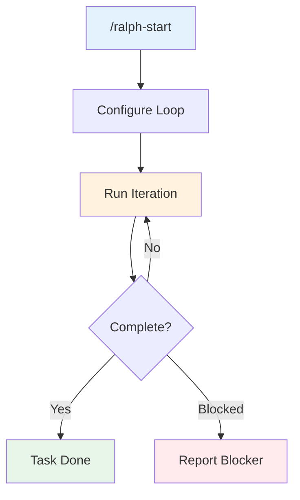
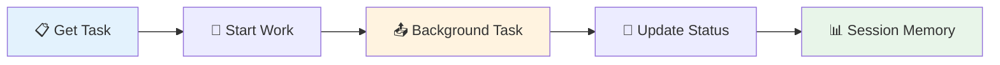

[Home](../README.md) > [.github](./) > Background Workflow

# 🔄 Background Agent Workflow

> **Last Updated**: 2025-01-22 | **Version**: 2.0  
> **Status**: ✅ Final | **Based On**: Boris Cherny's Multi-Agent Pattern

---

## 📑 Table of Contents

- [Overview](#-overview)
- [Quick Start](#-quick-start)
- [Available Commands](#-available-commands)
- [Workflow Patterns](#-workflow-patterns)
- [Agent Inventory](#-agent-inventory)
- [Best Practices](#-best-practices)
- [Autonomous Agent Harness Integration](#-autonomous-agent-harness-integration)
- [Ralph Wiggum Integration](#-ralph-wiggum-integration)
- [Integration with Archon](#-integration-with-archon)
- [Troubleshooting](#-troubleshooting)
- [Related Documents](#-related-documents)

---

## 🎯 Overview

This workflow enables running multiple Copilot instances in parallel for maximum productivity:



### Key Benefits

| Benefit                    | Description                                      |
| -------------------------- | ------------------------------------------------ |
| ⚡ **Parallel Work**       | Multiple tasks running simultaneously            |
| 🔄 **Verification Loops**  | 2-3x quality improvement with feedback           |
| 🧠 **Focused Roles**       | Planners plan, implementers code, verifiers test |
| 📊 **Background Research** | Deep research without blocking your workflow     |

---

## 🚀 Quick Start

### Send to Background

Use the `&` prefix to send any prompt to run in the WebUI background:

```bash
# Basic syntax
& [your prompt here]

# Examples
& Research the best approach for implementing OAuth 2.0 with PKCE

& /background:verify the authentication flow

& /background:implement the user dashboard component
```

### Workflow in 4 Steps



1. **Implement** feature in terminal
2. **Send** verification to background with `&`
3. **Continue** working on other tasks
4. **Review** background report when ready

---

## 📋 Available Commands

### Background Commands

| Command                             | Purpose                  | Agent                   |
| ----------------------------------- | ------------------------ | ----------------------- |
| `& /background:research [topic]`    | Deep research tasks      | `background-researcher` |
| `& /background:verify [target]`     | Testing and validation   | `verify-app`            |
| `& /background:implement [feature]` | Code implementation      | `python-pro`            |
| `& /background:simplify [path]`     | Code cleanup/refactoring | `code-simplifier`       |

### Command Examples

<details>
<summary>🔍 <strong>Research Examples</strong></summary>

```bash
# Technology research
& /background:research best practices for GraphQL API design

# Documentation research
& /background:research React Server Components patterns

# Architecture research
& /background:research microservices vs monolith tradeoffs for our scale
```

</details>

<details>
<summary>✅ <strong>Verification Examples</strong></summary>

```bash
# Test a specific feature
& /background:verify the login flow handles all edge cases

# Run comprehensive tests
& /background:verify all API endpoints return correct status codes

# Check for regressions
& /background:verify no breaking changes in the auth module
```

</details>

<details>
<summary>💻 <strong>Implementation Examples</strong></summary>

```bash
# Implement a component
& /background:implement a reusable data table component with sorting

# Add a feature
& /background:implement email verification flow

# Create utilities
& /background:implement date formatting utilities following project patterns
```

</details>

<details>
<summary>🧹 <strong>Simplification Examples</strong></summary>

```bash
# Clean up a specific file
& /background:simplify src/services/authService.ts

# Refactor a module
& /background:simplify the API error handling across all endpoints

# Remove duplication
& /background:simplify extract common patterns from components/forms/*
```

</details>

---

## 🔄 Workflow Patterns

### Pattern 1: Implementation + Verification Loop

The most common and effective pattern:



**Terminal Flow:**

```bash
# 1. Implement feature
# ... code the feature ...

# 2. Send for verification
& /background:verify the new user registration feature

# 3. Continue with other work
# ... work on documentation, other features ...

# 4. Review when ready
# ... check WebUI for report ...

# 5. Fix any issues and re-verify
& /background:verify user registration after fixing validation
```

### Pattern 2: Planning + Parallel Implementation

For larger features, plan first then parallelize:

```
┌─────────────────────────────────────────────────────────────┐
│ 💻 Terminal                                                  │
│                                                              │
│ 1. Plan feature (Plan mode: Shift+Tab twice)                │
│ 2. Break into subtasks                                       │
│ 3. & /background:implement subtask 1  ──────────────────┐   │
│ 4. & /background:implement subtask 2  ───────────────┐  │   │
│ 5. Implement subtask 3 locally                       │  │   │
│                                                      │  │   │
└──────────────────────────────────────────────────────│──│───┘
                                                       │  │
┌──────────────────────────────────────────────────────│──│───┐
│ 🌐 WebUI Tab 1                                       │  │   │
│ Working on subtask 1...                         ◄────┘  │   │
└─────────────────────────────────────────────────────────│───┘
                                                          │
┌─────────────────────────────────────────────────────────│───┐
│ 🌐 WebUI Tab 2                                          │   │
│ Working on subtask 2...                         ◄───────┘   │
└─────────────────────────────────────────────────────────────┘
```

### Pattern 3: Research → Implement → Verify

Full development cycle using background agents:



**Example Flow:**

```bash
# 1. Research first
& /background:research OAuth 2.0 PKCE implementation best practices

# 2. Review research report, then implement
& /background:implement OAuth PKCE flow based on research findings

# 3. Verify implementation
& /background:verify OAuth flow handles all auth scenarios

# 4. Review and merge
# ... check reports, make final adjustments ...
```

---

## 🤖 Agent Inventory

### Background-Optimized Agents

These agents work well in background mode:

| Agent                   | Specialty         | Best For                                |
| ----------------------- | ----------------- | --------------------------------------- |
| `background-researcher` | 🔍 Deep research  | Technology evaluation, documentation    |
| `verify-app`            | ✅ Testing & QA   | Comprehensive validation, edge cases    |
| `code-simplifier`       | 🧹 Refactoring    | Cleanup, reducing complexity            |
| `validation-gates`      | 🚦 Quality gates  | Full test suites, CI validation         |
| `python-pro`            | 🐍 Python expert  | Python implementation tasks             |
| `typescript-pro`        | 📘 TypeScript     | React, Node.js, frontend development    |
| `devops-engineer`       | 🐳 Infrastructure | Docker, CI/CD, deployment               |
| `database-specialist`   | 🗄️ Database       | SQL optimization, schema design         |
| `security-auditor`      | 🔐 Security       | Vulnerability scanning, security review |

### Interactive Agents (Terminal)

These agents need discussion and should run in terminal:

| Agent                   | Specialty       | Why Not Background             |
| ----------------------- | --------------- | ------------------------------ |
| `documentation-manager` | 📝 Docs         | Needs review of changes        |
| `architect-reviewer`    | 🏗️ Architecture | Needs discussion               |
| `mermaid-expert`        | 📊 Diagrams     | Visual review needed           |
| `code-reviewer`         | 👀 Code Review  | Interactive feedback           |
| `refactor-guide`        | ♻️ Refactoring  | Requires incremental decisions |

### Full Agent Catalog

<details>
<summary>📋 <strong>View All 20 Agents</strong></summary>

| Agent                   | Category        | Description                               |
| ----------------------- | --------------- | ----------------------------------------- |
| `ai-engineer`           | 🤖 AI/ML        | LLM apps, RAG systems, prompt engineering |
| `api-documenter`        | 📚 Docs         | OpenAPI specs, SDK generation             |
| `architect-reviewer`    | 🏗️ Architecture | Architectural consistency review          |
| `background-researcher` | 🔍 Research     | Deep technology research                  |
| `code-reviewer`         | 👀 Quality      | PR reviews, code quality feedback         |
| `code-simplifier`       | 🧹 Quality      | Complexity reduction, cleanup             |
| `data-engineer`         | 📊 Data         | ETL pipelines, data warehousing           |
| `database-specialist`   | 🗄️ Data         | SQL optimization, schema design           |
| `devops-engineer`       | 🐳 DevOps       | Docker, CI/CD, infrastructure             |
| `docs-architect`        | 📚 Docs         | Long-form technical documentation         |
| `documentation-manager` | 📝 Docs         | Documentation updates, README             |
| `mermaid-expert`        | 📊 Diagrams     | Mermaid diagram creation                  |
| `python-pro`            | 🐍 Language     | Python development, optimization          |
| `reference-builder`     | 📚 Docs         | API references, configuration guides      |
| `refactor-guide`        | ♻️ Quality      | Legacy code modernization                 |
| `search-specialist`     | 🔍 Research     | Web research, fact-checking               |
| `security-auditor`      | 🔐 Security     | Vulnerability assessment                  |
| `typescript-pro`        | 📘 Language     | TypeScript/React development              |
| `validation-gates`      | 🚦 Quality      | Test execution, quality checks            |
| `verify-app`            | ✅ Quality      | Application verification                  |

</details>

### Agent Selection Guide



---

## 💡 Best Practices

### From Boris Cherny's Workflow

| Principle                        | Description                                                        |
| -------------------------------- | ------------------------------------------------------------------ |
| 🎭 **Role Assignment**           | Planners discuss strategy, Implementers write code, Verifiers test |
| 🔄 **Verification Loops**        | "With feedback loops, quality improves 2-3x"                       |
| 📝 **Document Mistakes**         | When Copilot errs, add fix to `copilot-instructions.md`            |
| ⚡ **Plan Mode First**           | `Shift+Tab` twice for planning before implementation               |
| 🔐 **Pre-configure Permissions** | Use `/permissions` for safe commands                               |

### Permission Configuration

Pre-allow safe commands to reduce interruptions:

```bash
/permissions add "Bash(npm:*)" "Bash(pytest:*)" "Bash(docker:*)"
```

### Handoff Message Format

When tasks complete, structure the report:

```markdown
## ✅ TASK COMPLETE

**Type**: [Research/Implementation/Verification]  
**Status**: Complete | Partial | Blocked  
**Duration**: [Time]

### Summary

One-line summary of what was accomplished.

### Key Findings/Output

- Finding 1
- Finding 2
- Finding 3

### Next Steps

1. Recommended action 1
2. Recommended action 2

### Handoff To

Terminal / Another Agent / Human Review
```

### Quality Checklist

Before sending to background:

- [ ] Clear, specific prompt
- [ ] Defined scope (not too broad)
- [ ] Expected output format specified
- [ ] Dependencies available (files, access)

---

## 🤖 Autonomous Agent Harness Integration

For long-running, multi-session development projects, use the **Autonomous Agent Harness**:



### Harness Commands

| Command | Description |
|---------|-------------|
| `/harness-setup` | Launch full setup wizard |
| `/harness-quick` | Quick setup with defaults |
| `/harness-init` | Initialize (first session) |
| `/harness-next` | Start coding session |
| `/harness-status` | Check project status |
| `/harness-resume` | Resume existing project |

### Harness Agents

| Agent | Purpose | Invocation |
|-------|---------|------------|
| `@harness-wizard` | Setup and configuration | Via `/harness-setup` |
| `@harness-initializer` | Generate tasks from spec | Via `/harness-init` |
| `@harness-coder` | Implement features | Via `/harness-next` |
| `@harness-tester` | Testing and verification | `& @harness-tester verify [feature]` |
| `@harness-reviewer` | Code review | `& @harness-reviewer check [feature]` |

### Background Harness Execution

Run harness sessions in background:

```bash
# Run coding session in background
& /harness-next

# Run testing in parallel with coding
& @harness-tester verify "User Authentication"

# Get code review in parallel
& @harness-reviewer check "API endpoints"
```

### Harness State Management

All harness state is managed via Archon:

```python
# Project with tasks and documents
find_projects(project_id="<harness_project_id>")
find_tasks(filter_by="project", filter_value="<project_id>")
find_documents(project_id="<project_id>", query="Session Notes")
```

For complete harness documentation, see:
- [Autonomous Agent Harness Skill](.github/skills/autonomous-agent-harness/README.md)

---

## 🔄 Ralph Wiggum Integration

For persistent, iterative development loops, use **Ralph Wiggum**:



### What is Ralph?

Ralph Wiggum is an iterative AI development methodology where:
- AI receives the **same prompt** each iteration
- Previous work **persists in files** and git
- Each iteration **sees modified files** from previous work
- Loop continues until **completion criteria met**

### Ralph Commands

| Command | Description |
|---------|-------------|
| `/ralph-start` | Launch setup wizard |
| `/ralph-iterate` | Run single iteration manually |
| `/ralph-status` | Check loop status |
| `/ralph-cancel` | Cancel active loop |

### Ralph + Framework Integration

Ralph integrates with all existing frameworks:

```bash
# Ralph + Long Run Harness
/harness-ralph

# Ralph + Spec Kit  
/speckit-ralph specs/123-feature/spec.md

# Ralph + PRP Framework
/prp-ralph PRPs/plans/feature.plan.md
```

### Background Ralph Execution

Run Ralph loops in background mode:

```bash
# Start autonomous Ralph loop
& /ralph-loop "Build REST API for todos" --max-iterations 50

# Check status
/ralph-status

# Cancel if needed
/ralph-cancel
```

### Ralph Execution Modes

| Mode | Description | Command |
|------|-------------|---------|
| **Background** | Fully autonomous | `& /ralph-loop "task"` |
| **Manual** | You control each iteration | `/ralph-iterate` |
| **Hybrid** | Start manual, go background | `/ralph-iterate` then `& /ralph-continue` |

### Loop Termination

Ralph stops when:
1. ✅ **Completion promise** detected (`<promise>COMPLETE</promise>`)
2. ✅ **Archon task** marked done
3. ⚠️ **Max iterations** reached
4. 🛑 **Manual cancel** by user

### Ralph + Archon State

All Ralph state is managed via Archon:

```python
# Loop state in documents
find_documents(project_id="...", query="Ralph Loop State")

# Task progress tracking
manage_task("update", task_id="...", status="doing")
```

For complete Ralph documentation, see:
- [Ralph Wiggum Skill](./skills/ralph-wiggum/README.md)

---

## 🔗 Integration with Archon

All background tasks integrate with Archon for task tracking:



### Workflow with Archon

```bash
# 1. Before starting - check tasks
find_tasks(filter_by="status", filter_value="todo")

# 2. Mark task as in progress
manage_task("update", task_id="...", status="doing")

# 3. Send work to background
& /background:implement [task description]

# 4. When complete - update task
manage_task("update", task_id="...", status="review")

# 5. Update session memory
# Document findings for future sessions
```

---

## 🔧 Troubleshooting

### Common Issues

<details>
<summary>❌ <strong>Background task not starting</strong></summary>

**Symptoms**: Command sent but no activity in WebUI

**Solutions**:

1. Verify WebUI is open and logged in
2. Check if the `&` prefix was included
3. Try refreshing the WebUI session
4. Use explicit agent: `& @background-researcher [prompt]`

</details>

<details>
<summary>❌ <strong>Session context lost</strong></summary>

**Symptoms**: Background agent doesn't have needed context

**Solutions**:

1. Include relevant file paths in prompt
2. Reference specific functions/classes by name
3. Provide brief context summary in prompt
4. Use `--continue` to resume previous session

</details>

<details>
<summary>❌ <strong>Agent making wrong assumptions</strong></summary>

**Symptoms**: Implementation doesn't match project patterns

**Solutions**:

1. Reference similar existing code in prompt
2. Update `copilot-instructions.md` with patterns
3. Include specific requirements/constraints
4. Use research phase first to establish context

</details>

### Session Management

```bash
# Check what's running
/tasks

# See agent status
/agents

# Continue previous session
--continue
```

---

## 🔗 Related Documents

| Document                                             | Description                |
| ---------------------------------------------------- | -------------------------- |
| [copilot-instructions.md](./copilot-instructions.md) | Main Copilot configuration |
| [STYLE_GUIDE.md](../docs/STYLE_GUIDE.md)             | Documentation standards    |
| [agents/](./agents/)                                 | Agent definition files     |
| [Harness Skill](./skills/autonomous-agent-harness/)  | Autonomous agent harness   |

---

## 📌 Quick Reference Card

### Essential Commands

| Action             | Command                             |
| ------------------ | ----------------------------------- |
| Send to background | `& [prompt]`                        |
| Research           | `& /background:research [topic]`    |
| Verify             | `& /background:verify [target]`     |
| Implement          | `& /background:implement [feature]` |
| Simplify           | `& /background:simplify [path]`     |
| Plan mode          | `Shift+Tab` (twice)                 |
| Add permissions    | `/permissions add "pattern"`        |

### Harness Commands (Long-Running Projects)

| Action           | Command                              |
| ---------------- | ------------------------------------ |
| Setup harness    | `/harness-setup`                     |
| Quick setup      | `/harness-quick`                     |
| Initialize       | `/harness-init`                      |
| Next session     | `/harness-next`                      |
| Check status     | `/harness-status`                    |
| Resume project   | `/harness-resume`                    |
| Test feature     | `& @harness-tester verify [feature]` |
| Review code      | `& @harness-reviewer check [feature]`|

### Ralph Wiggum Commands (Iterative Loops)

| Action            | Command                                    |
| ----------------- | ------------------------------------------ |
| Start Ralph       | `/ralph-start`                             |
| Single iteration  | `/ralph-iterate`                           |
| Check status      | `/ralph-status`                            |
| Cancel loop       | `/ralph-cancel`                            |
| Ralph + Harness   | `/harness-ralph`                           |
| Ralph + SpecKit   | `/speckit-ralph [spec-path]`               |
| Ralph + PRP       | `/prp-ralph [plan-path]`                   |
| Background Ralph  | `& /ralph-loop "task" --max-iterations 50` |

### Agent Quick Reference

| Agent                   | Icon | Use For  |
| ----------------------- | ---- | -------- |
| `background-researcher` | 🔍   | Research |
| `verify-app`            | ✅   | Testing  |
| `code-simplifier`       | 🧹   | Cleanup  |
| `python-pro`            | 🐍   | Python   |
| `validation-gates`      | 🚦   | Full QA  |
| `harness-coder`         | 🤖   | Long-running development |
| `harness-tester`        | 🧪   | Harness testing |
| `harness-reviewer`      | 👀   | Harness review |
| `ralph-wizard`          | 🔄   | Ralph setup wizard |
| `ralph-loop`            | ♾️   | Ralph iteration loop |
| `ralph-monitor`         | 📊   | Ralph status monitor |

---

[⬆️ Back to Top](#-background-agent-workflow) | [📚 Docs](../docs/) | [🏠 Home](../README.md)
