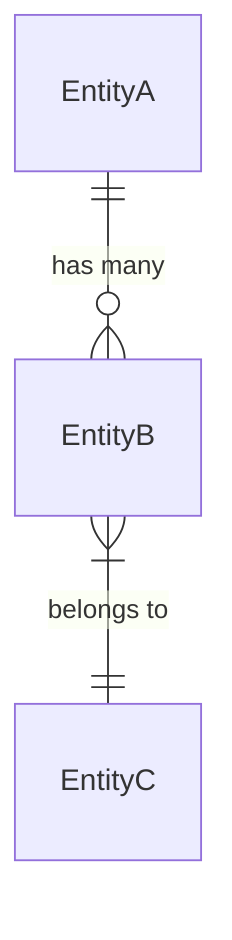

# Data Model Generation

Generate a data model from the following requirements:

## Requirements
$ARGUMENTS

## Analysis Framework

### 1. Entity Identification
- What are the core entities?
- What are their key attributes?
- What are the primary identifiers?

### 2. Relationships
- How do entities relate to each other?
- What are the cardinalities (1:1, 1:N, N:M)?
- Are there any circular dependencies?

### 3. Validation Rules
- What constraints apply to each field?
- What are the business rules?
- What are the data type restrictions?

### 4. State Transitions
- What lifecycle states exist?
- What transitions are allowed?
- What triggers state changes?

## Output Format

```markdown
# Data Model: [Feature Name]

## Entities

### [Entity Name]

**Purpose**: [What this entity represents]

**Fields**:
| Field | Type | Required | Description | Validation |
|-------|------|----------|-------------|------------|
| id | UUID | Yes | Primary identifier | Auto-generated |
| field1 | string | Yes | [Description] | Max 255 chars |

**Relationships**:
- Has many [Related Entity] (1:N)
- Belongs to [Parent Entity] (N:1)

**Validation Rules**:
- [Rule 1]
- [Rule 2]

**State Transitions** (if applicable):
```
[State A] --[action]--> [State B]
[State B] --[action]--> [State C]
```

## Entity Relationship Diagram


```
