# Create Project

Create a new Archon project for tracking work on a codebase.

## Project Types

### Standalone Project (Single Codebase)

```
manage_project("create",
  title="[Project Name]",
  description="[Brief description of the project]",
  github_repo="https://github.com/[org]/[repo]"
)
```

### Master Project with Sub-Projects (Monorepo/Solution)

```mermaid
graph TD
    A[🏗️ Master Project] --> B[📁 Frontend]
    A --> C[📁 Backend API]
    A --> D[📁 Shared Libraries]
    A --> E[📁 Infrastructure]
```



**Step 1: Create Master Project**

```
manage_project("create",
  title="MySolution",
  description="Full-stack application with multiple components"
)
# Returns: project_id = "master-123"
```

**Step 2: Create Sub-Projects**

```
manage_project("create",
  title="Frontend",
  parent_id="master-123",
  description="React frontend application"
)

manage_project("create",
  title="Backend API",
  parent_id="master-123",
  description="Node.js REST API"
)

manage_project("create",
  title="Infrastructure",
  parent_id="master-123",
  description="Docker, K8s, Terraform configs"
)
```

## Initial Setup

After creating a project, set up:

### 1. Session Memory Document

```
manage_document("create",
  project_id="[PROJECT_ID]",
  title="Session Memory",
  document_type="note",
  content={
    "created": "[DATE]",
    "current_focus": "",
    "blockers": [],
    "decisions_made": [],
    "next_steps": []
  }
)
```

### 2. Initial Tasks

```
manage_task("create", project_id="[PROJECT_ID]",
  title="Project setup and configuration",
  description="Initial setup, dependencies, dev environment",
  task_order=100)

manage_task("create", project_id="[PROJECT_ID]",
  title="Define architecture and patterns",
  description="Document key architectural decisions",
  task_order=90)
```

## Project Naming

| Type            | Convention      | Example                           |
| --------------- | --------------- | --------------------------------- |
| **Standalone**  | Repository name | `my-api-service`                  |
| **Master**      | Solution name   | `MyCompany Platform`              |
| **Sub-project** | Component name  | `Frontend`, `API`, `Auth Service` |

## Querying Projects

```
# Find all projects
find_projects()

# Search projects
find_projects(query="api")

# Get specific project with hierarchy
find_projects(project_id="proj-123")

# Get only master projects
find_projects(masters_only=True)

# Get sub-projects of a master
find_projects(parent_id="master-123")
```

## Arguments

{input}

If a name is provided, create with that name.
If no name, guide through project creation.
