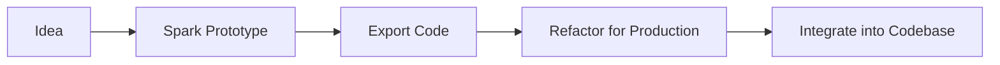
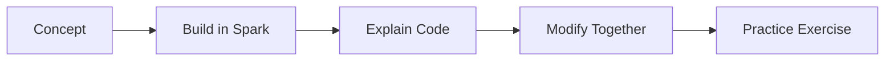
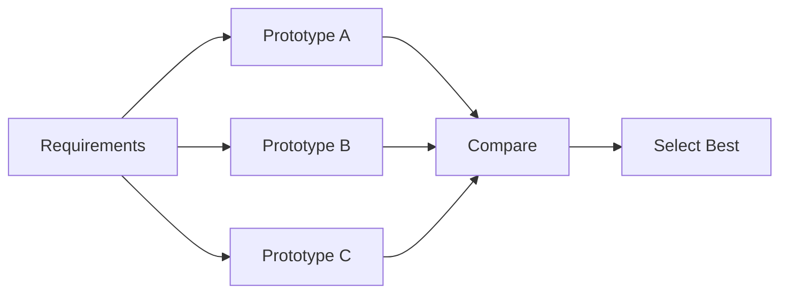

# GitHub Copilot Spark Reference

> Complete reference for Spark commands, prompts, and integration patterns

---

## Table of Contents

- [Prompt Patterns](#prompt-patterns)
- [App Types](#app-types)
- [UI Components](#ui-components)
- [Data Handling](#data-handling)
- [Export Options](#export-options)
- [Integration Patterns](#integration-patterns)
- [Troubleshooting](#troubleshooting)

---

## Prompt Patterns

### Structure Templates

#### Basic App Creation
```
Create a [app type] that [primary function]
```

**Examples:**
- "Create a todo app that tracks daily tasks"
- "Create a calculator that handles basic math"
- "Create a timer that counts down from a set time"

#### Feature Addition
```
Add [feature] that [behavior] when [trigger]
```

**Examples:**
- "Add a dark mode that toggles when clicking the moon icon"
- "Add form validation that shows errors when submitting empty fields"
- "Add a search filter that updates the list as I type"

#### Styling Changes
```
Change [element] to [new style/behavior]
```

**Examples:**
- "Change the header to a gradient blue background"
- "Change buttons to have rounded corners and shadows"
- "Change the layout to a two-column grid"

#### Behavior Modification
```
When [trigger], [action] should [result]
```

**Examples:**
- "When clicking a todo item, it should toggle complete"
- "When the form is submitted, show a success message"
- "When hovering cards, they should scale up slightly"

### Advanced Prompts

#### Multi-step Workflows
```
Create a [app type] with:
1. [Feature 1]
2. [Feature 2]
3. [Feature 3]
```

#### Reference-based
```
Create something like [known app/feature] but with [modifications]
```

#### Constraint-based
```
Create [app] using only [technology/approach] without [excluded thing]
```

---

## App Types

### Productivity Apps

| Type | Example Prompt | Generated Features |
|------|----------------|-------------------|
| Todo List | "Todo app with categories" | Add/edit/delete, categories, filters |
| Notes | "Note-taking with markdown" | Rich text, folders, search |
| Timer | "Pomodoro timer" | Start/stop, intervals, notifications |
| Tracker | "Habit tracker" | Daily check-ins, streaks, charts |

### Data Display Apps

| Type | Example Prompt | Generated Features |
|------|----------------|-------------------|
| Dashboard | "Sales dashboard with charts" | Bar/line/pie charts, metrics cards |
| Table | "Data table with sorting" | Columns, sort, filter, pagination |
| Gallery | "Image gallery with lightbox" | Grid, modal view, navigation |
| Timeline | "Event timeline" | Chronological display, details |

### Interactive Apps

| Type | Example Prompt | Generated Features |
|------|----------------|-------------------|
| Form | "Multi-step signup form" | Validation, steps, progress |
| Quiz | "Multiple choice quiz" | Questions, scoring, results |
| Survey | "Customer feedback survey" | Question types, submit |
| Calculator | "Mortgage calculator" | Inputs, formula, results |

### Social/Content Apps

| Type | Example Prompt | Generated Features |
|------|----------------|-------------------|
| Feed | "Social media feed" | Posts, likes, comments |
| Blog | "Blog with categories" | Posts, tags, navigation |
| Chat | "Simple chat interface" | Messages, input, timestamps |
| Profile | "User profile page" | Avatar, info, activity |

---

## UI Components

### Layout Components

```
# Request specific layouts
"Create a [component] with a [layout type] layout"

Layout types:
- grid (2-column, 3-column, responsive)
- sidebar (left, right, collapsible)
- header-content-footer
- card-based
- masonry
- split-view
```

### Form Elements

```
# Form component requests
"Add a form with [field types]"

Field types:
- text input, email, password
- textarea, rich text
- select dropdown, multi-select
- checkboxes, radio buttons
- date picker, time picker
- file upload
- range slider
- toggle switch
```

### Interactive Elements

```
# Interactive component requests
"Add [interactive element]"

Elements:
- modal/dialog
- dropdown menu
- accordion/collapse
- tabs
- tooltip
- popover
- carousel/slider
- drag-and-drop
```

### Feedback Elements

```
# Feedback component requests
"Show [feedback type] when [condition]"

Types:
- toast notifications
- alert banners
- progress bars
- loading spinners
- skeleton loaders
- success/error states
```

---

## Data Handling

### Local Storage

```
"Save [data] to local storage"
"Persist the [state] between sessions"
"Remember user preferences"
```

**Generated patterns:**
```javascript
// Spark generates localStorage wrappers
localStorage.setItem('todos', JSON.stringify(todos));
const saved = JSON.parse(localStorage.getItem('todos') || '[]');
```

### State Management

```
"Track [state] across components"
"Share [data] between [component A] and [component B]"
```

**Generated patterns:**
```javascript
// Spark uses React useState/useContext
const [items, setItems] = useState([]);
const AppContext = createContext();
```

### Mock Data

```
"Use sample data for [entity]"
"Generate mock [data type] for testing"
```

**Generated patterns:**
```javascript
// Spark generates realistic mock data
const mockUsers = [
  { id: 1, name: 'Alice', email: 'alice@example.com' },
  { id: 2, name: 'Bob', email: 'bob@example.com' },
];
```

---

## Export Options

### Code Export

| Format | Contents | Use Case |
|--------|----------|----------|
| **React** | JSX components, hooks | Production integration |
| **HTML/CSS/JS** | Vanilla files | Simple hosting |
| **Full Project** | Complete npm project | Standalone development |

### Export Structure

```
spark-export/
├── src/
│   ├── components/
│   │   ├── App.jsx
│   │   ├── Header.jsx
│   │   └── [Feature].jsx
│   ├── styles/
│   │   └── App.css
│   ├── utils/
│   │   └── helpers.js
│   └── index.jsx
├── public/
│   └── index.html
├── package.json
└── README.md
```

### Sharing Options

| Method | Purpose |
|--------|---------|
| **Share Link** | Live preview for stakeholders |
| **Embed Code** | Include in documentation |
| **Fork** | Let others modify |
| **Template** | Reusable starting point |

---

## Integration Patterns

### Pattern 1: Prototype to Feature



**Steps:**
1. Create prototype in Spark
2. Export React components
3. Add TypeScript types
4. Apply project conventions
5. Add tests
6. PR for review

### Pattern 2: Teaching Flow



**Steps:**
1. Identify concept to teach
2. Build simple example in Spark
3. Walk through generated code
4. Have learner make modifications
5. Assign similar exercise

### Pattern 3: Design Exploration



**Steps:**
1. Define requirements
2. Create multiple Spark prototypes
3. Share with stakeholders
4. Gather feedback
5. Choose direction
6. Implement properly

---

## Troubleshooting

### Common Issues

| Issue | Solution |
|-------|----------|
| App doesn't render | Check for JavaScript errors in console |
| Styling not applied | Verify CSS is imported |
| State not updating | Check useState/useEffect patterns |
| Data not persisting | Verify localStorage calls |
| Components not found | Check import paths |

### Prompt Refinement

| Problem | Try Instead |
|---------|-------------|
| Too complex output | Break into smaller requests |
| Wrong component type | Specify explicitly: "Use a modal, not a page" |
| Missing feature | Add explicitly: "Include a delete button" |
| Wrong styling | Reference specifics: "Use Tailwind classes" |

### Export Issues

| Issue | Solution |
|-------|----------|
| Missing dependencies | Run `npm install` after export |
| Build errors | Check for absolute vs relative imports |
| Style conflicts | Namespace CSS classes |
| Type errors | Add TypeScript annotations manually |

---

## Keyboard Shortcuts (Spark Editor)

| Action | Shortcut |
|--------|----------|
| New prompt | `Ctrl+Enter` |
| Undo | `Ctrl+Z` |
| Redo | `Ctrl+Shift+Z` |
| Preview | `Ctrl+P` |
| Export | `Ctrl+E` |
| Share | `Ctrl+Shift+S` |

---

## Related Resources

- [SKILL.md](./SKILL.md) - Main skill documentation
- [Spark Workflow Guide](../../../docs/guides/spark-workflow.md)
- [Spark Prototyper Agent](../../agents/spark-prototyper.md)
