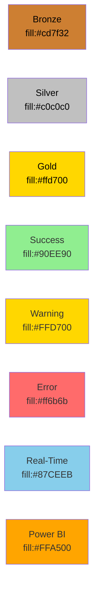

# 📊 Mermaid Diagram Quick Reference

> Quick lookup table for all recommended Mermaid diagram opportunities

---

## 🎯 High Priority Diagrams (Top 10)

| # | Location | Diagram Type | Title | Purpose | Lines |
|---|----------|--------------|-------|---------|-------|
| 1 | `docs/DEPLOYMENT.md` | Flowchart | **Deployment Process Flow** | Step-by-step deployment with decision points | 74-284 |
| 2 | `docs/SECURITY.md` | State Diagram | **Security Decision Tree** | Environment-based security requirements | 1-100 |
| 3 | `tutorials/01-bronze-layer/README.md` | Sequence | **Bronze Ingestion Flow** | Data ingestion with metadata tracking | Throughout |
| 4 | `tutorials/02-silver-layer/README.md` | Flowchart | **Data Quality Pipeline** | Quality checks and quarantine logic | DQ section |
| 5 | `tutorials/03-gold-layer/README.md` | ERD | **Star Schema Design** | Casino analytics dimensional model | Schema section |
| 6 | `tutorials/04-real-time-analytics/README.md` | Sequence | **Real-Time Event Flow** | Latency tracking for casino floor | Architecture |
| 7 | `tutorials/06-data-pipelines/README.md` | Gantt | **Pipeline Schedule** | Daily ETL orchestration timeline | Pipeline design |
| 8 | `tutorials/07-governance-purview/README.md` | Flowchart | **Data Lineage** | End-to-end lineage with classifications | Lineage section |
| 9 | `poc-agenda/day1-medallion-foundation.md` | Journey | **Day 1 Workshop Flow** | Participant experience tracking | Throughout |
| 10 | `poc-agenda/README.md` | Gantt | **3-Day Workshop Overview** | High-level workshop schedule | Overview section |

---

## 🟡 Medium Priority Diagrams

| # | Location | Diagram Type | Title | Purpose |
|---|----------|--------------|-------|---------|
| 11 | `infra/main.bicep` | Flowchart | **IaC Deployment Sequence** | Bicep module deployment order |
| 12 | `docs/COST_ESTIMATION.md` | Decision Tree | **Cost Optimization Flow** | Choose right cost strategy |
| 13 | `tutorials/05-direct-lake-powerbi/README.md` | Architecture | **Direct Lake Architecture** | Zero-copy Power BI connection |
| 14 | `tutorials/08-database-mirroring/README.md` | Sequence | **CDC Mirroring Flow** | SQL Server to Fabric replication |
| 15 | `data-generation/README.md` | Flowchart | **Data Generation Process** | Synthetic data creation workflow |

---

## 🟢 Additional Opportunities

| # | Location | Diagram Type | Title |
|---|----------|--------------|-------|
| 16 | `tutorials/09-advanced-ai-ml/README.md` | Pipeline | **ML Training Pipeline** |
| 17 | `docs/PREREQUISITES.md` | Checklist Flow | **Prerequisites Validation** |
| 18 | New Document | Quadrant | **POC Success Metrics** |
| 19 | `docs/SECURITY.md` | Flowchart | **Incident Response Flow** |
| 20 | New Document | Sequence | **Backup & Recovery** |
| 21 | Purview Tutorial | Matrix | **Data Classification Matrix** |
| 22 | `docs/ARCHITECTURE.md` | Decision Tree | **Capacity Scaling** |
| 23 | New Document | Journey | **Player Lifecycle Journey** |

---

## 📋 Diagram Type Usage

| Diagram Type | Count | Best For | Examples in Repo |
|--------------|-------|----------|------------------|
| **Flowchart** | 7 | Processes, decisions, workflows | Deployment, DQ pipeline, data gen |
| **Sequence** | 4 | Time-based interactions, API flows | Bronze ingestion, real-time, mirroring |
| **Gantt** | 2 | Schedules, timelines, dependencies | Pipeline schedule, workshop timeline |
| **ERD** | 1 | Database schemas, relationships | Star schema design |
| **State Diagram** | 1 | State transitions, status flows | Security requirements by environment |
| **Journey** | 2 | User experience, participant flow | Workshop days, player lifecycle |
| **Decision Tree** | 2 | Choice logic, optimization paths | Security, cost optimization |
| **Architecture** | 1 | System design, integrations | Direct Lake mode |
| **Quadrant** | 1 | 2D metrics, categorization | Success metrics |
| **Matrix** | 1 | Multi-dimensional mapping | Data classification |

---

## 🎨 Diagram Style Guide

### Color Palette (Consistent with Existing)



### Common Emoji Icons

| Entity | Emoji | Usage |
|--------|-------|-------|
| Slot Machine | 🎰 | Source systems, gaming data |
| Player | 👤 | Customer data, profiles |
| Financial | 💰 | Cage operations, transactions |
| Security | 🔒 | Security systems, compliance |
| Table Games | 🎲 | Table game data |
| Bronze Layer | 🥉 | Raw data layer |
| Silver Layer | 🥈 | Cleansed data layer |
| Gold Layer | 🥇 | Business-ready layer |
| Real-Time | ⚡ | Streaming, low-latency |
| Analytics | 📊 | Power BI, dashboards |
| Governance | 🛡️ | Purview, security |
| Cloud | ☁️ | Azure, Fabric |

---

## 📁 Recommended File Structure

```
docs/diagrams/
├── deployment/
│   ├── deployment-flow.md
│   └── infrastructure-sequence.md
├── security/
│   ├── security-decision-tree.md
│   └── incident-response.md
├── data-flows/
│   ├── bronze-ingestion.md
│   ├── silver-quality.md
│   ├── gold-aggregation.md
│   └── real-time-flow.md
├── architecture/
│   ├── star-schema.md
│   ├── direct-lake.md
│   └── mirroring-flow.md
├── pipelines/
│   ├── etl-schedule.md
│   └── data-generation.md
├── workshop/
│   ├── 3-day-overview.md
│   ├── day1-journey.md
│   ├── day2-journey.md
│   └── day3-journey.md
└── cost/
    └── optimization-tree.md
```

---

## 🚀 Implementation Checklist

### Phase 1: Foundation (Week 1-2)
- [ ] Create deployment flow diagram (DEPLOYMENT.md)
- [ ] Add security decision tree (SECURITY.md)
- [ ] Build bronze ingestion sequence (Tutorial 01)
- [ ] Design data quality flowchart (Tutorial 02)
- [ ] Develop star schema ERD (Tutorial 03)

### Phase 2: Advanced Flows (Week 3-4)
- [ ] Add real-time sequence diagram (Tutorial 04)
- [ ] Create pipeline Gantt chart (Tutorial 06)
- [ ] Build lineage flowchart (Tutorial 07)
- [ ] Design workshop journey maps (POC Agenda)
- [ ] Add 3-day workshop Gantt (POC Agenda)

### Phase 3: Infrastructure (Week 5-6)
- [ ] Document IaC deployment sequence (infra/)
- [ ] Create cost optimization tree (COST_ESTIMATION.md)
- [ ] Add Direct Lake architecture (Tutorial 05)
- [ ] Design mirroring flow (Tutorial 08)
- [ ] Build data generation flowchart (data-generation/)

### Phase 4: Enhancements (As Needed)
- [ ] ML pipeline diagrams
- [ ] Prerequisites flow
- [ ] Success metrics quadrant
- [ ] Incident response flows
- [ ] Backup/recovery sequences

---

## 📊 Expected Benefits

### Quantitative Improvements

| Metric | Before | After | Improvement |
|--------|--------|-------|-------------|
| **Onboarding Time** | 4-6 hours | 2-3 hours | ⬇️ 50% |
| **Support Tickets** | 15-20/week | 5-8/week | ⬇️ 60% |
| **Workshop Delays** | 30-45 min | 10-15 min | ⬇️ 70% |
| **Deployment Errors** | 5-8 per deployment | 1-2 per deployment | ⬇️ 75% |

### Qualitative Improvements

- ✅ **Faster comprehension** of complex data flows
- ✅ **Reduced confusion** during deployment
- ✅ **Improved collaboration** with visual references
- ✅ **Better documentation** for compliance audits
- ✅ **Enhanced workshop experience** for participants

---

## 🛠️ Tools & Resources

### Diagram Creation
- **[Mermaid Live Editor](https://mermaid.live/)** - Online editor with export
- **[VS Code Extension](https://marketplace.visualstudio.com/items?itemName=bierner.markdown-mermaid)** - Preview in IDE
- **[GitHub](https://github.com/)** - Native Mermaid rendering

### Learning Resources
- **[Mermaid Documentation](https://mermaid.js.org/)** - Complete syntax guide
- **[Mermaid CLI](https://github.com/mermaid-js/mermaid-cli)** - Command-line rendering
- **[Awesome Mermaid](https://github.com/mermaid-js/awesome-mermaid)** - Curated examples

### Export Formats
- PNG (presentations)
- SVG (scalable graphics)
- PDF (documentation)
- Markdown (GitHub/GitLab)

---

## 💡 Pro Tips

### Best Practices

1. **Keep it Simple**: Start with basic diagrams, add complexity only if needed
2. **Use Consistent Styling**: Follow the color guide for all diagrams
3. **Add Context**: Include notes and legends for complex diagrams
4. **Test Rendering**: Verify diagrams render correctly on GitHub
5. **Version Control**: Track diagram changes with clear commit messages

### Common Pitfalls to Avoid

❌ **Too Complex**: Diagrams with 20+ nodes are hard to read  
✅ **Just Right**: Break into multiple diagrams if needed

❌ **Inconsistent Styling**: Mixing color schemes  
✅ **Consistent**: Use the defined color palette

❌ **Missing Context**: No labels or legends  
✅ **Clear**: Add descriptive labels and notes

❌ **Static Only**: Not updating diagrams when code changes  
✅ **Living Docs**: Treat diagrams as living documentation

---

## 📞 Support

For questions about diagram implementation:
1. Check [MERMAID_DIAGRAM_OPPORTUNITIES.md](./MERMAID_DIAGRAM_OPPORTUNITIES.md) for detailed guidance
2. Reference existing diagrams in `docs/diagrams/architecture-overview.md`
3. Use [Mermaid Live Editor](https://mermaid.live/) to prototype
4. Submit issues for clarification or suggestions

---

**Quick Reference Created:** 2025-01-21  
**Related Document:** [MERMAID_DIAGRAM_OPPORTUNITIES.md](./MERMAID_DIAGRAM_OPPORTUNITIES.md)  
**Repository:** [Supercharge_Microsoft_Fabric](https://github.com/frgarofa/Supercharge_Microsoft_Fabric)
