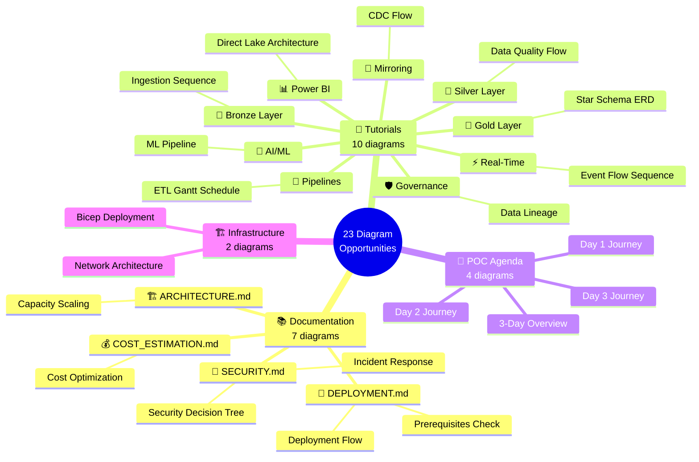
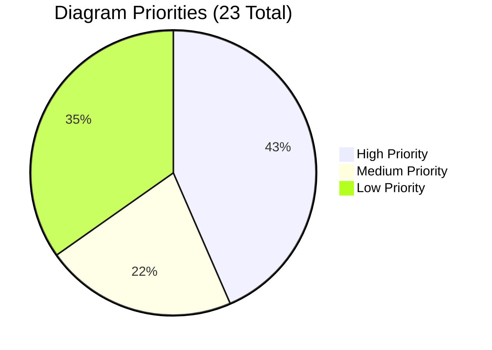
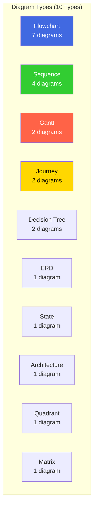
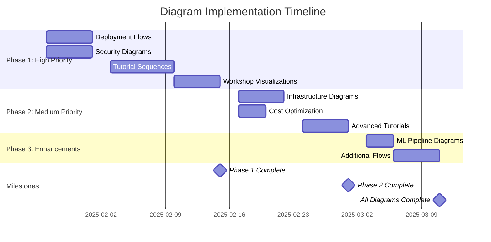
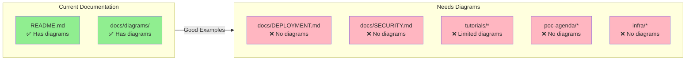
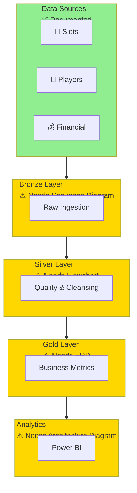
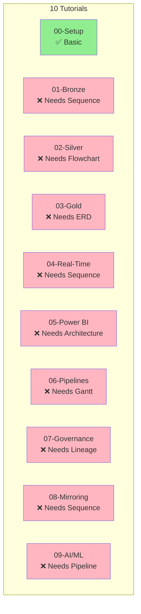
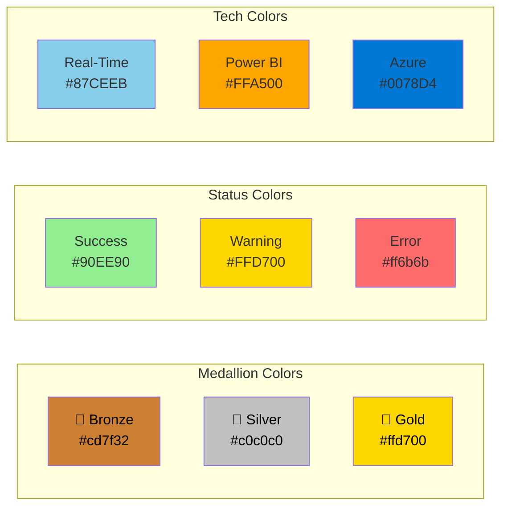
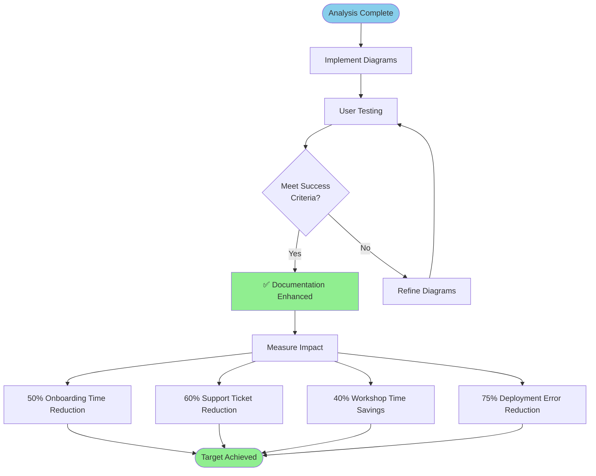
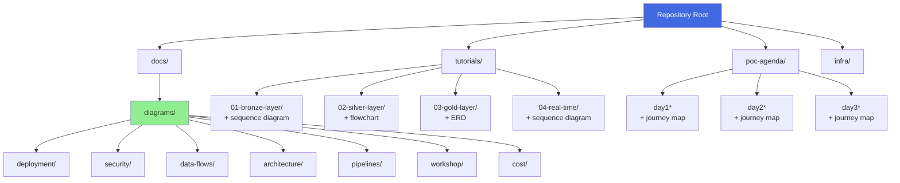

# 📊 Diagram Opportunities - Visual Summary

> Interactive visual overview of all identified Mermaid diagram opportunities

---

## 🗺️ Opportunity Distribution Map

```mermaid
mindmap
  root((23 Diagram<br/>Opportunities))
    📚 Documentation<br/>7 diagrams
      🚀 DEPLOYMENT.md
        Deployment Flow
        Prerequisites Check
      🔐 SECURITY.md
        Security Decision Tree
        Incident Response
      💰 COST_ESTIMATION.md
        Cost Optimization
      🏗️ ARCHITECTURE.md
        Capacity Scaling
    📖 Tutorials<br/>10 diagrams
      🥉 Bronze Layer
        Ingestion Sequence
      🥈 Silver Layer
        Data Quality Flow
      🥇 Gold Layer
        Star Schema ERD
      ⚡ Real-Time
        Event Flow Sequence
      📊 Power BI
        Direct Lake Architecture
      🔄 Pipelines
        ETL Gantt Schedule
      🛡️ Governance
        Data Lineage
      🔄 Mirroring
        CDC Flow
      🤖 AI/ML
        ML Pipeline
    📅 POC Agenda<br/>4 diagrams
      3-Day Overview
      Day 1 Journey
      Day 2 Journey
      Day 3 Journey
    🏗️ Infrastructure<br/>2 diagrams
      Bicep Deployment
      Network Architecture
```

---

## 📊 Priority Distribution

```mermaid
pie title Diagram Priorities (23 Total)
    "High Priority" : 10
    "Medium Priority" : 5
    "Low Priority" : 8
```

---

## 🎨 Diagram Type Distribution

```mermaid
graph TB
    subgraph Types["Diagram Types (10 Types)"]
        F[Flowchart<br/>7 diagrams]
        S[Sequence<br/>4 diagrams]
        G[Gantt<br/>2 diagrams]
        J[Journey<br/>2 diagrams]
        D[Decision Tree<br/>2 diagrams]
        E[ERD<br/>1 diagram]
        ST[State<br/>1 diagram]
        A[Architecture<br/>1 diagram]
        Q[Quadrant<br/>1 diagram]
        M[Matrix<br/>1 diagram]
    end
    
    style F fill:#4169E1,color:#fff
    style S fill:#32CD32,color:#fff
    style G fill:#FF6347,color:#fff
    style J fill:#FFD700,color:#000
```

---

## 🚀 Implementation Roadmap

```mermaid
gantt
    title Diagram Implementation Timeline
    dateFormat YYYY-MM-DD
    
    section Phase 1: High Priority
    Deployment Flows           :p1a, 2025-01-27, 5d
    Security Diagrams          :p1b, 2025-01-27, 5d
    Tutorial Sequences         :p1c, 2025-02-03, 7d
    Workshop Visualizations    :p1d, 2025-02-10, 5d
    
    section Phase 2: Medium Priority
    Infrastructure Diagrams    :p2a, 2025-02-17, 5d
    Cost Optimization          :p2b, 2025-02-17, 3d
    Advanced Tutorials         :p2c, 2025-02-24, 5d
    
    section Phase 3: Enhancements
    ML Pipeline Diagrams       :p3a, 2025-03-03, 3d
    Additional Flows           :p3b, 2025-03-06, 5d
    
    section Milestones
    Phase 1 Complete          :milestone, after p1d, 0d
    Phase 2 Complete          :milestone, after p2c, 0d
    All Diagrams Complete     :milestone, after p3b, 0d
```

---

## 📈 Expected Impact Metrics

```mermaid
quadrantChart
    title POC Success Impact (Effort vs Value)
    x-axis Low Effort --> High Effort
    y-axis Low Value --> High Value
    quadrant-1 Quick Wins (Do First)
    quadrant-2 Strategic Investments
    quadrant-3 Consider Later
    quadrant-4 Time Sinks (Avoid)
    
    Deployment Flow: [0.3, 0.9]
    Security Tree: [0.3, 0.8]
    Bronze Sequence: [0.4, 0.9]
    DQ Pipeline: [0.4, 0.8]
    Star Schema: [0.5, 0.9]
    Real-Time Flow: [0.5, 0.8]
    Pipeline Gantt: [0.3, 0.7]
    Lineage Flow: [0.6, 0.9]
    Workshop Journey: [0.2, 0.7]
    3-Day Overview: [0.2, 0.6]
    IaC Sequence: [0.5, 0.6]
    Cost Tree: [0.4, 0.6]
    Direct Lake: [0.4, 0.7]
    Mirroring: [0.5, 0.6]
    Data Gen Flow: [0.4, 0.5]
```

---

## 🎯 Coverage Analysis

```mermaid
graph LR
    subgraph Current["Current Documentation"]
        README[README.md<br/>✅ Has diagrams]
        ARCH[docs/diagrams/<br/>✅ Has diagrams]
    end
    
    subgraph NeedDiagrams["Needs Diagrams"]
        DEPLOY[docs/DEPLOYMENT.md<br/>❌ No diagrams]
        SEC[docs/SECURITY.md<br/>❌ No diagrams]
        TUT[tutorials/*<br/>❌ Limited diagrams]
        POC[poc-agenda/*<br/>❌ No diagrams]
        INFRA[infra/*<br/>❌ No diagrams]
    end
    
    Current -->|Good Examples| NeedDiagrams
    
    style README fill:#90EE90
    style ARCH fill:#90EE90
    style DEPLOY fill:#FFB6C1
    style SEC fill:#FFB6C1
    style TUT fill:#FFB6C1
    style POC fill:#FFB6C1
    style INFRA fill:#FFB6C1
```

---

## 🔄 Data Flow Coverage

```mermaid
flowchart TB
    subgraph Sources["Data Sources<br/>✅ Documented"]
        S1[🎰 Slots]
        S2[👤 Players]
        S3[💰 Financial]
    end
    
    subgraph Bronze["Bronze Layer<br/>⚠️ Needs Sequence Diagram"]
        B[Raw Ingestion]
    end
    
    subgraph Silver["Silver Layer<br/>⚠️ Needs Flowchart"]
        SV[Quality & Cleansing]
    end
    
    subgraph Gold["Gold Layer<br/>⚠️ Needs ERD"]
        G[Business Metrics]
    end
    
    subgraph Analytics["Analytics<br/>⚠️ Needs Architecture Diagram"]
        A[Power BI]
    end
    
    Sources --> Bronze
    Bronze --> Silver
    Silver --> Gold
    Gold --> Analytics
    
    style Sources fill:#90EE90
    style Bronze fill:#FFD700
    style Silver fill:#FFD700
    style Gold fill:#FFD700
    style Analytics fill:#FFD700
```

---

## 📚 Tutorial Coverage Matrix

```mermaid
graph TD
    subgraph Tutorials["10 Tutorials"]
        T00[00-Setup<br/>✅ Basic]
        T01[01-Bronze<br/>❌ Needs Sequence]
        T02[02-Silver<br/>❌ Needs Flowchart]
        T03[03-Gold<br/>❌ Needs ERD]
        T04[04-Real-Time<br/>❌ Needs Sequence]
        T05[05-Power BI<br/>❌ Needs Architecture]
        T06[06-Pipelines<br/>❌ Needs Gantt]
        T07[07-Governance<br/>❌ Needs Lineage]
        T08[08-Mirroring<br/>❌ Needs Sequence]
        T09[09-AI/ML<br/>❌ Needs Pipeline]
    end
    
    style T00 fill:#90EE90
    style T01 fill:#FFB6C1
    style T02 fill:#FFB6C1
    style T03 fill:#FFB6C1
    style T04 fill:#FFB6C1
    style T05 fill:#FFB6C1
    style T06 fill:#FFB6C1
    style T07 fill:#FFB6C1
    style T08 fill:#FFB6C1
    style T09 fill:#FFB6C1
```

---

## 🎨 Style Consistency Guide

```mermaid
graph LR
    subgraph Medallion["Medallion Colors"]
        B[🥉 Bronze<br/>#cd7f32]
        S[🥈 Silver<br/>#c0c0c0]
        G[🥇 Gold<br/>#ffd700]
    end
    
    subgraph Status["Status Colors"]
        SUCCESS[Success<br/>#90EE90]
        WARNING[Warning<br/>#FFD700]
        ERROR[Error<br/>#ff6b6b]
    end
    
    subgraph Technology["Tech Colors"]
        RT[Real-Time<br/>#87CEEB]
        PBI[Power BI<br/>#FFA500]
        AZURE[Azure<br/>#0078D4]
    end
    
    style B fill:#cd7f32,color:#000
    style S fill:#c0c0c0,color:#000
    style G fill:#ffd700,color:#000
    style SUCCESS fill:#90EE90
    style WARNING fill:#FFD700
    style ERROR fill:#ff6b6b
    style RT fill:#87CEEB
    style PBI fill:#FFA500
    style AZURE fill:#0078D4
```

---

## 📊 Value vs. Effort Matrix

| Diagram | Value | Effort | Priority | Location |
|---------|-------|--------|----------|----------|
| Deployment Flow | ⭐⭐⭐⭐⭐ | 🔨🔨 | 🔴 High | docs/DEPLOYMENT.md |
| Security Tree | ⭐⭐⭐⭐ | 🔨🔨 | 🔴 High | docs/SECURITY.md |
| Bronze Sequence | ⭐⭐⭐⭐⭐ | 🔨🔨🔨 | 🔴 High | tutorials/01-bronze-layer/ |
| DQ Pipeline | ⭐⭐⭐⭐ | 🔨🔨🔨 | 🔴 High | tutorials/02-silver-layer/ |
| Star Schema ERD | ⭐⭐⭐⭐⭐ | 🔨🔨🔨 | 🔴 High | tutorials/03-gold-layer/ |
| Real-Time Flow | ⭐⭐⭐⭐ | 🔨🔨🔨 | 🔴 High | tutorials/04-real-time/ |
| Pipeline Gantt | ⭐⭐⭐ | 🔨🔨 | 🔴 High | tutorials/06-pipelines/ |
| Lineage Flow | ⭐⭐⭐⭐⭐ | 🔨🔨🔨🔨 | 🔴 High | tutorials/07-governance/ |
| Workshop Journey | ⭐⭐⭐ | 🔨 | 🔴 High | poc-agenda/day1 |
| 3-Day Overview | ⭐⭐⭐ | 🔨 | 🔴 High | poc-agenda/README.md |
| IaC Sequence | ⭐⭐⭐ | 🔨🔨🔨 | 🟡 Medium | infra/main.bicep |
| Cost Tree | ⭐⭐⭐ | 🔨🔨 | 🟡 Medium | docs/COST_ESTIMATION.md |
| Direct Lake | ⭐⭐⭐ | 🔨🔨 | 🟡 Medium | tutorials/05-direct-lake/ |
| Mirroring Flow | ⭐⭐⭐ | 🔨🔨🔨 | 🟡 Medium | tutorials/08-mirroring/ |
| Data Gen Flow | ⭐⭐ | 🔨🔨 | 🟡 Medium | data-generation/ |

**Legend:**
- Value: ⭐ = Low to ⭐⭐⭐⭐⭐ = Critical
- Effort: 🔨 = Easy to 🔨🔨🔨🔨 = Complex
- Priority: 🔴 High | 🟡 Medium | 🟢 Low

---

## 🎯 Success Criteria

```mermaid
graph TD
    START([Analysis Complete]) --> IMPL[Implement Diagrams]
    IMPL --> TEST[User Testing]
    TEST --> METRICS{Meet Success<br/>Criteria?}
    
    METRICS -->|Yes| SUCCESS[✅ Documentation Enhanced]
    METRICS -->|No| REFINE[Refine Diagrams]
    REFINE --> TEST
    
    SUCCESS --> MEASURE[Measure Impact]
    MEASURE --> M1[50% Onboarding Time Reduction]
    MEASURE --> M2[60% Support Ticket Reduction]
    MEASURE --> M3[40% Workshop Time Savings]
    MEASURE --> M4[75% Deployment Error Reduction]
    
    M1 & M2 & M3 & M4 --> END([Target Achieved])
    
    style START fill:#87CEEB
    style SUCCESS fill:#90EE90
    style END fill:#90EE90
```

---

## 📁 File Organization

```mermaid
graph TD
    ROOT[Repository Root] --> DOCS[docs/]
    ROOT --> TUTORIALS[tutorials/]
    ROOT --> POC[poc-agenda/]
    ROOT --> INFRA[infra/]
    
    DOCS --> DIAGRAMS[diagrams/]
    DIAGRAMS --> DEPLOY_D[deployment/]
    DIAGRAMS --> SEC_D[security/]
    DIAGRAMS --> DATA_D[data-flows/]
    DIAGRAMS --> ARCH_D[architecture/]
    DIAGRAMS --> PIPE_D[pipelines/]
    DIAGRAMS --> WORK_D[workshop/]
    DIAGRAMS --> COST_D[cost/]
    
    TUTORIALS --> T01[01-bronze-layer/<br/>+ sequence diagram]
    TUTORIALS --> T02[02-silver-layer/<br/>+ flowchart]
    TUTORIALS --> T03[03-gold-layer/<br/>+ ERD]
    TUTORIALS --> T04[04-real-time/<br/>+ sequence diagram]
    
    POC --> DAY1[day1*<br/>+ journey map]
    POC --> DAY2[day2*<br/>+ journey map]
    POC --> DAY3[day3*<br/>+ journey map]
    
    style ROOT fill:#4169E1,color:#fff
    style DIAGRAMS fill:#90EE90
```

---

## 🔗 Quick Links

| Document | Purpose |
|----------|---------|
| [MERMAID_DIAGRAM_OPPORTUNITIES.md](./MERMAID_DIAGRAM_OPPORTUNITIES.md) | Comprehensive analysis with detailed diagrams |
| [DIAGRAM_QUICK_REFERENCE.md](./DIAGRAM_QUICK_REFERENCE.md) | Quick lookup table and implementation guide |
| [docs/diagrams/architecture-overview.md](./docs/diagrams/architecture-overview.md) | Existing diagram examples |

---

**Visual Summary Created:** 2025-01-21  
**Total Opportunities:** 23 diagrams identified  
**Estimated Implementation:** 6-8 weeks  
**Expected ROI:** 50-75% improvement in key metrics
