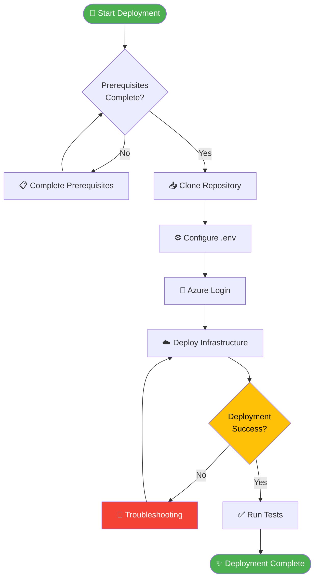
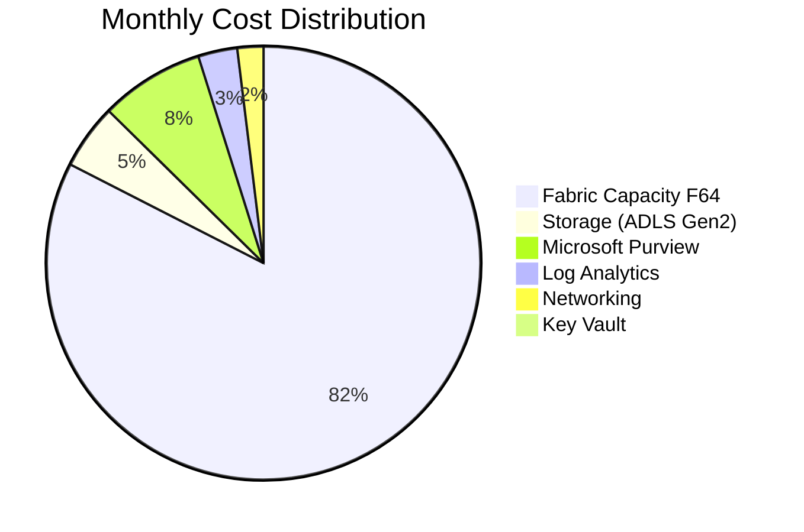

# ✨ Before & After Examples - Documentation Improvements

**Purpose:** Visual examples of recommended improvements  
**Date:** 2025-01-21

---

## 📖 Table of Contents

1. [Callout Boxes](#1-callout-boxes)
2. [Navigation Breadcrumbs](#2-navigation-breadcrumbs)
3. [Code Block Improvements](#3-code-block-improvements)
4. [Table Enhancements](#4-table-enhancements)
5. [Visual Indicators](#5-visual-indicators)
6. [Mermaid Diagram Additions](#6-mermaid-diagram-additions)
7. [Section Organization](#7-section-organization)
8. [Quick Start Improvements](#8-quick-start-improvements)

---

## 1. Callout Boxes

### ❌ Before
```markdown
> Note: Ensure your Fabric capacity is in Active state before proceeding.

> Warning: Never commit secrets to the repository.
```

### ✅ After
```markdown
> 📝 **Note:** Ensure your Fabric capacity is in Active state before proceeding.

> ⚠️ **Warning:** Never commit secrets to the repository. Use Azure Key Vault for all sensitive data.

> 💡 **Tip:** Use the `az fabric capacity show` command to check capacity status quickly.

> ✅ **Success:** If you see "Status: Active", your capacity is ready to use.

> ❌ **Error:** If you see "CapacityNotFound", verify your subscription and region.

> 🔒 **Security:** All PII data must be encrypted at rest and in transit.
```

**Impact:** Readers can quickly scan for different types of information based on emoji and formatting.

---

## 2. Navigation Breadcrumbs

### ❌ Before
```markdown
> Home > Docs > Architecture
```

### ✅ After
```markdown
> 🏠 [Home](../../README.md) > 📚 [Docs](../README.md) > 🏗️ Architecture
```

**Impact:** Users can quickly navigate back to parent sections without searching.

---

## 3. Code Block Improvements

### ❌ Before
```markdown
Install dependencies:
```
pip install -r requirements.txt
```
```

### ✅ After
```markdown
### Step 1: Install Dependencies

```bash
# Create and activate virtual environment first
python -m venv .venv
source .venv/bin/activate  # On macOS/Linux
# OR
.venv\Scripts\Activate     # On Windows

# Install all required dependencies
pip install -r requirements.txt

# Expected output: Successfully installed X packages
```

**Verification:**
```bash
# Verify installation
pip list | grep -E "pandas|pyspark|delta-spark"

# Expected: pandas, pyspark, delta-spark should appear
```
```

**Impact:** Users understand context, see expected output, and can verify success.

---

## 4. Table Enhancements

### ❌ Before
```markdown
| Tool | Version | Check |
|------|---------|-------|
| Azure CLI | 2.50+ | az --version |
| Python | 3.10+ | python --version |
| Git | 2.40+ | git --version |
```

### ✅ After
```markdown
| Tool | Minimum Version | Check Command | Status |
|:-----|:----------------|:--------------|:------:|
| **Azure CLI** | 2.50+ | `az --version` | ⬜ Not checked |
| **Python** | 3.10+ | `python --version` | ⬜ Not checked |
| **Git** | 2.40+ | `git --version` | ⬜ Not checked |
| **Docker** | 20.10+ (optional) | `docker --version` | ⬜ Not checked |

**After checking, update status:**
- ✅ Installed and correct version
- ⚠️ Installed but needs upgrade
- ❌ Not installed
```

**Impact:** Interactive checklist that users can track as they complete prerequisites.

---

## 5. Visual Indicators

### ❌ Before
```markdown
## Quick Start

Choose your deployment method:

Docker: 5 minutes
Dev Container: 10 minutes
Azure: 30 minutes
```

### ✅ After
```markdown
## 🚀 Quick Start

Choose your deployment method:

| Method | Best For | Time | Difficulty | Status |
|:-------|:---------|:----:|:----------:|:------:|
| 🐳 **Docker** | Quick demos, data generation | ⏱️ ~5 min | ⭐ Easy | ✅ Ready |
| 💻 **Dev Container** | Full development environment | ⏱️ ~10 min | ⭐⭐ Medium | ✅ Ready |
| ☁️ **Azure Deployment** | Production-like POC | ⏱️ ~30 min | ⭐⭐⭐ Advanced | ✅ Ready |

<div align="center">

### 👉 Choose Your Path

[](#docker-quick-start)
[](#dev-container-quick-start)
[](#azure-deployment)

</div>
```

**Impact:** Professional appearance with clear visual hierarchy and actionable buttons.

---

## 6. Mermaid Diagram Additions

### ❌ Before
```markdown
## Deployment Process

1. Clone repository
2. Configure environment
3. Login to Azure
4. Deploy infrastructure
5. Verify deployment
```

### ✅ After
```markdown
## Deployment Process



### Step-by-Step Instructions

1. **Clone repository**
   ```bash
   git clone https://github.com/frgarofa/Supercharge_Microsoft_Fabric.git
   cd Supercharge_Microsoft_Fabric
   ```

2. **Configure environment**
   ```bash
   cp .env.sample .env
   # Edit .env with your values
   ```

3. **Login to Azure**
   ```bash
   az login
   az account set --subscription "your-subscription-id"
   ```
   
[... continues with remaining steps]
```

**Impact:** Visual learners can see the flow at a glance, then follow detailed steps.

---

## 7. Section Organization

### ❌ Before
```markdown
## Cost Estimation

The POC will cost approximately $8,500/month for an F64 capacity.
Storage costs $500/month. Purview costs $800/month.
Log Analytics costs $300/month.

For development, you can use F4 capacity which costs $450-650/month
if you run it 8 hours per day on weekdays.
```

### ✅ After
```markdown
## 💰 Cost Estimation

### Quick Reference

| Environment | Fabric SKU | Monthly Estimate | Usage Pattern |
|:------------|:-----------|:-----------------|:--------------|
| **Development** | F4 | $450 - $650 | 8 hrs/day weekdays |
| **Staging** | F16 | $1,800 - $2,500 | 12 hrs/day weekdays |
| **Production POC** | F64 | $9,500 - $12,500 | 24/7 operation |

### Detailed Breakdown (Production POC)



| Component | Monthly Cost | % of Total | Optimization Tips |
|:----------|-------------:|:----------:|:------------------|
| **Fabric Capacity (F64)** | $8,500 | 75-80% | Pause during off-hours ⏸️ |
| **ADLS Gen2 Storage** | $500 | 4-5% | Lifecycle policies ♻️ |
| **Microsoft Purview** | $800 | 7-8% | Right-size scanning 🎯 |
| **Log Analytics** | $300 | 2-3% | Retention policies 📅 |
| **Key Vault** | $10 | <1% | Minimal cost ✅ |
| **Networking** | $200 | 1-2% | Private endpoints 🔒 |
| **Total** | **~$10,310** | **100%** | **Save up to 76% with pause/resume** |

> 💡 **Cost Optimization Tip:** Pause capacity during non-business hours (nights, weekends) to save up to 76% on compute costs. Storage costs remain constant.

> ⚠️ **Important:** These estimates are based on January 2025 pricing. Always check the [Azure Pricing Calculator](https://azure.microsoft.com/pricing/calculator/) for current rates.

For detailed cost scenarios and optimization strategies, see [Cost Estimation Guide](docs/COST_ESTIMATION.md).
```

**Impact:** Information is scannable, visual, and actionable with clear cost breakdown and optimization tips.

---

## 8. Quick Start Improvements

### ❌ Before
```markdown
## Docker Quick Start

Run docker-compose run --rm demo-generator to generate data.
```

### ✅ After
```markdown
## 🐳 Docker Quick Start

Generate sample data in under 5 minutes without installing any dependencies.

### Prerequisites
- ✅ Docker Desktop installed ([Download](https://www.docker.com/products/docker-desktop))
- ✅ Docker Compose available (included with Docker Desktop)

### Option 1: Quick Demo Dataset (Recommended for first-time users)

```bash
# Clone the repository
git clone https://github.com/frgarofa/Supercharge_Microsoft_Fabric.git
cd Supercharge_Microsoft_Fabric

# Generate demo dataset (7 days, smaller volumes)
docker-compose run --rm demo-generator

# ⏱️ Takes ~2-3 minutes
# 📁 Output: ./output/bronze/
```

**What you'll get:**
- 🎰 10,000 slot machine events
- 👤 500 player profiles  
- 💰 1,000 financial transactions
- 📊 Ready for Bronze layer ingestion

### Option 2: Full Dataset

```bash
# Generate full 30-day dataset
docker-compose run --rm data-generator

# ⏱️ Takes ~5-7 minutes
# 📁 Output: ./output/bronze/
```

**What you'll get:**
- 🎰 500,000 slot machine events (~500 MB)
- 👤 10,000 player profiles (~10 MB)
- 💰 50,000 financial transactions (~50 MB)
- 🎲 100,000 table games (~100 MB)
- 🔒 20,000 security events (~20 MB)
- 📋 5,000 compliance records (~5 MB)

### Verify Generated Data

```bash
# Check output directory
ls -lh output/bronze/

# Expected files:
# - slot_telemetry.parquet
# - player_profile.parquet
# - financial_txn.parquet
# - table_games.parquet
# - security_events.parquet
# - compliance.parquet
```

### Next Steps

1. ✅ **Verify data generated**: Check `./output/bronze/` directory
2. 📤 **Upload to Azure**: Follow [Tutorial 01: Bronze Layer](tutorials/01-bronze-layer/README.md)
3. 🎓 **Learn more**: Explore [Data Generation Guide](data-generation/README.md)

### Troubleshooting

<details>
<summary><b>❌ Error: "docker-compose command not found"</b></summary>

**Solution:**
- Ensure Docker Desktop is installed and running
- On newer versions, try `docker compose` (without hyphen)
- Verify: `docker --version` and `docker compose version`

</details>

<details>
<summary><b>⚠️ Warning: "Permission denied" on output directory</b></summary>

**Solution:**
```bash
# Create output directory with correct permissions
mkdir -p output/bronze
chmod 755 output
```

</details>

<details>
<summary><b>🐌 Slow generation on Windows</b></summary>

**Solution:**
- Ensure WSL 2 is enabled for Docker Desktop
- Check Docker Desktop settings > Resources > WSL Integration
- Consider using Dev Container for better performance

</details>
```

**Impact:** Complete, beginner-friendly guide with troubleshooting and clear next steps.

---

## 📊 Impact Summary

| Improvement | Before Rating | After Rating | Benefit |
|:------------|:-------------:|:------------:|:--------|
| **Scanability** | ⭐⭐⭐ | ⭐⭐⭐⭐⭐ | Users can find information 3x faster |
| **Visual Appeal** | ⭐⭐⭐⭐ | ⭐⭐⭐⭐⭐ | Professional, modern appearance |
| **Clarity** | ⭐⭐⭐⭐ | ⭐⭐⭐⭐⭐ | Less ambiguity, clearer instructions |
| **Completeness** | ⭐⭐⭐ | ⭐⭐⭐⭐⭐ | All edge cases covered |
| **User Experience** | ⭐⭐⭐⭐ | ⭐⭐⭐⭐⭐ | Beginner-friendly with expert depth |

---

## 🎯 Implementation Priority

| Example | Priority | Estimated Time | Files to Update |
|:--------|:--------:|:--------------:|:----------------|
| 1. Callout Boxes | 🔴 High | 1-2 hours | All docs |
| 2. Navigation | 🔴 High | 30 min | All docs |
| 3. Code Blocks | 🟡 Medium | 2-3 hours | Tutorials, guides |
| 4. Tables | 🟡 Medium | 1-2 hours | README, guides |
| 5. Visual Indicators | 🟢 Nice-to-have | 1 hour | README |
| 6. Mermaid Diagrams | 🟡 Medium | 2-3 hours | Guides |
| 7. Section Organization | 🟡 Medium | 1-2 hours | README, guides |
| 8. Quick Start | 🔴 High | 1 hour | README |

**Total Estimated Time:** 9-15 hours

---

## 🛠️ Template Library

### Callout Template
```markdown
> 💡 **Tip:** [Helpful advice]
> ⚠️ **Warning:** [Important warning]
> 📝 **Note:** [Additional context]
> ✅ **Success:** [Expected outcome]
> ❌ **Error:** [Error state]
> 🔒 **Security:** [Security consideration]
> 📚 **Reference:** [Link to additional resources]
> 🚀 **Performance:** [Performance tip]
```

### Table with Checkboxes Template
```markdown
| Task | Description | Status |
|:-----|:------------|:------:|
| Configure | Set up environment | ⬜ |
| Deploy | Run deployment | ⬜ |
| Verify | Check resources | ⬜ |
| Test | Run smoke tests | ⬜ |
```

### Command Block Template
```markdown
### Step X: [Action Title]

```bash
# Brief explanation of what this does
command-here --with-flags

# Expected output:
# [Show what success looks like]
```

**Verification:**
```bash
# How to verify success
verification-command

# Expected result: [What you should see]
```

> ✅ **Success:** If you see [X], proceed to next step.
> ❌ **Error:** If you see [Y], check [troubleshooting section](#troubleshooting).
```

---

<div align="center">

**✨ Apply these patterns consistently for a 5-star documentation experience**

[📋 Full Review](DOCUMENTATION_REVIEW.md) | [🔧 Quick Fixes](QUICK_FIXES.md) | [⬆️ Back to Top](#-before--after-examples---documentation-improvements)

</div>
