<div align="center">

# 🎰 Supercharge Microsoft Fabric 🎲

### Casino & Gaming Industry POC


**Transform your casino operations with enterprise-grade analytics powered by Microsoft Fabric**

*Real-time insights • Medallion Architecture • Regulatory Compliance • Direct Lake BI*

[🚀 Quick Start](#-quick-start) •
[🐳 Docker](#-docker-support) •
[📖 Tutorials](#-tutorials) •
[🏗️ Architecture](#-architecture) •
[📊 POC Agenda](#-3-day-poc-agenda)

---

</div>

## 📍 Navigation

> **Home** / README

| Section | Description |
|:--------|:------------|
| [🎯 Overview](#-overview) | What this POC delivers |
| [👥 Target Audience](#-target-audience) | Who should use this |
| [🚀 Quick Start](#-quick-start) | Get up and running |
| [🐳 Docker Support](#-docker-support) | Container-based deployment |
| [💻 Dev Container](#-dev-container) | One-click development setup |
| [📊 Power BI Reports](#-power-bi-reports) | Pre-built report templates |
| [💰 Cost Estimation](#-cost-estimation) | Azure cost planning |
| [📁 Sample Data](#-sample-data) | Pre-generated datasets |
| [🏗️ Architecture](#-architecture) | Technical deep-dive |
| [🎰 Data Domains](#-casinogaming-data-domains) | Gaming-specific domains |
| [📂 Repository Structure](#-repository-structure) | What's included |
| [📊 POC Agenda](#-3-day-poc-agenda) | Workshop schedule |
| [📖 Tutorials](#-tutorials) | Learning path |
| [📜 Compliance](#-compliance-frameworks) | Regulatory coverage |

---

## 🎯 Overview

This repository provides a **complete, production-ready proof-of-concept** environment for Microsoft Fabric, purpose-built for the casino and gaming industry.

<table>
<tr>
<td width="50%">

### ✨ Key Features

| Feature | Description |
|:--------|:------------|
| 🏛️ **Medallion Architecture** | Bronze/Silver/Gold Lakehouse |
| ⚡ **Real-Time Intelligence** | Casino floor monitoring |
| 📊 **Direct Lake** | Sub-second Power BI analytics |
| 🔐 **Microsoft Purview** | Data governance & compliance |
| 🚀 **Infrastructure as Code** | Bicep/ARM deployment |
| 📚 **Step-by-Step Tutorials** | Hands-on learning path |

</td>
<td width="50%">

### 💎 Value Proposition

```
┌─────────────────────────────────────┐
│  🎰 REAL-TIME SLOT TELEMETRY        │
│  🎲 TABLE GAME ANALYTICS            │
│  👤 PLAYER 360 INSIGHTS             │
│  💰 FINANCIAL COMPLIANCE            │
│  🔒 SECURITY & SURVEILLANCE         │
│  📋 REGULATORY REPORTING            │
└─────────────────────────────────────┘
```

</td>
</tr>
</table>

---

## 👥 Target Audience

<table>
<tr>
<td align="center" width="16%">
<br/>
<b>Data Architects</b><br/>
<sub>Evaluating Fabric</sub>
</td>
<td align="center" width="16%">
<br/>
<b>Data Engineers</b><br/>
<sub>Medallion patterns</sub>
</td>
<td align="center" width="16%">
<br/>
<b>BI Developers</b><br/>
<sub>Direct Lake solutions</sub>
</td>
<td align="center" width="16%">
<br/>
<b>Solution Architects</b><br/>
<sub>Enterprise platforms</sub>
</td>
<td align="center" width="16%">
<br/>
<b>Gaming Industry</b><br/>
<sub>Regulated operations</sub>
</td>
<td align="center" width="16%">
<br/>
<b>Hospitality</b><br/>
<sub>Guest analytics</sub>
</td>
</tr>
</table>

---

## 🚀 Quick Start

Choose your preferred deployment method:

| Method | Best For | Time to Start |
|:-------|:---------|:--------------|
| [🐳 Docker Quick Start](#docker-quick-start) | Quick demos, testing data generators | ~5 minutes |
| [💻 Dev Container](#dev-container-quick-start) | Full development environment | ~10 minutes |
| [☁️ Azure Deployment](#azure-deployment) | Production-like POC environment | ~30 minutes |

---

### Docker Quick Start

The fastest way to generate sample data and explore the POC.

```bash
# Clone the repository
git clone https://github.com/frgarofa/Supercharge_Microsoft_Fabric.git
cd Supercharge_Microsoft_Fabric

# Generate demo data (1000 events, 7 days)
docker-compose run --rm demo-generator

# Generate full dataset (30 days, all domains)
docker-compose run --rm data-generator

# Output will be in ./output directory
```

> 💡 **Pro Tip:** Use the demo generator for quick testing (generates in ~2 minutes), or the full data generator for realistic POC scenarios with 30 days of data.

See [Docker Support](#-docker-support) for more options.

---

### Dev Container Quick Start

One-click development environment with all tools pre-configured.

**VS Code:**
1. Install the [Dev Containers extension](https://marketplace.visualstudio.com/items?itemName=ms-vscode-remote.remote-containers)
2. Open this repository in VS Code
3. Click "Reopen in Container" when prompted (or use `Ctrl+Shift+P` > "Dev Containers: Reopen in Container")

**GitHub Codespaces:**
1. Click the green "Code" button on GitHub
2. Select "Codespaces" tab
3. Click "Create codespace on main"

> 💡 **Pro Tip:** GitHub Codespaces provides a cloud-based development environment with no local installation required. Perfect for team collaboration and workshops.

See [Dev Container](#-dev-container) for configuration details.

---

### Azure Deployment

> 📋 **Prerequisites:** Complete the full [Prerequisites Guide](docs/PREREQUISITES.md) before starting deployment. This includes Azure subscription setup, tool installation, and resource provider registration.

#### Prerequisites Checklist

- [ ] Azure subscription with **Owner** or **Contributor** access
- [ ] Microsoft Fabric capacity (**F64** recommended for POC)
- [ ] Azure CLI **2.50+** with Bicep extension
- [ ] PowerShell **7+** or Bash
- [ ] Git installed
- [ ] Docker (optional, for data generation)

---

#### Step-by-Step Deployment

<table>
<tr>
<td width="80">

### 1️⃣

</td>
<td>

**Clone the Repository**

```bash
git clone https://github.com/frgarofa/Supercharge_Microsoft_Fabric.git
cd Supercharge_Microsoft_Fabric
```

</td>
</tr>
<tr>
<td>

### 2️⃣

</td>
<td>

**Configure Environment**

```bash
cp .env.sample .env
# Edit .env with your Azure subscription and tenant details
```

> ⚠️ **Warning:** Ensure all required environment variables are populated. Missing values will cause deployment failures.

</td>
</tr>
<tr>
<td>

### 3️⃣

</td>
<td>

**Login to Azure**

```bash
az login
az account set --subscription "<your-subscription-id>"
```

</td>
</tr>
<tr>
<td>

### 4️⃣

</td>
<td>

**Deploy Infrastructure**

```bash
az deployment sub create \
  --location eastus2 \
  --template-file infra/main.bicep \
  --parameters infra/environments/dev/dev.bicepparam
```

> 💡 **Pro Tip:** Run `az deployment sub what-if` first to preview all resource changes before actual deployment.

</td>
</tr>
<tr>
<td>

### 5️⃣

</td>
<td>

**Start Learning**

👉 Begin with [Tutorial 00: Environment Setup](tutorials/00-environment-setup/README.md)

</td>
</tr>
</table>

---

## 🏗️ Architecture

### High-Level Data Flow


### Architecture Highlights

<details>
<summary><b>🥉 Bronze Layer - Raw Ingestion</b></summary>

- **Purpose**: Land raw data with minimal transformation
- **Pattern**: Schema-on-read, append-only
- **Format**: Delta Lake tables
- **Retention**: Configurable (default 90 days)
- **Key Feature**: Full historical lineage preserved

</details>

<details>
<summary><b>🥈 Silver Layer - Cleansed & Validated</b></summary>

- **Purpose**: Business rules and data quality
- **Pattern**: Slowly Changing Dimensions (SCD Type 2)
- **Transformations**: Deduplication, validation, standardization
- **Data Quality**: Great Expectations integration
- **Key Feature**: Audit-ready data lineage

</details>

<details>
<summary><b>🥇 Gold Layer - Business Ready</b></summary>

- **Purpose**: Aggregations, KPIs, and business metrics
- **Pattern**: Star/Snowflake schema
- **Optimization**: Partitioned by date, optimized for queries
- **Refresh**: Incremental or scheduled
- **Key Feature**: Direct Lake semantic model integration

</details>

<details>
<summary><b>⚡ Real-Time Intelligence</b></summary>

- **Eventstreams**: Apache Kafka-compatible streaming
- **Eventhouse**: KQL-based analytics database
- **Latency**: Sub-second to seconds
- **Use Cases**: Slot monitoring, player alerts, anomaly detection

</details>

---

## 🐳 Docker Support

Run the data generators and validation tools without installing any dependencies.

### Available Services

| Service | Command | Description |
|:--------|:--------|:------------|
| `data-generator` | `docker-compose run --rm data-generator` | Generate full dataset (30 days) |
| `demo-generator` | `docker-compose run --rm demo-generator` | Quick demo dataset (7 days, smaller volumes) |
| `streaming-generator` | `docker-compose up streaming-generator` | Real-time streaming to Event Hub |
| `data-validator` | `docker-compose run --rm data-validator` | Validate generated data |

### Common Commands

```bash
# Build the Docker image
docker-compose build

# Generate all data with custom parameters
docker-compose run --rm data-generator --all --days 14 --format parquet

# Generate specific data types
docker-compose run --rm data-generator --slots 50000 --players 1000

# Stream events to Azure Event Hub (requires configuration)
EVENTHUB_CONNECTION_STRING="your-connection-string" \
EVENTHUB_NAME="slot-telemetry" \
docker-compose up streaming-generator

# Run validation on generated data
docker-compose run --rm data-validator
```

### Environment Variables

| Variable | Default | Description |
|:---------|:--------|:------------|
| `DATA_FORMAT` | `parquet` | Output format (parquet, csv, json) |
| `DATA_DAYS` | `30` | Days of historical data to generate |
| `EVENTHUB_CONNECTION_STRING` | - | Azure Event Hub connection string |
| `EVENTHUB_NAME` | `slot-telemetry` | Event Hub name for streaming |
| `STREAMING_RATE` | `10` | Events per second for streaming |

For detailed Docker documentation, see [docker/README.md](docker/README.md).

---

## 💻 Dev Container

The Dev Container provides a complete, pre-configured development environment with all necessary tools.

### Included Tools

| Tool | Version | Purpose |
|:-----|:--------|:--------|
| Python | 3.11 | Data generation, notebooks |
| Azure CLI | Latest | Azure resource management |
| Bicep | Latest | Infrastructure as Code |
| Git | Latest | Version control |
| PowerShell | 7.x | Scripting |
| Docker CLI | Latest | Container management |

### VS Code Extensions (Pre-installed)

- Azure Account
- Bicep
- Python
- Jupyter
- Docker
- GitHub Copilot (if licensed)
- Power BI (preview)

### Features

- **Automatic Python environment**: Virtual environment created on container start
- **Azure CLI authentication**: Sign in once, stay authenticated
- **Port forwarding**: Automatic forwarding for Jupyter and other services
- **GitHub Codespaces ready**: Same experience in the cloud

### Configuration Files

```
.devcontainer/
├── devcontainer.json    # Main configuration
├── Dockerfile           # Container image definition
└── post-create.sh       # Post-creation setup script
```

For customization options, see the [Dev Containers documentation](https://code.visualstudio.com/docs/devcontainers/containers).

---

## 📊 Power BI Reports

Pre-built Power BI report templates and semantic model definitions for quick deployment.

### Available Reports

| Report | Description | Key Visuals |
|:-------|:------------|:------------|
| **Casino Executive Dashboard** | High-level KPIs and trends | Revenue trends, floor performance, player metrics |
| **Slot Performance Analysis** | Machine-level analytics | Hold percentage, utilization, jackpot frequency |
| **Player 360 View** | Customer analytics | Player segments, lifetime value, visit patterns |
| **Compliance Monitoring** | Regulatory reporting | CTR/SAR status, W-2G tracking, audit trails |
| **Real-Time Floor Monitor** | Live casino floor status | Machine status, alerts, occupancy |

### Report Locations

```
reports/
├── report-definitions/           # Power BI report definition files
│   ├── executive-dashboard/
│   ├── slot-performance/
│   └── player-360/
└── semantic-model/               # Direct Lake semantic model
    ├── tables/                   # Table definitions
    └── measures/                 # DAX measures
```

### How to Import

1. **Connect to Fabric Workspace**: Open Power BI Desktop, connect to your Fabric workspace
2. **Import Semantic Model**: Use the definitions in `reports/semantic-model/`
3. **Import Reports**: Open `.pbip` files from `reports/report-definitions/`
4. **Configure Data Source**: Point to your Gold layer Lakehouse

For detailed instructions, see [reports/README.md](reports/README.md).

---

## 💰 Cost Estimation

Understand Azure costs before deployment with our comprehensive cost guide.

### Quick Reference

| Environment | Fabric SKU | Monthly Estimate | Notes |
|:------------|:-----------|:-----------------|:------|
| **Development** | F4 | $450 - $650 | 8 hrs/day weekdays |
| **Staging** | F16 | $1,800 - $2,500 | 12 hrs/day weekdays |
| **Production POC** | F64 | $9,500 - $12,500 | 24/7 operation |
| **Production Pilot** | F64 Reserved | $6,500 - $9,000 | 1-year reserved |

### Cost Breakdown (Production POC)

| Component | Monthly Cost | % of Total |
|:----------|:-------------|:-----------|
| Fabric Capacity (F64) | ~$8,500 | 75-80% |
| ADLS Gen2 Storage | ~$500 | 4-5% |
| Microsoft Purview | ~$800 | 7-8% |
| Log Analytics | ~$300 | 2-3% |
| Key Vault | ~$10 | <1% |
| Networking | ~$200 | 1-2% |

### Cost Optimization Tips

- **Pause capacity during off-hours** (saves up to 76%)
- **Use reserved capacity** for production (saves 25-30%)
- **Implement storage lifecycle policies** (move cold data to Cool tier)
- **Set up Azure Cost Management alerts**

> 💡 **Pro Tip:** Enable auto-pause on dev/staging environments to automatically suspend compute during idle periods. This can reduce costs by up to 76% for non-production workloads.

For detailed cost scenarios and optimization strategies, see [docs/COST_ESTIMATION.md](docs/COST_ESTIMATION.md).

---

## 📁 Sample Data

Pre-generated sample datasets for quick exploration without running data generators.

### Available Datasets

| Dataset | Records | Format | Size | Location |
|:--------|:--------|:-------|:-----|:---------|
| Slot Telemetry (7 days) | 10,000 | CSV/Parquet | ~10 MB | `sample-data/bronze/` |
| Player Profiles | 500 | CSV/Parquet | ~1 MB | `sample-data/bronze/` |
| Table Games | 2,000 | CSV/Parquet | ~2 MB | `sample-data/bronze/` |
| Financial Transactions | 1,000 | CSV/Parquet | ~1 MB | `sample-data/bronze/` |

### Quick Exploration

```bash
# View sample data structure
ls sample-data/bronze/

# Load into Pandas (Python)
import pandas as pd
df = pd.read_parquet('sample-data/bronze/slot_telemetry_sample.parquet')
df.head()

# View schemas
ls sample-data/schemas/
```

### Schema Definitions

Sample data includes matching schema definitions in `sample-data/schemas/` that document:
- Column names and data types
- Business descriptions
- Valid value ranges
- PII handling requirements

> 💡 **Pro Tip:** Sample data is perfect for initial exploration and testing notebooks without waiting for data generation. Use it to validate your environment setup before generating full datasets.

For generating larger custom datasets, see [data-generation/README.md](data-generation/README.md).

---

## 🎰 Casino/Gaming Data Domains

<table>
<tr>
<th width="15%">Domain</th>
<th width="5%">Icon</th>
<th width="40%">Description</th>
<th width="25%">Key Entities</th>
<th width="15%">Compliance</th>
</tr>
<tr>
<td><b>Slot Machines</b></td>
<td align="center">🎰</td>
<td>Telemetry, meter readings, jackpot events, machine performance analytics</td>
<td>Machines, Meters, Jackpots, Sessions</td>
<td>NIGC MICS</td>
</tr>
<tr>
<td><b>Table Games</b></td>
<td align="center">🎲</td>
<td>Hand results, chip tracking, table performance, dealer analytics</td>
<td>Tables, Games, Hands, Chips</td>
<td>NIGC MICS</td>
</tr>
<tr>
<td><b>Player/Loyalty</b></td>
<td align="center">👤</td>
<td>Player profiles, rewards programs, activity tracking, Player 360</td>
<td>Players, Tiers, Points, Offers</td>
<td>PCI-DSS, PII</td>
</tr>
<tr>
<td><b>Financial/Cage</b></td>
<td align="center">💰</td>
<td>Transactions, fills, credits, cash management, cage operations</td>
<td>Transactions, Fills, Drops</td>
<td>FinCEN BSA</td>
</tr>
<tr>
<td><b>Security</b></td>
<td align="center">🔒</td>
<td>Surveillance integration, access control, incident tracking</td>
<td>Events, Incidents, Access Logs</td>
<td>State Regs</td>
</tr>
<tr>
<td><b>Compliance</b></td>
<td align="center">📋</td>
<td>CTR/SAR reporting, W-2G tax forms, regulatory filings</td>
<td>CTRs, SARs, W-2Gs, Audits</td>
<td>Federal/State</td>
</tr>
</table>

---

## 📂 Repository Structure

```
Supercharge_Microsoft_Fabric/
│
├── 📁 .devcontainer/                  # 💻 Dev Container configuration
│   ├── devcontainer.json              # VS Code/Codespaces config
│   └── Dockerfile                     # Container image definition
│
├── 📁 .vscode/                        # ⚙️ VS Code settings
│   ├── settings.json                  # Workspace settings
│   ├── extensions.json                # Recommended extensions
│   └── launch.json                    # Debug configurations
│
├── 📁 docker/                         # 🐳 Docker configurations
│   ├── entrypoint.sh                  # Container entrypoint
│   └── generate-all.sh                # Data generation script
│
├── 📁 scripts/                        # 📜 Automation scripts
│   ├── deploy.ps1                     # Deployment automation
│   ├── generate-data.ps1              # Data generation wrapper
│   └── validate.ps1                   # Validation runner
│
├── 📁 infra/                          # 🚀 Infrastructure as Code (Bicep)
│   ├── main.bicep                     # Root orchestration template
│   ├── 📁 modules/                    # Reusable Bicep modules
│   └── 📁 environments/               # Environment-specific parameters
│       ├── dev/                       # Development configuration
│       ├── staging/                   # Staging configuration
│       └── prod/                      # Production configuration
│
├── 📁 docs/                           # 📚 Documentation
│   ├── ARCHITECTURE.md                # Detailed architecture guide
│   ├── DEPLOYMENT.md                  # Deployment procedures
│   ├── SECURITY.md                    # Security & compliance guide
│   ├── PREREQUISITES.md               # Setup requirements
│   └── COST_ESTIMATION.md             # Azure cost planning
│
├── 📁 tutorials/                      # 📖 Step-by-step tutorials
│   ├── 00-environment-setup/          # Initial setup
│   ├── 01-bronze-layer/               # Bronze implementation
│   ├── 02-silver-layer/               # Silver transformations
│   ├── 03-gold-layer/                 # Gold aggregations
│   ├── 04-real-time-analytics/        # Streaming analytics
│   ├── 05-direct-lake-powerbi/        # Power BI integration
│   ├── 06-data-pipelines/             # Pipeline orchestration
│   ├── 07-governance-purview/         # Data governance
│   ├── 08-database-mirroring/         # SQL mirroring
│   └── 09-advanced-ai-ml/             # Machine learning
│
├── 📁 sample-data/                    # 📁 Pre-generated sample data
│   ├── bronze/                        # Bronze layer samples
│   └── schemas/                       # Schema definitions
│
├── 📁 reports/                        # 📊 Power BI templates
│   ├── report-definitions/            # Report .pbip files
│   └── semantic-model/                # Direct Lake model definitions
│       ├── tables/                    # Table definitions
│       └── measures/                  # DAX measures
│
├── 📁 poc-agenda/                     # 📅 3-Day workshop materials
├── 📁 data-generation/                # 🎲 Synthetic data generators
├── 📁 notebooks/                      # 📓 Fabric-importable notebooks
├── 📁 validation/                     # ✅ Testing & data quality
│
├── 🐳 Dockerfile                      # Data generator Docker image
├── 🐳 docker-compose.yml              # Multi-service orchestration
└── 📄 CHANGELOG.md                    # Version history
```

---

## 📊 3-Day POC Agenda

A structured workshop to experience the full Microsoft Fabric platform:

| Day | Theme | Focus Areas | Key Deliverables |
|:---:|:------|:------------|:-----------------|
| **Day 1** | 🏗️ **Foundation** | Environment setup, Bronze & Silver layers | Working Lakehouse, data ingestion pipeline |
| **Day 2** | ⚙️ **Transformation** | Gold layer, Real-time analytics | Business-ready datasets, streaming dashboard |
| **Day 3** | 📊 **Intelligence** | Direct Lake, Power BI, Purview | Semantic model, reports, governance catalog |

<details>
<summary><b>📅 View Detailed Agenda</b></summary>

### Day 1: Medallion Foundation (8 hours)
- **Morning**: Environment provisioning, workspace setup
- **Afternoon**: Bronze layer implementation, batch ingestion
- **Wrap-up**: Silver layer transformations, data quality

### Day 2: Transformations & Real-Time (8 hours)
- **Morning**: Gold layer aggregations, star schema
- **Afternoon**: Eventstreams, Eventhouse, KQL queries
- **Wrap-up**: Real-time dashboard prototyping

### Day 3: BI & Governance (8 hours)
- **Morning**: Direct Lake semantic model creation
- **Afternoon**: Power BI reports, Purview integration
- **Wrap-up**: Review, Q&A, next steps

</details>

👉 See [POC Agenda](poc-agenda/README.md) for complete schedules and materials.

---

## 📖 Tutorials

### Learning Path

```mermaid
flowchart LR
    subgraph L1["🟢 Level 1: Foundation"]
        T00[00-Setup]
        T01[01-Bronze]
    end

    subgraph L2["🟡 Level 2: Core"]
        T02[02-Silver]
        T03[03-Gold]
    end

    subgraph L3["🟠 Level 3: Advanced"]
        T04[04-Real-Time]
        T05[05-Direct Lake]
    end

    subgraph L4["🔴 Level 4: Enterprise"]
        T06[06-Pipelines]
        T07[07-Governance]
        T08[08-Mirroring]
        T09[09-AI/ML]
    end

    T00 --> T01 --> T02 --> T03 --> T04 --> T05
    T05 --> T06 --> T07 --> T08 --> T09
```



<table>
<tr>
<th>🎯 Level</th>
<th>📖 Tutorial</th>
<th>📝 Description</th>
<th>⏱️ Duration</th>
</tr>
<tr>
<td rowspan="2"><b>🟢 Foundation</b><br/><sub>Start here</sub></td>
<td><a href="tutorials/00-environment-setup/README.md"><b>00 - Environment Setup</b></a></td>
<td>Azure & Fabric workspace provisioning</td>
<td><code>~1 hour</code></td>
</tr>
<tr>
<td><a href="tutorials/01-bronze-layer/README.md"><b>01 - Bronze Layer</b></a></td>
<td>Raw data ingestion patterns</td>
<td><code>~2 hours</code></td>
</tr>
<tr>
<td rowspan="2"><b>🟡 Core</b><br/><sub>Essential skills</sub></td>
<td><a href="tutorials/02-silver-layer/README.md"><b>02 - Silver Layer</b></a></td>
<td>Data cleansing & validation</td>
<td><code>~2 hours</code></td>
</tr>
<tr>
<td><a href="tutorials/03-gold-layer/README.md"><b>03 - Gold Layer</b></a></td>
<td>Business aggregations & KPIs</td>
<td><code>~2 hours</code></td>
</tr>
<tr>
<td rowspan="2"><b>🟠 Advanced</b><br/><sub>Real-time & BI</sub></td>
<td><a href="tutorials/04-real-time-analytics/README.md"><b>04 - Real-Time Analytics</b></a></td>
<td>Eventstreams & Eventhouse</td>
<td><code>~3 hours</code></td>
</tr>
<tr>
<td><a href="tutorials/05-direct-lake-powerbi/README.md"><b>05 - Direct Lake & Power BI</b></a></td>
<td>Semantic models & reports</td>
<td><code>~2 hours</code></td>
</tr>
<tr>
<td rowspan="4"><b>🔴 Enterprise</b><br/><sub>Production-ready</sub></td>
<td><a href="tutorials/06-data-pipelines/README.md"><b>06 - Data Pipelines</b></a></td>
<td>Orchestration & scheduling</td>
<td><code>~2 hours</code></td>
</tr>
<tr>
<td><a href="tutorials/07-governance-purview/README.md"><b>07 - Governance & Purview</b></a></td>
<td>Data catalog & lineage</td>
<td><code>~2 hours</code></td>
</tr>
<tr>
<td><a href="tutorials/08-database-mirroring/README.md"><b>08 - Database Mirroring</b></a></td>
<td>SQL Server replication</td>
<td><code>~1 hour</code></td>
</tr>
<tr>
<td><a href="tutorials/09-advanced-ai-ml/README.md"><b>09 - Advanced AI/ML</b></a></td>
<td>Machine learning integration</td>
<td><code>~3 hours</code></td>
</tr>
</table>

---

## 📜 Compliance Frameworks

This POC addresses regulatory requirements across gaming jurisdictions:

<table>
<tr>
<td align="center" width="25%">
<h3>🏛️ NIGC MICS</h3>
<sub>Minimum Internal Control Standards</sub><br/>
<sub>Gaming machine & table game controls</sub>
</td>
<td align="center" width="25%">
<h3>🏦 FinCEN BSA</h3>
<sub>Bank Secrecy Act</sub><br/>
<sub>CTR/SAR reporting thresholds</sub>
</td>
<td align="center" width="25%">
<h3>💳 PCI-DSS</h3>
<sub>Payment Card Industry</sub><br/>
<sub>Card data security standards</sub>
</td>
<td align="center" width="25%">
<h3>🏴 State Gaming</h3>
<sub>Jurisdiction Requirements</sub><br/>
<sub>State-specific regulations</sub>
</td>
</tr>
</table>

---

## 🔮 Future Expansions

The architecture supports expansion into additional verticals:

| Vertical | Use Cases | Key Requirements |
|:---------|:----------|:-----------------|
| 🏥 **Tribal Healthcare** | HIPAA-compliant patient analytics | PHI protection, IHS integration |
| 🏛️ **Federal Government** | DOT, FAA, USDA, NOAA datasets | FedRAMP, IL4/IL5 compliance |
| 🛒 **Retail/E-commerce** | Customer 360, supply chain | PII management, inventory optimization |

---

## 🤝 Contributing

We welcome contributions! Please read our [Contributing Guide](CONTRIBUTING.md) before submitting pull requests.

<table>
<tr>
<td>

**Ways to Contribute:**
- 🐛 Report bugs and issues
- 💡 Suggest new features
- 📝 Improve documentation
- 🔧 Submit pull requests

</td>
<td>

**Get Started:**
1. Fork the repository
2. Create a feature branch
3. Make your changes
4. Submit a pull request

</td>
</tr>
</table>

---

## 📄 License

This project is licensed under the **MIT License** - see the [LICENSE](LICENSE) file for details.

---

## 🙏 Acknowledgments

<table>
<tr>
<td align="center">
<br/>
<sub><b>Microsoft Fabric Team</b></sub>
</td>
<td align="center">
<br/>
<sub><b>Azure Architecture Center</b></sub>
</td>
<td align="center">
<br/>
<sub><b>Gaming Industry Experts</b></sub>
</td>
<td align="center">
<br/>
<sub><b>Compliance Specialists</b></sub>
</td>
</tr>
</table>

---

<div align="center">

### 🎰 Built for Microsoft Fabric | Casino/Gaming Industry | Production-Ready POC 🎲

**[⬆ Back to Top](#-supercharge-microsoft-fabric-)**

---

<sub>Made with ❤️ for the gaming industry</sub>

[](https://github.com/frgarofa/Supercharge_Microsoft_Fabric)
[](https://github.com/frgarofa/Supercharge_Microsoft_Fabric/fork)

</div>
