# 🏗️ Architecture Documentation

> 🏠 [Home](../README.md) > 📚 [Docs](./) > 🏗️ Architecture

# 🏗️ Architecture

**System Design & Technical Foundation**

---

**Last Updated:** `2025-01-21` | **Version:** 1.0.0

---

## 📑 Table of Contents

- [🎯 Overview](#-overview)
- [🏛️ High-Level Architecture](#️-high-level-architecture)
- [🥉🥈🥇 Medallion Architecture](#-medallion-architecture)
  - [🥉 Bronze Layer (Raw Data)](#-bronze-layer-raw-data)
  - [🥈 Silver Layer (Cleansed Data)](#-silver-layer-cleansed-data)
  - [🥇 Gold Layer (Business Ready)](#-gold-layer-business-ready)
- [⚡ Real-Time Intelligence Architecture](#-real-time-intelligence-architecture)
- [📊 Data Governance](#-data-governance)
- [🔐 Security Architecture](#-security-architecture)
- [📈 Capacity Planning](#-capacity-planning)
- [🔄 Disaster Recovery](#-disaster-recovery)
- [📡 Monitoring & Alerting](#-monitoring--alerting)
- [🛠️ Technology Decisions](#️-technology-decisions)

---

## 🎯 Overview

This document describes the architecture of the **Microsoft Fabric Casino/Gaming POC** environment. The solution implements a modern data lakehouse architecture using the **medallion pattern** (Bronze/Silver/Gold) with real-time analytics capabilities.

> 📝 **Note:** This architecture is designed for a Proof of Concept (POC) environment. Production implementations may require additional security controls, compliance certifications, and capacity planning.

---

## 🏛️ High-Level Architecture

### Microsoft Fabric Platform Architecture

Microsoft Fabric provides a unified SaaS experience that integrates all data and analytics workloads. The diagram below shows how Fabric's core components work together:

*Source: [Microsoft Fabric Overview](https://learn.microsoft.com/en-us/fabric/get-started/microsoft-fabric-overview)*

### OneLake: The Foundation

OneLake serves as the single, unified data lake for your entire organization. All Fabric workloads automatically store data in OneLake using the Delta Lake format:

*Source: [OneLake Overview](https://learn.microsoft.com/en-us/fabric/onelake/onelake-overview)*

### Casino/Gaming POC Architecture

```mermaid
flowchart TB
    subgraph Sources["🎰 Data Sources"]
        SAS["🎰 Slot Machines<br/>SAS Protocol"]
        TG["🃏 Table Games<br/>RFID/Terminals"]
        LMS["👤 Loyalty System"]
        CAGE["💰 Cage Operations"]
        SEC["🔒 Security/Surveillance"]
        COMP["📋 Compliance Systems"]
    end

    subgraph Ingestion["📥 Ingestion Layer"]
        ES["⚡ Eventstreams<br/>Real-Time"]
        DF["📊 Dataflows Gen2<br/>Batch"]
        PIPE["🔧 Data Pipelines"]
    end

    subgraph Fabric["☁️ Microsoft Fabric"]
        subgraph Bronze["🥉 Bronze Layer"]
            B_SLOT[bronze_slot_telemetry]
            B_TABLE[bronze_table_games]
            B_PLAYER[bronze_player_profile]
            B_FIN[bronze_financial_txn]
            B_SEC[bronze_security_events]
        end

        subgraph Silver["🥈 Silver Layer"]
            S_SLOT[silver_slot_cleansed]
            S_TABLE[silver_table_enriched]
            S_PLAYER[silver_player_master]
            S_FIN[silver_financial_reconciled]
            S_SEC[silver_security_enriched]
        end

        subgraph Gold["🥇 Gold Layer"]
            G_SLOT[gold_slot_performance]
            G_TABLE[gold_table_analytics]
            G_PLAYER[gold_player_360]
            G_FIN[gold_financial_summary]
            G_SEC[gold_compliance_reporting]
        end

        subgraph Analytics["📈 Analytics"]
            DL["🔗 Direct Lake<br/>Semantic Model"]
            PBI["📊 Power BI<br/>Reports"]
            RTD["⏱️ Real-Time<br/>Dashboards"]
        end
    end

    subgraph Governance["🛡️ Governance"]
        PV["Microsoft Purview"]
    end

    Sources --> Ingestion
    Ingestion --> Bronze
    Bronze --> Silver
    Silver --> Gold
    Gold --> Analytics
    Fabric --> Governance

    style Bronze fill:#CD7F32,color:#000
    style Silver fill:#C0C0C0,color:#000
    style Gold fill:#FFD700,color:#000
```

### Component Summary

| Component | Technology | Purpose |
|-----------|------------|---------|
| **Ingestion** | Eventstreams, Dataflows Gen2, Pipelines | Data intake from various sources |
| **Storage** | OneLake (Delta Lake) | Unified data lake storage |
| **Processing** | PySpark Notebooks | Data transformation and enrichment |
| **Analytics** | Direct Lake, Power BI | Business intelligence and reporting |
| **Governance** | Microsoft Purview | Data catalog, lineage, and security |

---

## 🥉🥈🥇 Medallion Architecture

The medallion architecture provides a structured approach to data refinement. This pattern is a recommended best practice for organizing data in a lakehouse:

*Source: [Implement medallion lakehouse architecture in Fabric](https://learn.microsoft.com/en-us/fabric/onelake/onelake-medallion-lakehouse-architecture)*

### Medallion Layer Flow

```mermaid
flowchart LR
    subgraph B["🥉 BRONZE<br/>Raw Data"]
        B1["Schema-on-read"]
        B2["Append-only"]
        B3["Full fidelity"]
    end

    subgraph S["🥈 SILVER<br/>Cleansed Data"]
        S1["Schema enforced"]
        S2["Data quality"]
        S3["Deduplication"]
    end

    subgraph G["🥇 GOLD<br/>Business Ready"]
        G1["Aggregated"]
        G2["Star schema"]
        G3["Direct Lake optimized"]
    end

    B --> S --> G

    style B fill:#CD7F32,color:#000
    style S fill:#C0C0C0,color:#000
    style G fill:#FFD700,color:#000
```

---

### 🥉 Bronze Layer (Raw Data)

**Purpose:** Land raw data with minimal transformation for auditability and reprocessing.

<b>🔠Click to expand: Bronze Layer Table Details</b>

| Table | Source | Update Pattern | Retention |
|-------|--------|----------------|-----------|
| `bronze_slot_telemetry` | SAS Protocol / IoT | Streaming | 90 days |
| `bronze_table_games` | Gaming terminals | Micro-batch | 90 days |
| `bronze_player_profile` | Loyalty system | CDC | 90 days |
| `bronze_financial_txn` | Cage system | Batch | 7 years |
| `bronze_security_events` | Surveillance | Streaming | 30 days |
| `bronze_compliance` | Compliance systems | Batch | 7 years |

> 💡 **Pro Tip:** The Bronze layer acts as your "data insurance policy" - always preserve raw data for compliance audits and reprocessing scenarios.

> 📝 **Note:** Key Characteristics:
> - Schema-on-read approach
> - Append-only inserts
> - Full source fidelity preserved
> - Metadata columns: `_ingested_at`, `_source_file`, `_batch_id`

---

### 🥈 Silver Layer (Cleansed Data)

**Purpose:** Validated, cleansed, and enriched data with enforced schema.

| Table | Transformations | SCD Type |
|-------|-----------------|----------|
| `silver_slot_cleansed` | Dedup, null handling, meter validation | Type 1 |
| `silver_table_enriched` | Join game rules, dealer info | Type 1 |
| `silver_player_master` | PII handling, SCD history | Type 2 |
| `silver_financial_reconciled` | Reconciliation, validation | Type 1 |
| `silver_security_enriched` | Event correlation, alert tagging | Type 1 |
| `silver_compliance_validated` | Threshold checks, rule validation | Type 1 |

> 💡 **Pro Tip:** Implement data quality checks at the Silver layer to catch issues early. Use Great Expectations or Delta Lake constraints for automated validation.

> 📝 **Note:** Key Characteristics:
> - Schema enforcement (Delta Lake)
> - Data quality rules applied
> - Referential integrity checked
> - Business keys established

---

### 🥇 Gold Layer (Business Ready)

**Purpose:** Aggregated, business-oriented views optimized for analytics.

| Table | Grain | Key Metrics |
|-------|-------|-------------|
| `gold_slot_performance` | Machine/Day | Coin-in, Theo, Hold %, Jackpots |
| `gold_table_analytics` | Table/Shift | Drop, Win, Hold %, Hands played |
| `gold_player_360` | Player | LTV, Tier, Churn score, Preferences |
| `gold_financial_summary` | Day/Cage | Deposits, Withdrawals, Fills, Credits |
| `gold_security_dashboard` | Hour/Zone | Incidents, Alerts, Response time |
| `gold_compliance_reporting` | Day/Type | CTR count, SAR count, W-2G count |

> 💡 **Pro Tip:** Design Gold tables with Power BI consumption in mind. Use proper partitioning and avoid wide tables to optimize Direct Lake performance.

> 📝 **Note:** Key Characteristics:
> - Star schema design
> - Pre-aggregated metrics
> - Direct Lake optimized
> - Incremental refresh enabled

---

## ⚡ Real-Time Intelligence Architecture

Microsoft Fabric Real-Time Intelligence provides end-to-end streaming analytics capabilities. The architecture below shows how real-time data flows through the platform:

*Source: [Real-Time Intelligence Overview](https://learn.microsoft.com/en-us/fabric/real-time-intelligence/overview)*

### Casino Floor Real-Time Architecture

```mermaid
flowchart TB
    subgraph Sources["📡 Real-Time Sources"]
        SLOT["🎰 Slot Machines"]
        TABLE["🃏 Table Games"]
        SEC["🔒 Security"]
    end

    subgraph Streaming["⚡ Streaming"]
        ES["Eventstream"]
    end

    subgraph RealTime["📊 Real-Time Intelligence"]
        EH_DB[("Eventhouse<br/>KQL Database")]
        KQL["KQL Queries"]
        ALERT["🔔 Alerts"]
    end

    subgraph Dashboard["📺 Dashboards"]
        RT_DASH["Real-Time Dashboard"]
        FLOOR["Floor Monitor"]
    end

    Sources --> Streaming --> RealTime --> Dashboard
    ALERT -->|"Jackpot > $10K"| FLOOR
    ALERT -->|"Machine Down"| FLOOR
```

<b>🔠Click to expand: Eventhouse Configuration & KQL Tables</b>

### Eventhouse Configuration

| Database | Purpose | Retention |
|----------|---------|-----------|
| `casino_realtime` | Live floor monitoring | 7 days |
| `casino_analytics` | Historical analysis | 90 days |

### Key KQL Tables

| Table | Description |
|-------|-------------|
| `SlotEvents` | Real-time slot machine events |
| `TableGameEvents` | Table game transactions |
| `SecurityAlerts` | Security incident stream |
| `FloorHeatmap` | Aggregated activity by zone |

---

## 📊 Data Governance

Microsoft Purview provides unified data governance across your entire data estate. The Purview hub in Fabric gives you a central place to manage data discovery, lineage, and access policies.

*Source: [Use Microsoft Purview hub in Fabric](https://learn.microsoft.com/en-us/fabric/governance/use-microsoft-purview-hub)*

### Purview Integration

```mermaid
flowchart LR
    subgraph Purview["🛡️ Microsoft Purview"]
        CAT["📚 Data Catalog"]
        LIN["🔗 Data Lineage"]
        POL["🔐 Access Policies"]
    end

    subgraph Features["Features"]
        F1["Glossary terms"]
        F2["Classifications"]
        F3["Ownership"]
        F4["Impact analysis"]
        F5["Sensitivity labels"]
        F6["Row-level security"]
    end

    Purview --> Features
```

### Data Classification

| Classification | Examples | Handling |
|----------------|----------|----------|
| 🔴 `Highly Confidential` | SSN, Full card numbers | Encrypted, masked |
| 🟠 `Confidential` | Player balances, Win/Loss | RBAC restricted |
| 🟡 `Internal` | Operational metrics | Staff access |
| 🟢 `Public` | Aggregated reports | Open access |

> ⚠️ **Warning:** PII data must be handled according to gaming regulations (NIGC MICS, state regulations) and may be subject to audit. Never store unencrypted SSN or full card numbers in the Gold layer.

> 💡 **Pro Tip:** Use dynamic data masking or column-level encryption for sensitive data. Purview can automatically discover and classify PII fields.

---

## 🔐 Security Architecture

### Network Architecture

### Identity & Access Controls

| Control | Implementation |
|---------|----------------|
| **Managed Identity** | System-assigned for Fabric workspace |
| **RBAC** | Principle of least privilege |
| **Key Vault** | All secrets and certificates |
| **Conditional Access** | MFA required for admin operations |

> 📋 **Prerequisites:** For production deployments, implement private endpoints and disable public network access to OneLake and Key Vault.

---

## 📈 Capacity Planning

<b>🔠Click to expand: F64 SKU Specifications & Resource Usage</b>

### F64 SKU Specifications

| Resource | Allocation |
|----------|------------|
| Compute CUs | 64 |
| Parallel jobs | 16 |
| Max memory per query | 400 GB |
| OneLake storage | Unlimited (pay-per-use) |

### Estimated Resource Usage (POC)

| Workload | CU Consumption |
|----------|----------------|
| 🥉 Bronze ingestion | 4-8 CUs |
| 🥈 Silver transformation | 8-16 CUs |
| 🥇 Gold aggregation | 4-8 CUs |
| ⚡ Real-time analytics | 8-12 CUs |
| 📊 Power BI Direct Lake | 4-8 CUs |

> 💡 **Pro Tip:** Monitor CU consumption via Fabric Capacity Metrics app and set up alerts for sustained usage above 80%. Consider auto-pause during off-hours to reduce costs.

> 📝 **Note:** These are POC estimates. Production workloads may require additional capacity based on data volumes and concurrency.

---

## 🔄 Disaster Recovery

### RPO/RTO Targets

| Tier | RPO | RTO | Strategy |
|------|-----|-----|----------|
| 🥉 Bronze | 1 hour | 4 hours | Geo-redundant storage |
| 🥈🥇 Silver/Gold | 1 hour | 2 hours | Delta Lake time travel |
| ⚡ Real-time | 5 minutes | 15 minutes | Eventhouse replication |
| 📊 Reports | 1 day | 1 hour | Git version control |

> 💡 **Pro Tip:** Test your disaster recovery procedures quarterly. Use Delta Lake time travel to practice point-in-time recovery scenarios.

---

## 📡 Monitoring & Alerting

### Key Metrics

| Category | Metrics |
|----------|---------|
| **Pipeline Health** | Success rate, latency, data volume |
| **Data Quality** | Completeness, validity, freshness |
| **Capacity** | CU utilization, throttling events |
| **Security** | Access anomalies, failed authentications |

### Alert Thresholds

| Metric | ⚠️ Warning | 🔴 Critical |
|--------|---------|----------|
| Pipeline failure rate | > 5% | > 20% |
| CU utilization | > 80% | > 95% |
| Data freshness (Bronze) | > 15 min | > 1 hour |
| Query latency (P95) | > 5 sec | > 30 sec |

---

## 🛠️ Technology Decisions

| Decision | Choice | Rationale |
|----------|--------|-----------|
| Storage Format | Delta Lake | ACID, time travel, schema evolution |
| Processing | PySpark | Industry standard, Fabric native |
| Real-time | Eventstreams + KQL | Low latency, powerful queries |
| BI Connectivity | Direct Lake | Sub-second queries, no import |
| Governance | Purview | Unified catalog, native integration |
| IaC | Bicep | Azure native, type-safe |

### Direct Lake Mode

Direct Lake is the recommended connectivity mode for Power BI in Fabric. It provides the performance of import mode with the freshness of DirectQuery:

*Source: [Direct Lake Overview](https://learn.microsoft.com/en-us/fabric/get-started/direct-lake-overview)*

---

## 📚 Related Documentation

| Document | Description |
|----------|-------------|
| [🚀 Deployment Guide](DEPLOYMENT.md) | Infrastructure deployment instructions |
| [🔐 Security Guide](SECURITY.md) | Security controls and compliance |
| [📋 Prerequisites](PREREQUISITES.md) | Setup requirements |
| [📊 Architecture Diagrams](diagrams/architecture-overview.md) | Detailed Mermaid diagrams |

---

[⬆️ Back to top](#️-architecture-documentation)

---

> 📖 **Documentation maintained by:** Microsoft Fabric POC Team
> 🔗 **Repository:** [Supercharge_Microsoft_Fabric](https://github.com/fgarofalo56/Supercharge_Microsoft_Fabric)
