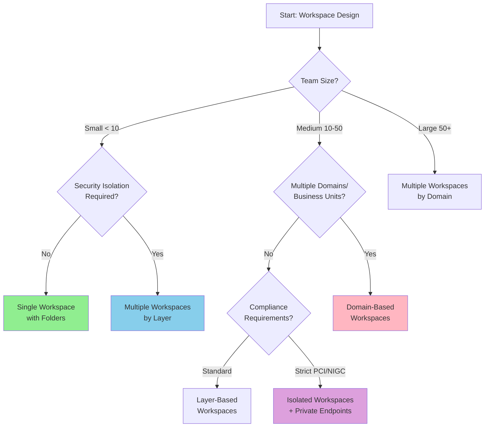
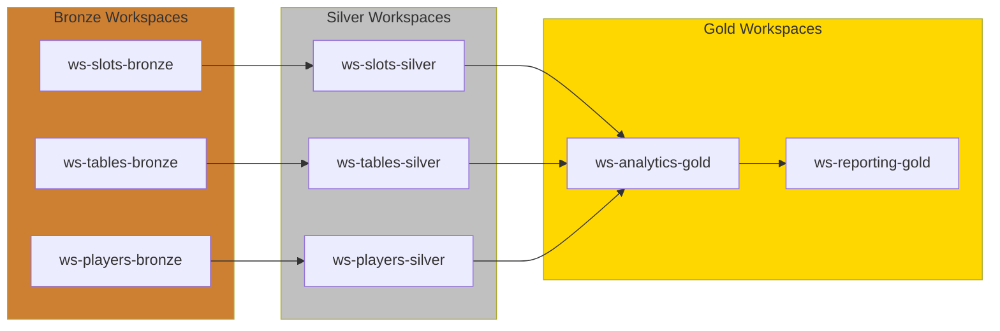
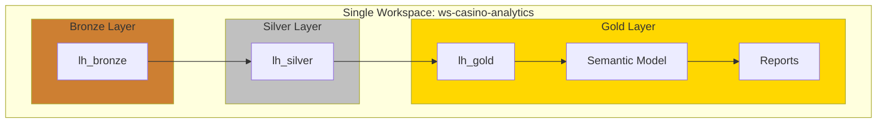
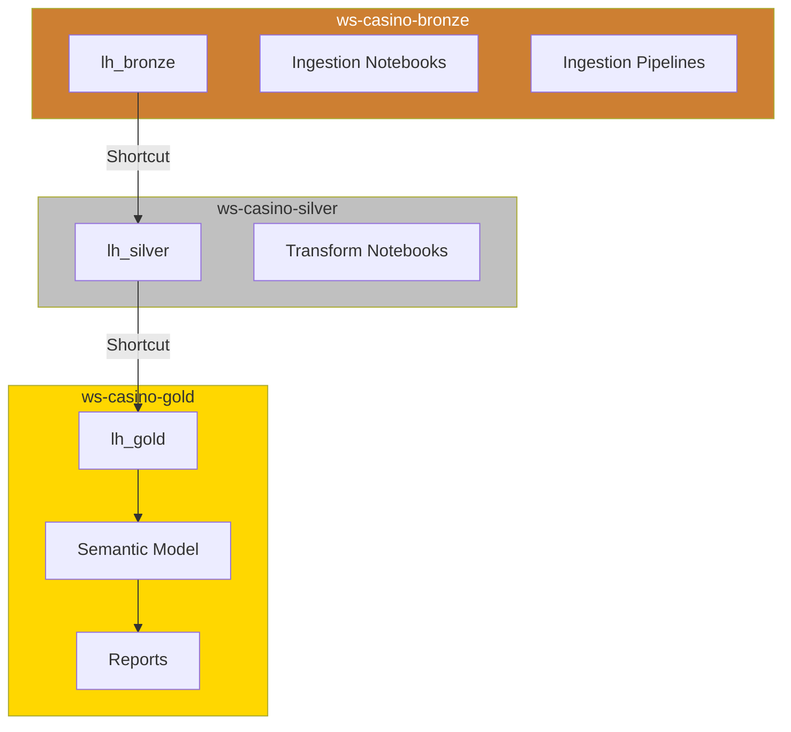
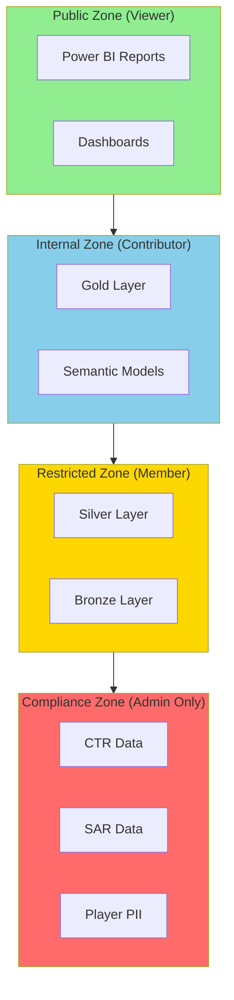

# 🏆 Microsoft Fabric Best Practices Guide

> 🏠 [Home](../README.md) > 📚 [Docs](./) > 🏆 Best Practices

**Last Updated:** 2026-01-28 | **Version:** 1.0.0

---

## 📑 Table of Contents

- [🎯 Overview](#-overview)
- [🏗️ Workspace Organization](#️-workspace-organization)
- [📁 Folder Structure & Hierarchy](#-folder-structure--hierarchy)
- [🔄 Environment Strategy (Dev/Test/Prod)](#-environment-strategy-devtestprod)
- [🏅 Medallion Architecture Placement](#-medallion-architecture-placement)
- [🔐 Security Best Practices](#-security-best-practices)
- [📊 Naming Conventions](#-naming-conventions)
- [⚡ Performance Optimization](#-performance-optimization)
- [💰 Cost Management](#-cost-management)

---

## 🎯 Overview

This guide provides enterprise best practices for organizing, securing, and optimizing Microsoft Fabric environments. These recommendations are based on Microsoft's official guidance combined with real-world casino/gaming industry implementations.


*Source: [What is Microsoft Fabric?](https://learn.microsoft.com/en-us/fabric/get-started/microsoft-fabric-overview)*

### Key Principles

| Principle | Description |
|-----------|-------------|
| **Separation of Concerns** | Isolate workloads by purpose, environment, and security boundary |
| **Least Privilege** | Grant minimum permissions required for each role |
| **Scalability** | Design for growth with modular, reusable patterns |
| **Governance** | Implement consistent policies across all workspaces |
| **Cost Efficiency** | Optimize capacity usage and storage costs |

---

## 🏗️ Workspace Organization

### Single vs. Multiple Workspaces

Choosing between single and multiple workspaces depends on your organization's size, security requirements, and team structure.

#### Decision Framework



### Workspace Patterns

#### Pattern 1: Single Workspace (Small Teams, POC)

**Best For:** Teams < 10, proof-of-concept, rapid prototyping

```
📁 casino-fabric-workspace/
├── 🏠 Lakehouses
│   ├── lh_bronze
│   ├── lh_silver
│   └── lh_gold
├── 📊 Semantic Models
│   └── Casino Analytics Model
├── 📈 Reports
│   └── Executive Dashboard
├── 🔄 Pipelines
│   └── Daily ETL Pipeline
└── 📓 Notebooks
    ├── bronze/
    ├── silver/
    └── gold/
```

**Pros:**
- Simple to manage
- Easy cross-item references
- Minimal permission complexity
- Ideal for POC and small teams

**Cons:**
- No environment isolation
- Mixed dev/prod artifacts
- Limited security boundaries
- Scaling challenges

---

#### Pattern 2: Layer-Based Workspaces (Medium Teams)

**Best For:** Teams 10-30, clear medallion architecture, moderate security needs

```
📁 Workspaces Structure:
├── ws-casino-bronze/
│   ├── 🏠 lh_bronze_raw
│   ├── 🏠 lh_bronze_staging
│   └── 📓 Bronze Notebooks
├── ws-casino-silver/
│   ├── 🏠 lh_silver_cleansed
│   ├── 🏠 lh_silver_conformed
│   └── 📓 Silver Notebooks
├── ws-casino-gold/
│   ├── 🏠 lh_gold_analytics
│   ├── 📊 Semantic Models
│   └── 📈 Reports
└── ws-casino-shared/
    ├── 📁 Reference Data
    └── 🔄 Shared Pipelines
```

**Workspace Permissions:**

| Workspace | Data Engineers | Data Analysts | Business Users |
|-----------|---------------|---------------|----------------|
| ws-casino-bronze | Admin | Viewer | None |
| ws-casino-silver | Contributor | Viewer | None |
| ws-casino-gold | Contributor | Contributor | Viewer |
| ws-casino-shared | Viewer | Viewer | Viewer |

---

#### Pattern 3: Domain + Environment Workspaces (Enterprise)

**Best For:** Large enterprises, multiple business units, strict compliance (PCI-DSS, NIGC)

```
📁 Enterprise Workspace Structure:
│
├── 🎰 Slots Domain
│   ├── ws-slots-dev/
│   ├── ws-slots-test/
│   ├── ws-slots-staging/
│   └── ws-slots-prod/
│
├── 🃏 Table Games Domain
│   ├── ws-tables-dev/
│   ├── ws-tables-test/
│   ├── ws-tables-staging/
│   └── ws-tables-prod/
│
├── 👤 Player Analytics Domain
│   ├── ws-players-dev/
│   ├── ws-players-test/
│   ├── ws-players-staging/
│   └── ws-players-prod/
│
├── 📋 Compliance Domain (Isolated)
│   ├── ws-compliance-dev/
│   ├── ws-compliance-test/
│   └── ws-compliance-prod/  ← Private Endpoint Only
│
└── 🔧 Platform/Shared
    ├── ws-platform-shared/
    ├── ws-reference-data/
    └── ws-monitoring/
```

**Cross-Workspace Data Flow:**



---

### Workspace Naming Conventions

| Pattern | Example | Use Case |
|---------|---------|----------|
| `ws-{domain}-{env}` | `ws-slots-prod` | Domain + environment |
| `ws-{org}-{project}-{env}` | `ws-acme-casino-dev` | Multi-tenant |
| `ws-{layer}-{domain}` | `ws-gold-analytics` | Layer-focused |
| `ws-{region}-{domain}-{env}` | `ws-us-slots-prod` | Multi-region |

**Recommended:** `ws-{domain}-{layer}-{env}`
- Example: `ws-slots-bronze-dev`, `ws-players-gold-prod`

---

## 📁 Folder Structure & Hierarchy

### Lakehouse Folder Organization

```
📁 lh_bronze/
├── 📂 Files/
│   ├── 📁 landing/              # Raw file drops
│   │   ├── slot_telemetry/
│   │   ├── player_sessions/
│   │   └── cage_transactions/
│   ├── 📁 archive/              # Processed files (dated)
│   │   └── 2026/01/28/
│   ├── 📁 rejected/             # Failed/invalid files
│   │   └── 2026/01/28/
│   └── 📁 schemas/              # Schema definitions
│       └── slot_telemetry.json
│
└── 📂 Tables/
    ├── 🔷 bronze_slot_telemetry
    ├── 🔷 bronze_player_sessions
    └── 🔷 bronze_cage_transactions
```

### Silver Layer Organization

```
📁 lh_silver/
├── 📂 Files/
│   ├── 📁 checkpoints/          # Streaming checkpoints
│   └── 📁 temp/                 # Processing temp files
│
└── 📂 Tables/
    ├── 📁 cleansed/
    │   ├── 🔷 silver_slot_telemetry
    │   └── 🔷 silver_player_sessions
    ├── 📁 conformed/
    │   ├── 🔷 silver_slot_enriched
    │   └── 🔷 silver_player_enriched
    └── 📁 dimensions/
        ├── 🔷 dim_machine
        ├── 🔷 dim_player
        └── 🔷 dim_date
```

### Gold Layer Organization

```
📁 lh_gold/
├── 📂 Files/
│   ├── 📁 exports/              # Scheduled exports
│   └── 📁 ml_models/            # Trained models
│
└── 📂 Tables/
    ├── 📁 facts/
    │   ├── 🔷 fact_slot_performance
    │   ├── 🔷 fact_player_activity
    │   └── 🔷 fact_compliance_transactions
    ├── 📁 aggregates/
    │   ├── 🔷 agg_daily_revenue
    │   ├── 🔷 agg_hourly_floor_activity
    │   └── 🔷 agg_player_lifetime_value
    └── 📁 dimensions/
        ├── 🔷 dim_date
        ├── 🔷 dim_machine
        ├── 🔷 dim_player
        └── 🔷 dim_zone
```

---

## 🔄 Environment Strategy (Dev/Test/Prod)

### Recommended Environment Setup

```mermaid
flowchart LR
    subgraph DEV["Development"]
        D_WS[Dev Workspace]
        D_CAP[F2-F8 Capacity]
        D_DATA[Sample Data]
    end

    subgraph TEST["Test/QA"]
        T_WS[Test Workspace]
        T_CAP[F8-F16 Capacity]
        T_DATA[Anonymized Prod Data]
    end

    subgraph STAGING["Staging/UAT"]
        S_WS[Staging Workspace]
        S_CAP[F16-F32 Capacity]
        S_DATA[Production Mirror]
    end

    subgraph PROD["Production"]
        P_WS[Prod Workspace]
        P_CAP[F64+ Capacity]
        P_DATA[Live Data]
    end

    DEV -->|PR Merge| TEST
    TEST -->|Approved| STAGING
    STAGING -->|Release| PROD

    style DEV fill:#90EE90
    style TEST fill:#87CEEB
    style STAGING fill:#FFD700
    style PROD fill:#FF6B6B
```



### Environment Configuration Matrix

| Aspect | Development | Test | Staging | Production |
|--------|-------------|------|---------|------------|
| **Capacity SKU** | F2-F8 | F8-F16 | F16-F32 | F64+ |
| **Data** | Sample/Synthetic | Anonymized | Prod Mirror | Live |
| **Refresh Frequency** | Manual | Daily | Near Real-time | Real-time |
| **Git Branch** | feature/* | develop | release/* | main |
| **Access** | Developers | QA + Devs | UAT Team | Ops + Analysts |
| **Monitoring** | Basic | Standard | Full | Full + Alerts |
| **Backup** | None | Weekly | Daily | Continuous |
| **Private Endpoints** | No | No | Optional | Required |

### Deployment Pipeline Configuration

```yaml
# deployment-pipeline-config.yaml
pipeline:
  name: "Casino Analytics Deployment"
  stages:
    - name: Development
      workspace: ws-casino-dev
      capacity: F8
      git_branch: develop
      deployment_rules:
        - allow_direct_publish: true
        - require_approval: false

    - name: Test
      workspace: ws-casino-test
      capacity: F16
      git_branch: release/*
      deployment_rules:
        - allow_direct_publish: false
        - require_approval: true
        - approvers: ["qa-team@casino.com"]
        - run_tests: true

    - name: Staging
      workspace: ws-casino-staging
      capacity: F32
      git_branch: release/*
      deployment_rules:
        - require_approval: true
        - approvers: ["tech-lead@casino.com", "pm@casino.com"]
        - uat_sign_off: required

    - name: Production
      workspace: ws-casino-prod
      capacity: F64
      git_branch: main
      deployment_rules:
        - require_approval: true
        - approvers: ["cto@casino.com", "compliance@casino.com"]
        - change_window: "Tue-Thu 02:00-06:00 UTC"
        - rollback_enabled: true
```

---

## 🏅 Medallion Architecture Placement

### Option A: All Layers in Single Workspace

**When to Use:**
- Small teams (< 10 people)
- POC/Prototype
- Simple data flows
- Minimal security requirements



**Pros:** Simple, fast development, easy debugging
**Cons:** No isolation, mixed permissions, scaling limits

---

### Option B: Separate Workspaces per Layer

**When to Use:**
- Medium teams (10-50 people)
- Clear team boundaries (ingest vs. analytics)
- Different refresh cadences per layer
- Cost allocation by layer



**Data Access Pattern:**
```python
# In Silver workspace, reference Bronze via shortcut
df_bronze = spark.read.format("delta").load(
    "abfss://ws-casino-bronze@onelake.dfs.fabric.microsoft.com/lh_bronze.Lakehouse/Tables/bronze_slot_telemetry"
)
```

---

### Option C: Domain + Layer Matrix (Enterprise)

**When to Use:**
- Large enterprises (50+ people)
- Multiple business domains
- Strict compliance (PCI-DSS, NIGC, SOX)
- Different data retention policies

```
                    │  Development  │    Test     │   Production
────────────────────┼───────────────┼─────────────┼────────────────
Slots Domain        │               │             │
  ├── Bronze        │ ws-slots-b-d  │ ws-slots-b-t│ ws-slots-b-p
  ├── Silver        │ ws-slots-s-d  │ ws-slots-s-t│ ws-slots-s-p
  └── Gold          │ ws-slots-g-d  │ ws-slots-g-t│ ws-slots-g-p
────────────────────┼───────────────┼─────────────┼────────────────
Players Domain      │               │             │
  ├── Bronze        │ ws-play-b-d   │ ws-play-b-t │ ws-play-b-p
  ├── Silver        │ ws-play-s-d   │ ws-play-s-t │ ws-play-s-p
  └── Gold          │ ws-play-g-d   │ ws-play-g-t │ ws-play-g-p
────────────────────┼───────────────┼─────────────┼────────────────
Compliance Domain   │               │             │
  ├── Bronze        │ ws-comp-b-d   │ ws-comp-b-t │ ws-comp-b-p ←
  ├── Silver        │ ws-comp-s-d   │ ws-comp-s-t │ ws-comp-s-p ← Private
  └── Gold          │ ws-comp-g-d   │ ws-comp-g-t │ ws-comp-g-p ← Endpoints
```

### Workspace-to-Workspace Data Sharing

Use **OneLake Shortcuts** for cross-workspace data access:

```python
# Create shortcut from Gold workspace to Silver lakehouse
from azure.fabric import FabricClient

client = FabricClient()
client.create_shortcut(
    workspace_id="ws-casino-gold-prod",
    lakehouse_id="lh_gold",
    shortcut_name="silver_slot_data",
    target_workspace_id="ws-casino-silver-prod",
    target_lakehouse_id="lh_silver",
    target_path="/Tables/silver_slot_enriched"
)
```

---

## 🔐 Security Best Practices

### Role-Based Access Control (RBAC)

| Role | Workspace | Item | Data | Use Case |
|------|-----------|------|------|----------|
| **Admin** | Full control | Full control | Full control | Platform admins |
| **Member** | Manage settings | Create/edit/delete | Read/write | Data engineers |
| **Contributor** | View only | Create/edit | Read/write | Analysts |
| **Viewer** | View only | View only | Read only | Business users |

### Casino-Specific Security Zones



### Row-Level Security (RLS) Example

```dax
// RLS Rule: Regional Manager sees only their region
[Region Security] =
VAR UserRegion = LOOKUPVALUE(
    UserMapping[Region],
    UserMapping[UserEmail],
    USERPRINCIPALNAME()
)
RETURN
    fact_slot_performance[region] = UserRegion
    || UserRegion = "ALL"
```

---

## 📊 Naming Conventions

### Standard Naming Patterns

| Item Type | Pattern | Example |
|-----------|---------|---------|
| **Workspace** | `ws-{domain}-{layer}-{env}` | `ws-slots-gold-prod` |
| **Lakehouse** | `lh_{layer}_{domain}` | `lh_bronze_slots` |
| **Table (Bronze)** | `bronze_{source}_{entity}` | `bronze_sis_slot_events` |
| **Table (Silver)** | `silver_{entity}_{qualifier}` | `silver_slot_enriched` |
| **Table (Gold)** | `{type}_{entity}` | `fact_slot_performance`, `dim_machine` |
| **Notebook** | `nb_{layer}_{action}_{entity}` | `nb_bronze_ingest_slots` |
| **Pipeline** | `pl_{frequency}_{action}` | `pl_daily_bronze_refresh` |
| **Semantic Model** | `sm_{domain}_analytics` | `sm_casino_analytics` |
| **Report** | `rpt_{audience}_{topic}` | `rpt_exec_daily_revenue` |

### Abbreviations

| Full Name | Abbreviation |
|-----------|--------------|
| Development | dev |
| Test | test |
| Staging | stg |
| Production | prod |
| Bronze | b, bronze |
| Silver | s, silver |
| Gold | g, gold |
| Dimension | dim |
| Fact | fact |
| Aggregate | agg |

---

## ⚡ Performance Optimization

### V-Order Optimization

Always enable V-Order for Gold layer tables:

```python
# Write with V-Order optimization
df.write \
    .format("delta") \
    .mode("overwrite") \
    .option("vorder", "true") \
    .option("optimizeWrite", "true") \
    .saveAsTable("lh_gold.fact_slot_performance")
```

### Partitioning Strategy

| Table Type | Partition Column | Rationale |
|------------|------------------|-----------|
| Fact tables | `business_date` | Time-series queries |
| Large dimensions | `region` or `category` | Filter pushdown |
| Event tables | `event_date`, `event_hour` | Real-time queries |

```python
# Partition by date for time-series data
df.write \
    .format("delta") \
    .partitionBy("business_date") \
    .mode("overwrite") \
    .saveAsTable("lh_gold.fact_daily_revenue")
```

### Query Optimization Checklist

- [ ] Use predicate pushdown with date filters
- [ ] Avoid `SELECT *` - specify columns
- [ ] Pre-aggregate where possible
- [ ] Use Z-ORDER for frequently filtered columns
- [ ] Monitor query plans with EXPLAIN

---

## 💰 Cost Management

### Capacity Right-Sizing

| Workload Type | Recommended SKU | Notes |
|---------------|-----------------|-------|
| Development | F2-F8 | Pause when not in use |
| Test/QA | F8-F16 | Schedule auto-pause |
| Production (Small) | F16-F32 | Monitor utilization |
| Production (Large) | F64+ | Enable bursting |

### Cost Optimization Strategies

1. **Auto-pause development capacities** after hours
2. **Use reserved capacity** for production (40% savings)
3. **Archive old data** to cheaper storage tiers
4. **Optimize refresh schedules** to reduce peak loads
5. **Monitor capacity metrics** weekly

### Cost Allocation Tags

```json
{
  "workspace_tags": {
    "cost_center": "gaming-analytics",
    "department": "data-engineering",
    "environment": "production",
    "project": "casino-fabric-poc"
  }
}
```

---

## 📚 Related Documentation

| Document | Description |
|----------|-------------|
| [🏗️ Architecture](./ARCHITECTURE.md) | System architecture overview |
| [🚀 Deployment Guide](./DEPLOYMENT.md) | Infrastructure deployment |
| [🔐 Security Guide](./SECURITY.md) | Security configuration |
| [📖 Tutorial 20: Best Practices](../tutorials/20-workspace-best-practices/README.md) | Hands-on best practices tutorial |

---

## 📖 References

- [Microsoft Fabric Workspace Documentation](https://learn.microsoft.com/fabric/fundamentals/workspaces)
- [OneLake Architecture](https://learn.microsoft.com/fabric/onelake/onelake-overview)
- [Deployment Pipelines](https://learn.microsoft.com/fabric/cicd/deployment-pipelines/intro-to-deployment-pipelines)
- [Security in Microsoft Fabric](https://learn.microsoft.com/fabric/security/security-overview)

---

[⬆️ Back to top](#-microsoft-fabric-best-practices-guide) | [🏠 Home](../README.md)

---

> 📖 **Documentation maintained by:** Microsoft Fabric POC Team
> 🔗 **Repository:** [Supercharge_Microsoft_Fabric](https://github.com/fgarofalo56/Suppercharge_Microsoft_Fabric)
