# 🚀 Deployment Guide

> 🏠 [Home](index.md) > 📚 [Docs](./) > 🚀 Deployment

<div align="center">

# 🚀 Deployment Guide

**Step-by-Step Deployment Instructions**


</div>

---

**Last Updated:** `2025-01-21` | **Version:** 1.0.0

---

## 📑 Table of Contents

- [📊 Visual Overview](#-visual-overview)
- [📋 Prerequisites](#-prerequisites)
- [🛠️ Quick Deployment](#️-quick-deployment)
- [🐳 Docker Deployment](#-docker-deployment)
- [📜 Script-Based Deployment](#-script-based-deployment)
- [🌍 Environment-Specific Deployment](#-environment-specific-deployment)
- [🔄 GitHub Actions Deployment](#-github-actions-deployment)
- [⚙️ Post-Deployment Configuration](#️-post-deployment-configuration)
- [✅ Deployment Verification](#-deployment-verification)
- [🔧 Troubleshooting](#-troubleshooting)
- [🗑️ Cleanup](#️-cleanup)
- [💰 Cost Optimization](#-cost-optimization)
- [📚 Next Steps](#-next-steps)

---

## 📊 Visual Overview

### Microsoft Fabric Deployment Architecture

Before diving into deployment steps, it's helpful to understand how Fabric integrates with Azure services:


*Source: [Microsoft Fabric licenses](https://learn.microsoft.com/en-us/fabric/enterprise/licenses)*

### Lakehouse End-to-End Architecture

This POC deploys a complete lakehouse solution following Microsoft's recommended architecture pattern:


*Source: [Lakehouse Tutorial Introduction](https://learn.microsoft.com/en-us/fabric/data-engineering/tutorial-lakehouse-introduction)*

### Deployment Decision Flowchart

This flowchart guides you through the deployment process from prerequisites to verification:


### Deployment State Diagram

Track your deployment progress through these states:

```mermaid
%%{init: {'theme':'base', 'themeVariables': { 'primaryColor':'#C0C0C0','primaryTextColor':'#000','primaryBorderColor':'#999','lineColor':'#2196F3','secondaryColor':'#4CAF50','tertiaryColor':'#CD7F32','fontSize':'14px'}}}%%
stateDiagram-v2
    [*] --> NotStarted: Initialize
    
    NotStarted --> PreparingEnvironment: Start Deployment
    
    PreparingEnvironment --> ValidatingPrerequisites: Tools Installed
    ValidatingPrerequisites --> PreparingEnvironment: Missing Requirements
    ValidatingPrerequisites --> Deploying: Prerequisites Met
    
    Deploying --> DeploymentFailed: Error Occurred
    DeploymentFailed --> Deploying: Retry
    DeploymentFailed --> RollingBack: Critical Failure
    RollingBack --> NotStarted: Rollback Complete
    
    Deploying --> Deployed: Bicep Deployment Success
    
    Deployed --> Configuring: Start Post-Config
    Configuring --> ConfigurationFailed: Config Error
    ConfigurationFailed --> Configuring: Fix & Retry
    
    Configuring --> Verifying: Configuration Complete
    
    Verifying --> VerificationFailed: Tests Failed
    VerificationFailed --> Troubleshooting: Investigate
    Troubleshooting --> Verifying: Issues Resolved
    
    Verifying --> Verified: All Tests Passed
    
    Verified --> ProductionReady: Final Sign-off
    ProductionReady --> [*]: Complete
    
    note right of NotStarted
        Prerequisites ready
        Tools installed
        Azure access configured
    end note
    
    note right of Deploying
        Bicep template execution
        Resource provisioning
        Network configuration
    end note
    
    note right of Verified
        All checks passed:
        ✓ Fabric capacity
        ✓ Storage & networking
        ✓ Security & monitoring
    end note
    
    note right of ProductionReady
        Ready for:
        - Data ingestion
        - Pipeline execution
        - Tutorial walkthroughs
    end note
```



---

## 📋 Prerequisites

Before deploying, ensure you have completed all items in the [Prerequisites Guide](PREREQUISITES.md).

### Azure Requirements

| Requirement | Details |
|-------------|---------|
| **Azure Subscription** | Owner or Contributor access |
| **Microsoft Fabric** | Enabled in your tenant |
| **Resource Providers** | See list below |

**Required Resource Providers:**

```
Microsoft.Fabric
Microsoft.Purview
Microsoft.Storage
Microsoft.KeyVault
Microsoft.Network
Microsoft.OperationalInsights
```

### Local Tools

| Tool | Minimum Version | Check Command |
|------|-----------------|---------------|
| Azure CLI | 2.50+ | `az --version` |
| Bicep | 0.22+ | `az bicep version` |
| Git | 2.40+ | `git --version` |
| PowerShell | 7.0+ | `pwsh --version` |

### Install Required Tools

```bash
# Install/Update Azure CLI
winget install -e --id Microsoft.AzureCLI

# Install Bicep
az bicep install
az bicep upgrade

# Install PowerShell 7+
winget install -e --id Microsoft.PowerShell
```

---

## 🛠️ Quick Deployment

Follow these steps for a rapid deployment to the development environment.

### Step 1: Clone and Configure

```bash
# Clone repository
git clone https://github.com/fgarofalo56/Supercharge_Microsoft_Fabric.git
cd Supercharge_Microsoft_Fabric

# Copy environment template
cp .env.sample .env

# Edit .env with your values
code .env  # or your preferred editor
```

> 📝 **Note:** Ensure all required values in `.env` are populated before proceeding.

### Step 2: Login to Azure

```bash
# Interactive login
az login

# Set subscription
az account set --subscription "<subscription-id>"

# Verify
az account show
```

### Step 3: Validate Deployment

```bash
# Build and validate Bicep
az bicep build --file infra/main.bicep

# What-if analysis (preview changes)
az deployment sub what-if \
  --location eastus2 \
  --template-file infra/main.bicep \
  --parameters infra/environments/dev/dev.bicepparam
```

> 💡 **Pro Tip:** Always run what-if analysis before deployment to preview resource changes and catch potential issues early.

### Step 4: Deploy

```bash
# Deploy infrastructure
az deployment sub create \
  --name "fabric-poc-$(date +%Y%m%d-%H%M%S)" \
  --location eastus2 \
  --template-file infra/main.bicep \
  --parameters infra/environments/dev/dev.bicepparam
```

---

## 🐳 Docker Deployment

Use Docker to run data generators without installing Python dependencies locally. The generated data will be ingested into your Fabric Lakehouse following this pattern:


*Source: [What is Data Engineering in Fabric](https://learn.microsoft.com/en-us/fabric/data-engineering/data-engineering-overview)*

### Quick Start with Docker

```bash
# Generate demo data (quick, small dataset)
docker-compose run --rm demo-generator

# Generate full dataset (30 days, all domains)
docker-compose run --rm data-generator

# Output data will be in ./output directory
```

### Available Docker Services

| Service | Description | Use Case |
|---------|-------------|----------|
| `data-generator` | Full dataset generation | POC data population |
| `demo-generator` | Small demo dataset | Quick testing |
| `streaming-generator` | Real-time event streaming | Event Hub integration |
| `data-validator` | Data quality validation | Verify generated data |

<details>
<summary><b>🔍 Click to expand: Docker Commands & Environment Variables</b></summary>

### Docker Commands

```bash
# Build the Docker image
docker-compose build

# Generate specific data volumes
docker-compose run --rm data-generator --slots 100000 --players 5000

# Generate data in CSV format
docker-compose run --rm data-generator --all --format csv

# Stream to Azure Event Hub
EVENTHUB_CONNECTION_STRING="your-connection-string" \
EVENTHUB_NAME="slot-telemetry" \
docker-compose up streaming-generator
```

### Docker Environment Variables

Configure via `.env` file or command line:

| Variable | Default | Description |
|----------|---------|-------------|
| `DATA_FORMAT` | `parquet` | Output format |
| `DATA_DAYS` | `30` | Days of data to generate |
| `EVENTHUB_CONNECTION_STRING` | - | Event Hub connection |
| `EVENTHUB_NAME` | `slot-telemetry` | Event Hub name |
| `STREAMING_RATE` | `10` | Events per second |

> 💡 **Pro Tip:** Use Parquet format for better compression and query performance. It's 10-100x faster than CSV for analytical workloads.

</details>

### Using Docker with Fabric Upload

After generating data, upload to Fabric:

```bash
# 1. Generate data
docker-compose run --rm data-generator --all --days 30

# 2. Upload to Azure Storage (for Fabric import)
az storage blob upload-batch \
  --source ./output \
  --destination bronze \
  --account-name $STORAGE_ACCOUNT_NAME

# 3. Import into Fabric Lakehouse via notebooks
```

---

## 📜 Script-Based Deployment

PowerShell scripts for automated deployment workflows.

### Available Scripts

| Script | Purpose | Usage |
|--------|---------|-------|
| `scripts/deploy.ps1` | Full infrastructure deployment | CI/CD pipelines |
| `scripts/generate-data.ps1` | Data generation wrapper | Local/Docker execution |
| `scripts/validate.ps1` | Run validation tests | Quality assurance |

### Full Deployment Script

```powershell
# Deploy infrastructure with all defaults
./scripts/deploy.ps1 -Environment dev

# Deploy with custom parameters
./scripts/deploy.ps1 `
  -Environment staging `
  -Location westus2 `
  -SkipValidation $false

# Deploy with cost estimation first
./scripts/deploy.ps1 -Environment prod -ShowCostEstimate
```

### Data Generation Script

```powershell
# Generate all data locally
./scripts/generate-data.ps1 -All -Days 30

# Generate via Docker
./scripts/generate-data.ps1 -UseDocker -All -Days 14

# Generate specific data types
./scripts/generate-data.ps1 -Slots 50000 -Players 2000 -Format csv
```

### Validation Script

```powershell
# Run all validations
./scripts/validate.ps1

# Run specific validation suites
./scripts/validate.ps1 -Suite "slot_machine"

# Generate HTML report
./scripts/validate.ps1 -OutputReport ./validation-report.html
```

### Script Parameters Reference

See individual script help for full parameter documentation:

```powershell
Get-Help ./scripts/deploy.ps1 -Full
Get-Help ./scripts/generate-data.ps1 -Full
Get-Help ./scripts/validate.ps1 -Full
```

---

## 🌍 Environment-Specific Deployment

### Environment Comparison

| Setting | 🔧 Development | 🧪 Staging | 🏭 Production |
|---------|---------------|-----------|--------------|
| **SKU** | F2/F4 | F16/F32 | F64+ |
| **Auto-pause** | Enabled | Enabled | Disabled |
| **Private Endpoints** | Optional | Recommended | Required |
| **Geo-redundancy** | Disabled | Enabled | Enabled |
| **Cost Alerts** | Optional | Enabled | Enabled |
| **Resource Lock** | None | CanNotDelete | CanNotDelete |

### 🔧 Development Deployment

```bash
az deployment sub create \
  --location eastus2 \
  --template-file infra/main.bicep \
  --parameters infra/environments/dev/dev.bicepparam
```

### 🧪 Staging Deployment

```bash
az deployment sub create \
  --location eastus2 \
  --template-file infra/main.bicep \
  --parameters infra/environments/staging/staging.bicepparam
```

### 🏭 Production Deployment

```bash
az deployment sub create \
  --location eastus2 \
  --template-file infra/main.bicep \
  --parameters infra/environments/prod/prod.bicepparam
```

> ⚠️ **Warning:** Production deployments should go through proper change management processes and approval workflows.

---

## 🔄 GitHub Actions Deployment

### Azure Deployment Sequence

This sequence diagram illustrates the Azure deployment process flow:


### Setting Up OIDC Authentication

<details>
<summary><b>🔍 Click to expand: OIDC Setup Commands</b></summary>

#### 1. Create Azure AD Application

```bash
# Create app registration
az ad app create --display-name "github-fabric-poc"

# Get app ID
APP_ID=$(az ad app list --display-name "github-fabric-poc" --query "[0].appId" -o tsv)

# Create service principal
az ad sp create --id $APP_ID

# Get subscription and tenant IDs
SUBSCRIPTION_ID=$(az account show --query id -o tsv)
TENANT_ID=$(az account show --query tenantId -o tsv)

# Assign Contributor role
az role assignment create \
  --assignee $APP_ID \
  --role "Contributor" \
  --scope "/subscriptions/$SUBSCRIPTION_ID"
```

#### 2. Configure Federated Credentials

```bash
# Create federated credential for main branch
az ad app federated-credential create \
  --id $APP_ID \
  --parameters '{
    "name": "github-main",
    "issuer": "https://token.actions.githubusercontent.com",
    "subject": "repo:<your-org>/Supercharge_Microsoft_Fabric:ref:refs/heads/main",
    "audiences": ["api://AzureADTokenExchange"]
  }'

# Create federated credential for pull requests
az ad app federated-credential create \
  --id $APP_ID \
  --parameters '{
    "name": "github-pr",
    "issuer": "https://token.actions.githubusercontent.com",
    "subject": "repo:<your-org>/Supercharge_Microsoft_Fabric:pull_request",
    "audiences": ["api://AzureADTokenExchange"]
  }'
```

#### 3. Add GitHub Secrets

Navigate to **Repository Settings** > **Secrets and variables** > **Actions**:

| Secret Name | Value | Description |
|-------------|-------|-------------|
| `AZURE_CLIENT_ID` | Application (client) ID | From app registration |
| `AZURE_TENANT_ID` | Directory (tenant) ID | Azure AD tenant |
| `AZURE_SUBSCRIPTION_ID` | Subscription ID | Target subscription |

</details>

### Manual Workflow Trigger

```bash
# Trigger deployment via GitHub CLI
gh workflow run deploy-infra.yml \
  --ref main \
  -f environment=dev
```

---

## ⚙️ Post-Deployment Configuration

### 1. Verify Fabric Capacity

```bash
# List Fabric capacities
az resource list \
  --resource-type "Microsoft.Fabric/capacities" \
  --query "[].{Name:name, Location:location, SKU:sku.name}"
```

### 2. Configure Fabric Workspace

After Bicep deployment, complete these manual steps in Fabric Portal:

| Step | Action | Details |
|------|--------|---------|
| 1 | Navigate to Fabric | [app.fabric.microsoft.com](https://app.fabric.microsoft.com) |
| 2 | Create workspace | Link to deployed capacity |
| 3 | Create Lakehouses | One per medallion layer |
| 4 | Import notebooks | From `notebooks/` directory |

### 3. Connect Purview

```bash
# Get Purview account endpoint
az purview account show \
  --name "<purview-account-name>" \
  --resource-group "<resource-group>" \
  --query "endpoints"
```

### 4. Configure Key Vault Access

```bash
# Grant current user access
az keyvault set-policy \
  --name "<keyvault-name>" \
  --upn "$(az ad signed-in-user show --query userPrincipalName -o tsv)" \
  --secret-permissions get list set delete
```

---

## ✅ Deployment Verification

### Automated Verification Script

```bash
# Run verification
./scripts/verify-deployment.sh
```

**Expected Output:**

```
✓ Fabric capacity deployed
✓ Purview account accessible
✓ Storage account created
✓ Key Vault configured
✓ Network connectivity verified
```

### Manual Verification Checklist

| Component | Check | Status |
|-----------|-------|--------|
| Fabric capacity | Shows in Azure portal | ☐ |
| Fabric capacity | Shows in Fabric admin portal | ☐ |
| Purview account | Accessible via portal | ☐ |
| Storage account | ADLS Gen2 enabled | ☐ |
| Key Vault | Secrets accessible | ☐ |
| Log Analytics | Receiving logs | ☐ |
| Private endpoints | Connected (if enabled) | ☐ |

---

## 🔧 Troubleshooting

<details>
<summary><b>🔍 Click to expand: Common Issues & Solutions</b></summary>

### Common Issues

#### Issue: Fabric Capacity Deployment Fails

```
Error: Microsoft.Fabric/capacities resource provider not registered
```

> ⚠️ **Warning:** Resource provider registration can take up to 10 minutes to complete. Wait for "Registered" status before proceeding.

**Solution:**

```bash
az provider register --namespace Microsoft.Fabric
az provider show --namespace Microsoft.Fabric --query "registrationState"
```

---

#### Issue: Insufficient Permissions

```
Error: AuthorizationFailed
```

**Solution:** Ensure you have Owner or Contributor role at subscription level.

```bash
# Check your role assignments
az role assignment list --assignee "$(az ad signed-in-user show --query id -o tsv)"
```

---

#### Issue: Capacity SKU Not Available

```
Error: SKU F64 not available in region
```

> 💡 **Pro Tip:** Fabric F64 is available in limited regions. East US 2 and West US 2 typically have the best availability.

**Solution:** Check [Fabric capacity availability](https://learn.microsoft.com/fabric/enterprise/region-availability) and choose a supported region.

---

#### Issue: Purview Name Already Exists

```
Error: Purview account name already exists
```

**Solution:** Purview names are globally unique. Use a different name in `.env`.

</details>

<details>
<summary><b>🔍 Click to expand: Deployment Logs & Debugging</b></summary>

### Deployment Logs

```bash
# Get deployment details
az deployment sub show \
  --name "<deployment-name>" \
  --query "properties.outputs"

# Get deployment operations (for debugging)
az deployment sub operation list \
  --name "<deployment-name>" \
  --query "[?properties.provisioningState=='Failed']"
```

> 💡 **Pro Tip:** Keep deployment names handy for troubleshooting. They follow the pattern `fabric-poc-YYYYMMDD-HHMMSS`. Store recent deployment names in your notes.

</details>

---

## 🗑️ Cleanup

### Remove All Resources

```bash
# Delete resource group (removes all resources)
az group delete --name "rg-fabric-poc-dev" --yes --no-wait

# Or delete specific deployment
az deployment sub delete --name "<deployment-name>"
```

### Preserve Specific Resources

```bash
# Remove lock before deletion (if locked)
az lock delete --name "CanNotDelete" --resource-group "rg-fabric-poc-dev"
```

> ⚠️ **Warning:** Resource deletion is irreversible. Ensure backups exist before cleanup.

---

## 💰 Cost Optimization

For detailed cost estimates and optimization strategies, see the comprehensive [Cost Estimation Guide](COST_ESTIMATION.md).

### Quick Cost Reference

| Environment | Fabric SKU | Monthly Estimate |
|-------------|------------|------------------|
| Development | F4 | $450 - $650 |
| Staging | F16 | $1,800 - $2,500 |
| Production POC | F64 | $9,500 - $12,500 |

### Development Environment

| Strategy | Implementation |
|----------|----------------|
| Use smaller SKU | F2 or F4 for development |
| Enable auto-pause | Suspend when idle |
| Schedule pause | Stop overnight/weekends |

### Production Environment

| Strategy | Implementation |
|----------|----------------|
| Reserved capacity | For predictable costs |
| Monitor consumption | Via Log Analytics |
| Set up alerts | Before budget exceeded |

### Create Cost Alert

```bash
az monitor metrics alert create \
  --name "fabric-cost-alert" \
  --resource-group "rg-fabric-poc-prod" \
  --scopes "<capacity-resource-id>" \
  --condition "total Cost > 1000" \
  --window-size 1d \
  --action "<action-group-id>"
```

### Related Cost Resources

- [Cost Estimation Guide](COST_ESTIMATION.md) - Detailed cost breakdown and scenarios
- [Azure Pricing Calculator](https://azure.microsoft.com/pricing/calculator/) - Current pricing

---

## 📚 Next Steps

After successful deployment, proceed with these guides:

| Step | Guide | Description |
|------|-------|-------------|
| 1 | [Tutorial 00: Environment Setup](tutorials/00-environment-setup/README.md) | Configure your workspace |
| 2 | [Tutorial 01: Bronze Layer](tutorials/01-bronze-layer/README.md) | Build ingestion pipelines |
| 3 | [Generate Sample Data](../data-generation/README.md) | Create test datasets |

---

## 📚 Related Documentation

| Document | Description |
|----------|-------------|
| [🏗️ Architecture](ARCHITECTURE.md) | System architecture and design |
| [🔐 Security Guide](SECURITY.md) | Security controls and compliance |
| [📋 Prerequisites](PREREQUISITES.md) | Setup requirements |

---

[⬆️ Back to top](#-deployment-guide)

---

> 📖 **Documentation maintained by:** Microsoft Fabric POC Team
> 🔗 **Repository:** [Supercharge_Microsoft_Fabric](https://github.com/fgarofalo56/Supercharge_Microsoft_Fabric)
