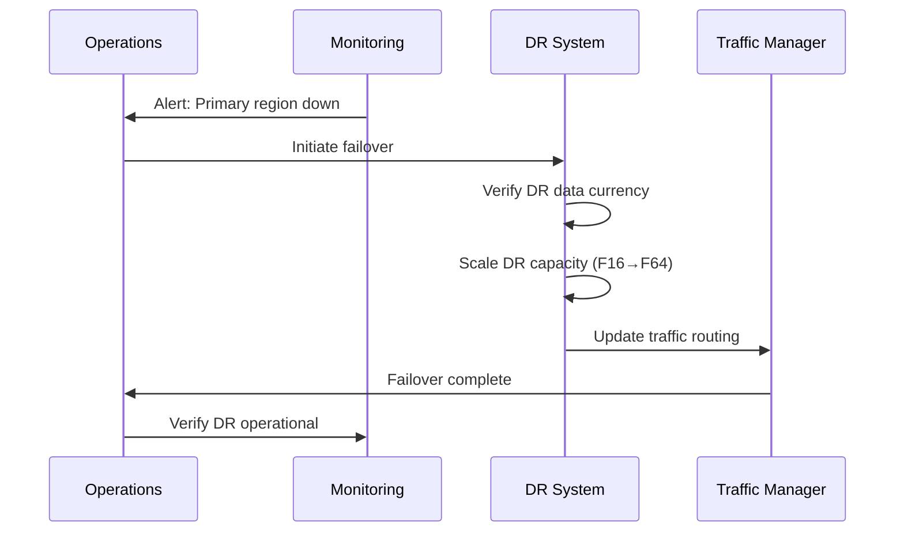

# Disaster Recovery & Business Continuity

> **Home > Documentation > Disaster Recovery**

---

## Overview

This document outlines the disaster recovery (DR) and business continuity (BC) strategy for the Microsoft Fabric Casino Analytics platform. Gaming operations require high availability and rapid recovery to meet regulatory requirements and minimize business impact.

---

## Recovery Objectives

### Recovery Time Objective (RTO)

| System Component | RTO | Priority |
|-----------------|-----|----------|
| Real-Time Analytics (Eventhouse) | 15 minutes | Critical |
| Gold Layer (BI Reports) | 1 hour | High |
| Silver Layer (Cleansed Data) | 4 hours | Medium |
| Bronze Layer (Raw Data) | 8 hours | Medium |
| Historical Analytics | 24 hours | Low |

### Recovery Point Objective (RPO)

| Data Type | RPO | Backup Frequency |
|-----------|-----|------------------|
| Slot Telemetry | 5 minutes | Continuous replication |
| Financial Transactions | 0 minutes | Synchronous |
| Player Profiles | 1 hour | Hourly snapshots |
| Aggregated Metrics | 4 hours | Incremental |
| Reference Data | 24 hours | Daily |

---

## Architecture: Multi-Region Deployment

```
                    Primary Region (East US 2)              DR Region (West US 2)
                    ┌────────────────────────────┐          ┌────────────────────────────┐
                    │     Fabric Capacity        │          │     Fabric Capacity        │
                    │         (F64)              │  Async   │         (F16)              │
                    │                            │  Replic  │                            │
                    │  ┌────────────────────┐   │ ──────► │  ┌────────────────────┐   │
                    │  │    OneLake         │   │          │  │    OneLake         │   │
                    │  │  ┌──────────────┐  │   │          │  │  ┌──────────────┐  │   │
                    │  │  │   Bronze     │  │   │          │  │  │   Bronze     │  │   │
                    │  │  │   Silver     │  │   │          │  │  │   Silver     │  │   │
                    │  │  │    Gold      │  │   │          │  │  │    Gold      │  │   │
                    │  │  └──────────────┘  │   │          │  │  └──────────────┘  │   │
                    │  └────────────────────┘   │          │  └────────────────────┘   │
                    │                            │          │                            │
                    │  ┌────────────────────┐   │          │  ┌────────────────────┐   │
                    │  │   Eventhouse       │   │ ──────► │  │   Eventhouse       │   │
                    │  │   (Real-Time)      │   │          │  │   (Standby)        │   │
                    │  └────────────────────┘   │          │  └────────────────────┘   │
                    └────────────────────────────┘          └────────────────────────────┘
```

---

## Backup Strategy

### OneLake Data Protection

#### Delta Lake Time Travel

Delta tables automatically maintain version history, enabling point-in-time recovery.

```python
# Restore to specific version
spark.read.format("delta") \
    .option("versionAsOf", 42) \
    .table("bronze_slot_telemetry")

# Restore to timestamp
spark.read.format("delta") \
    .option("timestampAsOf", "2024-01-15 10:00:00") \
    .table("bronze_slot_telemetry")
```

**Retention Settings:**
```sql
-- Configure retention for each table
ALTER TABLE bronze_slot_telemetry
SET TBLPROPERTIES ('delta.logRetentionDuration' = '30 days');

ALTER TABLE bronze_slot_telemetry
SET TBLPROPERTIES ('delta.deletedFileRetentionDuration' = '7 days');
```

#### Cross-Region Replication

```bicep
// Configure OneLake replication
resource replicationPolicy 'Microsoft.Fabric/replicationPolicies@2024-01-01' = {
  name: 'dr-replication-policy'
  properties: {
    sourceWorkspace: primaryWorkspaceId
    targetWorkspace: drWorkspaceId
    replicationType: 'Asynchronous'
    replicationFrequency: 'PT5M'  // 5-minute intervals
    includedItems: [
      'Lakehouse:lh_bronze',
      'Lakehouse:lh_silver',
      'Lakehouse:lh_gold'
    ]
  }
}
```

### Eventhouse Backup

```kql
// Export critical tables to external storage
.export to csv (
    h@"https://drbackupstorage.blob.core.windows.net/eventhouse-backup"
)
<| SlotTelemetry
| where ingestion_time() > ago(24h)
```

### Power BI Artifacts

```powershell
# Export Power BI workspace to PBIP format
# Run weekly or after significant changes

$workspace = Get-PowerBIWorkspace -Name "Casino-Analytics-Prod"
$reports = Get-PowerBIReport -WorkspaceId $workspace.Id

foreach ($report in $reports) {
    Export-PowerBIReport -Id $report.Id -OutFile "backup/reports/$($report.Name).pbix"
}
```

---

## Failover Procedures

### Scenario 1: Primary Region Failure

**Trigger Criteria:**
- Primary region unavailable > 10 minutes
- Azure status confirms regional outage
- Automated health check failures

**Failover Steps:**



**Detailed Steps:**

1. **Verify Outage (5 min)**
   ```bash
   # Check Azure status
   az rest --method get --url "https://status.azure.com/api/v2/status.json"

   # Verify Fabric capacity
   az rest --method get \
     --url "https://api.fabric.microsoft.com/v1/capacities/{capacityId}"
   ```

2. **Scale DR Capacity (10 min)**
   ```bash
   # Scale DR Fabric capacity from F16 to F64
   az rest --method patch \
     --url "https://management.azure.com/subscriptions/{sub}/resourceGroups/{rg}/providers/Microsoft.Fabric/capacities/{capacity}" \
     --body '{"sku": {"name": "F64", "tier": "Fabric"}}'
   ```

3. **Verify Data Currency (5 min)**
   ```python
   # Check last replication timestamp
   df = spark.table("dr_workspace.lh_bronze.bronze_slot_telemetry")
   last_record = df.agg(max("_ingestion_timestamp")).collect()[0][0]
   print(f"Last replicated record: {last_record}")

   # Acceptable data loss: < RPO (5 minutes)
   ```

4. **Update DNS/Routing (5 min)**
   ```bash
   # Update Traffic Manager endpoint priority
   az network traffic-manager endpoint update \
     --resource-group rg-fabric-networking \
     --profile-name tm-fabric-casino \
     --name primary-endpoint \
     --type azureEndpoints \
     --priority 2

   az network traffic-manager endpoint update \
     --resource-group rg-fabric-networking \
     --profile-name tm-fabric-casino \
     --name dr-endpoint \
     --type azureEndpoints \
     --priority 1
   ```

5. **Verify Operational (10 min)**
   - Confirm Power BI reports load
   - Verify real-time dashboard data flow
   - Test data pipeline execution
   - Notify stakeholders

### Scenario 2: Data Corruption

**Trigger Criteria:**
- Data quality alerts fired
- Invalid data in Gold layer
- User-reported data issues

**Recovery Steps:**

1. **Identify Corruption Scope**
   ```python
   # Find affected partitions
   corrupted = spark.table("gold.fact_daily_slot_performance") \
     .filter("hold_percentage < -100 or hold_percentage > 100") \
     .select("play_date").distinct()

   print(f"Affected dates: {corrupted.collect()}")
   ```

2. **Restore from Delta History**
   ```python
   # Find last good version
   history = spark.sql("DESCRIBE HISTORY gold.fact_daily_slot_performance")
   history.show(10)

   # Restore specific version
   spark.sql("""
     RESTORE TABLE gold.fact_daily_slot_performance
     TO VERSION AS OF 42
   """)
   ```

3. **Reprocess from Silver**
   ```python
   # If needed, reprocess Gold from Silver
   # Trigger Gold layer notebook for affected dates
   ```

### Scenario 3: Capacity Failure

**Recovery Steps:**

1. **Create New Capacity**
   ```bash
   az rest --method put \
     --url "https://management.azure.com/subscriptions/{sub}/resourceGroups/{rg}/providers/Microsoft.Fabric/capacities/fabric-casino-recovery" \
     --body '{
       "location": "eastus2",
       "sku": {"name": "F64", "tier": "Fabric"},
       "properties": {"administration": {"members": ["admin@contoso.com"]}}
     }'
   ```

2. **Reassign Workspaces**
   ```powershell
   # Reassign workspaces to new capacity
   Set-PowerBIWorkspace -Id $workspaceId -CapacityId $newCapacityId
   ```

---

## Monitoring & Alerting

### Health Check Queries

```kql
// Eventhouse health check
SlotTelemetry
| where ingestion_time() > ago(5m)
| summarize RecordCount = count(), LastRecord = max(EventTimestamp)
| extend IsHealthy = RecordCount > 0 and LastRecord > ago(5m)
```

### Alert Configuration

```json
{
  "alertRules": [
    {
      "name": "DataIngestionLag",
      "condition": "LastIngestion > 10 minutes ago",
      "severity": "Critical",
      "action": "PageOnCall"
    },
    {
      "name": "ReplicationLag",
      "condition": "DRLag > 15 minutes",
      "severity": "High",
      "action": "NotifyOps"
    },
    {
      "name": "CapacityUtilization",
      "condition": "CPUPercent > 90 for 5 minutes",
      "severity": "Warning",
      "action": "AutoScale"
    }
  ]
}
```

---

## Testing Schedule

| Test Type | Frequency | Duration | Participants |
|-----------|-----------|----------|--------------|
| Backup Verification | Weekly | 2 hours | Data Engineering |
| Delta Time Travel | Monthly | 4 hours | Data Engineering |
| DR Failover (Planned) | Quarterly | 8 hours | Full Team |
| DR Failover (Unplanned) | Annually | 4 hours | Full Team |
| Full Recovery | Annually | 24 hours | Full Team + Mgmt |

### Test Checklist

```markdown
## DR Test Checklist

### Pre-Test
- [ ] Notify stakeholders
- [ ] Verify DR capacity available
- [ ] Document current primary state
- [ ] Confirm test window

### During Test
- [ ] Execute failover procedure
- [ ] Verify data accessibility
- [ ] Test report generation
- [ ] Validate real-time ingestion
- [ ] Test data pipeline execution
- [ ] Measure actual RTO

### Post-Test
- [ ] Document findings
- [ ] Calculate actual RTO/RPO
- [ ] Failback to primary
- [ ] Verify primary operational
- [ ] Update procedures if needed
- [ ] Stakeholder debrief
```

---

## Contact Information

### Escalation Path

| Level | Role | Contact | Response Time |
|-------|------|---------|---------------|
| L1 | On-Call Engineer | PagerDuty | 5 minutes |
| L2 | Platform Lead | Teams/Phone | 15 minutes |
| L3 | Architecture Team | Teams/Phone | 30 minutes |
| L4 | VP Engineering | Phone | 1 hour |
| Vendor | Microsoft Support | Premier Support | Per SLA |

### Communication Templates

**Initial Incident:**
```
INCIDENT: [Brief description]
IMPACT: [User/business impact]
STATUS: [Investigating/Identified/Resolved]
NEXT UPDATE: [Time]
```

**Resolution:**
```
RESOLVED: [Brief description]
ROOT CAUSE: [What happened]
IMPACT DURATION: [Start - End]
DATA LOSS: [None/Describe]
FOLLOW-UP: [Actions]
```

---

## Regulatory Compliance

### Gaming Commission Requirements

- **Data Retention:** 7 years minimum for all gaming data
- **Audit Trail:** Complete transaction history must be recoverable
- **Recovery Demonstration:** Quarterly DR test documentation required
- **Notification:** Regulators must be notified of any data loss > 24 hours

### Compliance Checklist

- [ ] DR plan approved by compliance officer
- [ ] Quarterly DR tests documented
- [ ] Annual DR plan review
- [ ] Regulator notification procedures tested
- [ ] Audit trail recovery verified

---

[Back to Documentation](./README.md)
