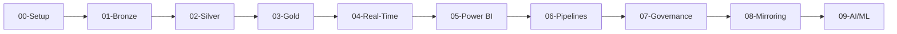

# 💬 Frequently Asked Questions (FAQ)

> 🏠 [Home](../README.md) > 📚 [Docs](./) > 💬 FAQ

**Last Updated:** `2025-01-21` | **Version:** 1.0.0

---

## 📑 Table of Contents

- [🎯 General Questions](#-general-questions)
- [📋 Prerequisites & Setup](#-prerequisites--setup)
- [🚀 Deployment Questions](#-deployment-questions)
- [🎲 Data Generation](#-data-generation)
- [📖 Tutorial Questions](#-tutorial-questions)
- [📊 Power BI & Reporting](#-power-bi--reporting)
- [🔐 Security & Compliance](#-security--compliance)
- [🔧 Troubleshooting](#-troubleshooting)
- [💰 Cost & Licensing](#-cost--licensing)
- [🐳 Docker & Dev Containers](#-docker--dev-containers)

---

## 🎯 General Questions

### What is this POC?

This is a **production-ready proof-of-concept environment** for Microsoft Fabric, purpose-built for the casino and gaming industry. It demonstrates:

- ✅ Complete medallion architecture (Bronze/Silver/Gold)
- ✅ Real-time slot machine telemetry
- ✅ Player 360 analytics
- ✅ Regulatory compliance (NIGC MICS, FinCEN BSA)
- ✅ Direct Lake Power BI dashboards
- ✅ Data governance with Microsoft Purview

**Key Value:** Provides a working reference implementation that can be customized for your specific casino operations.

---

### Who is this POC for?

<details>
<summary>👥 Click to see target audience</summary>

| Audience | Use Case |
|----------|----------|
| 🏗️ **Data Architects** | Evaluate Fabric for enterprise data platforms |
| 💻 **Data Engineers** | Learn medallion architecture patterns |
| 📊 **BI Developers** | Build Direct Lake Power BI solutions |
| 🎰 **Gaming Industry** | Implement analytics for casino operations |
| 🏛️ **Solution Architects** | Design cloud-native analytics platforms |
| 🎓 **Students/Learners** | Hands-on experience with Microsoft Fabric |

</details>

---

### What data domains are covered?

<details>
<summary>🎲 Click to see data domains</summary>

| Domain | Icon | Description |
|--------|------|-------------|
| **Slot Machines** | 🎰 | Telemetry, meter readings, jackpots, performance |
| **Table Games** | 🎲 | Hand results, chip tracking, dealer analytics |
| **Player/Loyalty** | 👤 | Profiles, rewards, Player 360 insights |
| **Financial/Cage** | 💰 | Transactions, fills, credits, cash management |
| **Security** | 🔒 | Surveillance, access control, incident tracking |
| **Compliance** | 📋 | CTR/SAR reporting, W-2G forms, regulatory filings |

</details>

---

### How long does it take to complete the full POC?

**3-Day Workshop Format:**
- **Day 1** (8 hours): Medallion foundation (Bronze + Silver)
- **Day 2** (8 hours): Gold layer + Real-time analytics
- **Day 3** (8 hours): Power BI + Governance

**Self-Paced Learning:** 2-4 weeks (2-3 hours per week)

See the [3-Day POC Agenda](../poc-agenda/README.md) for detailed schedules.

---

### Can I use this for non-gaming industries?

**Yes!** While this POC is casino-focused, the architecture patterns apply to many industries:

| Industry | Adaptations |
|----------|-------------|
| 🏥 Healthcare | Patient analytics, HIPAA compliance |
| 🏛️ Federal Government | DOT/FAA datasets, FedRAMP compliance |
| 🛒 Retail/E-commerce | Customer 360, supply chain optimization |
| 🏦 Financial Services | Transaction monitoring, fraud detection |

See [Future Expansions](../future-expansions/) for vertical-specific examples.

---

## 📋 Prerequisites & Setup

### What Azure resources do I need?

<details>
<summary>☁️ Click to see requirements</summary>

**Required:**
- ✅ Azure subscription (Owner or Contributor access)
- ✅ Microsoft Fabric capacity (F64 recommended for POC)
- ✅ Resource providers registered (see below)

**Optional:**
- Microsoft Purview account (for governance features)
- Azure Key Vault (for secrets management)
- Private endpoints (for production security)

**Resource Providers to Register:**
```bash
az provider register --namespace Microsoft.Fabric
az provider register --namespace Microsoft.Purview
az provider register --namespace Microsoft.Storage
az provider register --namespace Microsoft.KeyVault
```

See [Prerequisites Guide](PREREQUISITES.md) for complete details.

</details>

---

### What is the minimum Fabric capacity SKU?

| SKU | Use Case | Monthly Cost (24/7) |
|-----|----------|---------------------|
| **F2** | Minimal testing | ~$265 |
| **F4** | Development (recommended minimum) | ~$530 |
| **F64** | **POC recommended** | ~$8,480 |

**Why F64 for POC?**
- Sufficient compute for parallel data processing
- Can handle real-time streaming workloads
- Supports multiple concurrent users

**Can I start smaller?** Yes, but expect slower performance with F2/F4. Good for learning tutorials but not representative of production performance.

See [Cost Estimation Guide](COST_ESTIMATION.md) for detailed pricing.

---

### Do I need to install anything locally?

**Quick Answer:** No, if using Dev Container or Codespaces.

**Local Installation Option:**

| Tool | Version | Required? |
|------|---------|-----------|
| Azure CLI | 2.50+ | Yes |
| Bicep | 0.22+ | Yes |
| Git | 2.40+ | Yes |
| PowerShell | 7.0+ | Yes |
| Python | 3.10+ | For data generation |
| Docker | Latest | For containerized generators |

**Easiest Setup:** Use GitHub Codespaces (zero installation) or VS Code Dev Container.

See [Prerequisites - Dev Container Setup](PREREQUISITES.md#dev-container-setup-alternative-to-local-installation).

---

### How do I enable Fabric in my tenant?

<details>
<summary>🔑 Click to see steps</summary>

**Requirements:**
- Azure AD Global Administrator OR Fabric Administrator role

**Steps:**
1. Navigate to [Microsoft Fabric Admin Portal](https://app.fabric.microsoft.com/admin-portal)
2. Select **Tenant settings**
3. Under **Microsoft Fabric**, enable:
   - ✅ Users can create Fabric items
   - ✅ Users can use OneLake
4. (Optional) Restrict to specific security groups
5. Click **Apply**

**Verification:**
1. Go to [app.fabric.microsoft.com](https://app.fabric.microsoft.com)
2. You should see the Fabric home page
3. Click **+ New** - you should see Lakehouse, Warehouse, etc.

**Troubleshooting:** If Fabric options don't appear, contact your Azure AD admin to verify tenant settings.

</details>

---

### What permissions do I need?

<details>
<summary>🔐 Click to see permission requirements</summary>

**Azure Subscription:**
- Minimum: **Contributor** role
- Recommended: **Owner** role (for initial setup)

**Fabric Workspace:**
- **Admin**: Full control (workspace owners)
- **Member**: Can create and edit items (data engineers)
- **Contributor**: Can create/edit but not share (developers)
- **Viewer**: Read-only (business users)

**Why Owner for Setup?**
- Configure RBAC and resource providers
- Create service principals for CI/CD
- Set up managed identities

After initial setup, Contributor is sufficient for day-to-day operations.

</details>

---

## 🚀 Deployment Questions

### What are the deployment options?

| Method | Best For | Time to Deploy |
|--------|----------|----------------|
| 🐳 **Docker Quick Start** | Generate sample data, test generators | ~5 minutes |
| ☁️ **Azure Bicep** | Full infrastructure deployment | ~30 minutes |
| 📜 **PowerShell Scripts** | Automated CI/CD workflows | ~30 minutes |
| 🔄 **GitHub Actions** | Continuous deployment pipelines | One-time setup |

See [Deployment Guide](DEPLOYMENT.md) for detailed instructions.

---

### How do I deploy to Azure?

<details>
<summary>📜 Click to see quick deployment steps</summary>

**Prerequisites:**
- Azure CLI logged in
- Bicep extension installed
- `.env` file configured

**Quick Deployment:**

```bash
# 1. Login to Azure
az login
az account set --subscription "<your-subscription-id>"

# 2. Deploy infrastructure
az deployment sub create \
  --location eastus2 \
  --template-file infra/main.bicep \
  --parameters infra/environments/dev/dev.bicepparam

# 3. Verify deployment
./scripts/verify-deployment.sh
```

**Deployment Time:** ~30 minutes for complete infrastructure.

**What Gets Deployed:**
- Fabric capacity
- Purview account
- ADLS Gen2 storage
- Key Vault
- Log Analytics workspace
- Network security groups

</details>

---

### Common deployment errors?

<details>
<summary>⚠️ Click to see common issues and fixes</summary>

#### Error: `Microsoft.Fabric/capacities resource provider not registered`

**Fix:**
```bash
az provider register --namespace Microsoft.Fabric
az provider show --namespace Microsoft.Fabric --query "registrationState"
```
Wait for "Registered" status (can take 5-10 minutes).

---

#### Error: `AuthorizationFailed`

**Cause:** Insufficient permissions

**Fix:** Ensure you have Owner or Contributor role:
```bash
az role assignment list --assignee "$(az ad signed-in-user show --query id -o tsv)"
```

---

#### Error: `SKU F64 not available in region`

**Cause:** Capacity not available in selected region

**Fix:** Check [Fabric capacity availability](https://learn.microsoft.com/fabric/enterprise/region-availability) and choose supported region.

---

#### Error: `Purview account name already exists`

**Cause:** Purview names are globally unique

**Fix:** Choose a different name in `.env` file:
```bash
PURVIEW_ACCOUNT_NAME=pv-fabricpoc-<your-unique-id>
```

</details>

---

### How do I verify deployment succeeded?

<details>
<summary>✅ Click to see verification steps</summary>

**Automated Verification:**
```bash
./scripts/verify-deployment.sh
```

**Manual Verification Checklist:**
- [ ] Fabric capacity shows in Azure Portal
- [ ] Fabric capacity shows in [Fabric Admin Portal](https://app.fabric.microsoft.com/admin-portal)
- [ ] Purview account accessible
- [ ] Storage account has ADLS Gen2 enabled
- [ ] Key Vault accessible
- [ ] Log Analytics receiving logs

**Quick Portal Check:**
```bash
# List deployed resources
az resource list --resource-group "rg-fabric-poc-dev" --output table
```

</details>

---

### How do I delete everything?

**⚠️ Warning:** This is irreversible. Ensure you have backups.

```bash
# Delete resource group (removes all resources)
az group delete --name "rg-fabric-poc-dev" --yes --no-wait

# Remove lock first if resources are locked
az lock delete --name "CanNotDelete" --resource-group "rg-fabric-poc-dev"
```

See [Deployment Guide - Cleanup](DEPLOYMENT.md#️-cleanup) for details.

---

## 🎲 Data Generation

### How do I generate sample data?

<details>
<summary>🎰 Click to see data generation options</summary>

**Option 1: Docker (Easiest)**
```bash
# Quick demo dataset (7 days, small)
docker-compose run --rm demo-generator

# Full dataset (30 days, production-like)
docker-compose run --rm data-generator

# Custom parameters
docker-compose run --rm data-generator --slots 100000 --players 5000 --days 14
```

**Option 2: Local Python**
```bash
# Install dependencies
pip install -r requirements.txt

# Generate all data
python data-generation/generate.py --all --days 30

# Generate specific domains
python data-generation/generate.py --slots 50000 --players 2000
```

**Option 3: Use Pre-Generated Samples**
```bash
# Sample data is already in the repository
ls sample-data/bronze/

# 10,000 slot events, 500 players, etc.
```

Output location: `./output` directory

See [Data Generation Guide](../data-generation/README.md) for complete documentation.

</details>

---

### What data volumes are generated by default?

| Data Type | Records | Size | Bronze Table |
|-----------|---------|------|--------------|
| Slot Events | 500,000 | ~500 MB | `bronze_slot_telemetry` |
| Table Games | 100,000 | ~100 MB | `bronze_table_games` |
| Players | 10,000 | ~10 MB | `bronze_player_profile` |
| Financial | 50,000 | ~50 MB | `bronze_financial_txn` |
| Security | 25,000 | ~25 MB | `bronze_security_events` |
| Compliance | 10,000 | ~10 MB | `bronze_compliance` |
| **Total** | **~700,000** | **~700 MB** | |

**Customization:**
```bash
# Scale up for larger POCs
docker-compose run --rm data-generator --all --days 90

# Scale down for quick testing
docker-compose run --rm demo-generator  # 7 days, smaller volumes
```

---

### Is the generated data realistic?

**Yes!** The data generators include:

✅ **Realistic distributions** based on industry patterns
✅ **Referential integrity** (Player IDs match across tables)
✅ **Compliance logic** (CTR $10K threshold, W-2G $1,200)
✅ **Time-series patterns** (hourly/daily seasonality)
✅ **PII protection** (hashed SSN, masked credit cards)

**Example realistic patterns:**
- Slot machine hold percentage: 8-12%
- Player loyalty tiers: Bronze (60%), Silver (30%), Gold (8%), Platinum (2%)
- Peak gaming hours: 7pm-2am (weekends higher)
- CTR generation: ~0.5% of transactions

See [Data Generation - Data Quality Features](../data-generation/README.md#data-quality-features).

---

### How do I customize the generated data?

<details>
<summary>🔧 Click to see customization options</summary>

**Command Line Options:**
```bash
# Adjust volumes
--slots 1000000        # 1 million slot events
--players 50000        # 50,000 player profiles
--days 90              # 90 days of history

# Adjust format
--format csv           # Output as CSV instead of Parquet
--format json          # Output as JSON

# Control randomness
--seed 12345           # Use specific seed for reproducibility
```

**Programmatic Customization:**
```python
from generators import SlotMachineGenerator

# Custom generator configuration
generator = SlotMachineGenerator(
    num_machines=1000,
    denominations=[0.01, 0.25, 0.50, 1.00, 5.00],
    hold_pct_mean=0.10,  # 10% hold
    seed=42
)

df = generator.generate(100000)
```

**Configuration Files:**
Edit `data-generation/config/` YAML files for domain-specific customization.

</details>

---

### How do I stream data to Event Hub?

<details>
<summary>⚡ Click to see streaming setup</summary>

**Prerequisites:**
- Azure Event Hub created
- Connection string obtained

**Docker Streaming:**
```bash
EVENTHUB_CONNECTION_STRING="Endpoint=sb://..." \
EVENTHUB_NAME="slot-telemetry" \
STREAMING_RATE=10 \
docker-compose up streaming-generator
```

**Python Streaming:**
```python
from generators import SlotMachineGenerator
from streaming import EventHubStreamer

# Configure streamer
streamer = EventHubStreamer(
    connection_string=os.getenv("EVENTHUB_CONNECTION_STRING"),
    eventhub_name="slot-telemetry"
)

# Stream events
generator = SlotMachineGenerator()
for event in generator.generate_stream(events_per_second=10):
    streamer.send(event)
```

**Parameters:**
- `STREAMING_RATE`: Events per second (default: 10)
- `BATCH_SIZE`: Events per batch (default: 100)

See [Tutorial 04: Real-Time Analytics](../tutorials/04-real-time-analytics/README.md).

</details>

---

## 📖 Tutorial Questions

### What's the learning path?



**Recommended Path:**
1. **🟢 Foundation** (00-01): Environment setup, Bronze layer
2. **🟡 Core** (02-03): Silver and Gold layers
3. **🟠 Advanced** (04-05): Real-time analytics, Power BI
4. **🔴 Enterprise** (06-09): Pipelines, governance, AI/ML

See [Tutorials README](../tutorials/README.md) for complete learning path.

---

### Can I skip tutorials?

**Not Recommended.** Each tutorial builds on the previous one:

| Tutorial | Can Skip? | Notes |
|----------|-----------|-------|
| 00-Setup | ❌ No | Creates workspace and Lakehouses |
| 01-Bronze | ❌ No | Required for Silver layer |
| 02-Silver | ❌ No | Required for Gold layer |
| 03-Gold | ❌ No | Required for Power BI |
| 04-Real-Time | ✅ Yes | Optional for basic POC |
| 05-Power BI | ⚠️ Partial | Can use pre-built reports |
| 06-Pipelines | ✅ Yes | Optional for manual workflows |
| 07-Governance | ✅ Yes | Optional for POC |
| 08-Mirroring | ✅ Yes | Optional feature |
| 09-AI/ML | ✅ Yes | Advanced feature |

**Minimum POC:** Complete tutorials 00-03 + 05 (Power BI).

---

### Tutorial 00: Environment setup issues?

<details>
<summary>⚠️ Common setup problems</summary>

#### Issue: Can't create workspace

**Cause:** Fabric not enabled in tenant

**Fix:** Ask Azure AD admin to enable Fabric tenant settings.

---

#### Issue: Capacity appears paused

**Cause:** Auto-pause enabled or manually paused

**Fix:**
1. Go to [Fabric Admin Portal](https://app.fabric.microsoft.com/admin-portal)
2. Navigate to **Capacity settings**
3. Click **Resume** on your capacity

---

#### Issue: Can't create Lakehouse

**Cause:** Insufficient workspace permissions

**Fix:** Ensure you have Member or Admin role in the workspace.

</details>

---

### Tutorial 01: Bronze layer issues?

<details>
<summary>⚠️ Common Bronze layer problems</summary>

#### Issue: Data not loading into Lakehouse

**Cause:** File path or format issues

**Fix:**
```python
# Check file path
display(dbutils.fs.ls("Files/bronze/"))

# Verify Parquet format
df = spark.read.format("parquet").load("Files/bronze/slot_telemetry.parquet")
display(df.limit(10))
```

---

#### Issue: Schema mismatch errors

**Cause:** Generated data doesn't match expected schema

**Fix:** Use `mergeSchema` option:
```python
df = spark.read.format("parquet") \
    .option("mergeSchema", "true") \
    .load("Files/bronze/")
```

---

#### Issue: Large files causing timeouts

**Cause:** File too large for single operation

**Fix:** Process in batches or use streaming read.

</details>

---

### Tutorial 05: Direct Lake not working?

<details>
<summary>⚠️ Common Direct Lake problems</summary>

#### Issue: Semantic model falls back to DirectQuery

**Cause:** Delta table not V-Order optimized or too complex

**Fix:**
```sql
-- Optimize Delta table for Direct Lake
OPTIMIZE gold_slot_performance
USING (VORDER);
```

---

#### Issue: "Not supported in Direct Lake mode" error

**Cause:** Using unsupported DAX features

**Supported in Direct Lake:**
- ✅ Most DAX functions
- ✅ Calculated columns
- ✅ Measures
- ✅ Row-level security

**Not Supported:**
- ❌ Calculated tables
- ❌ Some complex M queries
- ❌ Composite models with Import

**Fix:** Simplify DAX or move calculation to Gold layer.

---

#### Issue: Performance is slow

**Cause:** Query complexity or missing optimization

**Fix:**
1. Run `OPTIMIZE` on Delta tables
2. Ensure table partitioning
3. Check Fabric capacity is active
4. Review DAX query performance in Performance Analyzer

</details>

---

## 📊 Power BI & Reporting

### What is Direct Lake mode?

**Direct Lake** is a revolutionary data connectivity mode that combines the best of Import and DirectQuery:

| Mode | Speed | Freshness | Data Duplication |
|------|-------|-----------|------------------|
| Import | ⚡ Fast | ❌ Stale (requires refresh) | Yes |
| DirectQuery | 🐌 Slow | ✅ Fresh | No |
| **Direct Lake** | ⚡ **Fast** | ✅ **Fresh** | **No** |

**How it works:**
- Queries execute directly against Delta tables in OneLake
- Uses V-Order optimization for sub-second performance
- No data import or scheduled refresh required
- Automatic fallback to DirectQuery if needed

See [Tutorial 05: Direct Lake & Power BI](../tutorials/05-direct-lake-powerbi/README.md).

---

### Do I need a Power BI license?

<details>
<summary>💳 Click to see licensing requirements</summary>

**To Create Content:**
- Power BI Pro OR
- Power BI Premium Per User (PPU)

**To Consume Content:**
- Power BI Free (if content is in Premium/Fabric capacity)
- Power BI Pro (if not in Premium capacity)

**Fabric Capacity Advantage:**
Users with free licenses can view reports published to Fabric capacity workspaces.

**POC Recommendation:**
- Get Power BI Pro trial (60 days free)
- Or use Fabric capacity with free license for viewers

</details>

---

### How often does Direct Lake refresh?

**Answer:** It doesn't! That's the beauty of Direct Lake.

**Traditional Import Mode:**
- Requires scheduled refresh (e.g., every 8 hours)
- Data is stale between refreshes
- Consumes refresh capacity

**Direct Lake:**
- ✅ Always queries the latest data
- ✅ No refresh schedule needed
- ✅ Updates appear immediately when Delta tables update

**Exception:** If you have calculated tables or composite models, those components might need refresh.

---

### What reports are included?

| Report | Description | Key Visuals |
|--------|-------------|-------------|
| 🎰 **Casino Executive Dashboard** | High-level KPIs | Revenue trends, floor performance, player metrics |
| 🎲 **Slot Performance Analysis** | Machine-level analytics | Hold %, utilization, jackpot frequency |
| 👤 **Player 360 View** | Customer analytics | Segments, lifetime value, visit patterns |
| 📋 **Compliance Monitoring** | Regulatory reporting | CTR/SAR status, W-2G tracking, audit trails |
| ⚡ **Real-Time Floor Monitor** | Live casino status | Machine status, alerts, occupancy |

**Location:** `reports/report-definitions/`

See [Reports README](../reports/README.md) for import instructions.

---

### Can I customize the reports?

**Absolutely!** The reports are provided as starting templates.

**Customization Options:**
1. **Edit in Power BI Desktop:**
   - Open `.pbip` files
   - Modify visuals, add pages
   - Adjust DAX measures

2. **Create New Reports:**
   - Connect to existing semantic model
   - Build custom visuals
   - Apply your branding

3. **Add Custom DAX:**
   ```dax
   // Example: Average Daily Theo per Player
   Avg Daily Theo = 
   DIVIDE(
       SUM(gold_player_360[total_theo]),
       DISTINCTCOUNT(gold_player_360[player_id])
   )
   ```

**Best Practice:** Copy template first, then customize.

---

### How do I implement Row-Level Security (RLS)?

<details>
<summary>🔒 Click to see RLS implementation</summary>

**Use Case:** Users should only see data for their casino property.

**Step 1: Create Role in Semantic Model**
1. Open semantic model in Power BI Desktop
2. Go to **Modeling** > **Manage roles**
3. Create role: `PropertyFilter`
4. Add DAX filter:

```dax
[PropertyID] = LOOKUPVALUE(
    UserPropertyMapping[PropertyID],
    UserPropertyMapping[UserEmail],
    USERPRINCIPALNAME()
)
```

**Step 2: Test Role**
1. Click **Modeling** > **View as**
2. Select role and test user
3. Verify data is filtered correctly

**Step 3: Assign Users**
1. Publish report to Fabric workspace
2. Go to semantic model security settings
3. Add users/groups to roles

**Row-Level Security Patterns:**
- Filter by region: `[Region] = "West"`
- Filter by user email: `USERPRINCIPALNAME()`
- Dynamic filtering from lookup table

See [Security Guide - Row-Level Security](SECURITY.md#row-level-security-rls) for complete examples.

</details>

---

## 🔐 Security & Compliance

### What compliance frameworks are covered?

<details>
<summary>📋 Click to see compliance coverage</summary>

| Framework | Description | Implementation |
|-----------|-------------|----------------|
| 🎰 **NIGC MICS** | Minimum Internal Control Standards | Meter accuracy validation, drop count verification |
| 💰 **FinCEN BSA** | Bank Secrecy Act | CTR/SAR reporting, $10K threshold detection |
| 💳 **PCI-DSS** | Payment Card Industry | Card number masking, access controls |
| 🏛️ **State Gaming** | Jurisdiction Requirements | Configurable audit trails, retention policies |

**Compliance Features:**
- Automated CTR generation (>= $10,000)
- SAR pattern detection (structuring)
- W-2G auto-generation ($1,200 slots, $600 keno)
- 5-year data retention policies

See [Security Guide - Compliance Requirements](SECURITY.md#-compliance-requirements).

</details>

---

### How is PII protected?

<details>
<summary>🔐 Click to see PII handling</summary>

**Default PII Protection:**

| PII Type | Method | Example |
|----------|--------|---------|
| SSN | Hashed (SHA-256) + Masked | `XXX-XX-1234` |
| Names | First initial only | `J*** S***` |
| Credit Cards | Masked last 4 digits | `****-****-****-1234` |
| Phone | Partial mask | `(***) ***-4567` |
| Email | Domain only | `j***@example.com` |

**Bronze Layer:** Raw PII hashed/masked on ingestion
**Silver Layer:** Only hashed values, no raw PII
**Gold Layer:** No PII, only aggregated/anonymized data

**Sample Data:** All provided sample data has PII pre-masked.

**Testing Only:** Use `--include-pii` flag for development (never in production).

See [Security Guide - PII Handling](SECURITY.md#pii-handling).

</details>

---

### How are secrets managed?

**Never commit secrets to Git!** This repository has multiple protections:

✅ **`.gitignore`**: Blocks common secret files
✅ **Pre-commit hook**: Scans for high-risk patterns
✅ **`.env.sample`**: Provides template without secrets
✅ **Sample data**: All PII masked

**Best Practices:**
1. Use `.env` files locally (gitignored)
2. Store production secrets in Azure Key Vault
3. Use managed identities for Azure authentication
4. Enable the pre-commit hook:
   ```bash
   git config core.hooksPath .githooks
   ```

**If you accidentally commit a secret:**
1. Assume it's compromised - rotate immediately
2. Remove from Git history with BFG Repo-Cleaner
3. Report per your security policy

See [Security Guide - Repository Security](SECURITY.md#-repository-security).

---

### What network security options are available?

<details>
<summary>🌐 Click to see network security</summary>

**Private Endpoint Support:**
- Azure Storage (ADLS Gen2)
- Key Vault
- Microsoft Purview
- Log Analytics

**Network Security Groups (NSG):**
- Restrict inbound/outbound traffic
- Segment subnets by function
- Deny-by-default rules

**Fabric Network Isolation:**
- Connect Fabric workspace to VNet (Preview)
- Private endpoints for OneLake
- Firewall rules for managed endpoints

**Configuration:**
Edit `infra/modules/network.bicep` to enable private endpoints.

See [Security Guide - Network Security](SECURITY.md#-network-security).

</details>

---

## 🔧 Troubleshooting

### Notebook fails with "Capacity not available"

**Cause:** Fabric capacity is paused or inactive.

**Fix:**
1. Go to [Fabric Admin Portal](https://app.fabric.microsoft.com/admin-portal)
2. Navigate to **Capacity settings**
3. Ensure capacity status is **Active**
4. If paused, click **Resume**

**Prevention:** Disable auto-pause for POC demos.

---

### "Cannot connect to Lakehouse" error

<details>
<summary>🔍 Click to see debugging steps</summary>

**Check 1: Lakehouse exists**
```python
# In notebook
%run ./_notebook_config

# Should show lakehouse tables
display(spark.catalog.listTables())
```

**Check 2: Workspace permissions**
- Verify you have Member or Admin role
- Check workspace settings > Users & permissions

**Check 3: Lakehouse attached to notebook**
1. Open notebook
2. Click **Add Lakehouse** in left pane
3. Select existing Lakehouse
4. Click **Add**

**Check 4: Capacity active**
Ensure Fabric capacity is not paused.

</details>

---

### Delta table "file not found" errors

**Cause:** Delta transaction log corruption or incomplete writes.

**Fix:**
```python
# Repair Delta table
from delta.tables import DeltaTable

DeltaTable.forPath(spark, "Tables/bronze_slot_telemetry").generate("symlink_format_manifest")

# Or vacuum old files
DeltaTable.forPath(spark, "Tables/bronze_slot_telemetry").vacuum()
```

**Prevention:** Use proper DataFrame writes with checkpoints.

---

### Power BI reports show "Unable to connect"

<details>
<summary>🔍 Click to see connection debugging</summary>

**Check 1: Semantic model exists**
1. Go to workspace
2. Verify semantic model is published
3. Click semantic model > Settings
4. Check data source credentials

**Check 2: Direct Lake requirements**
- Gold tables must be Delta format
- Tables must be in OneLake
- Workspace must be on Fabric capacity

**Check 3: Permissions**
- User must have Build permission on semantic model
- Or Viewer permission for read-only

**Check 4: Refresh semantic model**
1. Open semantic model
2. Click **Refresh now**
3. Check refresh history for errors

</details>

---

### Data generator produces "invalid schema" warnings

**Cause:** Schema mismatch between generator and expected Bronze schema.

**Fix:**
```bash
# Update to latest generator code
git pull origin main

# Or specify schema version
python generate.py --all --schema-version 1.1
```

**Workaround:** Use `mergeSchema` when reading:
```python
df = spark.read.format("parquet") \
    .option("mergeSchema", "true") \
    .load("Files/bronze/")
```

---

### "Out of memory" errors during data processing

<details>
<summary>💾 Click to see memory optimization</summary>

**Cause:** Processing too much data at once or inefficient code.

**Fix 1: Process in batches**
```python
# Bad: Load entire dataset
df = spark.read.format("delta").load("Tables/bronze_slot_telemetry")

# Good: Filter first
df = spark.read.format("delta").load("Tables/bronze_slot_telemetry") \
    .filter("event_date >= '2024-01-01'")
```

**Fix 2: Repartition data**
```python
df.repartition(10).write.format("delta").save("Tables/silver_slot_clean")
```

**Fix 3: Increase capacity**
- Use larger Fabric SKU temporarily
- Or reduce data volume for POC

**Fix 4: Optimize DataFrame operations**
- Use `select()` to limit columns early
- Avoid `collect()` on large datasets
- Use `coalesce()` instead of `repartition()` when reducing partitions

</details>

---

## 💰 Cost & Licensing

### What will this POC cost me?

**Quick Estimates:**

| Scenario | Duration | Capacity | Estimated Cost |
|----------|----------|----------|----------------|
| 🧪 **POC Demo** | 3 days | F64 (24 hrs/day) | **$35-50** |
| 🔧 **Development** | 1 month | F4 (8 hrs/day, weekdays) | **$175-265** |
| 🏭 **Production Pilot** | 1 month | F64 (24/7) | **$8,500-9,500** |

**Cost Breakdown (1-month F64 24/7):**
- Fabric Capacity: ~$8,500 (80%)
- ADLS Gen2 Storage: ~$500 (5%)
- Purview: ~$800 (8%)
- Other services: ~$700 (7%)

**Major Cost Driver:** Fabric capacity (75-80% of total cost).

See [Cost Estimation Guide](COST_ESTIMATION.md) for detailed scenarios.

---

### How can I reduce costs?

<details>
<summary>💡 Click to see cost optimization strategies</summary>

**Strategy 1: Pause/Resume Capacity**
```bash
# Pause capacity when not in use
az fabric capacity pause --name "fabric-casino-poc"

# Resume when needed
az fabric capacity resume --name "fabric-casino-poc"
```
**Savings:** Up to 76% for development environments (8 hrs/day vs 24/7)

---

**Strategy 2: Use Smaller SKU for Dev**
- Development: F4 ($530/month 24/7) or F2 ($265/month 24/7)
- Staging: F16 ($2,120/month 24/7)
- Production only: F64 ($8,480/month 24/7)

**Savings:** 93% for dev environments (F4 vs F64)

---

**Strategy 3: Reserved Capacity**
- 1-year commitment: Save 25-30%
- 3-year commitment: Save 35-40%

**Example:** F64 reserved 1-year: ~$6,000-7,000/month (vs $8,500)

---

**Strategy 4: Storage Lifecycle Policies**
```bash
# Move cold data to Cool tier after 30 days
az storage blob lifecycle-management set \
  --policy @lifecycle-policy.json \
  --account-name $STORAGE_ACCOUNT_NAME
```
**Savings:** 50% on storage costs for archival data

---

**Strategy 5: Schedule-Based Automation**
```powershell
# Automated pause/resume schedule
# Run via Azure Automation or GitHub Actions
Start-FabricCapacity -Time "08:00" -Days "Mon-Fri"
Stop-FabricCapacity -Time "18:00" -Days "Mon-Fri"
```

---

See [Cost Estimation - Optimization Strategies](COST_ESTIMATION.md#cost-optimization-strategies).

</details>

---

### Do I need to pay for Power BI separately?

**Short Answer:** Maybe, depends on your usage.

**Licensing Options:**

| Scenario | License Required | Cost |
|----------|------------------|------|
| Create reports/semantic models | Power BI Pro or PPU | $10-20/user/month |
| View reports (Fabric capacity) | Free license | $0 |
| View reports (non-Fabric) | Power BI Pro | $10/user/month |
| Enterprise distribution | Premium capacity or Fabric | Capacity cost |

**POC Recommendation:**
1. Use Power BI Pro trial (60 days free)
2. Publish to Fabric workspace
3. Viewers can use free licenses

**Note:** Fabric capacity is already included in your F64 cost estimate - it provides Power BI Premium features.

---

### What about Azure free tier/credits?

**Azure Free Tier:**
- ❌ Microsoft Fabric not included in free tier
- ✅ Some supporting services (Storage, Key Vault) have free allowances

**Azure Credits:**
- ✅ Can use Fabric with Azure credits (students, startups)
- ✅ Visual Studio subscriptions include monthly credits

**Free Trials:**
- Power BI Pro: 60-day trial
- Fabric capacity: Trial available via Microsoft
- Azure subscription: $200 credit for 30 days (new customers)

**POC on a Budget:**
- Use F2 capacity ($265/month or ~$9/day)
- Pause when not in use
- Limit to 3-day POC demo ($27-35 total)

---

## 🐳 Docker & Dev Containers

### What's the difference between Docker and Dev Container?

| Feature | Docker | Dev Container |
|---------|--------|---------------|
| **Purpose** | Run data generators | Full development environment |
| **Requires** | Docker Desktop only | Docker + VS Code |
| **What's Inside** | Python + generators | Python + Azure CLI + Bicep + extensions |
| **Use Case** | Generate data quickly | Complete coding environment |
| **Persistent** | No | Yes (VS Code workspace) |

**Docker:** Run generators, validate data, stream to Event Hub
**Dev Container:** Complete development setup with all tools pre-installed

---

### How do I use Docker for data generation?

```bash
# Quick demo (7 days, small dataset)
docker-compose run --rm demo-generator

# Full dataset (30 days, production-like volumes)
docker-compose run --rm data-generator

# Custom parameters
docker-compose run --rm data-generator --all --days 14 --format csv

# Specific data domains
docker-compose run --rm data-generator --slots 100000 --players 5000
```

Output: `./output` directory

See [Docker Support](../README.md#-docker-support) in main README.

---

### How do I use Dev Containers?

**Option 1: VS Code Local**
1. Install [Docker Desktop](https://www.docker.com/products/docker-desktop)
2. Install [Dev Containers extension](https://marketplace.visualstudio.com/items?itemName=ms-vscode-remote.remote-containers)
3. Open repository in VS Code
4. Click "Reopen in Container" when prompted

**Option 2: GitHub Codespaces (Zero Installation)**
1. Go to repository on GitHub
2. Click **Code** > **Codespaces** tab
3. Click **Create codespace on main**
4. Wait ~2 minutes for environment to build

**What You Get:**
- ✅ Python 3.11 with all dependencies
- ✅ Azure CLI + Bicep
- ✅ PowerShell 7
- ✅ Git configured
- ✅ All VS Code extensions pre-installed

---

### Docker commands are failing?

<details>
<summary>🔧 Click to see Docker troubleshooting</summary>

**Issue: `docker-compose: command not found`**

**Cause:** Docker Compose not installed or using wrong command

**Fix:**
```bash
# Docker Compose V2 (preferred)
docker compose run --rm data-generator

# Docker Compose V1 (legacy)
docker-compose run --rm data-generator
```

---

**Issue: `Cannot connect to Docker daemon`**

**Cause:** Docker Desktop not running

**Fix:** Start Docker Desktop application

---

**Issue: `Port 8080 already in use`**

**Cause:** Another service using the port

**Fix:**
```bash
# Change port in docker-compose.yml
ports:
  - "8081:8080"  # Use 8081 instead

# Or stop conflicting service
docker ps  # Find conflicting container
docker stop <container-id>
```

---

**Issue: `Image build fails`**

**Cause:** Network issues or missing dependencies

**Fix:**
```bash
# Rebuild without cache
docker-compose build --no-cache data-generator

# Or pull latest image
docker-compose pull
```

</details>

---

## 📚 Additional Resources

### Where can I learn more about Microsoft Fabric?

**Official Documentation:**
- [Microsoft Fabric Documentation](https://learn.microsoft.com/fabric/)
- [Fabric Architecture Center](https://learn.microsoft.com/fabric/get-started/architecture)
- [Fabric Pricing](https://azure.microsoft.com/pricing/details/microsoft-fabric/)

**Community Resources:**
- [Microsoft Fabric Blog](https://blog.fabric.microsoft.com/)
- [Microsoft Fabric Community](https://community.fabric.microsoft.com/)
- [Power BI Community](https://community.powerbi.com/)

**Training:**
- [Microsoft Learn: Fabric Learning Path](https://learn.microsoft.com/training/browse/?products=fabric)
- [Data Engineering with Fabric](https://learn.microsoft.com/training/paths/get-started-fabric/)

---

### Where do I report issues or contribute?

**GitHub Repository:**
- 🐛 **Report bugs**: [Open an issue](https://github.com/frgarofa/Suppercharge_Microsoft_Fabric/issues)
- 💡 **Feature requests**: [Start a discussion](https://github.com/frgarofa/Suppercharge_Microsoft_Fabric/discussions)
- 🔧 **Pull requests**: See [Contributing Guide](../CONTRIBUTING.md)

**Before Opening an Issue:**
1. Check existing issues for duplicates
2. Review FAQ (this document)
3. Include reproduction steps
4. Provide error messages and logs

---

### How do I stay updated?

**Watch the Repository:**
- Click **Watch** on GitHub
- Choose notification preferences

**Release Notes:**
- Check [CHANGELOG.md](../CHANGELOG.md) for version history
- Subscribe to releases on GitHub

**Social Media:**
- Follow Microsoft Fabric on Twitter
- Join the LinkedIn Fabric community

---

## 🎯 Quick Reference

### Essential Links

| Resource | Link |
|----------|------|
| 🏠 **Main README** | [README.md](../README.md) |
| 🏗️ **Architecture** | [ARCHITECTURE.md](ARCHITECTURE.md) |
| 🚀 **Deployment** | [DEPLOYMENT.md](DEPLOYMENT.md) |
| 📋 **Prerequisites** | [PREREQUISITES.md](PREREQUISITES.md) |
| 🔐 **Security** | [SECURITY.md](SECURITY.md) |
| 💰 **Cost Estimation** | [COST_ESTIMATION.md](COST_ESTIMATION.md) |
| 📖 **Tutorials** | [tutorials/](../tutorials/) |
| 🎲 **Data Generation** | [data-generation/](../data-generation/) |
| 📊 **Reports** | [reports/](../reports/) |
| 📅 **POC Agenda** | [poc-agenda/](../poc-agenda/) |

---

### Command Cheat Sheet

```bash
# Deployment
az deployment sub create --location eastus2 --template-file infra/main.bicep --parameters infra/environments/dev/dev.bicepparam

# Data Generation
docker-compose run --rm data-generator --all --days 30

# Verify
./scripts/verify-deployment.sh

# Cleanup
az group delete --name "rg-fabric-poc-dev" --yes
```

---

### Support

**Need help?** Try these resources in order:

1. 📖 Check this FAQ
2. 🔍 Search [existing issues](https://github.com/frgarofa/Suppercharge_Microsoft_Fabric/issues)
3. 💬 Ask in [GitHub Discussions](https://github.com/frgarofa/Suppercharge_Microsoft_Fabric/discussions)
4. 🐛 [Open a new issue](https://github.com/frgarofa/Suppercharge_Microsoft_Fabric/issues/new)

---

[⬆️ Back to top](#-frequently-asked-questions-faq)

---

> 📖 **Documentation maintained by:** Microsoft Fabric POC Team
> 🔗 **Repository:** [Suppercharge_Microsoft_Fabric](https://github.com/frgarofa/Suppercharge_Microsoft_Fabric)
> 🔄 **Last Updated:** 2025-01-21
