# 🧪 Mermaid Diagram Test Page

This page contains simplified versions of the diagrams for quick testing.

## Test 1: Simple Flowchart

## Test 2: Simple State Diagram

```mermaid
%%{init: {'theme':'base', 'themeVariables': { 'primaryColor':'#C0C0C0','lineColor':'#2196F3'}}}%%
stateDiagram-v2
    [*] --> NotStarted
    NotStarted --> Deploying
    Deploying --> Deployed
    Deployed --> Verified
    Verified --> [*]
    
    note right of Verified
        All checks passed ✓
    end note
```

## Test 3: Simple Sequence Diagram

```mermaid
%%{init: {'theme':'base', 'themeVariables': { 'actorBkg':'#2196F3','noteBkgColor':'#FFD700'}}}%%
sequenceDiagram
    autonumber
    actor User
    participant Azure
    
    User->>Azure: Login
    Azure-->>User: Token
    User->>Azure: Deploy
    Azure-->>User: Success
    
    Note over User,Azure: Deployment Complete ✓
```

---

## ✅ Rendering Checklist

- [ ] Flowchart displays with colored nodes
- [ ] State diagram shows transitions
- [ ] Sequence diagram has numbered steps
- [ ] Custom colors are visible
- [ ] Text is readable
- [ ] Notes appear correctly

---

## 🎨 Color Reference

| Color Name | Hex Code | Should Appear In |
|------------|----------|------------------|
| Bronze | #CD7F32 | Deploy node (flowchart) |
| Silver | #C0C0C0 | State backgrounds |
| Gold | #FFD700 | End node, notes |
| Success Green | #4CAF50 | Start node |
| Info Blue | #2196F3 | Actor backgrounds, decisions |

If you see these colors rendered correctly, the main diagrams in DEPLOYMENT.md should render perfectly! 🎉
