# 🌐 Networking & Connectivity Guide

> 🏠 [Home](../README.md) > 📚 [Docs](./) > 🌐 Networking & Connectivity

**Last Updated:** 2026-01-28 | **Version:** 1.0.0

---

## 📑 Table of Contents

- [🎯 Overview](#-overview)
- [🏗️ Network Architecture](#️-network-architecture)
- [🔒 Private Endpoints](#-private-endpoints)
- [🛤️ ExpressRoute Configuration](#️-expressroute-configuration)
- [🔐 VPN Best Practices](#-vpn-best-practices)
- [🖥️ Self-Hosted Integration Runtime (SHIR)](#️-self-hosted-integration-runtime-shir)
- [🚪 On-Premises Data Gateway](#-on-premises-data-gateway)
- [🌍 Multi-Cloud Connectivity](#-multi-cloud-connectivity)
- [🎰 Casino/Gaming Compliance Considerations](#-casinogaming-compliance-considerations)

---

## 🎯 Overview

This guide covers enterprise networking configurations for Microsoft Fabric, including hybrid connectivity, private endpoints, and on-premises data access patterns critical for casino/gaming industry compliance.


*Source: [Private Links for Microsoft Fabric](https://learn.microsoft.com/en-us/fabric/security/security-private-links-overview)*

### Key Networking Components

| Component | Purpose | Use Case |
|-----------|---------|----------|
| **Private Endpoints** | Secure access without public internet | Compliance, PCI-DSS |
| **ExpressRoute** | Dedicated private connection to Azure | High-bandwidth, low-latency |
| **VPN Gateway** | Encrypted tunnel over internet | Hybrid connectivity |
| **Self-Hosted IR** | Data movement from private networks | On-prem databases |
| **Data Gateway** | Power BI/Fabric access to on-prem | Reports, DirectQuery |

---

## 🏗️ Network Architecture

### Enterprise Hybrid Architecture

```mermaid
flowchart TB
    subgraph OnPrem["🏢 On-Premises Data Center"]
        SQL[(SQL Server)]
        ORACLE[(Oracle)]
        SIS[Slot Information<br/>System]
        PTS[Player Tracking<br/>System]
        SHIR[Self-Hosted IR]
        GW[Data Gateway]
    end

    subgraph Azure["☁️ Azure"]
        subgraph VNet["Virtual Network"]
            PE[Private Endpoint<br/>for Fabric]
            SHIR_VM[SHIR VM]
            GW_VM[Gateway VM]
        end

        subgraph Fabric["Microsoft Fabric"]
            DF[Data Factory]
            LH[(Lakehouse)]
            WH[(Warehouse)]
            PBI[Power BI]
        end
    end

    subgraph Connectivity["🔗 Connectivity"]
        ER[ExpressRoute]
        VPN[Site-to-Site VPN]
    end

    SQL --> SHIR
    ORACLE --> SHIR
    SIS --> SHIR
    PTS --> GW

    SHIR --> SHIR_VM
    GW --> GW_VM

    SHIR_VM --> PE
    GW_VM --> PE

    PE --> DF
    PE --> LH
    PE --> WH
    PE --> PBI

    OnPrem <-->|Private| ER
    OnPrem <-->|Encrypted| VPN
    ER --> VNet
    VPN --> VNet

    style OnPrem fill:#f5f5f5
    style Azure fill:#e3f2fd
    style Fabric fill:#fff3e0
    style Connectivity fill:#e8f5e9
```



### Network Flow Matrix

| Source | Destination | Protocol | Port | Method |
|--------|-------------|----------|------|--------|
| On-prem SQL Server | Fabric Lakehouse | HTTPS | 443 | Self-Hosted IR |
| On-prem Oracle | Fabric Warehouse | HTTPS | 443 | Self-Hosted IR |
| Power BI Service | On-prem SQL | TDS | 1433 | Data Gateway |
| Fabric Pipeline | Azure SQL | TDS | 1433 | Managed VNet |
| Fabric Pipeline | S3/GCS | HTTPS | 443 | Direct |

---

## 🔒 Private Endpoints

### When to Use Private Endpoints

| Scenario | Requirement | Private Endpoint |
|----------|-------------|------------------|
| PCI-DSS Compliance | No public internet | ✅ Required |
| NIGC Gaming Regulations | Data sovereignty | ✅ Required |
| Standard Enterprise | Defense in depth | ✅ Recommended |
| Development/POC | Quick setup | ❌ Optional |

### Private Endpoint Configuration

#### Step 1: Enable Private Link in Fabric Admin Portal

```
1. Navigate to Fabric Admin Portal
2. Go to Tenant Settings
3. Find "Azure Private Link" section
4. Enable "Block public internet access"
5. Configure allowed tenant connections
```

#### Step 2: Create Private Endpoint in Azure

```bicep
// private-endpoint.bicep
resource fabricPrivateEndpoint 'Microsoft.Network/privateEndpoints@2023-05-01' = {
  name: 'pe-fabric-casino-prod'
  location: location
  properties: {
    subnet: {
      id: subnetId
    }
    privateLinkServiceConnections: [
      {
        name: 'fabric-connection'
        properties: {
          privateLinkServiceId: fabricWorkspaceId
          groupIds: [
            'tenant'
          ]
        }
      }
    ]
  }
}

resource privateDnsZone 'Microsoft.Network/privateDnsZones@2020-06-01' = {
  name: 'privatelink.analysis.windows.net'
  location: 'global'
}
```

#### Step 3: Configure DNS Resolution

```powershell
# Private DNS Zone configuration
$dnsZoneName = "privatelink.analysis.windows.net"
$vnetName = "vnet-fabric-prod"
$resourceGroup = "rg-fabric-networking"

# Create private DNS zone
New-AzPrivateDnsZone -Name $dnsZoneName -ResourceGroupName $resourceGroup

# Link to VNet
New-AzPrivateDnsVirtualNetworkLink `
  -Name "fabric-dns-link" `
  -ResourceGroupName $resourceGroup `
  -ZoneName $dnsZoneName `
  -VirtualNetworkId (Get-AzVirtualNetwork -Name $vnetName -ResourceGroupName $resourceGroup).Id
```

### Private Endpoint Best Practices

1. **Use dedicated subnets** for private endpoints
2. **Implement NSG rules** to restrict access
3. **Configure DNS properly** with private DNS zones
4. **Monitor endpoint health** via Azure Monitor
5. **Document IP allocations** for firewall rules

---

## 🛤️ ExpressRoute Configuration

### ExpressRoute for Fabric

ExpressRoute provides a dedicated, private connection between your on-premises network and Azure, ideal for:
- High-bandwidth data transfers (10+ Gbps)
- Low-latency requirements (< 10ms)
- Consistent performance
- PCI-DSS compliance

### Architecture Options


### ExpressRoute Setup

#### Step 1: Create ExpressRoute Circuit

```bicep
// expressroute-circuit.bicep
resource expressRouteCircuit 'Microsoft.Network/expressRouteCircuits@2023-05-01' = {
  name: 'er-circuit-casino-prod'
  location: 'eastus2'
  sku: {
    name: 'Premium_MeteredData'
    tier: 'Premium'
    family: 'MeteredData'
  }
  properties: {
    serviceProviderProperties: {
      serviceProviderName: 'Equinix'
      peeringLocation: 'Washington DC'
      bandwidthInMbps: 1000
    }
  }
}
```

#### Step 2: Configure Private Peering

```powershell
# Configure ExpressRoute private peering
$circuit = Get-AzExpressRouteCircuit `
  -Name "er-circuit-casino-prod" `
  -ResourceGroupName "rg-networking"

Add-AzExpressRouteCircuitPeeringConfig `
  -Name "AzurePrivatePeering" `
  -ExpressRouteCircuit $circuit `
  -PeeringType AzurePrivatePeering `
  -PeerASN 65001 `
  -PrimaryPeerAddressPrefix "10.0.0.0/30" `
  -SecondaryPeerAddressPrefix "10.0.0.4/30" `
  -VlanId 100

Set-AzExpressRouteCircuit -ExpressRouteCircuit $circuit
```

#### Step 3: Connect to Virtual Network

```bicep
// vnet-gateway.bicep
resource virtualNetworkGateway 'Microsoft.Network/virtualNetworkGateways@2023-05-01' = {
  name: 'vng-expressroute-prod'
  location: location
  properties: {
    gatewayType: 'ExpressRoute'
    sku: {
      name: 'ErGw2AZ'
      tier: 'ErGw2AZ'
    }
    ipConfigurations: [
      {
        name: 'default'
        properties: {
          subnet: {
            id: gatewaySubnetId
          }
          publicIPAddress: {
            id: publicIpId
          }
        }
      }
    ]
  }
}
```

### ExpressRoute Best Practices

| Practice | Description | Priority |
|----------|-------------|----------|
| **Redundant circuits** | Use two circuits in different peering locations | High |
| **BFD (Bidirectional Forwarding Detection)** | Enable for fast failover | High |
| **Route filters** | Limit advertised routes | Medium |
| **Monitoring** | Configure ExpressRoute Monitor | High |
| **Bandwidth planning** | Monitor utilization, scale proactively | Medium |

---

## 🔐 VPN Best Practices

### Site-to-Site VPN Architecture

For environments without ExpressRoute or as backup connectivity:


### VPN Configuration

```bicep
// vpn-gateway.bicep
resource vpnGateway 'Microsoft.Network/virtualNetworkGateways@2023-05-01' = {
  name: 'vpn-gateway-casino-prod'
  location: location
  properties: {
    gatewayType: 'Vpn'
    vpnType: 'RouteBased'
    vpnGatewayGeneration: 'Generation2'
    sku: {
      name: 'VpnGw2AZ'
      tier: 'VpnGw2AZ'
    }
    activeActive: true  // High availability
    enableBgp: true
    bgpSettings: {
      asn: 65515
    }
    ipConfigurations: [
      {
        name: 'vnetGatewayConfig1'
        properties: {
          subnet: {
            id: gatewaySubnetId
          }
          publicIPAddress: {
            id: publicIp1Id
          }
        }
      }
      {
        name: 'vnetGatewayConfig2'
        properties: {
          subnet: {
            id: gatewaySubnetId
          }
          publicIPAddress: {
            id: publicIp2Id
          }
        }
      }
    ]
  }
}
```

### VPN Security Best Practices

| Setting | Recommended Value | Notes |
|---------|-------------------|-------|
| **IKE Version** | IKEv2 | More secure than IKEv1 |
| **Encryption** | AES-256-GCM | Strong encryption |
| **Integrity** | SHA-384 | Strong hash |
| **DH Group** | DHGroup24 | 2048-bit MODP |
| **PFS Group** | PFS24 | Perfect forward secrecy |
| **SA Lifetime** | 28800 seconds | 8 hours |

```powershell
# Configure IPsec policy
$ipsecPolicy = New-AzIpsecPolicy `
  -IkeEncryption AES256 `
  -IkeIntegrity SHA384 `
  -DhGroup DHGroup24 `
  -IpsecEncryption GCMAES256 `
  -IpsecIntegrity GCMAES256 `
  -PfsGroup PFS24 `
  -SALifeTimeSeconds 28800 `
  -SADataSizeKilobytes 102400000

# Apply to connection
Set-AzVirtualNetworkGatewayConnection `
  -VirtualNetworkGatewayConnection $connection `
  -IpsecPolicies $ipsecPolicy `
  -UsePolicyBasedTrafficSelectors $true
```

---

## 🖥️ Self-Hosted Integration Runtime (SHIR)

### What is Self-Hosted IR?

Self-Hosted Integration Runtime enables Data Factory to connect to data sources in private networks that aren't directly accessible from Azure.


### SHIR Installation & Setup

#### Step 1: Download and Install SHIR

```powershell
# Download SHIR installer (run on your VM)
$shirUrl = "https://www.microsoft.com/download/details.aspx?id=39717"

# Or use command line
Invoke-WebRequest `
  -Uri "https://download.microsoft.com/download/E/4/7/E4771905-1079-445B-8BF9-8A1A075D8A10/IntegrationRuntime_5.x.x.x.msi" `
  -OutFile ".\IntegrationRuntime.msi"

# Install
msiexec /i IntegrationRuntime.msi /quiet
```

#### Step 2: Register SHIR with Fabric

```powershell
# Get authentication key from Fabric Data Factory
# Navigate to: Data Factory > Manage > Integration runtimes > New > Self-hosted

# Register using key
cd "C:\Program Files\Microsoft Integration Runtime\5.0\Shared"
.\dmgcmd.exe -RegisterNewNode "IR@xxxxxxxx-xxxx-xxxx-xxxx-xxxxxxxxxxxx@servicefabric.azure.com" "YourAuthenticationKey"

# Verify registration
.\dmgcmd.exe -Status
```

#### Step 3: High Availability Configuration

For production, deploy multiple SHIR nodes:


### SHIR Best Practices

| Practice | Implementation | Priority |
|----------|----------------|----------|
| **High Availability** | 2+ nodes in different availability zones | Critical |
| **Resource Sizing** | 4+ vCPU, 8+ GB RAM per node | High |
| **Network** | Dedicated subnet, NSG rules | High |
| **Monitoring** | Azure Monitor agent, SHIR diagnostics | High |
| **Auto-update** | Enable automatic updates | Medium |
| **Isolation** | Dedicated VM, no other workloads | Medium |

### SHIR Network Requirements

| Direction | Protocol | Port | Destination | Purpose |
|-----------|----------|------|-------------|---------|
| Outbound | HTTPS | 443 | *.servicebus.windows.net | Command channel |
| Outbound | HTTPS | 443 | *.core.windows.net | Data transfer |
| Outbound | HTTPS | 443 | *.frontend.clouddatahub.net | Data Factory |
| Inbound | TCP | 8060 | localhost | Node-to-node (HA) |

### SHIR Connection Examples

```json
// On-premises SQL Server connection
{
  "name": "OnPremSqlServerLinkedService",
  "type": "Microsoft.DataFactory/factories/linkedservices",
  "properties": {
    "type": "SqlServer",
    "typeProperties": {
      "connectionString": "Server=CasinoSQL01;Database=SlotDB;Integrated Security=True",
      "userName": "fabric_service",
      "password": {
        "type": "SecureString",
        "value": "**********"
      }
    },
    "connectVia": {
      "referenceName": "SelfHostedIR-Casino",
      "type": "IntegrationRuntimeReference"
    }
  }
}
```

---

## 🚪 On-Premises Data Gateway

### Gateway vs. SHIR Comparison

| Feature | Self-Hosted IR | On-Premises Data Gateway |
|---------|----------------|--------------------------|
| **Primary Use** | Data Factory pipelines | Power BI, Dataflows |
| **Data Movement** | Batch ingestion | DirectQuery, refresh |
| **Supported Sources** | 90+ connectors | 100+ connectors |
| **Real-time** | No | Yes (DirectQuery) |
| **Clustering** | Yes (HA nodes) | Yes (gateway cluster) |
| **Management** | Fabric/ADF portal | Gateway admin portal |

### Gateway Installation

#### Step 1: Download and Install

```powershell
# Download gateway installer
$gatewayUrl = "https://download.microsoft.com/download/D/A/1/DA1FDDB8-6DA8-4F50-B4D0-18019591E182/GatewayInstall.exe"
Invoke-WebRequest -Uri $gatewayUrl -OutFile ".\GatewayInstall.exe"

# Install (standard mode, not personal mode)
.\GatewayInstall.exe
```

#### Step 2: Register Gateway

```
1. Launch On-premises Data Gateway app
2. Sign in with Fabric/Power BI account
3. Select "Register a new gateway on this computer"
4. Name: "GW-Casino-Prod-01"
5. Set recovery key (store securely!)
6. Complete registration
```

#### Step 3: Configure Data Sources

```powershell
# Via PowerShell (Gateway Management)
$gateway = Get-DataGateway -Name "GW-Casino-Prod-01"

# Add SQL Server data source
Add-DataGatewayDataSource `
  -GatewayId $gateway.Id `
  -DataSourceType "Sql" `
  -DataSourceName "CasinoSlotDB" `
  -ConnectionDetails @{
    server = "CasinoSQL01.corp.local"
    database = "SlotDB"
  } `
  -CredentialType "Windows" `
  -WindowsCredential (Get-Credential)
```

### Gateway High Availability


### Gateway Best Practices

| Practice | Description | Priority |
|----------|-------------|----------|
| **Cluster Mode** | 2+ nodes for HA | Critical |
| **Dedicated VMs** | No other workloads | High |
| **Network Location** | Close to data sources | High |
| **Memory** | 8+ GB RAM minimum | High |
| **CPU** | 4+ cores | Medium |
| **Monitoring** | Enable gateway logs | Medium |
| **Recovery Key** | Store in key vault | Critical |

---

## 🌍 Multi-Cloud Connectivity

### AWS S3 Access

```python
# Access S3 via shortcut (no gateway needed)
# Configure in Fabric: Lakehouse > Get data > Shortcut > Amazon S3

# S3 shortcut configuration
{
    "shortcutType": "S3",
    "targetLocation": {
        "bucketName": "casino-data-lake",
        "region": "us-east-1",
        "path": "/bronze/slot-events/"
    },
    "authentication": {
        "type": "AccessKey",
        "accessKeyId": "AKIAXXXXXXXX",
        "secretAccessKey": "********"
    }
}
```

### Google Cloud Storage Access

```python
# GCS shortcut configuration
{
    "shortcutType": "GCS",
    "targetLocation": {
        "bucketName": "casino-analytics-bucket",
        "path": "/exports/"
    },
    "authentication": {
        "type": "ServiceAccount",
        "serviceAccountKey": "{ ... GCP service account JSON ... }"
    }
}
```

### Azure Data Lake Gen2

```python
# ADLS Gen2 shortcut (same tenant)
{
    "shortcutType": "AdlsGen2",
    "targetLocation": {
        "storageAccountName": "stcasinodata",
        "containerName": "raw",
        "path": "/slot-telemetry/"
    },
    "authentication": {
        "type": "OrganizationalAccount"  # Uses Entra ID
    }
}
```

---

## 🎰 Casino/Gaming Compliance Considerations

### PCI-DSS Network Requirements

| Requirement | Implementation | Fabric Feature |
|-------------|----------------|----------------|
| **Req 1.1** | Firewall between cardholder data | Private Endpoints |
| **Req 1.2** | No direct public access | Block public internet |
| **Req 1.3** | Restrict inbound/outbound traffic | NSG rules |
| **Req 4.1** | Encrypt transmission | TLS 1.2+ enforced |
| **Req 10.3** | Audit logging | Activity logs, diagnostics |

### NIGC (National Indian Gaming Commission) Considerations


### Recommended Network Architecture for Gaming

```bicep
// Network architecture for gaming compliance
module networkArchitecture 'network.bicep' = {
  name: 'casino-network-deployment'
  params: {
    // Hub-spoke topology
    hubVnetName: 'vnet-hub-prod'
    spokeVnets: [
      {
        name: 'vnet-fabric-prod'
        purpose: 'Fabric workloads'
        addressPrefix: '10.1.0.0/16'
      }
      {
        name: 'vnet-compliance-prod'
        purpose: 'Compliance data - isolated'
        addressPrefix: '10.2.0.0/16'
      }
      {
        name: 'vnet-onprem-gateway'
        purpose: 'Gateway connectivity'
        addressPrefix: '10.3.0.0/16'
      }
    ]

    // Security controls
    enableAzureFirewall: true
    enableDDoSProtection: true
    enablePrivateEndpoints: true
    blockPublicAccess: true

    // Compliance logging
    enableDiagnostics: true
    logRetentionDays: 365  // Gaming regulation requirement
    enableActivityLogs: true
  }
}
```

---

## 📚 Related Documentation

| Document | Description |
|----------|-------------|
| [🔐 Security Guide](./SECURITY.md) | Security best practices |
| [🏆 Best Practices](./BEST_PRACTICES.md) | Workspace organization |
| [📖 Tutorial 22](../tutorials/22-networking-connectivity/README.md) | Networking hands-on tutorial |
| [📖 Tutorial 23](../tutorials/23-self-hosted-ir-gateways/README.md) | SHIR & Gateway tutorial |

---

## 📖 References

- [Private Links for Microsoft Fabric](https://learn.microsoft.com/fabric/security/security-private-links-overview)
- [ExpressRoute Documentation](https://learn.microsoft.com/azure/expressroute/)
- [Self-hosted Integration Runtime](https://learn.microsoft.com/azure/data-factory/create-self-hosted-integration-runtime)
- [On-premises Data Gateway](https://learn.microsoft.com/data-integration/gateway/service-gateway-onprem)
- [VPN Gateway Documentation](https://learn.microsoft.com/azure/vpn-gateway/)

---

[⬆️ Back to top](#-networking--connectivity-guide) | [🏠 Home](../README.md)
