# 🔐 Security and Compliance Guide

> 🏠 [Home](../README.md) > 📚 [Docs](./) > 🔐 Security

**Last Updated:** `2025-01-21` | **Version:** 1.0.0

---

## 📑 Table of Contents

- [🛡️ Security Architecture](#️-security-architecture)
- [👤 Identity and Access Management](#-identity-and-access-management)
- [🔒 Data Protection](#-data-protection)
- [🔐 Repository Security](#-repository-security)
- [🌐 Network Security](#-network-security)
- [📋 Compliance Requirements](#-compliance-requirements)
- [📊 Audit and Monitoring](#-audit-and-monitoring)
- [🚨 Incident Response](#-incident-response)
- [✅ Security Checklists](#-security-checklists)
- [📚 References](#-references)

---

## 🛡️ Security Architecture

### Defense in Depth

Our security architecture implements multiple layers of protection:

```mermaid
flowchart TB
    subgraph L1["🔑 IDENTITY LAYER"]
        A1["Azure AD"]
        A2["Conditional Access"]
        A3["MFA"]
        A4["PIM"]
        A5["RBAC"]
    end

    subgraph L2["🌐 NETWORK LAYER"]
        B1["VNet"]
        B2["NSG"]
        B3["Private Endpoints"]
        B4["Firewall"]
        B5["DDoS Protection"]
    end

    subgraph L3["📱 APPLICATION LAYER"]
        C1["Fabric Workspace Security"]
        C2["Row-Level Security"]
        C3["Object-Level Security"]
    end

    subgraph L4["💾 DATA LAYER"]
        D1["Encryption at Rest"]
        D2["Encryption in Transit"]
        D3["Key Vault"]
        D4["Purview"]
    end

    subgraph L5["📡 MONITORING LAYER"]
        E1["Azure Monitor"]
        E2["Defender for Cloud"]
        E3["Sentinel"]
        E4["Audit Logs"]
    end

    L1 --> L2 --> L3 --> L4 --> L5
```



### Security Control Matrix

| Layer | Controls | Tools |
|-------|----------|-------|
| **Identity** | Authentication, Authorization | Azure AD, MFA, PIM |
| **Network** | Segmentation, Filtering | VNet, NSG, Private Endpoints |
| **Application** | Access Control | Workspace Security, RLS |
| **Data** | Encryption, Classification | Key Vault, Purview |
| **Monitoring** | Detection, Response | Defender, Sentinel |

---

## 👤 Identity and Access Management

### Azure AD Integration

| Feature | Configuration | Status |
|---------|--------------|--------|
| Authentication | Azure AD SSO | Required |
| MFA | Required for all users | Required |
| Conditional Access | Location + device compliance | Recommended |
| Session timeout | 8 hours (configurable) | Default |

### Role-Based Access Control (RBAC)

#### Fabric Workspace Roles

| Role | Permissions | Typical Users |
|------|-------------|---------------|
| 🔴 **Admin** | Full control | Workspace owners |
| 🟠 **Member** | Edit all items | Data engineers |
| 🟡 **Contributor** | Create/edit (no share) | Developers |
| 🟢 **Viewer** | Read-only | Business users |

#### Custom RBAC Example

```json
{
  "Name": "Fabric Data Engineer",
  "Description": "Can manage data items but not workspace settings",
  "AssignableScopes": ["/subscriptions/{sub-id}"],
  "Permissions": [{
    "Actions": [
      "Microsoft.Fabric/capacities/read",
      "Microsoft.Fabric/workspaces/read",
      "Microsoft.Fabric/workspaces/items/*"
    ],
    "NotActions": [
      "Microsoft.Fabric/workspaces/delete",
      "Microsoft.Fabric/workspaces/write"
    ]
  }]
}
```

### Row-Level Security (RLS)

```dax
// DAX filter for player data - users see only their region
[Region] = USERPRINCIPALNAME()
  && RELATED(UserRegions[UserEmail]) = USERPRINCIPALNAME()

// Casino property filter
[PropertyID] IN VALUES(UserProperties[AllowedPropertyID])
```

> ℹ️ **Note:** RLS policies are enforced at the semantic model level and apply to all reports and dashboards.

---

## 🔒 Data Protection

### Encryption Standards

| Data State | Method | Key Management |
|------------|--------|----------------|
| 🔐 At Rest | AES-256 | Microsoft-managed or CMK |
| 🔒 In Transit | TLS 1.2+ | Azure-managed |
| 🛡️ In Use | Confidential computing (optional) | Azure Key Vault |

### Customer-Managed Keys (CMK)

```bicep
// Key Vault with CMK for Fabric
resource keyVault 'Microsoft.KeyVault/vaults@2023-07-01' = {
  name: keyVaultName
  properties: {
    enablePurgeProtection: true
    enableSoftDelete: true
    softDeleteRetentionInDays: 90
    sku: {
      family: 'A'
      name: 'premium'  // Required for HSM-backed keys
    }
  }
}

resource encryptionKey 'Microsoft.KeyVault/vaults/keys@2023-07-01' = {
  parent: keyVault
  name: 'fabric-encryption-key'
  properties: {
    kty: 'RSA'
    keySize: 4096
    keyOps: ['encrypt', 'decrypt', 'wrapKey', 'unwrapKey']
  }
}
```

### Data Classification

| Classification | Icon | Examples | Controls |
|----------------|------|----------|----------|
| **Highly Confidential** | 🔴 | SSN, Full card numbers, Bank accounts | Encrypted, masked, audit logged |
| **Confidential** | 🟠 | Player PII, Win/loss records | RBAC, RLS, no export |
| **Internal** | 🟡 | Operational metrics, KPIs | Standard RBAC |
| **Public** | 🟢 | Aggregated reports | Open access |

> ⚠️ **Warning:** Never store unmasked PII in the Gold layer. All sensitive data must be encrypted or hashed.

### PII Handling

```python
# Example: PII masking in Silver layer
from pyspark.sql.functions import sha2, concat, lit, regexp_replace

def mask_pii(df):
    return df \
        .withColumn("ssn_hash", sha2(concat(col("ssn"), lit(SALT)), 256)) \
        .withColumn("ssn_masked", lit("XXX-XX-") + col("ssn").substr(-4, 4)) \
        .withColumn("card_masked",
            concat(lit("****-****-****-"), col("card_number").substr(-4, 4))) \
        .drop("ssn", "card_number")
```

---

## 🔐 Repository Security

### Preventing Secret Leaks

This repository implements multiple layers of protection to prevent accidental commits of sensitive data:

| Protection Layer | Implementation | Status |
|-----------------|----------------|--------|
| **`.gitignore`** | Comprehensive patterns for secrets, keys, credentials | ✅ Active |
| **Pre-commit Hook** | Scans staged files for high-risk patterns | ✅ Available |
| **Sample Files** | `.env.sample` with placeholders only | ✅ In Use |
| **PII Masking** | All sample data uses hashed/masked PII | ✅ Verified |

### Enabling the Pre-Commit Hook

```bash
# Configure Git to use the repository's hooks
git config core.hooksPath .githooks

# Verify it's enabled
git config --get core.hooksPath
```

### What Gets Blocked

The pre-commit hook will **block commits** containing:

| Category | Examples |
|----------|----------|
| 🔑 **Azure Keys** | Storage account keys, SAS tokens |
| 🔑 **Cloud Credentials** | AWS access keys, GCP service accounts |
| 🔑 **API Keys** | Any `api_key=`, `apikey:` patterns |
| 🔑 **Private Keys** | PEM, PPK, RSA private keys |
| 🔑 **Tokens** | JWT tokens, GitHub tokens, Slack tokens |
| 🔑 **Connection Strings** | Strings with embedded passwords |

### What Gets Warned

The hook will **warn** (but not block) for:

| Category | Notes |
|----------|-------|
| ⚠️ **SSN Patterns** | In code files (sample-data CSV is excluded) |
| ⚠️ **Credit Cards** | 16-digit patterns |
| ⚠️ **Email Addresses** | In Python files (docs excluded) |

### Files Ignored by Security Scans

- Documentation files (`*.md`)
- Sample/example templates (`*.sample`, `*.example`)
- Test files (`test_*.py`, `conftest.py`)
- Sample data directory (`sample-data/`)

### Best Practices

> ✅ **DO:**
> - Use `.env` files for local secrets (gitignored)
> - Store production secrets in Azure Key Vault
> - Use managed identities for Azure authentication
> - Mask all PII in sample/test data
> - Enable the pre-commit hook for all contributors

> ❌ **DON'T:**
> - Commit real credentials, even "temporarily"
> - Store secrets in code comments
> - Use `--no-verify` without careful review
> - Include real customer data in samples

### Emergency: Committed a Secret?

If you accidentally commit sensitive data:

```bash
# 1. Remove from history (if not pushed)
git reset --soft HEAD~1
# Remove the secret from the file
git add -A
git commit -m "fix: remove sensitive data"

# 2. If already pushed, rotate the credential immediately!
# Then use git filter-branch or BFG Repo-Cleaner to remove from history

# 3. Report the incident per your security policy
```

> ⚠️ **Important:** Assume any committed credential is compromised. Always rotate secrets that were accidentally committed, even if removed quickly.

---

## 🌐 Network Security

### Private Endpoint Architecture

```mermaid
flowchart TB
    subgraph Corp["🏢 Corporate Network"]
        USER["👤 User/Admin"]
    end

    USER -->|"ExpressRoute/VPN"| VNET

    subgraph VNET["🌐 Azure Virtual Network"]
        subgraph Fabric["Fabric Subnet<br/>10.0.1.0/24"]
            F1["Fabric Workspace"]
            F2["Dataflows"]
        end

        subgraph PE["Private Endpoint Subnet<br/>10.0.2.0/24"]
            P1["Storage PE"]
            P2["Key Vault PE"]
            P3["Purview PE"]
        end
    end
```



### Network Security Groups (NSG)

```bicep
// NSG for Fabric subnet
resource fabricNsg 'Microsoft.Network/networkSecurityGroups@2023-05-01' = {
  name: 'nsg-fabric-subnet'
  location: location
  properties: {
    securityRules: [
      {
        name: 'AllowHTTPS'
        properties: {
          priority: 100
          direction: 'Inbound'
          access: 'Allow'
          protocol: 'Tcp'
          sourceAddressPrefix: 'VirtualNetwork'
          destinationAddressPrefix: '*'
          destinationPortRange: '443'
        }
      }
      {
        name: 'DenyAllInbound'
        properties: {
          priority: 4096
          direction: 'Inbound'
          access: 'Deny'
          protocol: '*'
          sourceAddressPrefix: '*'
          destinationAddressPrefix: '*'
          destinationPortRange: '*'
        }
      }
    ]
  }
}
```

---

## 📋 Compliance Requirements

### Gaming Industry (NIGC MICS)

| Requirement | Implementation | Status |
|-------------|----------------|--------|
| Meter accuracy | < 0.1% variance validation | ☐ |
| Drop count verification | Daily reconciliation | ☐ |
| Jackpot verification | W-2G >= $1,200 auto-generation | ☐ |
| Access controls | Role-based + audit logging | ☐ |
| Data retention | 5 years minimum | ☐ |

### Financial (FinCEN BSA)

| Report | Threshold | Automation |
|--------|-----------|------------|
| 📄 CTR (Currency Transaction Report) | $10,000 | Auto-generate |
| 🚨 SAR (Suspicious Activity Report) | Pattern-based | Alert + review |
| 📋 W-2G (Gambling Winnings) | $1,200 slots, $600 keno | Auto-generate |

#### CTR Detection Logic

```python
# CTR threshold detection
def detect_ctr_threshold(df):
    return df.filter(
        (col("transaction_type") == "CASH") &
        (col("amount") >= 10000)
    ).withColumn("ctr_required", lit(True))

# Structuring detection (SAR trigger)
def detect_structuring(df, window_hours=24):
    window_spec = Window.partitionBy("player_id") \
        .orderBy("transaction_time") \
        .rangeBetween(-window_hours * 3600, 0)

    return df.withColumn("rolling_total",
        sum("amount").over(window_spec)
    ).filter(
        (col("amount").between(8000, 9999)) &
        (col("rolling_total") >= 10000)
    )
```

### PCI-DSS Requirements

| Requirement | Control | Implementation |
|-------------|---------|----------------|
| 3.4 | Render PAN unreadable | Hash/encrypt card numbers |
| 7.1 | Limit access | RBAC + need-to-know |
| 8.2 | MFA | Azure AD Conditional Access |
| 10.1 | Audit trails | Comprehensive logging |
| 12.3 | Security policies | Documented procedures |

---

## 📊 Audit and Monitoring

### Audit Log Configuration

```bicep
// Diagnostic settings for Fabric
resource fabricDiagnostics 'Microsoft.Insights/diagnosticSettings@2021-05-01-preview' = {
  name: 'fabric-audit-logs'
  scope: fabricCapacity
  properties: {
    workspaceId: logAnalyticsWorkspace.id
    logs: [
      {
        categoryGroup: 'audit'
        enabled: true
      }
      {
        categoryGroup: 'allLogs'
        enabled: true
      }
    ]
  }
}
```

### Key Audit Events

| Event Category | Examples | Retention |
|----------------|----------|-----------|
| 🔑 Authentication | Login, logout, MFA challenges | 90 days |
| 🔐 Authorization | Permission changes, access denied | 90 days |
| 📊 Data access | Query execution, data export | 1 year |
| ⚙️ Admin operations | Config changes, user management | 1 year |
| 🚨 Security events | Threats detected, policies triggered | 2 years |

### Alerting Rules

```kusto
// KQL alert for suspicious data export
FabricAuditLogs
| where OperationName == "ExportData"
| where RecordCount > 10000
| summarize ExportCount = count(), TotalRecords = sum(RecordCount)
    by UserPrincipalName, bin(TimeGenerated, 1h)
| where ExportCount > 5 or TotalRecords > 100000
| project TimeGenerated, UserPrincipalName, ExportCount, TotalRecords
```

---

## 🚨 Incident Response

### Security Incident Workflow

```mermaid
flowchart LR
    subgraph D["1️⃣ Detection"]
        D1["Azure Sentinel"]
        D2["Defender Alerts"]
        D3["Custom Alerts"]
    end

    subgraph T["2️⃣ Triage"]
        T1["Security Team Assessment"]
        T2["Severity Rating"]
    end

    subgraph C["3️⃣ Containment"]
        C1["Isolate User"]
        C2["Revoke Access"]
        C3["Block Network"]
    end

    subgraph E["4️⃣ Eradication"]
        E1["Remove Threat"]
        E2["Patch Systems"]
        E3["Update Rules"]
    end

    subgraph R["5️⃣ Recovery"]
        R1["Restore Services"]
        R2["Verify Security"]
    end

    subgraph L["6️⃣ Lessons"]
        L1["Update Policies"]
        L2["Document Findings"]
    end

    D --> T --> C --> E --> R --> L
```



### Contact Matrix

| Severity | Response Time | Escalation | Team |
|----------|---------------|------------|------|
| 🔴 **Critical** | 15 minutes | SOC + Leadership | Security + Exec |
| 🟠 **High** | 1 hour | Security Team | Security |
| 🟡 **Medium** | 4 hours | On-call engineer | Operations |
| 🟢 **Low** | Next business day | Ticket queue | IT Support |

---

## ✅ Security Checklists

### Pre-Deployment Checklist

| Task | Status | Owner |
|------|--------|-------|
| Azure AD tenant hardened | ☐ | Identity Team |
| Conditional Access policies configured | ☐ | Identity Team |
| Key Vault created with proper access policies | ☐ | Security Team |
| Network security groups defined | ☐ | Network Team |
| Private endpoints planned (if required) | ☐ | Network Team |

### Post-Deployment Checklist

| Task | Status | Owner |
|------|--------|-------|
| Fabric workspace roles assigned | ☐ | Platform Team |
| Row-level security implemented | ☐ | Data Team |
| Audit logging enabled | ☐ | Security Team |
| Alert rules configured | ☐ | Security Team |
| Incident response plan documented | ☐ | Security Team |
| Compliance controls validated | ☐ | Compliance Team |

### Ongoing Operations Checklist

| Task | Frequency | Status | Owner |
|------|-----------|--------|-------|
| Access reviews | Quarterly | ☐ | Identity Team |
| Vulnerability assessments | Monthly | ☐ | Security Team |
| Penetration testing | Annual | ☐ | Security Team |
| Compliance audits | As required | ☐ | Compliance Team |
| Security training | Annual | ☐ | HR/Security |

---

## 📚 References

### Official Documentation

| Resource | Link |
|----------|------|
| Microsoft Fabric Security | [learn.microsoft.com/fabric/security](https://learn.microsoft.com/fabric/security/) |
| Azure Security Best Practices | [learn.microsoft.com/azure/security](https://learn.microsoft.com/azure/security/fundamentals/best-practices-and-patterns) |

### Compliance Standards

| Standard | Link |
|----------|------|
| 🎰 NIGC MICS Standards | [nigc.gov/compliance](https://www.nigc.gov/compliance/minimum-internal-control-standards) |
| 💰 FinCEN BSA Regulations | [fincen.gov/resources](https://www.fincen.gov/resources/statutes-and-regulations) |
| 💳 PCI-DSS Requirements | [pcisecuritystandards.org](https://www.pcisecuritystandards.org/) |

---

## 📚 Related Documentation

| Document | Description |
|----------|-------------|
| [🏗️ Architecture](ARCHITECTURE.md) | System architecture and design |
| [🚀 Deployment Guide](DEPLOYMENT.md) | Infrastructure deployment |
| [📋 Prerequisites](PREREQUISITES.md) | Setup requirements |

---

[⬆️ Back to top](#-security-and-compliance-guide)

---

> 📖 **Documentation maintained by:** Microsoft Fabric POC Team
> 🔗 **Repository:** [Suppercharge_Microsoft_Fabric](https://github.com/frgarofa/Suppercharge_Microsoft_Fabric)
