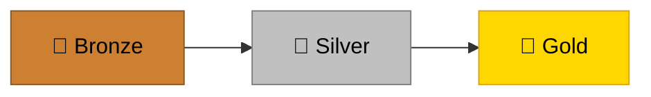
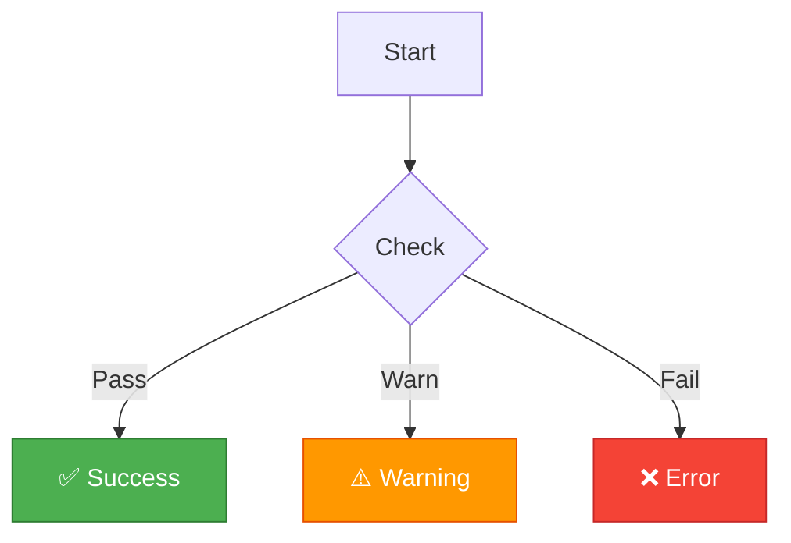
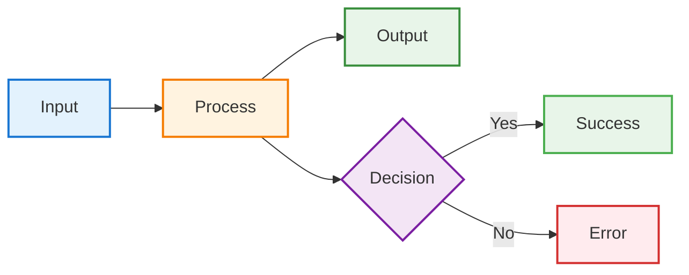
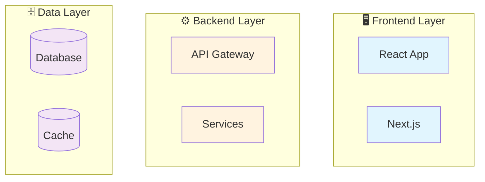
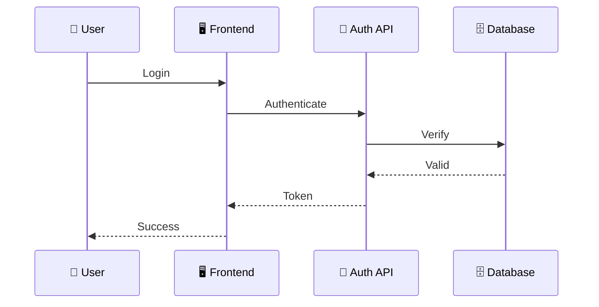
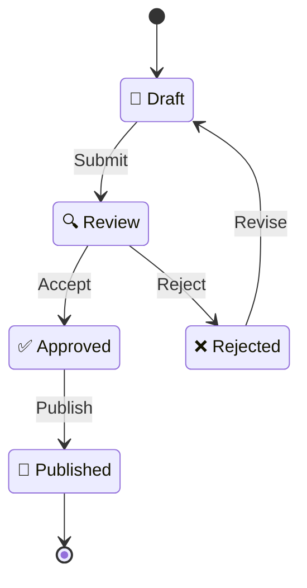
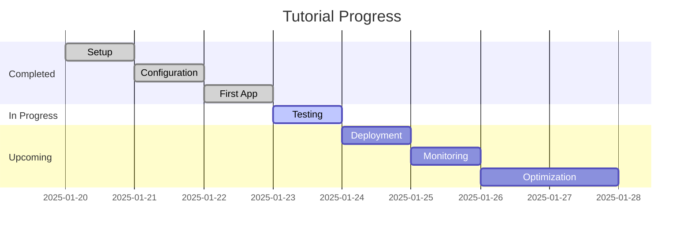

[Home](index.md) > [Docs](./index.md) > Visual Standards

# 🎨 Visual Design Standards

> **Last Updated**: 2025-01-22 | **Version**: 1.0  
> **Status**: ✅ Final | **Maintainer**: Documentation Team

**Quick Reference Guide for Visual Consistency**

This document defines the visual design system for all documentation. Use this as your go-to reference when creating or updating docs to ensure visual consistency across the repository.

---

## 📑 Table of Contents

- [Color Palette](#-color-palette)
- [Icon & Emoji Standards](#-icon--emoji-standards)
- [Badge Standards](#-badge-standards)
- [Callout Box Styles](#-callout-box-styles)
- [Table Formatting](#-table-formatting)
- [Mermaid Diagram Styles](#-mermaid-diagram-styles)
- [Progress Tracker Templates](#-progress-tracker-templates)
- [Quick Reference Card](#-quick-reference-card)

---

## 🎨 Color Palette

### Medallion Colors

Use these for achievement, ranking, or tier systems:

| Color    | Hex Code  | RGB               | Usage                                  | Example                       |
| -------- | --------- | ----------------- | -------------------------------------- | ----------------------------- |
| 🥉 Bronze | `#CD7F32` | `rgb(205,127,50)` | Entry-level, basic tier, third place   | Beginner tutorials            |
| 🥈 Silver | `#C0C0C0` | `rgb(192,192,192)`| Intermediate, standard tier, second    | Intermediate guides           |
| 🥇 Gold   | `#FFD700` | `rgb(255,215,0)`  | Advanced, premium tier, first place    | Advanced topics, best practice|

**Usage Example:**

```markdown
### 🥉 Bronze Level: Getting Started
### 🥈 Silver Level: Core Concepts  
### 🥇 Gold Level: Advanced Patterns
```

**In Mermaid Diagrams:**



### Status Colors

Use these for system states, notifications, and feedback:

| Status      | Hex Code  | RGB               | Usage                          | Icon | When to Use                    |
| ----------- | --------- | ----------------- | ------------------------------ | ---- | ------------------------------ |
| ✅ Success  | `#4CAF50` | `rgb(76,175,80)`  | Completed, passed, confirmed   | ✅ ✓ | Success messages, done items   |
| ℹ️ Info     | `#2196F3` | `rgb(33,150,243)` | Informational, neutral         | ℹ️ 📘 | General notes, documentation   |
| ⚠️ Warning  | `#FF9800` | `rgb(255,152,0)`  | Caution, important notice      | ⚠️ ⚡ | Warnings, important callouts   |
| ❌ Error    | `#F44336` | `rgb(244,67,54)`  | Failed, blocked, critical      | ❌ 🚫 | Errors, critical issues        |
| 🚧 In Progress | `#FFC107` | `rgb(255,193,7)` | Work in progress, pending     | 🚧 ⏳ | Ongoing work, development      |

**Usage in Callouts:**

```markdown
> ✅ **Success**: Your deployment completed successfully!

> ℹ️ **Info**: This feature requires version 2.0 or higher.

> ⚠️ **Warning**: This action cannot be undone.

> ❌ **Error**: Authentication failed. Check your credentials.

> 🚧 **In Progress**: This feature is currently being developed.
```

**In Mermaid Diagrams:**



### Neutral Colors

Use these for backgrounds, borders, and subtle elements:

| Color         | Hex Code  | RGB               | Usage                          |
| ------------- | --------- | ----------------- | ------------------------------ |
| Background    | `#F5F5F5` | `rgb(245,245,245)`| Light backgrounds              |
| Border        | `#E0E0E0` | `rgb(224,224,224)`| Subtle borders, dividers       |
| Text Primary  | `#212121` | `rgb(33,33,33)`   | Primary text content           |
| Text Secondary| `#757575` | `rgb(117,117,117)`| Secondary text, metadata       |

### Semantic Colors (Additional)

| Purpose       | Hex Code  | RGB               | Usage                          |
| ------------- | --------- | ----------------- | ------------------------------ |
| 💙 Primary    | `#1976D2` | `rgb(25,118,210)` | Primary actions, links         |
| 💜 Secondary  | `#7E57C2` | `rgb(126,87,194)` | Secondary actions              |
| 💚 Positive   | `#43A047` | `rgb(67,160,71)`  | Positive trends, growth        |
| ❤️ Negative   | `#E53935` | `rgb(229,57,53)`  | Negative trends, issues        |

---

## 🏷️ Icon & Emoji Standards

### Category Icons

Use these to indicate document or section categories:

| Icon | Category           | Usage                                    |
| ---- | ------------------ | ---------------------------------------- |
| 🎰   | Casino/Gaming      | Casino-related features, game logic      |
| 📊   | Analytics          | Data analysis, reporting, metrics        |
| 🔐   | Security           | Authentication, authorization, encryption|
| ⚙️   | Configuration      | Settings, setup, configuration           |
| 🗄️   | Database           | Data storage, schemas, queries           |
| 🌐   | API/Network        | APIs, endpoints, networking              |
| 🚀   | Getting Started    | Introduction, quickstart guides          |
| 📚   | Documentation      | Docs, references, guides                 |
| 🧪   | Testing            | Unit tests, integration tests, QA        |
| 🐳   | Docker/Containers  | Containerization, orchestration          |
| ☁️   | Cloud              | Cloud services, deployment               |
| 🔧   | Tools/Utilities    | CLI tools, scripts, utilities            |
| 📦   | Packages           | Dependencies, modules, libraries         |
| 🎯   | Goals/Objectives   | Targets, milestones, objectives          |
| 💡   | Tips/Ideas         | Best practices, recommendations          |
| 📈   | Performance        | Optimization, speed, efficiency          |
| 🏗️   | Architecture       | System design, structure                 |

### Status & Action Icons

Use these to indicate state or required actions:

| Icon | Status/Action      | Usage                                    |
| ---- | ------------------ | ---------------------------------------- |
| ✅   | Complete/Success   | Finished items, passed tests             |
| ❌   | Error/Failed       | Failed items, errors, blocked            |
| ⚠️   | Warning/Caution    | Important notices, cautions              |
| 🚧   | In Progress/WIP    | Work in progress, under construction     |
| ⏳   | Pending/Waiting    | Queued items, waiting for action         |
| ⏸️   | Paused             | Temporarily stopped                      |
| 🔄   | Refresh/Sync       | Update operations, synchronization       |
| 🔍   | Search/Review      | Investigation, review needed             |
| ➡️   | Next/Forward       | Next steps, progression                  |
| ⬅️   | Back/Previous      | Previous steps, return                   |
| ⬆️   | Up/Increase        | Scroll up, increase, upgrade             |
| ⬇️   | Down/Decrease      | Scroll down, decrease, downgrade         |
| 🔗   | Link/Reference     | Cross-references, links                  |
| 📌   | Pin/Important      | Pinned items, highlights                 |
| 🎉   | Celebration        | Achievements, completions                |
| 💬   | Comment/Discussion | Comments, discussions, feedback          |

### Navigation Icons

Use these for navigation and wayfinding:

| Icon | Purpose            | Usage                                    |
| ---- | ------------------ | ---------------------------------------- |
| 🏠   | Home               | Main page, root navigation               |
| 📚   | Docs/Library       | Documentation index                      |
| 📖   | Read/Book          | Reading material, guides                 |
| 📝   | Write/Edit         | Editing, note-taking                     |
| 🔝   | Top                | Back to top links                        |
| 🔙   | Back               | Previous page, go back                   |
| ➡️   | Next               | Next page, continue                      |
| 📂   | Folder/Section     | Section navigation                       |
| 🔖   | Bookmark           | Saved items, bookmarks                   |

### Technical Component Icons

Use these to represent technical components:

| Icon | Component          | Usage                                    |
| ---- | ------------------ | ---------------------------------------- |
| 💻   | Client/Frontend    | User interfaces, client apps             |
| ⚙️   | Server/Backend     | Server-side, backend services            |
| 🗄️   | Database           | Data storage systems                     |
| 🌐   | API Gateway        | API management, gateways                 |
| 🔐   | Auth Service       | Authentication services                  |
| 📨   | Message Queue      | Message brokers, queues                  |
| 💾   | Cache/Storage      | Caching layers, storage                  |
| 🤖   | Bot/Automation     | Automated processes, bots                |
| 🔌   | Plugin/Extension   | Extensions, plugins                      |
| 📡   | Webhook/Event      | Webhooks, event triggers                 |

### User & Team Icons

| Icon | Role/Entity        | Usage                                    |
| ---- | ------------------ | ---------------------------------------- |
| 👤   | User               | Single user, user entity                 |
| 👥   | Team/Group         | Multiple users, teams                    |
| 👨‍💼   | Admin              | Administrator, admin role                |
| 👩‍💻   | Developer          | Developer, engineer                      |
| 👨‍🔧   | Operator           | Operator, DevOps                         |
| 🎭   | Role               | Role-based access, personas              |

### Icon Usage Rules

1. **One icon per header** - Don't overuse
2. **Consistency** - Use the same icon for the same concept
3. **Placement** - Always before the text: `🚀 Getting Started`
4. **Spacing** - One space between icon and text
5. **Accessibility** - Icons enhance, don't replace text

**✅ Good:**

```markdown
# 🚀 Getting Started
## 📦 Installation
### Prerequisites
```

**❌ Bad:**

```markdown
# 🚀🎉✨ Getting Started ✨🎉🚀
## 📦💻🔧 Installation 🔧💻📦
### ⚙️🔩 Prerequisites ⚙️🔩
```

---

## 🎖️ Badge Standards

### Shields.io Badge Templates

Use [shields.io](https://shields.io/) for consistent badge styling.

#### Status Badges

```markdown


```

**Rendered:**


#### Difficulty Badges

```markdown


```

**Rendered:**


#### Technology Badges

```markdown


```

**Rendered:**


#### Build & Test Badges

```markdown


```

**Rendered:**


#### Version & License Badges

```markdown


```

**Rendered:**


### Simple Text Badges

For inline status indicators without shields.io:

```markdown
`✅ Complete` `🚧 In Progress` `⏳ Pending` `❌ Blocked` `⏸️ Paused`
```

**Rendered:**

`✅ Complete` `🚧 In Progress` `⏳ Pending` `❌ Blocked` `⏸️ Paused`

### Badge Color Reference

| Color         | Hex Code  | Shields.io Name  | Usage                    |
| ------------- | --------- | ---------------- | ------------------------ |
| Bright Green  | `#4C1`    | `brightgreen`    | Success, passing, active |
| Green         | `#97CA00` | `green`          | Positive, stable         |
| Yellow Green  | `#A4A61D` | `yellowgreen`    | Good, acceptable         |
| Yellow        | `#DFB317` | `yellow`         | Warning, moderate        |
| Orange        | `#FE7D37` | `orange`         | Caution, experimental    |
| Red           | `#E05D44` | `red`            | Error, critical, failing |
| Blue          | `#007EC6` | `blue`           | Info, neutral, version   |
| Light Grey    | `#9F9F9F` | `lightgrey`      | Inactive, disabled       |

---

## 💬 Callout Box Styles

### Callout Types & Templates

#### 💡 Pro Tips

For helpful advice, best practices, and optimizations:

```markdown
> 💡 **Pro Tip**: Use environment variables to manage configuration across different environments.
>
> This keeps sensitive data out of your codebase and makes deployment easier.
```

**Rendered:**

> 💡 **Pro Tip**: Use environment variables to manage configuration across different environments.
>
> This keeps sensitive data out of your codebase and makes deployment easier.

#### ⚠️ Warnings

For important cautions and things to avoid:

```markdown
> ⚠️ **Warning**: Deleting this resource is irreversible!
>
> Make sure you have backups before proceeding. Consider using soft deletes instead.
```

**Rendered:**

> ⚠️ **Warning**: Deleting this resource is irreversible!
>
> Make sure you have backups before proceeding. Consider using soft deletes instead.

#### 📝 Notes

For supplementary information and context:

```markdown
> 📝 **Note**: This feature requires version 2.0 or higher.
>
> Check your current version with `npm list <package-name>`.
```

**Rendered:**

> 📝 **Note**: This feature requires version 2.0 or higher.
>
> Check your current version with `npm list <package-name>`.

#### 📋 Prerequisites

For required steps or knowledge before starting:

```markdown
> 📋 **Prerequisites**: Before starting, ensure you have:
>
> - Node.js 18+ installed
> - Docker Desktop running
> - Git configured with SSH keys
> - Basic knowledge of TypeScript
```

**Rendered:**

> 📋 **Prerequisites**: Before starting, ensure you have:
>
> - Node.js 18+ installed
> - Docker Desktop running
> - Git configured with SSH keys
> - Basic knowledge of TypeScript

#### ❌ Errors & Troubleshooting

For error messages and solutions:

```markdown
> ❌ **Error**: `ECONNREFUSED: Connection refused`
>
> **Cause**: The database server is not running.
>
> **Solution**: Start the database with `docker-compose up -d db`
```

**Rendered:**

> ❌ **Error**: `ECONNREFUSED: Connection refused`
>
> **Cause**: The database server is not running.
>
> **Solution**: Start the database with `docker-compose up -d db`

#### ✅ Success Messages

For confirmations and positive outcomes:

```markdown
> ✅ **Success**: Your application is now running!
>
> Visit http://localhost:3000 to see it in action.
```

**Rendered:**

> ✅ **Success**: Your application is now running!
>
> Visit http://localhost:3000 to see it in action.

#### ℹ️ Information

For general information and neutral notices:

```markdown
> ℹ️ **Info**: Azure Fabric supports multiple authentication methods.
>
> Choose the one that best fits your security requirements.
```

**Rendered:**

> ℹ️ **Info**: Azure Fabric supports multiple authentication methods.
>
> Choose the one that best fits your security requirements.

#### 🚧 Work in Progress

For features under development:

```markdown
> 🚧 **Work in Progress**: Real-time analytics dashboard
>
> Expected completion: Q2 2025. Feedback welcome via GitHub Discussions.
```

**Rendered:**

> 🚧 **Work in Progress**: Real-time analytics dashboard
>
> Expected completion: Q2 2025. Feedback welcome via GitHub Discussions.

#### 🔐 Security Notices

For security-related information:

```markdown
> 🔐 **Security**: Never commit secrets to version control!
>
> Use environment variables, Azure Key Vault, or secrets management tools.
```

**Rendered:**

> 🔐 **Security**: Never commit secrets to version control!
>
> Use environment variables, Azure Key Vault, or secrets management tools.

### Callout Usage Rules

1. **One type per box** - Don't mix multiple callout types
2. **Bold the heading** - Always bold the first word/phrase
3. **Keep it short** - 2-3 sentences maximum
4. **Provide context** - Explain why it matters
5. **Link to details** - Reference deeper docs when needed

---

## 📊 Table Formatting

### Standard Table Styles

#### Feature Comparison Tables

```markdown
| Feature             | Free | Pro | Enterprise |
| ------------------- | :--: | :-: | :--------: |
| Basic API Access    |  ✅  | ✅  |     ✅     |
| Advanced Analytics  |  ❌  | ✅  |     ✅     |
| 24/7 Support        |  ❌  | ❌  |     ✅     |
| Custom Integrations |  ❌  | ❌  |     ✅     |
| SLA Guarantee       |  ❌  | ❌  |     ✅     |
```

**Rendered:**

| Feature             | Free | Pro | Enterprise |
| ------------------- | :--: | :-: | :--------: |
| Basic API Access    |  ✅  | ✅  |     ✅     |
| Advanced Analytics  |  ❌  | ✅  |     ✅     |
| 24/7 Support        |  ❌  | ❌  |     ✅     |
| Custom Integrations |  ❌  | ❌  |     ✅     |
| SLA Guarantee       |  ❌  | ❌  |     ✅     |

#### Status Tables

```markdown
| Component      | Status         | Last Updated | Notes              |
| -------------- | -------------- | ------------ | ------------------ |
| Frontend       | ✅ Complete    | 2025-01-22   | All tests passing  |
| Backend API    | 🚧 In Progress | 2025-01-20   | 75% complete       |
| Database       | ✅ Complete    | 2025-01-18   | Migrated to v2     |
| Documentation  | ⏳ Pending     | -            | Awaiting approval  |
```

**Rendered:**

| Component      | Status         | Last Updated | Notes              |
| -------------- | -------------- | ------------ | ------------------ |
| Frontend       | ✅ Complete    | 2025-01-22   | All tests passing  |
| Backend API    | 🚧 In Progress | 2025-01-20   | 75% complete       |
| Database       | ✅ Complete    | 2025-01-18   | Migrated to v2     |
| Documentation  | ⏳ Pending     | -            | Awaiting approval  |

#### API Reference Tables

```markdown
| Parameter | Type     | Required | Default | Description                    |
| --------- | -------- | :------: | ------- | ------------------------------ |
| `userId`  | `string` |    ✅    | -       | Unique user identifier         |
| `limit`   | `number` |    ❌    | `10`    | Maximum items to return (1-100)|
| `offset`  | `number` |    ❌    | `0`     | Number of items to skip        |
| `sortBy`  | `string` |    ❌    | `date`  | Field to sort by               |
```

**Rendered:**

| Parameter | Type     | Required | Default | Description                    |
| --------- | -------- | :------: | ------- | ------------------------------ |
| `userId`  | `string` |    ✅    | -       | Unique user identifier         |
| `limit`   | `number` |    ❌    | `10`    | Maximum items to return (1-100)|
| `offset`  | `number` |    ❌    | `0`     | Number of items to skip        |
| `sortBy`  | `string` |    ❌    | `date`  | Field to sort by               |

#### Configuration Tables

```markdown
| Option              | Type      | Default   | Description                        |
| ------------------- | --------- | --------- | ---------------------------------- |
| `debug`             | `boolean` | `false`   | Enable debug logging               |
| `timeout`           | `number`  | `30000`   | Request timeout in milliseconds    |
| `retryAttempts`     | `number`  | `3`       | Number of retry attempts           |
| `enableCache`       | `boolean` | `true`    | Enable response caching            |
```

**Rendered:**

| Option              | Type      | Default   | Description                        |
| ------------------- | --------- | --------- | ---------------------------------- |
| `debug`             | `boolean` | `false`   | Enable debug logging               |
| `timeout`           | `number`  | `30000`   | Request timeout in milliseconds    |
| `retryAttempts`     | `number`  | `3`       | Number of retry attempts           |
| `enableCache`       | `boolean` | `true`    | Enable response caching            |

#### Performance Metrics Tables

```markdown
| Metric              | Before    | After     | Improvement |
| ------------------- | --------: | --------: | :---------: |
| Page Load Time      | 3.2s      | 1.1s      |    📈 66%   |
| First Contentful    | 1.8s      | 0.6s      |    📈 67%   |
| Time to Interactive | 4.1s      | 1.5s      |    📈 63%   |
| Bundle Size         | 450 KB    | 180 KB    |    📈 60%   |
```

**Rendered:**

| Metric              | Before    | After     | Improvement |
| ------------------- | --------: | --------: | :---------: |
| Page Load Time      | 3.2s      | 1.1s      |    📈 66%   |
| First Contentful    | 1.8s      | 0.6s      |    📈 67%   |
| Time to Interactive | 4.1s      | 1.5s      |    📈 63%   |
| Bundle Size         | 450 KB    | 180 KB    |    📈 60%   |

### Table Alignment Rules

```markdown
| Left Aligned | Center Aligned | Right Aligned |
| :----------- | :------------: | ------------: |
| Text         |      Text      |          Text |
| Use for text | Use for icons  | Use for numbers |
```

**Guidelines:**

- **Left align**: Text content, descriptions
- **Center align**: Icons, status indicators, boolean values
- **Right align**: Numbers, metrics, dates

---

## 🖼️ Mermaid Diagram Styles

### Color Schemes for Different Diagram Types

#### Flowchart Colors

**Soft Pastels** (recommended for most flows):



**Template:**

```markdown
style NodeA fill:#e3f2fd,stroke:#1976d2,stroke-width:2px
style NodeB fill:#fff3e0,stroke:#f57c00,stroke-width:2px
style NodeC fill:#e8f5e9,stroke:#388e3c,stroke-width:2px
```

#### Process Flow Colors

| Node Type    | Fill Color | Stroke Color | Usage              |
| ------------ | ---------- | ------------ | ------------------ |
| Input/Start  | `#e3f2fd`  | `#1976d2`    | Entry points       |
| Process      | `#fff3e0`  | `#f57c00`    | Processing steps   |
| Decision     | `#f3e5f5`  | `#7b1fa2`    | Conditional logic  |
| Success/Done | `#e8f5e9`  | `#4caf50`    | Successful outcome |
| Error/Fail   | `#ffebee`  | `#d32f2f`    | Error states       |
| Output/End   | `#e0f7fa`  | `#0097a7`    | Exit points        |

#### Architecture Diagram Colors

**By Layer:**



**Template:**

```markdown
style Frontend fill:#e1f5fe
style Backend fill:#fff3e0
style Data fill:#f3e5f5
```

#### Sequence Diagram Participant Colors



**Color Guidelines:**

- Use emojis for visual differentiation
- Keep participant names short (3-8 chars)
- Use consistent icons across diagrams

#### State Diagram Colors



### Diagram Style Templates

#### Minimal Clean Style

```markdown
style NodeName fill:#f9f9f9,stroke:#333,stroke-width:1px
```

#### Bold Highlight Style

```markdown
style NodeName fill:#ffd700,stroke:#ff6b6b,stroke-width:3px,color:#000
```

#### Subtle Style

```markdown
style NodeName fill:#fff,stroke:#ddd,stroke-width:1px,stroke-dasharray: 5 5
```

### Mermaid Best Practices

1. **Use icons** - Add emojis to participant names and nodes
2. **Color code** - Use consistent colors for similar elements
3. **Keep it simple** - Max 10-15 nodes per diagram
4. **Label clearly** - Short, descriptive labels
5. **Group related** - Use subgraphs for organization
6. **Direction matters** - Choose LR (left-right) or TD (top-down) based on content

---

## 📈 Progress Tracker Templates

### Tutorial Progress Bar

#### Simple Text Progress

```markdown
**Tutorial Progress:** 3 of 7 steps complete

`✅ Setup` → `✅ Configuration` → `✅ First App` → `⏳ Testing` → `⏳ Deployment` → `⏳ Monitoring` → `⏳ Optimization`
```

**Rendered:**

**Tutorial Progress:** 3 of 7 steps complete

`✅ Setup` → `✅ Configuration` → `✅ First App` → `⏳ Testing` → `⏳ Deployment` → `⏳ Monitoring` → `⏳ Optimization`

#### Table-Based Progress

```markdown
| Step | Title              | Status         | Duration |
| :--: | ------------------ | -------------- | -------: |
|  1   | 🚀 Setup           | ✅ Complete    |    5 min |
|  2   | ⚙️ Configuration   | ✅ Complete    |   10 min |
|  3   | 💻 First App       | ✅ Complete    |   15 min |
|  4   | 🧪 Testing         | 🚧 Current     |   20 min |
|  5   | 🚀 Deployment      | ⏳ Not Started |   15 min |
|  6   | 📊 Monitoring      | ⏳ Not Started |   10 min |
|  7   | ⚡ Optimization    | ⏳ Not Started |   25 min |
```

**Rendered:**

| Step | Title              | Status         | Duration |
| :--: | ------------------ | -------------- | -------: |
|  1   | 🚀 Setup           | ✅ Complete    |    5 min |
|  2   | ⚙️ Configuration   | ✅ Complete    |   10 min |
|  3   | 💻 First App       | ✅ Complete    |   15 min |
|  4   | 🧪 Testing         | 🚧 Current     |   20 min |
|  5   | 🚀 Deployment      | ⏳ Not Started |   15 min |
|  6   | 📊 Monitoring      | ⏳ Not Started |   10 min |
|  7   | ⚡ Optimization    | ⏳ Not Started |   25 min |

#### Visual Progress Bar

```markdown
**Progress:** 45% Complete

```
[████████████████░░░░░░░░░░░░░░░░] 45%
```

or using HTML:

```html
<div style="background: #e0e0e0; border-radius: 10px; padding: 3px;">
  <div style="background: linear-gradient(90deg, #4caf50, #8bc34a); width: 45%; padding: 8px; border-radius: 8px; text-align: center; color: white; font-weight: bold;">
    45%
  </div>
</div>
```
```

#### Checklist Progress

```markdown
### 📋 Setup Checklist

- [x] Install Node.js 18+
- [x] Install Docker Desktop
- [x] Clone repository
- [x] Configure environment variables
- [ ] Run database migrations
- [ ] Start development server
- [ ] Verify installation

**Progress:** 4 of 7 complete (57%)
```

**Rendered:**

### 📋 Setup Checklist

- [x] Install Node.js 18+
- [x] Install Docker Desktop
- [x] Clone repository
- [x] Configure environment variables
- [ ] Run database migrations
- [ ] Start development server
- [ ] Verify installation

**Progress:** 4 of 7 complete (57%)

#### Milestone Timeline

```markdown

```

**Rendered:**


#### Feature Completion Matrix

```markdown
| Module          | Design | Development | Testing | Documentation |
| --------------- | :----: | :---------: | :-----: | :-----------: |
| Authentication  |   ✅   |     ✅      |   ✅    |      ✅       |
| User Dashboard  |   ✅   |     ✅      |   ✅    |      🚧       |
| API Integration |   ✅   |     🚧      |   ⏳    |      ⏳       |
| Admin Panel     |   ✅   |     ⏳      |   ⏳    |      ⏳       |
| Analytics       |   🚧   |     ⏳      |   ⏳    |      ⏳       |

**Legend:** ✅ Complete | 🚧 In Progress | ⏳ Not Started
```

**Rendered:**

| Module          | Design | Development | Testing | Documentation |
| --------------- | :----: | :---------: | :-----: | :-----------: |
| Authentication  |   ✅   |     ✅      |   ✅    |      ✅       |
| User Dashboard  |   ✅   |     ✅      |   ✅    |      🚧       |
| API Integration |   ✅   |     🚧      |   ⏳    |      ⏳       |
| Admin Panel     |   ✅   |     ⏳      |   ⏳    |      ⏳       |
| Analytics       |   🚧   |     ⏳      |   ⏳    |      ⏳       |

**Legend:** ✅ Complete | 🚧 In Progress | ⏳ Not Started

---

## 📌 Quick Reference Card

### Color Quick Pick

| Need                  | Hex Code  | Name       |
| --------------------- | --------- | ---------- |
| Success/Complete      | `#4CAF50` | Green      |
| Warning/Caution       | `#FF9800` | Orange     |
| Error/Critical        | `#F44336` | Red        |
| Info/Neutral          | `#2196F3` | Blue       |
| In Progress           | `#FFC107` | Amber      |
| Bronze Tier           | `#CD7F32` | Bronze     |
| Silver Tier           | `#C0C0C0` | Silver     |
| Gold Tier             | `#FFD700` | Gold       |

### Icon Quick Pick

| Need              | Icon | Need              | Icon |
| ----------------- | ---- | ----------------- | ---- |
| Complete          | ✅   | Error             | ❌   |
| In Progress       | 🚧   | Pending           | ⏳   |
| Warning           | ⚠️   | Info              | ℹ️   |
| Success           | ✅   | Tip               | 💡   |
| Security          | 🔐   | Configuration     | ⚙️   |
| Database          | 🗄️   | API               | 🌐   |
| Documentation     | 📚   | Getting Started   | 🚀   |
| Testing           | 🧪   | Tools             | 🔧   |

### Callout Quick Templates

```markdown
> 💡 **Pro Tip**: [Your advice here]

> ⚠️ **Warning**: [Important caution]

> 📝 **Note**: [Supplementary info]

> ❌ **Error**: [Error description]
> **Solution**: [How to fix]

> ✅ **Success**: [Confirmation message]
```

### Badge Quick Templates

```markdown


```

### Table Alignment Quick Reference

```markdown
| Left    | Center  | Right   |
| :------ | :-----: | ------: |
| Text    | Icons   | Numbers |
```

---

## 🔗 Related Documents

| Document                            | Description                               |
| ----------------------------------- | ----------------------------------------- |
| [Style Guide](./STYLE_GUIDE.md)     | Complete documentation style guide        |
| [Contributing](../CONTRIBUTING.md)  | How to contribute to this project         |
| [README](index.md)              | Project overview and quick start          |

---

[⬆️ Back to Top](#-visual-design-standards) | [📚 Docs](./index.md) | [🏠 Home](index.md)
