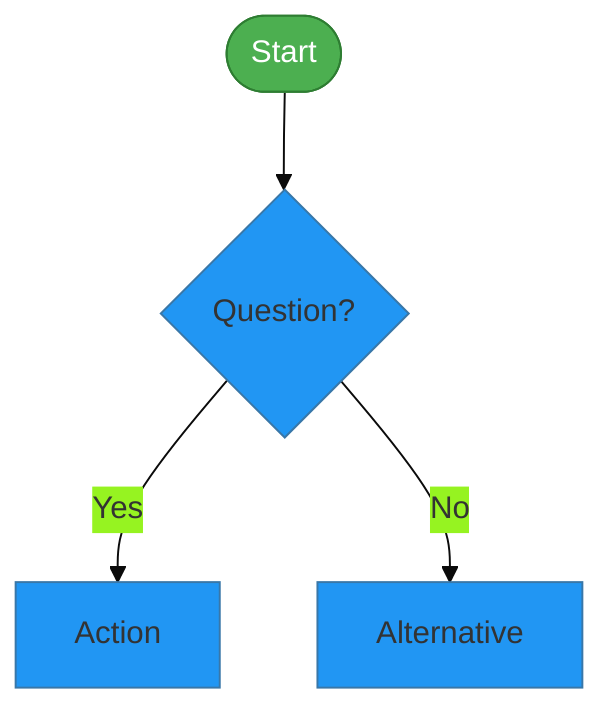
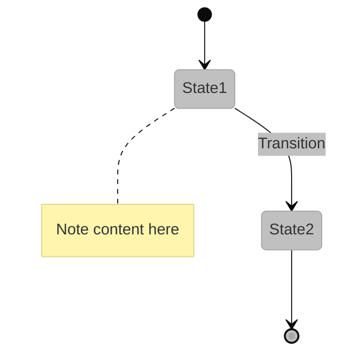

# 📊 Mermaid Diagrams Added to DEPLOYMENT.md

## Summary of Changes

Three professional Mermaid diagrams have been added to `docs/DEPLOYMENT.md` to enhance the deployment documentation with visual guides.

---

## 📍 Diagram Locations

### 1. **Deployment Decision Flowchart**
- **Location:** Visual Overview section (after Table of Contents)
- **Line:** ~33-88
- **Purpose:** Guides users through the deployment process from prerequisites check through deployment options to verification
- **Type:** `flowchart TD` (Top-Down)

### 2. **Deployment State Diagram**
- **Location:** Visual Overview section (after flowchart)
- **Line:** ~90-145
- **Purpose:** Shows deployment lifecycle states and transitions
- **Type:** `stateDiagram-v2`

### 3. **Azure Deployment Sequence Diagram**
- **Location:** GitHub Actions Deployment section
- **Line:** ~395-475
- **Purpose:** Illustrates the Azure deployment process interactions between user, Azure CLI, and Azure services
- **Type:** `sequenceDiagram`

---

## 🎨 Color Scheme Used

All diagrams use the repository's official color palette:

| Color | Hex Code | Usage |
|-------|----------|-------|
| **Bronze** | `#CD7F32` | Deployment actions, signals |
| **Silver** | `#C0C0C0` | State backgrounds, labels |
| **Gold** | `#FFD700` | Success states, completion, notes |
| **Success** | `#4CAF50` | Start states, successful transitions |
| **Info** | `#2196F3` | Decision points, primary actions |
| **Warning** | `#ff9800` | Troubleshooting, error states |

---

## 🎯 Diagram Features

### Flowchart Highlights
- ✅ Comprehensive decision tree covering all deployment methods
- ✅ Clear prerequisite validation flow
- ✅ Multiple deployment paths (Quick Start, Docker, Scripts, GitHub Actions)
- ✅ Validation and verification loops
- ✅ Troubleshooting integration
- ✅ Custom styling with color-coded nodes

### State Diagram Highlights
- ✅ Complete deployment lifecycle
- ✅ Error handling and rollback states
- ✅ Post-configuration and verification phases
- ✅ Detailed notes for key states
- ✅ Clear transition paths

### Sequence Diagram Highlights
- ✅ Step-by-step Azure deployment process
- ✅ Parallel resource provisioning visualization
- ✅ Four deployment phases clearly marked
- ✅ Auto-numbered steps for easy reference
- ✅ Comprehensive service interactions

---

## 🖥️ Rendering the Diagrams

### GitHub/GitLab
Mermaid diagrams render automatically in:
- GitHub README and markdown files
- GitLab documentation
- GitHub Pages

### VS Code
Install the **Mermaid Preview** extension:
```bash
code --install-extension bierner.markdown-mermaid
```

Then open `DEPLOYMENT.md` and use the preview pane (Ctrl+Shift+V).

### Browser Extensions
- [Mermaid Diagrams](https://chrome.google.com/webstore/detail/mermaid-diagrams) for Chrome
- [Markdown Preview Mermaid Support](https://addons.mozilla.org/en-US/firefox/addon/markdown-viewer-webext/) for Firefox

### Online Editors
Test and edit diagrams at:
- [Mermaid Live Editor](https://mermaid.live/)
- [Mermaid Chart](https://www.mermaidchart.com/)

### Documentation Sites
Compatible with:
- Docusaurus
- MkDocs (with plugin)
- Jekyll (with plugin)
- Hugo (with shortcode)

---

## 🔍 Testing Recommendations

1. **GitHub Preview:** Push changes and view on GitHub to see rendered diagrams
2. **VS Code:** Use Markdown Preview to verify locally
3. **Mermaid Live:** Copy diagram code to test specific styling
4. **Different Devices:** Check rendering on mobile/tablet views

---

## 🛠️ Customization Guide

### Changing Colors

Edit the `init` configuration at the top of each diagram:

```javascript
%%{init: {'theme':'base', 'themeVariables': { 
  'primaryColor':'#2196F3',
  'secondaryColor':'#4CAF50',
  // ... other colors
}}}%%
```

### Adding/Removing Nodes

**Flowchart:**
```mermaid
NewNode[Description] --> ExistingNode
```

**State Diagram:**
```mermaid
NewState --> ExistingState: Transition Label
```

**Sequence Diagram:**
```mermaid
Actor->>Service: Action
Service-->>Actor: Response
```

### Styling Individual Elements

Use inline styles in flowcharts:
```mermaid
style NodeID fill:#color,stroke:#bordercolor,color:#textcolor
```

---

## 📋 Diagram Code Snippets

### Flowchart Template


### State Diagram Template


### Sequence Diagram Template
```mermaid
%%{init: {'theme':'base', 'themeVariables': { 'actorBkg':'#2196F3'}}}%%
sequenceDiagram
    autonumber
    Actor->>Service: Request
    Service-->>Actor: Response
    
    Note over Actor,Service: Important note
```

---

## 📖 Mermaid Syntax Reference

### Common Elements

| Element | Flowchart | State | Sequence |
|---------|-----------|-------|----------|
| **Node/State** | `Node[Text]` | `State1` | `participant Name` |
| **Decision** | `Decision{Text?}` | N/A | N/A |
| **Link** | `-->` | `-->` | `->>` (solid), `-->>` (dashed) |
| **Label** | `-->|Label|` | `--> State: Label` | Message text |
| **Note** | N/A | `note right of State` | `Note over Actor` |
| **Styling** | `style ID` | Theme variables | Theme variables |

### Arrow Types

```mermaid
A --> B    # Solid arrow
A -.-> B   # Dotted arrow
A ==> B    # Thick arrow
A ->>  B   # Sequence message
A -->> B   # Sequence response
```

---

## 🚀 Next Steps

1. ✅ Review diagrams in GitHub preview
2. ✅ Test rendering in VS Code
3. ✅ Share with team for feedback
4. ✅ Consider adding more diagrams to other docs:
   - Architecture diagrams in `ARCHITECTURE.md`
   - Security flow in `SECURITY.md`
   - Data pipeline in tutorial files

---

## 📚 Additional Resources

- [Mermaid Documentation](https://mermaid.js.org/)
- [Mermaid Cheat Sheet](https://jojozhuang.github.io/tutorial/mermaid-cheat-sheet/)
- [GitHub Mermaid Support](https://github.blog/2022-02-14-include-diagrams-markdown-files-mermaid/)
- [Mermaid Theme Builder](https://mermaid.js.org/config/theming.html)

---

**Created:** 2025-01-21  
**Documentation maintained by:** Microsoft Fabric POC Team  
**Repository:** [Suppercharge_Microsoft_Fabric](https://github.com/fgarofalo56/Suppercharge_Microsoft_Fabric)
