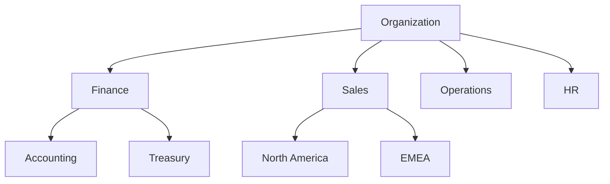
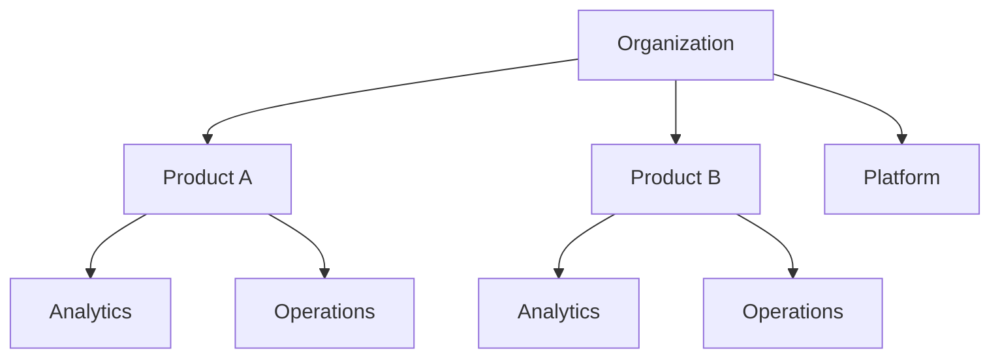

# Workspaces & Naming Conventions

> **Best Practices > Workspaces & Naming Conventions**

---

## Overview

Proper workspace organization and consistent naming conventions are foundational to a successful Microsoft Fabric implementation. This guide covers workspace design patterns, domain organization, and naming standards.

---

## Workspace Organization Patterns

### Pattern 1: Environment-Based Separation

**Recommended for:** Most organizations

```
ws-{project}-dev      Development workspace
ws-{project}-test     Testing/UAT workspace
ws-{project}-prod     Production workspace
```

**Benefits:**
- Clear separation of environments
- Independent capacity assignment
- Simplified permissions management
- Supports CI/CD workflows

### Pattern 2: Medallion Layer Separation

**Recommended for:** Large data engineering teams

```
ws-{project}-bronze   Raw data ingestion
ws-{project}-silver   Cleansed/validated data
ws-{project}-gold     Business-ready data
```

**Benefits:**
- Layer-specific permissions
- Independent scaling per layer
- Clear data lineage

### Pattern 3: Domain-Based Organization

**Recommended for:** Enterprise organizations with data mesh

```
domain-finance/
  ws-finance-reporting
  ws-finance-operations

domain-marketing/
  ws-marketing-analytics
  ws-marketing-campaigns
```

**Benefits:**
- Supports federated governance
- Domain teams own their data
- Aligns with organizational structure

---

## Workspace Configuration Checklist

### Essential Settings

| Setting | Recommendation | Reason |
|---------|----------------|--------|
| License Mode | Premium/Fabric Capacity | Enables full Fabric features |
| Contact List | Add team leads | Notification management |
| Git Integration | Enable for Dev/Test | Version control |
| Spark Settings | Configure defaults | Consistent execution |

### Capacity Assignment

```
Production Workspaces  -> Dedicated capacity (F64+)
Development Workspaces -> Shared capacity or smaller SKU (F4-F16)
POC/Sandbox           -> Trial or shared capacity
```

---

## Domain Organization

### Planning Domains

**Involve these roles:**
1. Center of Excellence (CoE)
2. Business and technical architects
3. Data owners and stewards
4. Security and compliance officers

**Key Questions:**
1. Who is responsible for the data?
2. What is the best structure for your data?
3. Do you need subdomains for additional hierarchy?

### Common Domain Structures

#### Functional Structure



#### Product/Project Structure



---

## Naming Conventions

### General Principles

1. **Consistent** - Use the same pattern across all items
2. **Descriptive** - Names should indicate purpose
3. **Lowercase** - Use lowercase with delimiters
4. **No Spaces** - Use hyphens or underscores
5. **Length** - Keep names concise but meaningful

### Workspace Naming

```
Pattern: {prefix}-{domain/project}-{environment}

Examples:
  ws-casino-analytics-dev
  ws-casino-analytics-prod
  ws-finance-reporting-test
```

### Fabric Item Naming

#### Lakehouses

```
Pattern: lh_{layer}_{domain}

Examples:
  lh_bronze_casino
  lh_silver_casino
  lh_gold_casino
```

#### Warehouses

```
Pattern: wh_{domain}_{purpose}

Examples:
  wh_casino_analytics
  wh_casino_compliance
  wh_finance_reporting
```

#### Pipelines

```
Pattern: pl_{source/domain}_{action}_{target}

Examples:
  pl_bronze_ingest_slot_telemetry
  pl_silver_transform_player_profiles
  pl_gold_aggregate_daily_kpis
  pl_oracle_extract_full_load
  pl_sqlserver_cdc_incremental
```

#### Notebooks

```
Pattern: nb_{layer}_{sequence}_{description}

Examples:
  nb_bronze_01_ingest_slot_telemetry
  nb_silver_02_cleanse_player_data
  nb_gold_03_build_kpi_tables
  nb_ml_01_churn_prediction
```

#### Dataflows

```
Pattern: df_{source}_{action}_{target}

Examples:
  df_sqlserver_transform_customers
  df_sharepoint_load_reference_data
  df_api_enrich_player_profiles
```

#### Semantic Models

```
Pattern: sm_{domain}_{purpose}

Examples:
  sm_casino_analytics
  sm_casino_executive_dashboard
  sm_compliance_reporting
```

#### Reports

```
Pattern: rpt_{domain}_{report_name}

Examples:
  rpt_casino_floor_performance
  rpt_casino_daily_revenue
  rpt_compliance_ctr_monitor
```

### Table Naming (Lakehouse/Warehouse)

#### Bronze Layer

```
Pattern: bronze_{source}_{entity}

Examples:
  bronze_sms_slot_events
  bronze_cms_player_profiles
  bronze_pos_transactions
```

#### Silver Layer

```
Pattern: silver_{entity}

Examples:
  silver_slot_telemetry
  silver_player_profiles
  silver_financial_transactions
```

#### Gold Layer

```
Pattern: {fact/dim}_{entity}

Examples:
  fact_daily_slot_performance
  fact_player_sessions
  dim_machine
  dim_player
  dim_date
  dim_casino
```

---

## Workspace Roles and Permissions

### Role Matrix

| Role | Create Content | Edit Content | View Content | Share Content | Manage Workspace |
|------|---------------|--------------|--------------|---------------|-----------------|
| Admin | Yes | Yes | Yes | Yes | Yes |
| Member | Yes | Yes | Yes | Yes | No |
| Contributor | Yes | Yes | Yes | No | No |
| Viewer | No | No | Yes | No | No |

### Recommended Role Assignments

| Team | Dev Workspace | Test Workspace | Prod Workspace |
|------|--------------|----------------|----------------|
| Data Engineers | Member | Member | Contributor |
| Data Analysts | Contributor | Viewer | Viewer |
| Business Users | - | Viewer | Viewer |
| Admins | Admin | Admin | Admin |

---

## Git Integration Best Practices

### Repository Structure

```
fabric-project/
├── .github/
│   └── workflows/
│       └── fabric-ci-cd.yml
├── workspaces/
│   ├── dev/
│   │   ├── lh_bronze_casino/
│   │   ├── lh_silver_casino/
│   │   └── pipelines/
│   ├── test/
│   └── prod/
├── shared/
│   ├── notebooks/
│   └── dataflows/
└── README.md
```

### Branch Strategy

```
main          -> Production workspace
develop       -> Development workspace
feature/*     -> Developer workspaces
release/*     -> Test/UAT workspace
```

---

## Anti-Patterns to Avoid

| Anti-Pattern | Problem | Better Approach |
|--------------|---------|-----------------|
| Single workspace for all | Permissions chaos, no isolation | Separate by environment/domain |
| Inconsistent naming | Hard to find items, confusion | Enforce naming standards |
| No capacity planning | Throttling, poor performance | Assign appropriate capacity |
| Everyone as Admin | Security risk | Use least-privilege roles |
| No Git integration | No version control, risky changes | Enable Git for Dev/Test |

---

## Implementation Checklist

### Initial Setup
- [ ] Define workspace naming convention
- [ ] Create workspace hierarchy document
- [ ] Establish domain structure
- [ ] Document capacity allocation plan
- [ ] Create role assignment matrix

### Per Workspace
- [ ] Apply naming convention
- [ ] Assign to correct capacity
- [ ] Configure contact list
- [ ] Set up Git integration (Dev/Test)
- [ ] Assign workspace roles
- [ ] Create folder structure
- [ ] Document in governance catalog

---

## Sample Workspace Setup Script

```powershell
# Using Fabric REST API via PowerShell

# Variables
$tenantId = "your-tenant-id"
$clientId = "your-client-id"
$clientSecret = "your-client-secret"
$capacityId = "your-capacity-id"

# Get access token
$tokenBody = @{
    grant_type    = "client_credentials"
    client_id     = $clientId
    client_secret = $clientSecret
    resource      = "https://api.fabric.microsoft.com"
}
$tokenResponse = Invoke-RestMethod -Uri "https://login.microsoftonline.com/$tenantId/oauth2/token" -Method POST -Body $tokenBody
$accessToken = $tokenResponse.access_token

# Create workspace
$headers = @{
    "Authorization" = "Bearer $accessToken"
    "Content-Type"  = "application/json"
}

$workspaceBody = @{
    displayName = "ws-casino-analytics-dev"
    description = "Casino Analytics Development Workspace"
    capacityId  = $capacityId
} | ConvertTo-Json

$workspace = Invoke-RestMethod -Uri "https://api.fabric.microsoft.com/v1/workspaces" `
    -Method POST -Headers $headers -Body $workspaceBody

Write-Host "Created workspace: $($workspace.id)"
```

---

[Back to Best Practices Index](./README.md)
