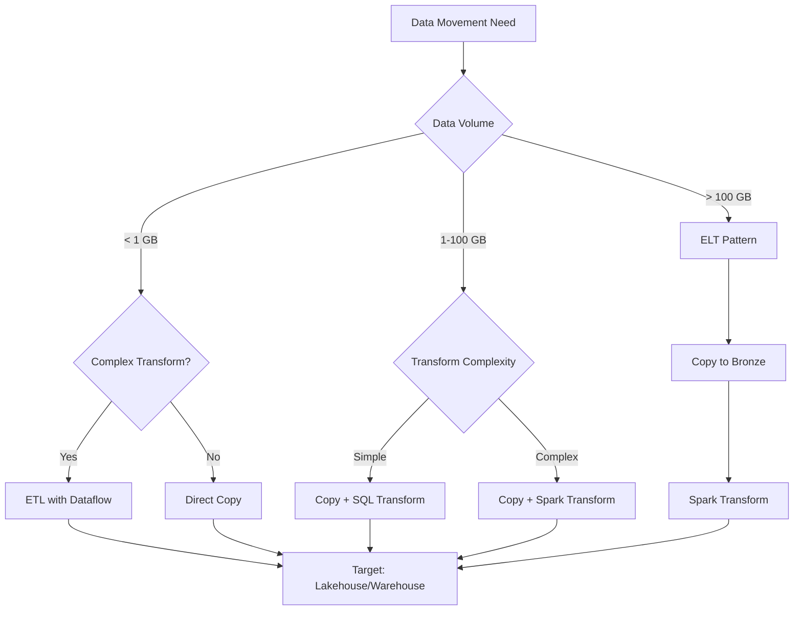
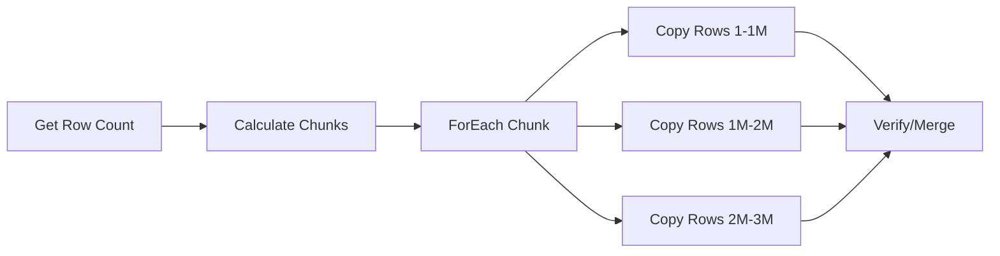
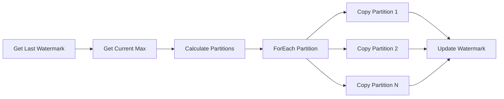

# Pipelines & Data Movement

> **Best Practices > Pipelines & Data Movement**

---

## Overview

This guide covers best practices for data movement in Microsoft Fabric, including ETL vs ELT patterns, copy activity optimization, and different load strategies (full, incremental, CDC).

---

## ETL vs ELT Decision Framework

### Comparison

| Aspect | ETL (Extract-Transform-Load) | ELT (Extract-Load-Transform) |
|--------|------------------------------|------------------------------|
| Transform Location | Source/staging | Destination (Lakehouse/Warehouse) |
| Best For | Complex pre-processing | Large volumes, Spark transforms |
| Tools | Dataflows, gateway | Pipelines + Spark/SQL |
| Performance | Gateway limited | Scales with capacity |
| Complexity | Moderate | Lower initial, higher transform |

### Decision Tree



### Recommended Pattern: ELT for Fabric

**For most Fabric workloads, ELT is preferred:**

```
1. EXTRACT: Copy raw data to Bronze lakehouse
2. LOAD: Land in Delta format
3. TRANSFORM: Use Spark notebooks or Warehouse SQL
```

**Benefits:**
- Leverages Fabric compute scaling
- Reduces gateway load
- Enables data replay from Bronze
- Supports incremental processing

---

## Copy Activity Optimization

### Parallel Copy Configuration

```json
{
  "name": "OptimizedCopyActivity",
  "type": "Copy",
  "typeProperties": {
    "source": {
      "type": "SqlServerSource",
      "partitionOption": "DynamicRange",
      "partitionSettings": {
        "partitionColumnName": "ModifiedDate",
        "partitionUpperBound": "2024-12-31",
        "partitionLowerBound": "2024-01-01"
      }
    },
    "sink": {
      "type": "LakehouseTableSink"
    },
    "parallelCopies": 16,
    "dataIntegrationUnits": 32
  }
}
```

### Partition Options

| Partition Type | Use Case | Configuration |
|----------------|----------|---------------|
| **Physical Partitions** | Table has partitions | Auto-detected |
| **Dynamic Range** | Integer/DateTime column | Specify column, bounds |
| **None** | Small tables | Default behavior |

### Parallel Copy Settings

| Setting | Default | Recommendation |
|---------|---------|----------------|
| Parallel Copies | Auto | 4-32 based on source |
| Data Integration Units | Auto | 4-256 based on volume |
| Degree of Copy Parallelism | Auto | Match partition count |

### Performance by Scenario

| Source | Destination | Partition | Parallelism | Expected Throughput |
|--------|-------------|-----------|-------------|---------------------|
| SQL Server | Lakehouse | None | Auto | ~100 MB/min |
| SQL Server | Lakehouse | Dynamic | 16 | ~500 MB/min |
| SQL Server | Lakehouse | Logical* | 50 | ~2 GB/min |
| Oracle | Lakehouse | Physical | Auto | ~300 MB/min |
| Oracle | Lakehouse | Dynamic | 16 | ~800 MB/min |

*Logical partitioning uses ForEach with date ranges

---

## Load Patterns

### 1. Full Load (Truncate and Load)

**Use Case:** Small-medium tables, reference data, complete refresh needed

```json
{
  "name": "FullLoadPipeline",
  "activities": [
    {
      "name": "TruncateTarget",
      "type": "Script",
      "typeProperties": {
        "scripts": [{
          "text": "TRUNCATE TABLE target_table"
        }]
      }
    },
    {
      "name": "CopyFullData",
      "type": "Copy",
      "dependsOn": [{"activity": "TruncateTarget"}],
      "typeProperties": {
        "source": {"type": "SqlServerSource"},
        "sink": {"type": "LakehouseTableSink"}
      }
    }
  ]
}
```

### 2. Incremental Load (Watermark-Based)

**Use Case:** Large tables with timestamp/ID column for tracking

```json
{
  "name": "IncrementalLoadPipeline",
  "activities": [
    {
      "name": "LookupLastWatermark",
      "type": "Lookup",
      "typeProperties": {
        "source": {
          "type": "LakehouseSource",
          "query": "SELECT MAX(watermark_value) as last_watermark FROM watermark_table WHERE table_name = 'source_table'"
        }
      }
    },
    {
      "name": "LookupCurrentWatermark",
      "type": "Lookup",
      "typeProperties": {
        "source": {
          "type": "SqlServerSource",
          "query": "SELECT MAX(ModifiedDate) as current_watermark FROM source_table"
        }
      }
    },
    {
      "name": "CopyIncrementalData",
      "type": "Copy",
      "dependsOn": [
        {"activity": "LookupLastWatermark"},
        {"activity": "LookupCurrentWatermark"}
      ],
      "typeProperties": {
        "source": {
          "type": "SqlServerSource",
          "query": {
            "value": "SELECT * FROM source_table WHERE ModifiedDate > '@{activity('LookupLastWatermark').output.firstRow.last_watermark}' AND ModifiedDate <= '@{activity('LookupCurrentWatermark').output.firstRow.current_watermark}'",
            "type": "Expression"
          }
        },
        "sink": {
          "type": "LakehouseTableSink",
          "tableOption": "autoCreate"
        }
      }
    },
    {
      "name": "UpdateWatermark",
      "type": "Script",
      "dependsOn": [{"activity": "CopyIncrementalData"}],
      "typeProperties": {
        "scripts": [{
          "text": {
            "value": "UPDATE watermark_table SET watermark_value = '@{activity('LookupCurrentWatermark').output.firstRow.current_watermark}' WHERE table_name = 'source_table'",
            "type": "Expression"
          }
        }]
      }
    }
  ]
}
```

### 3. Change Data Capture (CDC)

**Use Case:** Real-time or near-real-time sync, captures inserts, updates, deletes

#### Enable CDC on SQL Server Source

```sql
-- Enable CDC at database level
EXEC sys.sp_cdc_enable_db;

-- Enable CDC on specific table
EXEC sys.sp_cdc_enable_table
    @source_schema = N'dbo',
    @source_name = N'slot_telemetry',
    @role_name = N'cdc_admin',
    @supports_net_changes = 1;
```

#### Copy Job with CDC (Recommended)

```
Copy Job Configuration:
├── Source: SQL Server (CDC enabled)
├── Mode: Incremental copy
├── Update Method: Merge
├── Key Columns: Auto-detected from PK
└── Schedule: Every 15 minutes
```

**Benefits of Copy Job CDC:**
- Zero manual intervention
- Automatic insert/update/delete handling
- Initial full load + subsequent incremental
- Built-in checkpointing

### 4. Delta Load with Merge

**Use Case:** Upsert pattern - insert new, update existing

```python
# PySpark MERGE pattern in notebook
from delta.tables import DeltaTable

# Read incremental data
df_incremental = spark.read.format("delta").load("/bronze/slot_telemetry_incremental")

# Get target Delta table
delta_table = DeltaTable.forPath(spark, "/silver/slot_telemetry")

# Perform MERGE
delta_table.alias("target").merge(
    df_incremental.alias("source"),
    "target.event_id = source.event_id"
).whenMatchedUpdate(
    set={
        "event_timestamp": "source.event_timestamp",
        "bet_amount": "source.bet_amount",
        "win_amount": "source.win_amount",
        "_updated_at": "current_timestamp()"
    }
).whenNotMatchedInsert(
    values={
        "event_id": "source.event_id",
        "machine_id": "source.machine_id",
        "player_id": "source.player_id",
        "event_timestamp": "source.event_timestamp",
        "bet_amount": "source.bet_amount",
        "win_amount": "source.win_amount",
        "_inserted_at": "current_timestamp()",
        "_updated_at": "current_timestamp()"
    }
).execute()
```

---

## Pipeline Performance Optimization

### ForEach Parallel Execution

**Use ForEach for parallel table processing:**

```json
{
  "name": "ParallelTableLoad",
  "type": "ForEach",
  "typeProperties": {
    "isSequential": false,
    "batchCount": 20,
    "items": "@pipeline().parameters.tableList",
    "activities": [
      {
        "name": "CopyTable",
        "type": "Copy",
        "typeProperties": {
          "source": {
            "type": "SqlServerSource",
            "query": "@concat('SELECT * FROM ', item().schemaName, '.', item().tableName)"
          }
        }
      }
    ]
  }
}
```

**ForEach Settings:**
| Setting | Max Value | Recommendation |
|---------|-----------|----------------|
| batchCount | 50 | 10-20 for gateway, 30-50 for cloud |
| isSequential | false | Always false for parallelism |

### Logical Partitioning Design

**For very large tables (100GB+), use logical partitioning:**

```
Pipeline Structure:
├── Set Variables (date ranges)
├── ForEach (date buckets, batchCount=50)
│   └── Copy Activity (filtered by date range)
└── Verify Completion
```

**Date Range Generation:**

```json
{
  "name": "GenerateDateRanges",
  "type": "SetVariable",
  "typeProperties": {
    "variableName": "dateRanges",
    "value": {
      "value": "@range(0, div(sub(ticks(pipeline().parameters.endDate), ticks(pipeline().parameters.startDate)), ticks('50.00:00:00')))",
      "type": "Expression"
    }
  }
}
```

---

## Pipeline Patterns for Large Tables

### Pattern 1: Chunked Full Load



### Pattern 2: Partitioned Incremental



---

## Sink Optimization

### Lakehouse Table Sink

```json
{
  "sink": {
    "type": "LakehouseTableSink",
    "tableActionOption": "Append",
    "partitionOption": "None"
  }
}
```

**Options:**
- `Append` - Add rows (incremental)
- `Overwrite` - Replace table (full load)

### Warehouse Sink

```json
{
  "sink": {
    "type": "WarehouseSink",
    "writeBehavior": "Insert",
    "preCopyScript": "TRUNCATE TABLE dbo.target_table",
    "tableOption": "autoCreate"
  }
}
```

### File Sink Best Practices

| Setting | Recommendation | Reason |
|---------|----------------|--------|
| File format | Parquet | Compression, columnar |
| File size | 100MB - 1GB | Optimal for Spark |
| Compression | Snappy | Balance of speed/size |
| Max rows per file | 1M - 10M | Prevents small files |

---

## Error Handling and Retry

### Retry Configuration

```json
{
  "policy": {
    "timeout": "7.00:00:00",
    "retry": 3,
    "retryIntervalInSeconds": 30,
    "secureOutput": false,
    "secureInput": false
  }
}
```

### Error Handling Pattern

```json
{
  "activities": [
    {
      "name": "TryCopyData",
      "type": "Copy",
      "...": "..."
    },
    {
      "name": "LogError",
      "type": "Script",
      "dependsOn": [
        {
          "activity": "TryCopyData",
          "dependencyConditions": ["Failed"]
        }
      ],
      "typeProperties": {
        "scripts": [{
          "text": "INSERT INTO error_log VALUES ('@{activity('TryCopyData').error.message}', GETDATE())"
        }]
      }
    },
    {
      "name": "SendAlert",
      "type": "WebActivity",
      "dependsOn": [
        {
          "activity": "TryCopyData",
          "dependencyConditions": ["Failed"]
        }
      ]
    }
  ]
}
```

---

## Performance Benchmarks

### Copy Activity Performance Reference

| Source | Volume | Partition | Parallelism | Duration |
|--------|--------|-----------|-------------|----------|
| SQL Server (on-prem) | 10 GB | None | Auto | ~25 min |
| SQL Server (on-prem) | 10 GB | Dynamic | 16 | ~8 min |
| SQL Server (on-prem) | 100 GB | Logical | 50 | ~45 min |
| Oracle (on-prem) | 10 GB | Physical | Auto | ~15 min |
| Oracle (on-prem) | 100 GB | Dynamic | 32 | ~60 min |
| Azure SQL | 10 GB | Dynamic | 16 | ~5 min |
| Azure SQL | 100 GB | Dynamic | 32 | ~25 min |

*Benchmarks vary based on network, gateway, and source performance*

---

## Best Practices Checklist

### Copy Activity
- [ ] Use parallel copy with partitioning for large tables
- [ ] Set appropriate DIU based on volume
- [ ] Use Dynamic Range for tables without physical partitions
- [ ] Enable staging for cross-region copies

### Incremental Loads
- [ ] Use watermark columns (timestamp or incremental ID)
- [ ] Store watermarks in control table
- [ ] Handle late-arriving data with buffer
- [ ] Consider CDC for real-time needs

### Pipeline Design
- [ ] Use ForEach for parallel table processing
- [ ] Implement proper error handling
- [ ] Add logging and monitoring
- [ ] Use parameters for reusability
- [ ] Document pipeline dependencies

---

[Back to Best Practices Index](./README.md)
