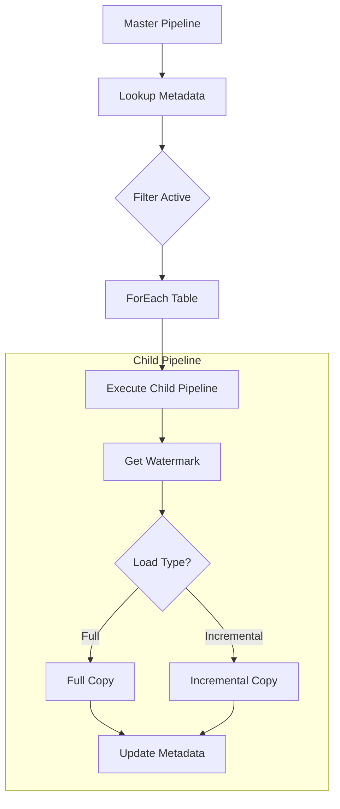

# Metadata-Driven Pipelines

> **Best Practices > Metadata-Driven Pipelines**

---

## Overview

Metadata-driven pipelines enable dynamic, configuration-based data movement without hardcoding source and destination details. This approach significantly reduces maintenance, improves reusability, and accelerates onboarding of new data sources.

---

## Key Concepts

### What is Metadata-Driven Design?

```
Traditional Pipeline:
  Source A -> Copy Activity -> Destination A (hardcoded)
  Source B -> Copy Activity -> Destination B (hardcoded)
  Source C -> Copy Activity -> Destination C (hardcoded)

Metadata-Driven Pipeline:
  Config Table -> ForEach -> Dynamic Copy Activity -> Dynamic Destination
```

**Benefits:**
- Single pipeline handles multiple tables
- Configuration changes don't require code changes
- Self-documenting through metadata
- Easier testing and validation

---

## Expressions and Functions

### Pipeline Scope Variables

| Variable | Description |
|----------|-------------|
| `@pipeline().DataFactory` | ID of the workspace |
| `@pipeline().Pipeline` | ID of the pipeline |
| `@pipeline().PipelineName` | Name of the pipeline |
| `@pipeline().RunId` | ID of the specific run |
| `@pipeline().TriggerId` | ID of the trigger |
| `@pipeline().TriggerName` | Name of the trigger |
| `@pipeline().TriggerTime` | Time of the trigger run |

### Common Expression Patterns

#### Dynamic Table Names

```
@concat('bronze_', pipeline().parameters.sourceSystem, '_', item().tableName)
```

#### Dynamic Date Paths

```
@concat('raw/', formatDateTime(utcnow(), 'yyyy'), '/',
        formatDateTime(utcnow(), 'MM'), '/',
        formatDateTime(utcnow(), 'dd'))
```

#### Conditional File Names

```
@if(equals(pipeline().parameters.isIncremental, true),
    concat('incr_', formatDateTime(utcnow(), 'yyyyMMdd_HHmmss'), '.parquet'),
    concat('full_', formatDateTime(utcnow(), 'yyyyMMdd'), '.parquet'))
```

#### Complex Subfield References

```
@activity('LookupActivity').output.firstRow.maxDate
@activity('GetMetadata').output.columnList[0].name
```

### String Interpolation

```
"First Name: @{pipeline().parameters.firstName} Last Name: @{pipeline().parameters.lastName}"
```

**Evaluation Examples:**

| Expression | Result |
|------------|--------|
| `@pipeline().parameters.myString` | Returns as string |
| `@{pipeline().parameters.myNumber}` | Returns number as string |
| `@@{value}` | Returns literal `@{value}` |

---

## Metadata Configuration Table

### Schema Design

```sql
CREATE TABLE config.pipeline_metadata (
    config_id INT PRIMARY KEY,
    source_system VARCHAR(100),
    source_schema VARCHAR(100),
    source_table VARCHAR(200),
    target_lakehouse VARCHAR(100),
    target_table VARCHAR(200),
    load_type VARCHAR(20),  -- 'full' or 'incremental'
    watermark_column VARCHAR(100),
    partition_column VARCHAR(100),
    partition_count INT,
    is_active BIT,
    last_load_date DATETIME2,
    last_watermark_value VARCHAR(100),
    created_date DATETIME2,
    modified_date DATETIME2
);
```

### Sample Configuration Data

```sql
INSERT INTO config.pipeline_metadata VALUES
(1, 'oracle_erp', 'SALES', 'ORDERS', 'lh_bronze_casino', 'bronze_oracle_orders', 'incremental', 'MODIFIED_DATE', 'ORDER_DATE', 16, 1, NULL, NULL, GETDATE(), GETDATE()),
(2, 'oracle_erp', 'SALES', 'ORDER_ITEMS', 'lh_bronze_casino', 'bronze_oracle_order_items', 'incremental', 'MODIFIED_DATE', NULL, 8, 1, NULL, NULL, GETDATE(), GETDATE()),
(3, 'sqlserver_cms', 'dbo', 'players', 'lh_bronze_casino', 'bronze_cms_players', 'full', NULL, NULL, 4, 1, NULL, NULL, GETDATE(), GETDATE()),
(4, 'sqlserver_sms', 'dbo', 'slot_events', 'lh_bronze_casino', 'bronze_sms_slot_events', 'incremental', 'event_timestamp', 'event_date', 32, 1, NULL, NULL, GETDATE(), GETDATE());
```

---

## Pipeline Architecture

### Master Orchestration Pattern



### Master Pipeline Definition

```json
{
  "name": "pl_master_orchestrator",
  "activities": [
    {
      "name": "LookupActiveConfigs",
      "type": "Lookup",
      "typeProperties": {
        "source": {
          "type": "LakehouseSource",
          "query": "SELECT * FROM config.pipeline_metadata WHERE is_active = 1"
        },
        "firstRowOnly": false
      }
    },
    {
      "name": "ForEachTable",
      "type": "ForEach",
      "dependsOn": [{"activity": "LookupActiveConfigs"}],
      "typeProperties": {
        "isSequential": false,
        "batchCount": 20,
        "items": "@activity('LookupActiveConfigs').output.value",
        "activities": [
          {
            "name": "ExecuteChildPipeline",
            "type": "ExecutePipeline",
            "typeProperties": {
              "pipeline": {
                "referenceName": "pl_generic_copy",
                "type": "PipelineReference"
              },
              "parameters": {
                "sourceSystem": "@item().source_system",
                "sourceSchema": "@item().source_schema",
                "sourceTable": "@item().source_table",
                "targetLakehouse": "@item().target_lakehouse",
                "targetTable": "@item().target_table",
                "loadType": "@item().load_type",
                "watermarkColumn": "@item().watermark_column",
                "partitionColumn": "@item().partition_column",
                "partitionCount": "@item().partition_count",
                "lastWatermark": "@item().last_watermark_value"
              }
            }
          }
        ]
      }
    }
  ]
}
```

---

## Dynamic Copy Activity

### Parameterized Source Query

```json
{
  "name": "DynamicCopyActivity",
  "type": "Copy",
  "typeProperties": {
    "source": {
      "type": "OracleSource",
      "query": {
        "value": "@if(equals(pipeline().parameters.loadType, 'full'),
                    concat('SELECT * FROM ', pipeline().parameters.sourceSchema, '.', pipeline().parameters.sourceTable),
                    concat('SELECT * FROM ', pipeline().parameters.sourceSchema, '.', pipeline().parameters.sourceTable,
                           ' WHERE ', pipeline().parameters.watermarkColumn, ' > TO_TIMESTAMP(''',
                           pipeline().parameters.lastWatermark, ''', ''YYYY-MM-DD HH24:MI:SS'')'))",
        "type": "Expression"
      },
      "partitionOption": {
        "value": "@if(greater(pipeline().parameters.partitionCount, 1), 'DynamicRange', 'None')",
        "type": "Expression"
      },
      "partitionSettings": {
        "partitionColumnName": "@pipeline().parameters.partitionColumn",
        "partitionUpperBound": "@activity('GetMaxPartition').output.firstRow.maxValue",
        "partitionLowerBound": "@activity('GetMinPartition').output.firstRow.minValue"
      }
    },
    "sink": {
      "type": "LakehouseTableSink",
      "tableActionOption": "@if(equals(pipeline().parameters.loadType, 'full'), 'Overwrite', 'Append')"
    },
    "parallelCopies": "@pipeline().parameters.partitionCount"
  }
}
```

### Dynamic Connection References

```json
{
  "typeProperties": {
    "source": {
      "type": {
        "value": "@concat(pipeline().parameters.sourceSystem, 'Source')",
        "type": "Expression"
      },
      "connectionId": {
        "value": "@pipeline().parameters.connectionId",
        "type": "Expression"
      }
    }
  }
}
```

---

## Parameterizing Connections

### Getting Connection GUID

1. Navigate to **Settings > Manage connections and gateways**
2. Find the connection name
3. Click ellipsis (...) > **Settings**
4. Copy the **Connection ID**

### Using Connection Parameter

```json
{
  "parameters": {
    "connectionId": {
      "type": "String",
      "defaultValue": "a1b2c3d4-e5f6-7890-abcd-ef1234567890"
    }
  },
  "source": {
    "type": "SqlServerSource",
    "connectionId": "@pipeline().parameters.connectionId"
  }
}
```

---

## Advanced Patterns

### Schema Drift Handling

```json
{
  "name": "CopyWithSchemaDrift",
  "type": "Copy",
  "typeProperties": {
    "source": {"type": "SqlServerSource"},
    "sink": {
      "type": "LakehouseTableSink",
      "tableActionOption": "autoCreate",
      "allowSchemaDrift": true,
      "validateDataConsistency": true
    },
    "translator": {
      "type": "TabularTranslator",
      "schemaMapping": {
        "value": "@json(pipeline().parameters.columnMapping)",
        "type": "Expression"
      }
    }
  }
}
```

### Multi-Source Routing

```json
{
  "name": "SwitchBySourceType",
  "type": "Switch",
  "typeProperties": {
    "on": "@pipeline().parameters.sourceType",
    "cases": [
      {
        "value": "Oracle",
        "activities": [{"name": "CopyFromOracle", "type": "Copy"}]
      },
      {
        "value": "SQLServer",
        "activities": [{"name": "CopyFromSQLServer", "type": "Copy"}]
      },
      {
        "value": "API",
        "activities": [{"name": "CopyFromAPI", "type": "Copy"}]
      }
    ],
    "defaultActivities": [
      {"name": "LogUnknownSource", "type": "SetVariable"}
    ]
  }
}
```

---

## Error Handling and Logging

### Audit Log Pattern

```json
{
  "activities": [
    {
      "name": "LogPipelineStart",
      "type": "Script",
      "typeProperties": {
        "scripts": [{
          "text": {
            "value": "INSERT INTO audit.pipeline_log (run_id, pipeline_name, table_name, status, start_time) VALUES ('@{pipeline().RunId}', '@{pipeline().PipelineName}', '@{pipeline().parameters.sourceTable}', 'Started', '@{utcnow()}')",
            "type": "Expression"
          }
        }]
      }
    },
    {
      "name": "CopyData",
      "type": "Copy",
      "dependsOn": [{"activity": "LogPipelineStart"}]
    },
    {
      "name": "LogSuccess",
      "type": "Script",
      "dependsOn": [{"activity": "CopyData", "dependencyConditions": ["Succeeded"]}],
      "typeProperties": {
        "scripts": [{
          "text": {
            "value": "UPDATE audit.pipeline_log SET status = 'Succeeded', end_time = '@{utcnow()}', rows_copied = @{activity('CopyData').output.rowsCopied} WHERE run_id = '@{pipeline().RunId}'",
            "type": "Expression"
          }
        }]
      }
    },
    {
      "name": "LogFailure",
      "type": "Script",
      "dependsOn": [{"activity": "CopyData", "dependencyConditions": ["Failed"]}],
      "typeProperties": {
        "scripts": [{
          "text": {
            "value": "UPDATE audit.pipeline_log SET status = 'Failed', end_time = '@{utcnow()}', error_message = '@{activity('CopyData').error.message}' WHERE run_id = '@{pipeline().RunId}'",
            "type": "Expression"
          }
        }]
      }
    }
  ]
}
```

---

## Best Practices Checklist

### Design
- [ ] Create centralized metadata configuration table
- [ ] Use parameters for all variable values
- [ ] Implement master/child pipeline pattern
- [ ] Design for both full and incremental loads

### Development
- [ ] Test expressions in isolation before combining
- [ ] Use meaningful parameter names
- [ ] Document parameter defaults and expected values
- [ ] Implement comprehensive error handling

### Operations
- [ ] Create audit logging for all runs
- [ ] Store watermarks in persistent storage
- [ ] Monitor and alert on failures
- [ ] Version control pipeline definitions

---

## Common Expression Functions

| Function | Description | Example |
|----------|-------------|---------|
| `concat()` | Concatenate strings | `@concat('prefix_', item().name)` |
| `formatDateTime()` | Format date | `@formatDateTime(utcnow(), 'yyyy-MM-dd')` |
| `if()` | Conditional | `@if(condition, trueValue, falseValue)` |
| `equals()` | Equality check | `@equals(a, b)` |
| `greater()` | Greater than | `@greater(a, b)` |
| `coalesce()` | First non-null | `@coalesce(a, b, 'default')` |
| `json()` | Parse JSON string | `@json(pipeline().parameters.config)` |
| `replace()` | Replace string | `@replace(string, old, new)` |
| `split()` | Split string | `@split(string, delimiter)` |
| `utcnow()` | Current UTC time | `@utcnow()` |

---

[Back to Best Practices Index](./README.md)
