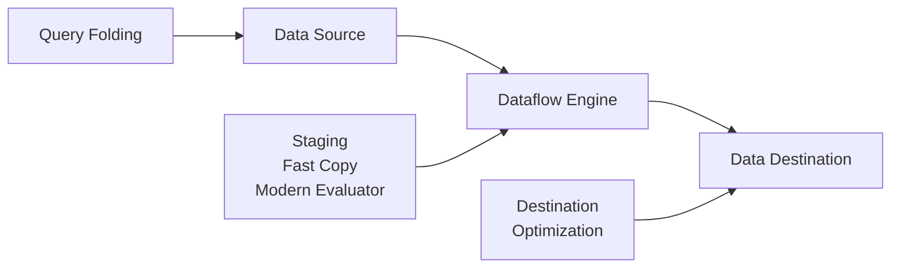
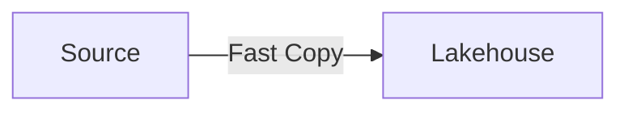
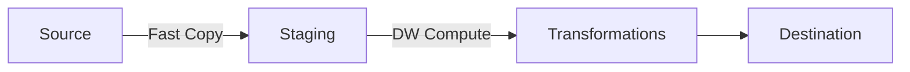
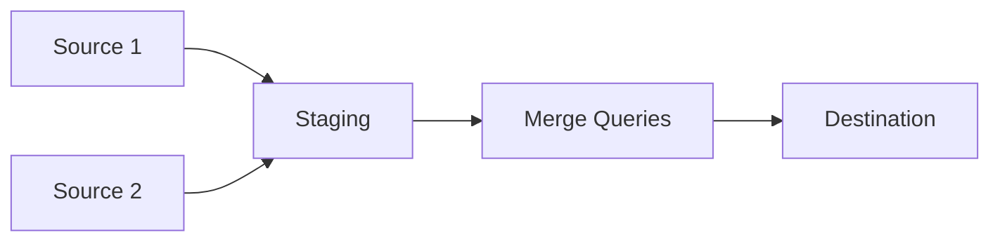

# Dataflows Gen2 Best Practices

> **Best Practices > Dataflows Gen2**

---

## Overview

Dataflows Gen2 provides a low-code/no-code experience for data transformation using Power Query. This guide covers query folding, staging, fast copy, and performance optimization techniques.

---

## Key Performance Areas



### Three Optimization Pillars

1. **Query Folding** - Push transformations to source
2. **Staging** - Use Fabric compute for complex transforms
3. **Fast Copy** - High-throughput data movement

---

## Query Folding

### What is Query Folding?

Query folding pushes transformation logic to the data source, reducing data transfer and leveraging source compute power.

### Folding Indicators

| Indicator | Icon | Description |
|-----------|------|-------------|
| Green | ✓ | Step will fold to source |
| Yellow | ⚠ | Partially foldable |
| Red | ✗ | Step doesn't fold |

### Transformations That Fold

| Transformation | Folds? |
|---------------|--------|
| Select columns | Yes |
| Filter rows | Yes |
| Sort | Yes |
| Group By (simple) | Yes |
| Join (same source) | Yes |
| Merge queries | Yes |
| Add calculated column | Depends |
| Custom functions | Usually No |
| Pivot/Unpivot | Depends |

### Checking Fold Status

1. Right-click on a step in Applied Steps
2. Select "View Data Flow Plan"
3. Check if operations happen at source or locally

---

## Fast Copy

### What is Fast Copy?

Fast Copy uses optimized data movement paths for high-throughput ingestion with minimal transformations.

### Performance Comparison

| Capability | Without Fast Copy | With Fast Copy |
|------------|-------------------|----------------|
| 5 GB Parquet files | ~1 hour | ~8 minutes |
| Improvement | Baseline | **~9x faster** |

### Enabling Fast Copy

1. Open Dataflow Gen2
2. Select **Options** from Home tab
3. Go to **Scale** tab
4. Enable **Allow use of fast copy connectors**

### Supported Sources

- ADLS Gen2
- Azure Blob Storage
- Azure SQL Database
- Lakehouse
- PostgreSQL
- On-premises SQL Server (with gateway)
- Warehouse
- Oracle
- Snowflake
- Fabric SQL Database

### Supported Transformations

Fast Copy supports limited transformations:
- Column selection
- Column renaming
- Basic filtering
- Type conversion

### Requiring Fast Copy

For critical performance queries:
1. Right-click the query
2. Select **Require fast copy**
3. Query fails if fast copy cannot be used

---

## Staging for Complex Transformations

### When to Use Staging

Use staging when:
- Transformations don't fold to source
- Complex joins, aggregations, or filtering
- Source doesn't support query folding
- Need to leverage Fabric compute

### How Staging Works

```
Source → Staging Lakehouse → SQL DW Compute → Destination
```

### Enabling Staging

1. Right-click on the query
2. Select **Enable staging**
3. Query turns blue to indicate staging

### Split Query Pattern

For best performance with complex transformations:

1. **Query 1:** Data ingestion with Fast Copy (foldable steps only)
2. **Query 2:** Reference Query 1, apply complex transformations

```
Original Query:
  Source → Filter → Select → Group By (doesn't fold)

Split Queries:
  Query 1: Source → Filter → Select [Enable Staging + Fast Copy]
  Query 2: Reference Query 1 → Group By [Uses DW Compute]
```

### Staging Best Practices

- Enable staging for queries loading to Warehouse (required)
- Split queries at the first non-folding step
- Use "Extract previous" to automatically split

---

## Modern Evaluator

### What is Modern Evaluator?

Modern Evaluator improves transformation performance for connectors that don't support full query folding.

### Supported Sources

- Azure Blob Storage
- ADLS Gen2
- Lakehouse
- Warehouse
- OData
- Power Platform Dataflows
- SharePoint Online List
- SharePoint folder
- Web

### When to Use

- Complex transformations on non-SQL sources
- Multi-file processing
- Power Query-heavy workloads

---

## Partitioned Compute (Preview)

### What is Partitioned Compute?

Process multi-file sources in parallel partitions for improved performance.

### Use Cases

- Large multi-file datasets
- Files that don't support query folding
- High-volume transformations

### Recommendations

1. Choose partitioned compute over fast copy when source doesn't support folding
2. Load directly to staging or Warehouse for best performance
3. Use **Sample transform file** for consistent transformations across files

---

## Data Destinations

### Destination Options

| Destination | Staging Required | Best For |
|-------------|------------------|----------|
| Lakehouse | No (but recommended) | Delta tables |
| Warehouse | Yes | T-SQL analytics |
| Azure SQL | No | Relational storage |
| Kusto Database | No | Time series analytics |

### Lakehouse Destination

```
Destination Settings:
├── Update method: Append or Replace
├── Table action: Overwrite schema, Append, Replace
└── Staging: Optional but improves performance
```

### Warehouse Destination

```
Destination Settings:
├── Update method: Append or Replace
├── Staging: Required
└── Schema: Auto-create or existing
```

---

## Performance Patterns

### Pattern 1: Simple EL (Extract-Load)



**Settings:**
- Enable Fast Copy
- Minimal transformations
- Direct load

### Pattern 2: ETL with Staging



**Settings:**
- Enable Fast Copy on ingestion query
- Enable Staging
- Reference for transformations

### Pattern 3: Multi-Source Merge



**Settings:**
- Stage each source
- Merge staged queries
- Leverage DW compute for joins

---

## Optimization Checklist

### Before Publishing

- [ ] Check folding indicators (aim for all green)
- [ ] Enable Fast Copy for supported sources
- [ ] Enable Staging for complex transformations
- [ ] Split queries at first non-folding step
- [ ] Set appropriate update methods

### Query Design

- [ ] Filter early in the query
- [ ] Select only needed columns
- [ ] Avoid custom functions when possible
- [ ] Use native transformations over M code
- [ ] Test with representative data volumes

### Monitoring

- [ ] Check refresh history for errors
- [ ] Review execution times per query
- [ ] Monitor staging usage
- [ ] Track engine type (CopyActivity vs Mashup)

---

## Common Issues and Solutions

| Issue | Cause | Solution |
|-------|-------|----------|
| Slow refresh | No query folding | Enable staging, split queries |
| Memory errors | Large dataset in memory | Use fast copy, enable staging |
| Timeout | Complex transformations | Split queries, increase timeout |
| Failed refresh | Incompatible transformation | Check fast copy requirements |

---

## Dataflow vs Pipeline Decision

| Criterion | Use Dataflow Gen2 | Use Pipeline Copy |
|-----------|-------------------|-------------------|
| Transformation complexity | High | Low |
| Code preference | No-code/Low-code | Low-code/JSON |
| Data volume | Low to Medium | Medium to High |
| Power Query experience | Preferred | Not required |
| 150+ connectors needed | Yes | Use 50+ connectors |
| Fast Copy optimization | Yes | Yes (Copy activity) |

---

## Best Practices Summary

### Do's

- Enable Fast Copy for large data loads
- Use staging for complex transformations
- Split queries at non-folding steps
- Check folding indicators regularly
- Test with production-scale data

### Don'ts

- Don't use custom M functions when native exists
- Don't skip staging for Warehouse destinations
- Don't ignore folding indicators
- Don't combine Fast Copy with incompatible transforms
- Don't use inline transformations for heavy processing

---

[Back to Best Practices Index](./README.md)
