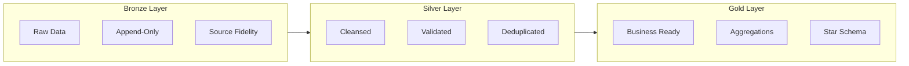
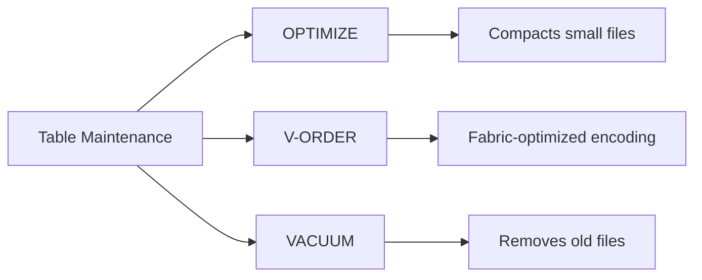

# Lakehouse Setup & Organization

> **Best Practices > Lakehouse Setup**

---

## Overview

The Lakehouse is central to Microsoft Fabric's data architecture, combining data lake flexibility with data warehouse capabilities. This guide covers Delta Lake configuration, medallion architecture implementation, and table maintenance best practices.


*Source: [Microsoft Learn - Lakehouse Overview](https://learn.microsoft.com/en-us/fabric/data-engineering/lakehouse-overview)*

---

## Lakehouse Architecture

### Components

```
Lakehouse
├── Files/           # Unstructured data (landing zone)
│   ├── raw/
│   ├── staging/
│   └── archive/
├── Tables/          # Managed Delta tables
│   ├── bronze_*
│   ├── silver_*
│   └── gold_*
└── SQL Endpoint     # T-SQL access (read-only)
```

### Access Methods

| Access Method | Use Case | Capabilities |
|---------------|----------|--------------|
| Spark | Data engineering | Full read/write |
| SQL Endpoint | Analytics, BI | Read-only |
| Shortcuts | External data | Virtual access |
| OneLake API | Programmatic | ADLS Gen2 compatible |

---

## Medallion Architecture

### Layer Definitions



### Layer Characteristics

| Layer | Purpose | Schema | Updates | Retention |
|-------|---------|--------|---------|-----------|
| Bronze | Raw ingestion | Source schema | Append-only | Long-term |
| Silver | Validated data | Enforced schema | MERGE/Upsert | Medium-term |
| Gold | Business views | Star schema | Computed | Based on use |

---

## Delta Lake Configuration

### Table Creation with Best Practices

```python
# Create optimized Delta table
spark.sql("""
    CREATE TABLE silver_slot_telemetry (
        event_id STRING NOT NULL,
        machine_id STRING NOT NULL,
        player_id STRING,
        event_timestamp TIMESTAMP NOT NULL,
        event_type STRING,
        bet_amount DECIMAL(18,2),
        win_amount DECIMAL(18,2),
        event_date DATE,
        _loaded_at TIMESTAMP,
        _source_file STRING
    )
    USING DELTA
    PARTITIONED BY (event_date)
    TBLPROPERTIES (
        'delta.autoOptimize.optimizeWrite' = 'true',
        'delta.autoOptimize.autoCompact' = 'true',
        'delta.dataSkippingNumIndexedCols' = '8',
        'delta.deletedFileRetentionDuration' = 'interval 7 days'
    )
""")
```

### Key Table Properties

| Property | Default | Recommendation | Purpose |
|----------|---------|----------------|---------|
| `delta.autoOptimize.optimizeWrite` | false | true | Better file sizes |
| `delta.autoOptimize.autoCompact` | false | true | Reduce small files |
| `delta.dataSkippingNumIndexedCols` | 32 | Match filter columns | Query performance |
| `delta.deletedFileRetentionDuration` | 7 days | 7+ days | Time travel support |

---

## V-Order Optimization

### What is V-Order?

V-Order is a Fabric-specific optimization that improves read performance across all Fabric engines (Spark, SQL, Power BI).

### Enabling V-Order

**Write-time V-Order:**
```python
df.write.format("delta") \
    .option("vorder", "true") \
    .mode("overwrite") \
    .save("/Tables/my_table")
```

**OPTIMIZE with V-Order:**
```sql
OPTIMIZE my_table VORDER;
```

**Combined Z-ORDER and V-Order:**
```sql
OPTIMIZE my_table
ZORDER BY (customer_id, event_date)
VORDER;
```

---

## Partitioning Strategy

### When to Partition

| Data Size | Recommendation |
|-----------|----------------|
| < 1 GB | No partitioning |
| 1-100 GB | Single partition column |
| > 100 GB | Consider multiple columns |

### Partition Column Selection

**Good candidates:**
- Date columns (event_date, created_date)
- Low cardinality columns (region, category)
- Frequently filtered columns

**Bad candidates:**
- High cardinality columns (customer_id, transaction_id)
- Columns that create thousands of partitions

### Example Partition Strategy

```python
# For time-series data, partition by date
df.write.format("delta") \
    .partitionBy("event_date") \
    .mode("overwrite") \
    .saveAsTable("bronze_slot_telemetry")

# For large historical tables, consider year/month
df.write.format("delta") \
    .partitionBy("year", "month") \
    .mode("overwrite") \
    .saveAsTable("archive_transactions")
```

---

## Z-ORDER Clustering

### What is Z-ORDER?

Z-ORDER colocates related data for efficient data skipping during queries.

### Implementation

```sql
-- Z-ORDER on frequently filtered columns
OPTIMIZE gold_player_activity
ZORDER BY (player_id, event_date);
```

### Best Practices

- Use on high-cardinality filter columns
- Combine with partitioning (partition first, then Z-ORDER within)
- Limit to 2-4 columns
- Re-run after significant data changes

---

## Table Maintenance

### Three Core Operations



### OPTIMIZE Command

Consolidates small files into larger ones:

```sql
-- Basic optimize
OPTIMIZE bronze_slot_telemetry;

-- Optimize specific partition
OPTIMIZE bronze_slot_telemetry
WHERE event_date >= '2024-01-01';

-- Optimize with Z-ORDER
OPTIMIZE silver_player_profiles
ZORDER BY (player_id);
```

**Target file size:** 128 MB - 1 GB (optimal for Spark)

### VACUUM Command

Removes files no longer referenced by Delta log:

```python
from delta.tables import DeltaTable

delta_table = DeltaTable.forPath(spark, "/Tables/bronze_slot_telemetry")

# Vacuum with default 7-day retention
delta_table.vacuum()

# Vacuum with custom retention (requires config change for < 7 days)
delta_table.vacuum(168)  # 168 hours = 7 days
```

**Important:**
- Default retention is 7 days
- Shorter retention impacts time travel
- Don't vacuum if Direct Lake semantic models reference old versions

### Maintenance Schedule

| Table Type | OPTIMIZE Frequency | VACUUM Frequency |
|------------|-------------------|------------------|
| High-velocity Bronze | Daily | Weekly |
| Silver (incremental) | Daily | Weekly |
| Gold (batch) | After refresh | Monthly |
| Archive | Monthly | Quarterly |

---

## Lakehouse UI Maintenance

### Using Portal UI


*Source: [Microsoft Learn - How to Use Notebooks](https://learn.microsoft.com/en-us/fabric/data-engineering/how-to-use-notebook)*

1. Open Lakehouse in Fabric portal
2. In Explorer, right-click table
3. Select **Maintenance**
4. Choose operations:
   - [x] OPTIMIZE
   - [x] V-ORDER
   - [x] VACUUM
5. Click **Run now**

### Automating Maintenance via API

```python
# Using Lakehouse REST API
import requests

workspace_id = "your-workspace-id"
lakehouse_id = "your-lakehouse-id"

# Submit maintenance job
response = requests.post(
    f"https://api.fabric.microsoft.com/v1/workspaces/{workspace_id}/items/{lakehouse_id}/jobs/instances",
    headers={"Authorization": f"Bearer {token}"},
    json={
        "jobType": "TableMaintenance",
        "executionData": {
            "tableName": "bronze_slot_telemetry",
            "optimizeSettings": {
                "vOrder": True,
                "zOrderBy": ["machine_id"]
            },
            "vacuumSettings": {
                "retentionPeriod": "168:00:00"
            }
        }
    }
)
```

---

## Shortcuts

### When to Use Shortcuts

| Scenario | Use Shortcut? |
|----------|---------------|
| Access ADLS Gen2 without copying | Yes |
| Cross-workspace data access | Yes |
| Real-time external data | Yes |
| Data needs transformation | No (copy first) |
| High-frequency queries | Evaluate (may need local copy) |

### Creating Shortcuts


*Source: [Microsoft Learn - Lakehouse Shortcuts](https://learn.microsoft.com/en-us/fabric/data-engineering/lakehouse-shortcuts)*

```
Lakehouse > Files > New shortcut > Select source
  - OneLake (another Fabric item)
  - Azure Data Lake Storage Gen2
  - Amazon S3
  - Dataverse
  - Google Cloud Storage
```

### Performance Considerations

- Shortcuts add network latency
- Same-region data performs best
- Consider local copy for heavy query workloads

---

## File Organization

### Recommended Structure

```
Files/
├── landing/                    # Initial file drops
│   ├── slot_telemetry/
│   │   └── YYYY/MM/DD/
│   └── player_data/
├── staging/                    # In-progress transformations
├── archive/                    # Historical files
│   └── YYYY/
└── reference/                  # Static reference data

Tables/
├── bronze_sms_slot_events      # Raw from SMS
├── bronze_cms_players          # Raw from CMS
├── silver_slot_telemetry       # Cleansed events
├── silver_player_profiles      # Validated players
├── fact_daily_slot_performance # Gold fact table
├── dim_machine                 # Gold dimension
└── dim_player                  # Gold dimension
```

---

## Best Practices Checklist

### Initial Setup

- [ ] Plan medallion layer structure
- [ ] Define naming conventions
- [ ] Configure default table properties
- [ ] Set up maintenance schedules
- [ ] Plan partitioning strategy

### Ongoing Operations

- [ ] Monitor table file counts
- [ ] Run OPTIMIZE after large loads
- [ ] VACUUM weekly (minimum)
- [ ] Review partition effectiveness
- [ ] Update Z-ORDER as query patterns change

### Performance

- [ ] Enable V-Order for Fabric workloads
- [ ] Use appropriate partition columns
- [ ] Keep files between 128 MB - 1 GB
- [ ] Use shortcuts for external data access
- [ ] Monitor SQL endpoint query performance

---

## Common Issues and Solutions

| Issue | Cause | Solution |
|-------|-------|----------|
| Slow queries | Too many small files | Run OPTIMIZE |
| Storage growth | Old files not cleaned | Run VACUUM |
| Time travel fails | Aggressive VACUUM | Increase retention |
| Partition skew | Poor partition choice | Re-partition data |
| Direct Lake errors | VACUUM removed files | Refresh semantic model |

---

[Back to Best Practices Index](./README.md)
