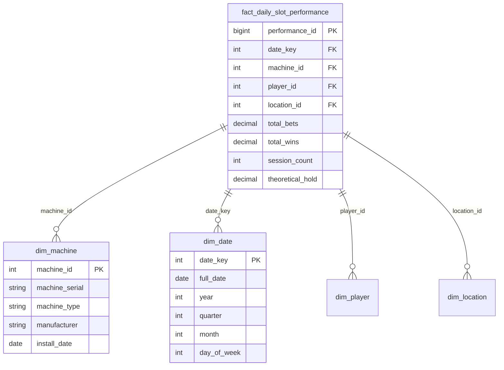

# Warehouse Setup & Configuration

> **Best Practices > Warehouse Setup**

---

## Overview

The Fabric Data Warehouse provides a full T-SQL experience with ACID transactions, ideal for traditional SQL workloads and enterprise analytics. This guide covers schema design, statistics management, query optimization, and best practices.

---

## Warehouse vs Lakehouse SQL Endpoint

| Capability | Warehouse | Lakehouse SQL Endpoint |
|------------|-----------|------------------------|
| DML Support | Full (INSERT, UPDATE, DELETE) | Read-only |
| DDL Support | Full | Limited (Views, TVFs) |
| Transactions | Yes | No |
| Storage | Delta (managed) | Delta (shared with Lakehouse) |
| Primary Use | Data warehousing | Analytics on Lakehouse data |
| Developer Persona | SQL Developer | Data Engineer/Analyst |

**Recommendation:** Use Warehouse for traditional SQL workloads with transactions. Use Lakehouse SQL Endpoint for analytical queries on engineering data.

---

## Schema Design

### Star Schema Pattern



### Naming Conventions

| Object Type | Pattern | Example |
|-------------|---------|---------|
| Fact tables | `fact_{subject}` | `fact_daily_slot_performance` |
| Dimension tables | `dim_{entity}` | `dim_machine`, `dim_player` |
| Staging tables | `stg_{source}_{entity}` | `stg_bronze_players` |
| Views | `vw_{purpose}` | `vw_active_players` |

---

## Data Type Optimization

### Best Practices

1. **Use smallest appropriate data type**
2. **Integer types for whole numbers**
3. **Match types for joins**
4. **Appropriate precision for decimals**

### Data Type Selection Guide

| Data Type | Use For | Avoid For |
|-----------|---------|-----------|
| `INT` | IDs, counts < 2.1B | Large IDs |
| `BIGINT` | Large IDs, large counts | Small numbers |
| `DECIMAL(p,s)` | Currency, precise numbers | Simple integers |
| `VARCHAR(n)` | Variable text | Fixed-length codes |
| `DATE` | Dates without time | Timestamps |
| `DATETIME2(n)` | Timestamps | Date-only values |

### Example Optimizations

```sql
-- Bad: Over-provisioned types
CREATE TABLE players_bad (
    player_id VARCHAR(500),        -- Too large
    balance DECIMAL(38, 10),       -- Excessive precision
    last_login VARCHAR(100)        -- Should be datetime
);

-- Good: Right-sized types
CREATE TABLE players_good (
    player_id INT,                 -- Appropriate for ID
    balance DECIMAL(18, 2),        -- Currency precision
    last_login DATETIME2(0)        -- Proper type, second precision
);
```

---

## Statistics Management

### Types of Statistics

| Type | Name Pattern | Purpose |
|------|--------------|---------|
| Histogram | `_WA_Sys_*` | Column distribution |
| Average Column Length | `ACE-AverageColumnLength_*` | VARCHAR sizing |
| Table Cardinality | `ACE-Cardinality` | Row count estimates |

### Automatic Statistics

Statistics are automatically created for:
- Columns in GROUP BY
- JOIN predicates
- WHERE clause filters
- ORDER BY columns

### Manual Statistics

```sql
-- Create statistics on specific column
CREATE STATISTICS stat_player_id
ON fact_daily_slot_performance (player_id);

-- Create with full scan for accuracy
CREATE STATISTICS stat_machine_id
ON fact_daily_slot_performance (machine_id)
WITH FULLSCAN;

-- Update statistics after large data loads
UPDATE STATISTICS fact_daily_slot_performance;

-- Update specific statistics
UPDATE STATISTICS fact_daily_slot_performance (stat_player_id)
WITH FULLSCAN;
```

### Statistics Best Practices

1. **Update after large loads** - Statistics become stale
2. **Use FULLSCAN for critical columns** - More accurate than sampling
3. **Monitor auto-generated statistics** - Check for accuracy
4. **Create statistics proactively** - Before heavy query workloads

### Viewing Statistics

```sql
-- List all statistics on a table
SELECT
    s.name AS statistics_name,
    c.name AS column_name,
    s.auto_created,
    STATS_DATE(s.object_id, s.stats_id) AS last_updated
FROM sys.stats s
JOIN sys.stats_columns sc ON s.stats_id = sc.stats_id AND s.object_id = sc.object_id
JOIN sys.columns c ON sc.column_id = c.column_id AND sc.object_id = c.object_id
WHERE s.object_id = OBJECT_ID('fact_daily_slot_performance');

-- View statistics details
DBCC SHOW_STATISTICS ('fact_daily_slot_performance', '_WA_Sys_00000001');
```

---

## Query Optimization

### Filter Early

```sql
-- Good: Filter before join
SELECT f.*, d.full_date
FROM fact_daily_slot_performance f
JOIN dim_date d ON f.date_key = d.date_key
WHERE f.date_key >= 20240101  -- Filter on fact table
  AND f.total_bets > 1000;

-- Less optimal: Filter after join
SELECT f.*, d.full_date
FROM fact_daily_slot_performance f
JOIN dim_date d ON f.date_key = d.date_key
WHERE d.full_date >= '2024-01-01';  -- Filter on dimension
```

### Select Only Needed Columns

```sql
-- Good: Specific columns
SELECT machine_id, SUM(total_bets), SUM(total_wins)
FROM fact_daily_slot_performance
GROUP BY machine_id;

-- Bad: SELECT *
SELECT *
FROM fact_daily_slot_performance;  -- Avoid in production
```

### Use Appropriate JOINs

```sql
-- Ensure data type parity in joins
SELECT f.*, m.machine_type
FROM fact_daily_slot_performance f
JOIN dim_machine m ON f.machine_id = m.machine_id  -- Both INT
-- Avoid: ON CAST(f.machine_id AS VARCHAR) = m.machine_id
```

---

## Ingestion Best Practices

### Loading Data

```sql
-- Use COPY INTO for bulk loads
COPY INTO dbo.fact_daily_slot_performance
FROM 'https://storage.blob.core.windows.net/data/*.parquet'
WITH (
    FILE_TYPE = 'PARQUET',
    CREDENTIAL = (IDENTITY = 'Managed Identity')
);
```

### Transaction Management

```sql
-- Keep transactions short
BEGIN TRANSACTION;

-- Perform quick operations
INSERT INTO fact_daily_slot_performance
SELECT * FROM stg_daily_performance
WHERE load_date = CAST(GETDATE() AS DATE);

COMMIT TRANSACTION;
```

### Post-Load Statistics Update

```sql
-- Update statistics after bulk load
UPDATE STATISTICS fact_daily_slot_performance WITH FULLSCAN;
```

---

## V-Order in Warehouse

### Automatic V-Order

All data ingested into Warehouse is automatically V-Order optimized.

**Benefits:**
- Faster reads across Fabric engines
- Optimized for Power BI Direct Lake
- Better compression

### V-Order Compatibility

| Operation | V-Order Applied |
|-----------|-----------------|
| INSERT | Yes |
| COPY INTO | Yes |
| Pipeline Copy | Yes |
| Dataflow | Yes |

---

## Performance Monitoring

### Query Monitoring Views

```sql
-- Active queries
SELECT
    session_id,
    command,
    status,
    total_elapsed_time,
    cpu_time,
    logical_reads
FROM sys.dm_exec_requests
WHERE status = 'running';

-- Query history (use DMVs)
SELECT TOP 100
    query_hash,
    total_elapsed_time,
    execution_count,
    total_worker_time,
    total_logical_reads
FROM sys.dm_exec_query_stats
ORDER BY total_elapsed_time DESC;
```

### Lock Monitoring

```sql
-- Current locks
SELECT
    request_session_id,
    resource_type,
    resource_description,
    request_mode,
    request_status
FROM sys.dm_tran_locks
WHERE resource_database_id = DB_ID();
```

---

## Concurrency and Locking

### Best Practices

1. **Keep transactions short** - Minimize lock duration
2. **Avoid long-running reads during writes** - Can cause blocking
3. **Use retry logic** - Handle transient conflicts

### Retry Pattern

```python
import time
from tenacity import retry, wait_exponential, stop_after_attempt

@retry(wait=wait_exponential(multiplier=1, max=60), stop=stop_after_attempt(5))
def execute_query(connection, query):
    cursor = connection.cursor()
    cursor.execute(query)
    return cursor.fetchall()
```

---

## Warehouse Design Patterns

### Slowly Changing Dimensions (SCD)

**Type 1 - Overwrite:**
```sql
UPDATE dim_player
SET email = source.email,
    phone = source.phone
FROM dim_player d
JOIN stg_player_updates source ON d.player_id = source.player_id;
```

**Type 2 - Historical:**
```sql
-- End current record
UPDATE dim_player
SET is_current = 0, end_date = GETDATE()
WHERE player_id IN (SELECT player_id FROM stg_player_changes)
  AND is_current = 1;

-- Insert new record
INSERT INTO dim_player (player_id, email, phone, start_date, is_current)
SELECT player_id, email, phone, GETDATE(), 1
FROM stg_player_changes;
```

### Incremental Loading

```sql
-- MERGE for upsert
MERGE INTO fact_daily_slot_performance AS target
USING stg_daily_performance AS source
ON target.performance_id = source.performance_id
WHEN MATCHED THEN
    UPDATE SET
        total_bets = source.total_bets,
        total_wins = source.total_wins,
        updated_at = GETDATE()
WHEN NOT MATCHED THEN
    INSERT (performance_id, date_key, machine_id, total_bets, total_wins)
    VALUES (source.performance_id, source.date_key, source.machine_id,
            source.total_bets, source.total_wins);
```

---

## Checklist

### Initial Setup

- [ ] Design star schema for analytics
- [ ] Define naming conventions
- [ ] Plan data type standards
- [ ] Identify key statistics columns
- [ ] Set up monitoring queries

### Ongoing Operations

- [ ] Update statistics after large loads
- [ ] Monitor query performance
- [ ] Review lock contention
- [ ] Optimize slow queries
- [ ] Archive historical data

### Performance

- [ ] Use appropriate data types
- [ ] Create statistics on filter/join columns
- [ ] Select only needed columns
- [ ] Filter early in queries
- [ ] Keep transactions short

---

[Back to Best Practices Index](./README.md)
