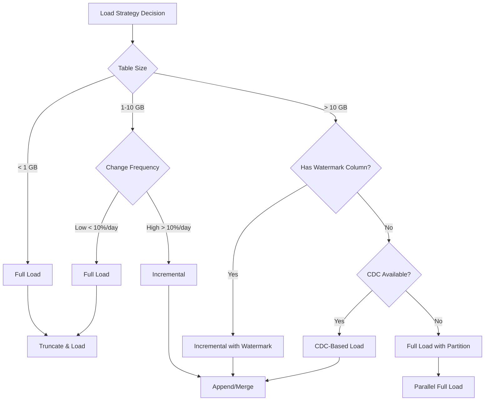

# Oracle & SQL Server Source Patterns

> **Best Practices > Source-Specific Patterns**

---

## Overview

Migrating data from Oracle and SQL Server to Microsoft Fabric requires specific patterns for optimal performance. This guide covers large table extraction, parallel loading, incremental patterns, and gateway optimization.

---

## Oracle Extraction Patterns

### Connection Requirements

| Component | Requirement |
|-----------|-------------|
| Gateway | On-premises data gateway (Standard mode) |
| Driver | Oracle Data Provider for .NET |
| Network | Direct connectivity or VPN to Oracle |
| Authentication | Oracle credentials |

### Large Table Parallel Extraction

#### Physical Partitioning (Best for Partitioned Tables)

```json
{
  "name": "CopyFromOraclePartitioned",
  "type": "Copy",
  "typeProperties": {
    "source": {
      "type": "OracleSource",
      "partitionOption": "PhysicalPartitionsOfTable"
    },
    "sink": {
      "type": "LakehouseTableSink"
    },
    "parallelCopies": 32
  }
}
```

#### Dynamic Range Partitioning (For Non-Partitioned Tables)

```json
{
  "name": "CopyFromOracleDynamic",
  "type": "Copy",
  "typeProperties": {
    "source": {
      "type": "OracleSource",
      "query": "SELECT * FROM SALES.LARGE_TABLE WHERE $$?ROWID_FILTER?$$",
      "partitionOption": "DynamicRange",
      "partitionSettings": {
        "partitionColumnName": "ORDER_DATE",
        "partitionUpperBound": "2024-12-31",
        "partitionLowerBound": "2024-01-01"
      }
    },
    "parallelCopies": 16
  }
}
```

### Oracle-Specific Query Patterns

```sql
-- Oracle incremental with ROWID optimization
SELECT /*+ PARALLEL(8) */ *
FROM SALES.TRANSACTIONS
WHERE MODIFIED_DATE > TO_TIMESTAMP(:last_watermark, 'YYYY-MM-DD HH24:MI:SS.FF')
  AND MODIFIED_DATE <= TO_TIMESTAMP(:current_watermark, 'YYYY-MM-DD HH24:MI:SS.FF');

-- Partition-aware query
SELECT * FROM SALES.TRANSACTIONS PARTITION (P202401);

-- ROWNUM-based chunking (legacy pattern)
SELECT * FROM (
    SELECT t.*, ROWNUM rn FROM SALES.LARGE_TABLE t WHERE ROWNUM <= :end_row
) WHERE rn > :start_row;
```

### Oracle Data Type Mappings

| Oracle Type | Fabric Type | Notes |
|-------------|-------------|-------|
| NUMBER(p,s) | DECIMAL(p,s) | Match precision |
| VARCHAR2 | VARCHAR | Adjust length |
| DATE | DATETIME2 | Oracle DATE includes time |
| TIMESTAMP | DATETIME2 | Precision varies |
| CLOB | VARCHAR(MAX) | Large text |
| BLOB | VARBINARY(MAX) | Binary data |
| RAW | VARBINARY | Binary |

---

## SQL Server Extraction Patterns

### Connection Options

| Source Location | Connection Method |
|-----------------|-------------------|
| On-premises | On-premises data gateway |
| Azure VM | On-premises gateway or VNet gateway |
| Azure SQL | Direct (no gateway) |
| Azure SQL MI | VNet gateway or public endpoint |

### Large Table Parallel Extraction

#### Table Partitioning (SQL Server Partitioned Tables)

```json
{
  "name": "CopyFromSQLServerPartitioned",
  "type": "Copy",
  "typeProperties": {
    "source": {
      "type": "SqlServerSource",
      "partitionOption": "PhysicalPartitionsOfTable"
    },
    "parallelCopies": 16
  }
}
```

#### Dynamic Range (Non-Partitioned)

```json
{
  "name": "CopyFromSQLServerDynamic",
  "type": "Copy",
  "typeProperties": {
    "source": {
      "type": "SqlServerSource",
      "query": "SELECT * FROM dbo.LargeTable",
      "partitionOption": "DynamicRange",
      "partitionSettings": {
        "partitionColumnName": "ModifiedDate",
        "partitionUpperBound": "2024-12-31",
        "partitionLowerBound": "2024-01-01"
      }
    },
    "parallelCopies": 16
  }
}
```

### SQL Server CDC (Change Data Capture)

#### Enable CDC on Source

```sql
-- Enable CDC at database level
EXEC sys.sp_cdc_enable_db;

-- Enable CDC on table
EXEC sys.sp_cdc_enable_table
    @source_schema = N'dbo',
    @source_name = N'slot_telemetry',
    @role_name = N'cdc_reader',
    @supports_net_changes = 1;

-- Verify CDC is enabled
SELECT name, is_cdc_enabled
FROM sys.databases
WHERE name = DB_NAME();
```

#### Incremental with CDC

```json
{
  "name": "CopyWithCDC",
  "type": "Copy",
  "typeProperties": {
    "source": {
      "type": "SqlServerSource",
      "query": {
        "value": "DECLARE @from_lsn binary(10), @to_lsn binary(10); SET @from_lsn = sys.fn_cdc_get_min_lsn('dbo_slot_telemetry'); SET @to_lsn = sys.fn_cdc_get_max_lsn(); SELECT * FROM cdc.fn_cdc_get_all_changes_dbo_slot_telemetry(@from_lsn, @to_lsn, N'all');",
        "type": "Expression"
      }
    }
  }
}
```

### Copy Job with CDC (Recommended)

For simplest CDC implementation, use Copy Job:

```
Copy Job Configuration:
├── Source: SQL Server (CDC enabled)
├── Mode: Incremental copy
├── Update Method: Merge
├── Key Columns: Auto-detected from PK
├── Schedule: Every 15 minutes
└── Initial Load: Automatic full load first
```

---

## Logical Partitioning Patterns

### Date-Based Chunking (Very Large Tables)

For tables 100GB+, use ForEach with date ranges:

```json
{
  "name": "ParallelDateChunkPipeline",
  "activities": [
    {
      "name": "GenerateDateRanges",
      "type": "SetVariable",
      "typeProperties": {
        "variableName": "dateRanges",
        "value": [
          {"start": "2024-01-01", "end": "2024-01-31"},
          {"start": "2024-02-01", "end": "2024-02-29"},
          {"start": "2024-03-01", "end": "2024-03-31"}
        ]
      }
    },
    {
      "name": "ForEachDateRange",
      "type": "ForEach",
      "dependsOn": [{"activity": "GenerateDateRanges"}],
      "typeProperties": {
        "isSequential": false,
        "batchCount": 50,
        "items": "@variables('dateRanges')",
        "activities": [
          {
            "name": "CopyChunk",
            "type": "Copy",
            "typeProperties": {
              "source": {
                "type": "OracleSource",
                "query": {
                  "value": "SELECT * FROM SALES.LARGE_TABLE WHERE ORDER_DATE >= TO_DATE('@{item().start}', 'YYYY-MM-DD') AND ORDER_DATE < TO_DATE('@{item().end}', 'YYYY-MM-DD')",
                  "type": "Expression"
                }
              }
            }
          }
        ]
      }
    }
  ]
}
```

### ID-Based Chunking

```python
# Generate ID ranges in notebook
def generate_id_chunks(min_id, max_id, chunk_size=1000000):
    chunks = []
    current = min_id
    while current < max_id:
        chunks.append({
            "start_id": current,
            "end_id": min(current + chunk_size, max_id)
        })
        current += chunk_size
    return chunks

# Use in pipeline parameter
chunks = generate_id_chunks(1, 50000000, 1000000)  # 50M records, 1M per chunk
```

---

## Performance Benchmarks

### Oracle to Lakehouse

| Volume | Partition Type | Parallelism | Expected Duration |
|--------|---------------|-------------|-------------------|
| 10 GB | Physical | Auto | ~15 min |
| 10 GB | Dynamic Range | 16 | ~10 min |
| 100 GB | Physical | 32 | ~45 min |
| 100 GB | Logical (date) | 50 | ~60 min |
| 500 GB | Logical (date) | 50 | ~4 hours |

### SQL Server to Lakehouse

| Volume | Partition Type | Parallelism | Expected Duration |
|--------|---------------|-------------|-------------------|
| 10 GB | None | Auto | ~25 min |
| 10 GB | Dynamic Range | 16 | ~8 min |
| 100 GB | Physical | 32 | ~25 min |
| 100 GB | Logical | 50 | ~45 min |

*Benchmarks vary based on network, gateway, and source performance*

---

## Gateway Optimization for Large Extractions

### Gateway Sizing for Oracle/SQL Server

| Concurrent Operations | CPU | RAM | Container Settings |
|----------------------|-----|-----|-------------------|
| < 10 | 8 cores | 16 GB | Default |
| 10-30 | 16 cores | 32 GB | 16 containers, 2GB each |
| 30-50 | 32 cores | 64 GB | 32 containers, 4GB each |
| 50+ | 64+ cores | 128 GB | Cluster with 2-3 nodes |

### Gateway Configuration for High Throughput

```xml
<!-- Increase container count for parallelism -->
<setting name="MashupDefaultPoolContainerMaxCount" serializeAs="String">
    <value>32</value>
</setting>

<!-- Increase memory for large datasets -->
<setting name="MashupDefaultPoolContainerMaxWorkingSetInMB" serializeAs="String">
    <value>4096</value>
</setting>

<!-- Disable auto-config to use manual settings -->
<setting name="MashupDisableContainerAutoConfig" serializeAs="String">
    <value>True</value>
</setting>

<!-- Enable streaming for large results -->
<setting name="StreamBeforeRequestCompletes" serializeAs="String">
    <value>True</value>
</setting>
```

---

## Incremental Load Patterns

### Watermark-Based (Oracle)

```json
{
  "activities": [
    {
      "name": "GetLastWatermark",
      "type": "Lookup",
      "typeProperties": {
        "source": {
          "type": "LakehouseSource",
          "query": "SELECT watermark_value FROM watermarks WHERE table_name = 'ORACLE_TRANSACTIONS'"
        }
      }
    },
    {
      "name": "GetCurrentMax",
      "type": "Lookup",
      "typeProperties": {
        "source": {
          "type": "OracleSource",
          "query": "SELECT TO_CHAR(MAX(MODIFIED_DATE), 'YYYY-MM-DD HH24:MI:SS.FF') AS max_date FROM SALES.TRANSACTIONS"
        }
      }
    },
    {
      "name": "CopyIncremental",
      "type": "Copy",
      "typeProperties": {
        "source": {
          "type": "OracleSource",
          "query": {
            "value": "SELECT * FROM SALES.TRANSACTIONS WHERE MODIFIED_DATE > TO_TIMESTAMP('@{activity('GetLastWatermark').output.firstRow.watermark_value}', 'YYYY-MM-DD HH24:MI:SS.FF') AND MODIFIED_DATE <= TO_TIMESTAMP('@{activity('GetCurrentMax').output.firstRow.max_date}', 'YYYY-MM-DD HH24:MI:SS.FF')",
            "type": "Expression"
          }
        }
      }
    },
    {
      "name": "UpdateWatermark",
      "type": "Script",
      "dependsOn": [{"activity": "CopyIncremental", "dependencyConditions": ["Succeeded"]}],
      "typeProperties": {
        "scripts": [{
          "text": {
            "value": "UPDATE watermarks SET watermark_value = '@{activity('GetCurrentMax').output.firstRow.max_date}' WHERE table_name = 'ORACLE_TRANSACTIONS'",
            "type": "Expression"
          }
        }]
      }
    }
  ]
}
```

### Watermark-Based (SQL Server)

```json
{
  "source": {
    "type": "SqlServerSource",
    "query": {
      "value": "SELECT * FROM dbo.Transactions WHERE ModifiedDate > '@{activity('GetLastWatermark').output.firstRow.watermark_value}' AND ModifiedDate <= '@{activity('GetCurrentMax').output.firstRow.max_date}'",
      "type": "Expression"
    }
  }
}
```

---

## Full Load vs Incremental Decision



---

## Checklist

### Pre-Migration

- [ ] Document source table sizes and row counts
- [ ] Identify partition columns (date, ID)
- [ ] Check for CDC availability (SQL Server)
- [ ] Identify watermark columns
- [ ] Plan gateway sizing

### Gateway Setup

- [ ] Install appropriate gateway version
- [ ] Configure container settings
- [ ] Set up monitoring
- [ ] Test connectivity to sources

### Pipeline Development

- [ ] Choose appropriate partition strategy
- [ ] Configure parallel copy settings
- [ ] Implement watermark tracking
- [ ] Add error handling and logging

### Validation

- [ ] Compare row counts source vs target
- [ ] Validate data types and conversions
- [ ] Test incremental load accuracy
- [ ] Performance test with production volumes

---

[Back to Best Practices Index](./README.md)
