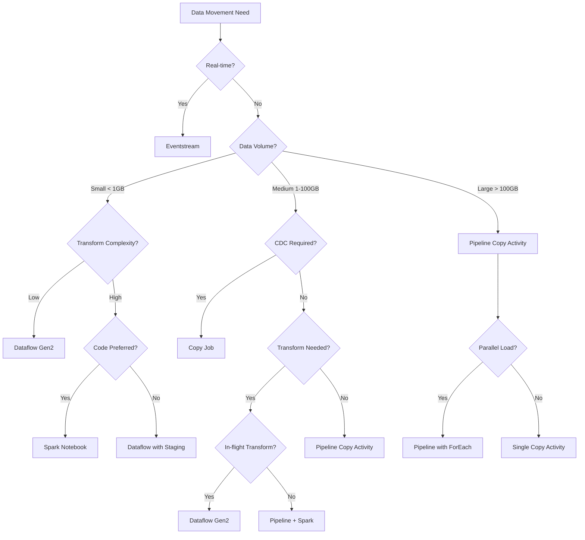
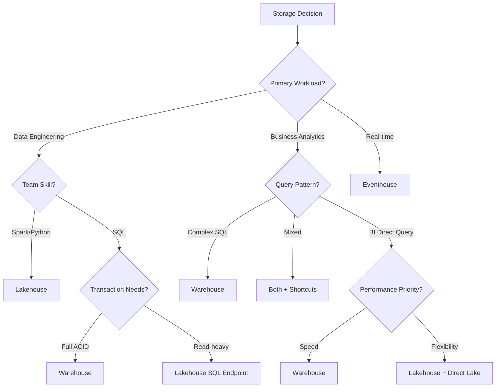

# Decision Guide: Choosing the Right Tool

> **Best Practices > Decision Guide**

---

## Overview

Microsoft Fabric offers multiple tools for data movement and transformation. This guide helps you choose the right tool based on your specific requirements, data volumes, and team capabilities.

---

## Quick Decision Matrix

| Scenario | Recommended Tool |
|----------|------------------|
| Large volume bulk copy (EL) | Pipeline Copy Activity |
| Automated CDC replication | Copy Job |
| Low-code transformations | Dataflow Gen2 |
| Real-time streaming | Eventstream |
| Complex code-based transforms | Spark Notebook |
| SQL-centric analytics | Warehouse |
| Data lake analytics | Lakehouse |

---

## Tool Comparison

### Data Movement Tools

| Capability | Pipeline Copy | Copy Job | Dataflow Gen2 | Eventstream | Spark |
|------------|--------------|----------|---------------|-------------|-------|
| **Use Case** | ETL, bulk copy | CDC, replication | Data wrangling | Event streaming | Data processing |
| **Developer** | Data engineer | Data integrator | Business analyst | Data engineer | Data engineer |
| **Code Required** | Low-code | No-code | No-code | Low-code | Code |
| **Data Volume** | Low to High | Low to High | Low to High | Medium to High | Low to High |
| **Connectors** | 50+ | 50+ | 150+ | CDC, Kafka, etc. | Spark libraries |
| **Transform Complexity** | Low | Low | Medium to High | Low | High |

### Storage Tools

| Capability | Lakehouse | Warehouse | Eventhouse |
|------------|-----------|-----------|------------|
| **Primary Use** | Data lake + analytics | Data warehousing | Real-time analytics |
| **Storage Format** | Delta Lake | Delta Lake | KQL Database |
| **Query Language** | Spark SQL, T-SQL (read) | T-SQL (full) | KQL |
| **Transactions** | Spark-level | Full ACID | No |
| **Best For** | Data engineering | Business analytics | Time-series data |

---

## Decision Tree: Data Movement



---

## Decision Tree: Storage Destination



---

## Scenario-Based Recommendations

### Scenario 1: Enterprise Data Warehouse Migration

**Context:** Migrating from on-premises Oracle/SQL Server to Fabric

**Recommendation:**
```
Source → Pipeline Copy → Lakehouse (Bronze) → Spark (Transform) → Warehouse (Gold)
```

| Component | Tool | Reason |
|-----------|------|--------|
| Extraction | Pipeline Copy | High volume, parallel copy |
| Landing | Lakehouse | Raw data flexibility |
| Transform | Spark Notebooks | Complex business logic |
| Serving | Warehouse | T-SQL analytics, BI |

### Scenario 2: Real-time Dashboard

**Context:** Casino floor monitoring with live updates

**Recommendation:**
```
IoT Devices → Eventstream → Eventhouse → Real-time Dashboard
                    ↓
              Lakehouse (archive)
```

| Component | Tool | Reason |
|-----------|------|--------|
| Ingestion | Eventstream | Sub-second latency |
| Analytics | Eventhouse | KQL for time-series |
| Archive | Lakehouse | Long-term storage |
| Visualization | Real-time Dashboard | Live updates |

### Scenario 3: Self-Service Analytics

**Context:** Business analysts need to prepare and analyze data

**Recommendation:**
```
Various Sources → Dataflow Gen2 → Lakehouse → Semantic Model → Power BI
```

| Component | Tool | Reason |
|-----------|------|--------|
| Preparation | Dataflow Gen2 | Low-code Power Query |
| Storage | Lakehouse | Flexible schema |
| Modeling | Semantic Model | Business definitions |
| Reporting | Power BI | Self-service BI |

### Scenario 4: CDC Replication

**Context:** Keep Fabric in sync with operational SQL Server

**Recommendation:**
```
SQL Server (CDC) → Copy Job → Lakehouse/Warehouse
```

| Component | Tool | Reason |
|-----------|------|--------|
| Replication | Copy Job | Built-in CDC support |
| Destination | Lakehouse or Warehouse | Based on query needs |

### Scenario 5: Complex Data Science Workload

**Context:** ML model training with feature engineering

**Recommendation:**
```
Multiple Sources → Lakehouse (Bronze) → Spark (Feature Engineering) → Lakehouse (Features) → ML Model
```

| Component | Tool | Reason |
|-----------|------|--------|
| Raw Data | Lakehouse | Schema flexibility |
| Processing | Spark Notebooks | Python ML libraries |
| Features | Lakehouse | Delta Lake versioning |
| Training | Spark MLlib or Notebooks | Distributed compute |

---

## Tool Selection by Persona

| Persona | Primary Tools | Secondary Tools |
|---------|--------------|-----------------|
| **Data Engineer** | Pipeline, Spark, Lakehouse | Dataflow, Warehouse |
| **Data Analyst** | Dataflow Gen2, Warehouse | Lakehouse SQL Endpoint |
| **BI Developer** | Semantic Model, Power BI | Warehouse, Lakehouse |
| **Data Scientist** | Spark Notebooks, Lakehouse | Eventhouse |
| **Integration Specialist** | Pipeline, Copy Job | Dataflow, Eventstream |

---

## Performance Considerations

### By Data Volume

| Volume | Recommended Approach |
|--------|---------------------|
| < 1 GB | Dataflow Gen2 (simple), any tool works |
| 1-10 GB | Pipeline Copy or Dataflow with Fast Copy |
| 10-100 GB | Pipeline with parallel copy |
| 100 GB - 1 TB | Pipeline with logical partitioning |
| > 1 TB | Pipeline + Spark for transforms |

### By Latency Requirement

| Latency | Recommended Tool |
|---------|------------------|
| Sub-second | Eventstream |
| Minutes | Copy Job (CDC mode) |
| Hourly | Pipeline (scheduled) |
| Daily | Pipeline or Dataflow |

---

## Cost Considerations

### Compute Cost Ranking (Lower = Less Expensive)

1. **Dataflow Gen2** - Efficient for small-medium volumes
2. **Pipeline Copy** - Optimized for bulk transfer
3. **Copy Job** - Similar to Pipeline
4. **Spark** - Higher cost, more powerful
5. **Eventstream** - Cost based on throughput

### Storage Cost

All Fabric storage uses OneLake with the same pricing:
- Lakehouse Tables (Delta)
- Warehouse Tables (Delta)
- Eventhouse (KQL Database)

---

## Hybrid Patterns

### Pipeline + Dataflow

```
Large Source → Pipeline Copy → Staging Lakehouse → Dataflow (cleanse) → Final Lakehouse
```

**Use when:** Need bulk copy performance AND Power Query transformations

### Pipeline + Spark

```
Source → Pipeline Copy → Bronze Lakehouse → Spark Notebook → Silver/Gold Lakehouse
```

**Use when:** Need parallel copy AND complex transformations

### Eventstream + Lakehouse

```
Real-time Events → Eventstream → Eventhouse (hot) → Lakehouse (cold)
```

**Use when:** Need real-time AND historical analytics

---

## Anti-Patterns to Avoid

| Anti-Pattern | Problem | Better Approach |
|--------------|---------|-----------------|
| Spark for simple copy | Overhead, complexity | Pipeline Copy Activity |
| Dataflow for 500GB | Performance | Pipeline with partitioning |
| Pipeline for real-time | Not designed for streaming | Eventstream |
| Warehouse for raw data | Unnecessary structure | Lakehouse Bronze layer |
| Lakehouse for all SQL | Missing T-SQL features | Use Warehouse for analytics |

---

## Quick Reference Card

### When to Use Each Tool

**Pipeline Copy Activity**
- ✅ Bulk data movement
- ✅ High volume (10GB+)
- ✅ Scheduled batch loads
- ❌ Real-time streaming
- ❌ Complex transformations

**Copy Job**
- ✅ CDC/incremental sync
- ✅ Automated replication
- ✅ Simple setup
- ❌ Complex transformations
- ❌ Real-time (near-real-time only)

**Dataflow Gen2**
- ✅ Business user data prep
- ✅ 150+ connectors
- ✅ Power Query interface
- ❌ Very large volumes (100GB+)
- ❌ Real-time

**Eventstream**
- ✅ Real-time ingestion
- ✅ Event processing
- ✅ IoT/streaming scenarios
- ❌ Batch processing
- ❌ Historical bulk loads

**Spark Notebooks**
- ✅ Complex transformations
- ✅ ML/Data Science
- ✅ Code flexibility
- ❌ Simple copy operations
- ❌ Business user self-service

---

## Decision Checklist

Before choosing a tool, answer these questions:

1. **Volume:** How much data? (GB/TB)
2. **Latency:** Real-time or batch?
3. **Complexity:** Simple copy or complex transforms?
4. **Team:** Data engineers or business analysts?
5. **Destination:** Lakehouse, Warehouse, or both?
6. **Pattern:** Full load, incremental, or CDC?
7. **Sources:** How many connectors needed?
8. **Code:** Code-first or no-code preferred?

---

[Back to Best Practices Index](./README.md)
