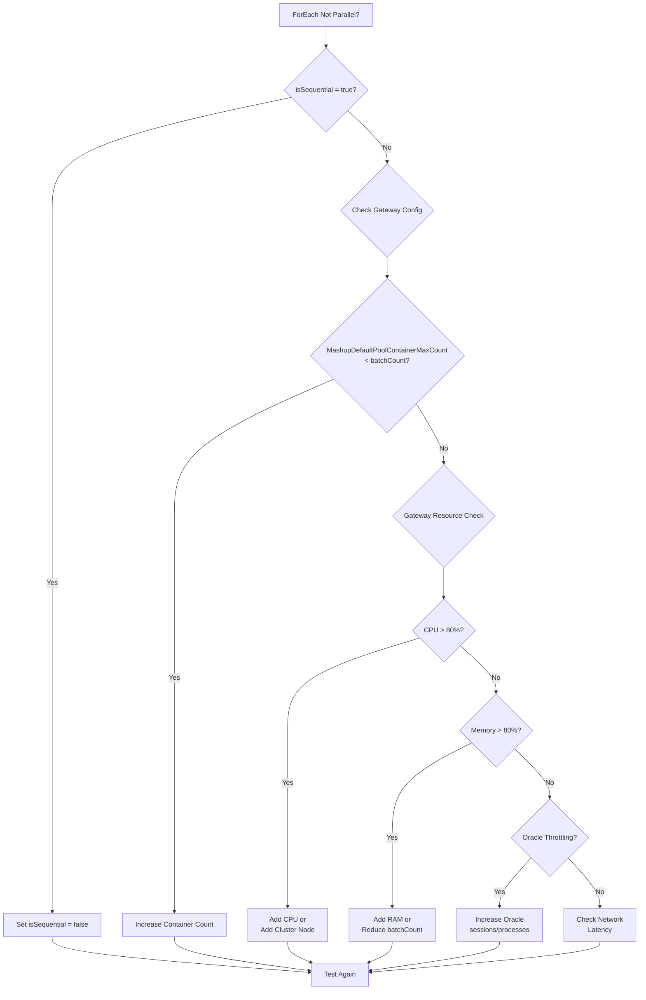
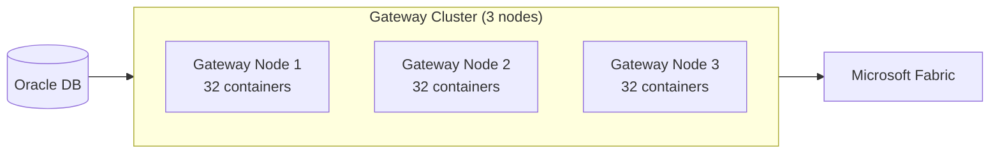

# Oracle to Fabric: Gateway & Pipeline Troubleshooting

> **Best Practices > Oracle Gateway Troubleshooting**

---

## Overview

This guide addresses common issues when moving data from on-premises Oracle to Microsoft Fabric, including slow gateway performance, ForEach loops not running in parallel, and maximizing concurrent connections.

---

## Step-by-Step Configuration Guide

Follow these steps in order to configure optimal Oracle-to-Fabric data movement.

### Prerequisites

Before starting, ensure you have:
- [ ] Administrator access to the gateway server
- [ ] Access to modify Fabric pipelines
- [ ] Oracle DBA contact (for connection limit changes if needed)

---

### Step 1: Update Gateway to Latest Version

1. **Check current version:**
   - Open **On-premises data gateway** application on your gateway server
   - Note the version number in the title bar or About section
   - Minimum required: `3000.214.2` or newer

2. **Download latest version:**
   - Go to: https://powerbi.microsoft.com/gateway/
   - Click **Download standard mode**
   - Run the installer and follow prompts

3. **Verify installation:**
   - Reopen the gateway application
   - Confirm the version updated

---

### Step 2: Configure Gateway Container Settings

1. **Open the configuration file:**
   ```
   Location: C:\Program Files\On-premises data gateway\Microsoft.PowerBI.DataMovement.Pipeline.GatewayCore.dll.config
   ```
   - Right-click Notepad → **Run as Administrator**
   - File → Open → Navigate to the path above

2. **Find the `<applicationSettings>` section** (usually near the end of the file)

3. **Add or modify these settings** inside `<Microsoft.PowerBI.DataMovement.Pipeline.GatewayCore.GatewayCoreSettings>`:

   ```xml
   <!-- SETTING 1: Maximum parallel containers (CRITICAL) -->
   <!-- Default is 8 - increase to match or exceed your ForEach batchCount -->
   <setting name="MashupDefaultPoolContainerMaxCount" serializeAs="String">
     <value>32</value>
   </setting>

   <!-- SETTING 2: Memory per container in MB -->
   <!-- Increase for large result sets -->
   <setting name="MashupDefaultPoolContainerMaxWorkingSetInMB" serializeAs="String">
     <value>4096</value>
   </setting>

   <!-- SETTING 3: DirectQuery container limit -->
   <setting name="MashupDQPoolContainerMaxCount" serializeAs="String">
     <value>16</value>
   </setting>

   <!-- SETTING 4: Disable auto-config (CRITICAL) -->
   <!-- Must be True to use your manual settings above -->
   <setting name="MashupDisableContainerAutoConfig" serializeAs="String">
     <value>True</value>
   </setting>

   <!-- SETTING 5: Enable streaming for large datasets -->
   <setting name="StreamBeforeRequestCompletes" serializeAs="String">
     <value>True</value>
   </setting>
   ```

4. **Save the file** (Ctrl+S)

5. **Verify your hardware can support these settings:**

   | Container Count | Minimum RAM | Minimum CPU |
   |-----------------|-------------|-------------|
   | 16 containers   | 16 GB       | 8 cores     |
   | 32 containers   | 32 GB       | 16 cores    |
   | 64 containers   | 64 GB       | 32 cores    |

---

### Step 3: Restart the Gateway Service

1. **Option A - Using PowerShell (Run as Administrator):**
   ```powershell
   Restart-Service PBIEgwService
   ```

2. **Option B - Using Command Prompt (Run as Administrator):**
   ```cmd
   net stop PBIEgwService
   net start PBIEgwService
   ```

3. **Option C - Using Services UI:**
   - Press `Win + R` → Type `services.msc` → Press Enter
   - Find **On-premises data gateway service**
   - Right-click → **Restart**

4. **Verify gateway is running:**
   - Open the gateway application
   - Confirm status shows "Ready"

---

### Step 4: Configure Pipeline ForEach Activity

1. **Open your pipeline** in Fabric Data Factory

2. **Click on the ForEach activity** to select it

3. **In the Settings tab**, configure:

   | Setting | Value | Notes |
   |---------|-------|-------|
   | Sequential | **Unchecked** (false) | Must be unchecked for parallel |
   | Batch count | 20 | Max is 50, set based on gateway capacity |
   | Items | Your array expression | e.g., `@activity('Lookup').output.value` |

4. **In JSON view**, verify it looks like:
   ```json
   {
     "name": "ForEachTable",
     "type": "ForEach",
     "typeProperties": {
       "isSequential": false,
       "batchCount": 20,
       "items": {
         "value": "@activity('LookupTables').output.value",
         "type": "Expression"
       }
     }
   }
   ```

---

### Step 5: Configure Copy Activity for Parallel Extraction

1. **Open the Copy Activity** inside your ForEach loop

2. **In the Source tab**, configure partitioning:

   **For Oracle tables WITH partitions:**
   - Partition option: **Physical partitions of table**

   **For Oracle tables WITHOUT partitions:**
   - Partition option: **Dynamic range**
   - Partition column: Choose a numeric/date column with good distribution (e.g., `ORDER_ID`, `TRANSACTION_DATE`)
   - Partition upper bound: Maximum value (e.g., `100000000`)
   - Partition lower bound: Minimum value (e.g., `1`)

3. **In the Settings tab**, configure:

   | Setting | Value | Notes |
   |---------|-------|-------|
   | Degree of copy parallelism | 16 | Threads within each copy activity |
   | Data Integration Units | Auto or 32 | Leave Auto for cloud, set for on-prem |

4. **In JSON view**, your source should look like:
   ```json
   {
     "source": {
       "type": "OracleSource",
       "partitionOption": "DynamicRange",
       "partitionSettings": {
         "partitionColumnName": "ORDER_ID",
         "partitionUpperBound": "100000000",
         "partitionLowerBound": "1"
       }
     },
     "parallelCopies": 16
   }
   ```

---

### Step 6: Verify Parallelism is Working

1. **Run your pipeline**

2. **Open the pipeline run** in Monitor

3. **Click on the ForEach activity** to expand it

4. **Check the Activity runs tab:**
   - Look at the **Start time** column
   - If parallelism is working: Multiple activities start within seconds of each other
   - If NOT working: Activities start one after another (sequential)

5. **Check resource utilization** on gateway server:
   ```powershell
   # Run this during pipeline execution
   Get-Process | Where-Object { $_.Name -like "*Gateway*" } |
       Select-Object Name, CPU, @{N='Memory(MB)';E={$_.WorkingSet64/1MB}}, Threads
   ```

---

### Step 7: (Optional) Configure Oracle Connection Limits

If you see connection errors in Oracle or the gateway logs:

1. **Check current Oracle limits** (requires DBA access):
   ```sql
   SELECT name, value FROM v$parameter
   WHERE name IN ('processes', 'sessions', 'open_cursors');
   ```

2. **Increase if needed** (DBA must execute):
   ```sql
   ALTER SYSTEM SET processes = 500 SCOPE=SPFILE;
   ALTER SYSTEM SET sessions = 572 SCOPE=SPFILE;
   -- Requires Oracle restart
   ```

3. **Alternative: Reduce Fabric parallelism** to match Oracle limits:
   - Reduce `batchCount` in ForEach
   - Reduce `parallelCopies` in Copy Activity

---

### Configuration Quick Reference Card

After completing all steps, your configuration should be:

| Component | Setting | Recommended Value |
|-----------|---------|-------------------|
| **Gateway Config** | MashupDefaultPoolContainerMaxCount | 32+ |
| **Gateway Config** | MashupDisableContainerAutoConfig | True |
| **Gateway Config** | MashupDefaultPoolContainerMaxWorkingSetInMB | 4096 |
| **ForEach Activity** | isSequential | false |
| **ForEach Activity** | batchCount | 20 |
| **Copy Activity** | partitionOption | DynamicRange or PhysicalPartitionsOfTable |
| **Copy Activity** | parallelCopies | 16 |

**Key Formula:**
```
Gateway Containers ≥ ForEach batchCount × 2
```

---

## Common Issues Checklist

| Symptom | Likely Cause | Solution Section |
|---------|--------------|------------------|
| ForEach not running in parallel | Gateway bottleneck or Sequential=true | [ForEach Parallelism](#foreach-parallelism-issues) |
| Slow copy despite high batchCount | Gateway container limits | [Gateway Configuration](#gateway-configuration) |
| Throttling errors (429) | Too many concurrent requests | [Concurrency Limits](#oracle-connection-limits) |
| Gateway memory errors | Insufficient container memory | [Container Settings](#mashup-container-configuration) |
| Single-threaded copy | No partitioning enabled | [Parallel Copy](#enable-oracle-parallel-copy) |

---

## Gateway Configuration

### Step 1: Verify Gateway Version

Ensure you have the latest gateway version:
```
Minimum: 3000.214.2 or newer
Recommended: Latest available
```

Download: [On-premises data gateway](https://powerbi.microsoft.com/gateway/)

### Step 2: Mashup Container Configuration

**Location:** `C:\Program Files\On-premises data gateway\Microsoft.PowerBI.DataMovement.Pipeline.GatewayCore.dll.config`

#### Critical Settings for Oracle Parallelism

```xml
<?xml version="1.0" encoding="utf-8"?>
<configuration>
  <applicationSettings>
    <Microsoft.PowerBI.DataMovement.Pipeline.GatewayCore.GatewayCoreSettings>

      <!-- CRITICAL: Maximum containers for refresh/copy operations -->
      <!-- Default: 8, Increase for parallel ForEach -->
      <setting name="MashupDefaultPoolContainerMaxCount" serializeAs="String">
        <value>32</value>
      </setting>

      <!-- Maximum memory per container in MB -->
      <!-- Increase for large result sets -->
      <setting name="MashupDefaultPoolContainerMaxWorkingSetInMB" serializeAs="String">
        <value>4096</value>
      </setting>

      <!-- CRITICAL: Maximum containers for DirectQuery -->
      <setting name="MashupDQPoolContainerMaxCount" serializeAs="String">
        <value>16</value>
      </setting>

      <!-- CRITICAL: Disable auto-config to use manual settings -->
      <setting name="MashupDisableContainerAutoConfig" serializeAs="String">
        <value>True</value>
      </setting>

      <!-- Enable streaming for large datasets -->
      <setting name="StreamBeforeRequestCompletes" serializeAs="String">
        <value>True</value>
      </setting>

    </Microsoft.PowerBI.DataMovement.Pipeline.GatewayCore.GatewayCoreSettings>
  </applicationSettings>
</configuration>
```

**After changing settings:**
1. Save the file
2. Restart the gateway service: `net stop PBIEgwService && net start PBIEgwService`

### Step 3: Gateway Sizing for Oracle Loads

| ForEach batchCount | Min Containers | CPU Cores | RAM | Network |
|--------------------|---------------|-----------|-----|---------|
| 5-10 | 16 | 8 cores | 16 GB | 1 Gbps |
| 10-20 | 32 | 16 cores | 32 GB | 10 Gbps |
| 20-50 | 64 | 32 cores | 64 GB | 10 Gbps |

**Rule of Thumb:**
```
Minimum Containers = batchCount × 2
Recommended RAM = Containers × 512 MB + 4 GB base
```

---

## ForEach Parallelism Issues

### Why ForEach Might Not Run in Parallel

#### Issue 1: Sequential Setting is True

```json
{
  "name": "ForEachTable",
  "type": "ForEach",
  "typeProperties": {
    "isSequential": true,  // ❌ PROBLEM: Forces sequential execution
    "batchCount": 10,
    "items": "@variables('tableList')"
  }
}
```

**Fix:** Set `isSequential` to `false`:

```json
{
  "name": "ForEachTable",
  "type": "ForEach",
  "typeProperties": {
    "isSequential": false,  // ✅ CORRECT: Enables parallel
    "batchCount": 10,
    "items": "@variables('tableList')"
  }
}
```

#### Issue 2: Gateway Container Limit Too Low

Even with `batchCount: 10`, if `MashupDefaultPoolContainerMaxCount` is 8, only 8 items can run in parallel.

**Diagnosis:**
```powershell
# Check current gateway settings
$configPath = "C:\Program Files\On-premises data gateway\Microsoft.PowerBI.DataMovement.Pipeline.GatewayCore.dll.config"
[xml]$config = Get-Content $configPath

$config.configuration.applicationSettings.'Microsoft.PowerBI.DataMovement.Pipeline.GatewayCore.GatewayCoreSettings'.setting |
    Where-Object { $_.name -like "*Container*" } |
    Select-Object name, value
```

**Fix:** Increase `MashupDefaultPoolContainerMaxCount` to at least match your `batchCount`.

#### Issue 3: Gateway Resource Exhaustion

If gateway CPU or memory is maxed out, parallelism degrades.

**Diagnosis:**
```powershell
# Monitor gateway process resources
Get-Process | Where-Object { $_.Name -like "*Gateway*" } |
    Select-Object Name, CPU, WorkingSet64, Threads
```

**Fix:**
- Add more RAM/CPU to gateway server
- Add gateway cluster nodes
- Reduce batchCount temporarily

#### Issue 4: Oracle Connection Pool Exhaustion

Oracle may limit concurrent connections.

**Diagnosis:** Check Oracle alert log for connection errors.

**Fix:** See [Oracle Connection Limits](#oracle-connection-limits) section.

### ForEach Behavior Deep Dive

**How ForEach Works:**
1. ForEach creates `n` internal queues where `n = batchCount`
2. Items are distributed across queues at pipeline start
3. Each queue runs **sequentially** within itself
4. Queues run **in parallel** with each other
5. No rebalancing occurs during runtime

**Example with batchCount=3 and 9 items:**
```
Queue 1: [Item1] → [Item4] → [Item7] (sequential)
Queue 2: [Item2] → [Item5] → [Item8] (sequential)  } Run in parallel
Queue 3: [Item3] → [Item6] → [Item9] (sequential)
```

**Implications:**
- If Item1 takes 10 minutes and others take 1 minute, Queue 1 becomes a bottleneck
- At any time, max `batchCount` items are running (one per queue)
- batchCount max is **50**

---

## Enable Oracle Parallel Copy

### The Most Important Setting for Oracle Performance

**Enable Data Partitioning** on the Copy Activity source:

#### Option 1: Physical Partitions (Best for Partitioned Tables)

```json
{
  "source": {
    "type": "OracleSource",
    "partitionOption": "PhysicalPartitionsOfTable"
  },
  "parallelCopies": 32
}
```

This automatically detects Oracle table partitions and copies them in parallel.

#### Option 2: Dynamic Range (For Non-Partitioned Tables)

```json
{
  "source": {
    "type": "OracleSource",
    "query": "SELECT * FROM LARGE_TABLE WHERE ORDER_DATE >= TO_DATE('2024-01-01', 'YYYY-MM-DD')",
    "partitionOption": "DynamicRange",
    "partitionSettings": {
      "partitionColumnName": "ORDER_ID",
      "partitionUpperBound": "100000000",
      "partitionLowerBound": "1"
    }
  },
  "parallelCopies": 16
}
```

#### Option 3: Use ORA_HASH for Tables Without Good Partition Columns

```sql
-- In your copy query, add ORA_HASH to create a partition column
SELECT t.*, ORA_HASH(ROWID, 15) AS partition_key
FROM LARGE_TABLE t
WHERE ...
```

Then configure:
```json
{
  "partitionOption": "DynamicRange",
  "partitionSettings": {
    "partitionColumnName": "partition_key",
    "partitionUpperBound": "15",
    "partitionLowerBound": "0"
  }
}
```

### Parallel Copy Settings

| Setting | Location | Purpose |
|---------|----------|---------|
| `parallelCopies` | Copy Activity | Max threads within single copy |
| `batchCount` | ForEach | Max concurrent copy activities |
| `MashupDefaultPoolContainerMaxCount` | Gateway config | Max gateway connections |

**Relationship:**
```
Effective Parallelism = min(
    ForEach.batchCount,
    CopyActivity.parallelCopies,
    Gateway.MashupDefaultPoolContainerMaxCount,
    Oracle.maxConcurrentConnections
)
```

---

## Oracle Connection Limits

### Oracle-Side Configuration

**Check current limits:**
```sql
-- Max processes/sessions
SELECT name, value FROM v$parameter
WHERE name IN ('processes', 'sessions', 'open_cursors');

-- Current connections
SELECT COUNT(*) AS current_connections FROM v$session WHERE username IS NOT NULL;
```

**Increase if needed (DBA required):**
```sql
ALTER SYSTEM SET processes = 500 SCOPE=SPFILE;
ALTER SYSTEM SET sessions = 572 SCOPE=SPFILE;
-- Requires database restart
```

### Fabric-Side Throttling

**In Copy Activity, limit max concurrent connections:**
```json
{
  "source": {
    "type": "OracleSource",
    "query": "SELECT * FROM MY_TABLE"
  },
  "sink": {
    "type": "LakehouseTableSink"
  },
  "parallelCopies": 16,
  "dataIntegrationUnits": 32
}
```

**Note:** If you see Oracle errors about too many connections:
1. Reduce `parallelCopies`
2. Reduce ForEach `batchCount`
3. Ask DBA to increase Oracle limits

---

## Complete Optimized Pipeline Example

### Pipeline: Parallel Oracle to Lakehouse

```json
{
  "name": "pl_oracle_parallel_optimized",
  "properties": {
    "activities": [
      {
        "name": "LookupTables",
        "type": "Lookup",
        "typeProperties": {
          "source": {
            "type": "LakehouseSource",
            "query": "SELECT * FROM config.oracle_tables WHERE is_active = 1"
          },
          "firstRowOnly": false
        }
      },
      {
        "name": "ForEachTable",
        "type": "ForEach",
        "dependsOn": [{"activity": "LookupTables", "dependencyConditions": ["Succeeded"]}],
        "typeProperties": {
          "isSequential": false,
          "batchCount": 20,
          "items": "@activity('LookupTables').output.value",
          "activities": [
            {
              "name": "CopyOracleTable",
              "type": "Copy",
              "typeProperties": {
                "source": {
                  "type": "OracleSource",
                  "query": {
                    "value": "@concat('SELECT * FROM ', item().schema_name, '.', item().table_name)",
                    "type": "Expression"
                  },
                  "partitionOption": "DynamicRange",
                  "partitionSettings": {
                    "partitionColumnName": "@item().partition_column",
                    "partitionUpperBound": "@item().partition_upper",
                    "partitionLowerBound": "@item().partition_lower"
                  }
                },
                "sink": {
                  "type": "LakehouseTableSink",
                  "tableActionOption": "Overwrite"
                },
                "parallelCopies": 16
              },
              "policy": {
                "timeout": "4.00:00:00",
                "retry": 2,
                "retryIntervalInSeconds": 60
              }
            }
          ]
        }
      }
    ]
  }
}
```

### Gateway Configuration for This Pipeline

```xml
<!-- For batchCount=20, parallelCopies=16 -->
<setting name="MashupDefaultPoolContainerMaxCount" serializeAs="String">
  <value>64</value>  <!-- 20 batchCount × 2 + buffer -->
</setting>

<setting name="MashupDefaultPoolContainerMaxWorkingSetInMB" serializeAs="String">
  <value>4096</value>  <!-- 4GB per container -->
</setting>

<setting name="MashupDisableContainerAutoConfig" serializeAs="String">
  <value>True</value>
</setting>
```

---

## Monitoring and Diagnostics

### Enable Gateway Logging

**Diagnostics Path:**
```
C:\Users\PBIEgwService\AppData\Local\Microsoft\On-premises data gateway\
```

**Enable Additional Logging:**
1. Open On-premises data gateway app
2. Go to **Diagnostics** tab
3. Enable **Additional logging**
4. Reproduce the issue
5. Disable logging when done (logs grow fast)

### Key Performance Counters

Monitor these in Windows Performance Monitor:

```
\Process(Microsoft.PowerBI.Gateway*)\% Processor Time
\Process(Microsoft.PowerBI.Gateway*)\Working Set
\Process(Microsoft.PowerBI.Gateway*)\Thread Count
\Network Interface(*)\Bytes Total/sec
\LogicalDisk(*)\Disk Transfers/sec
```

### Gateway Performance Report

Use the Power BI Gateway Performance template:
1. Download from Microsoft
2. Point to gateway log location
3. Analyze query performance

### Check ForEach Parallelism in Monitor

In Fabric Data Factory monitoring:
1. Open pipeline run
2. Click ForEach activity
3. Check **Activity runs** tab
4. Look at **Start time** of child activities

If all start times are the same (within seconds), parallelism is working.
If start times are staggered, parallelism is limited.

---

## Troubleshooting Decision Tree



---

## Quick Fix Summary

### Immediate Actions

1. **Gateway Config Changes:**
```xml
<setting name="MashupDefaultPoolContainerMaxCount" serializeAs="String">
  <value>32</value>  <!-- Match or exceed batchCount -->
</setting>
<setting name="MashupDisableContainerAutoConfig" serializeAs="String">
  <value>True</value>  <!-- CRITICAL: Use manual settings -->
</setting>
```

2. **Pipeline ForEach Settings:**
```json
{
  "isSequential": false,
  "batchCount": 20
}
```

3. **Copy Activity Settings:**
```json
{
  "partitionOption": "DynamicRange",
  "parallelCopies": 16
}
```

4. **Restart Gateway:**
```powershell
Restart-Service PBIEgwService
```

### Expected Throughput After Optimization

| Configuration | Expected Throughput |
|--------------|---------------------|
| Default (no partition) | ~100 MB/min |
| Physical Partitions | ~300-500 MB/min |
| Dynamic Range (16 partitions) | ~500-800 MB/min |
| Logical Partitioning + ForEach (20) | ~1-2 GB/min |

---

## Anti-Virus Exclusions

Add these folders to anti-virus exclusions for better performance:

```
C:\Windows\ServiceProfiles\PBIEgwService\AppData\Local\Microsoft\On-premises data gateway
C:\Windows\ServiceProfiles\PBIEgwService\AppData\Local\Microsoft\On-premises data gateway\Spooler
C:\Program Files\On-premises data gateway
```

---

## Gateway Cluster for High Availability

For maximum throughput, deploy a gateway cluster:



**Setup:**
1. Install gateway on first node
2. On additional nodes, select "Add to existing cluster"
3. Use the same recovery key
4. Configure load balancing in Fabric Admin portal

**Effective Capacity:**
```
Total Containers = Nodes × MashupDefaultPoolContainerMaxCount
Example: 3 nodes × 32 = 96 concurrent operations
```

---

[Back to Best Practices Index](./README.md)
