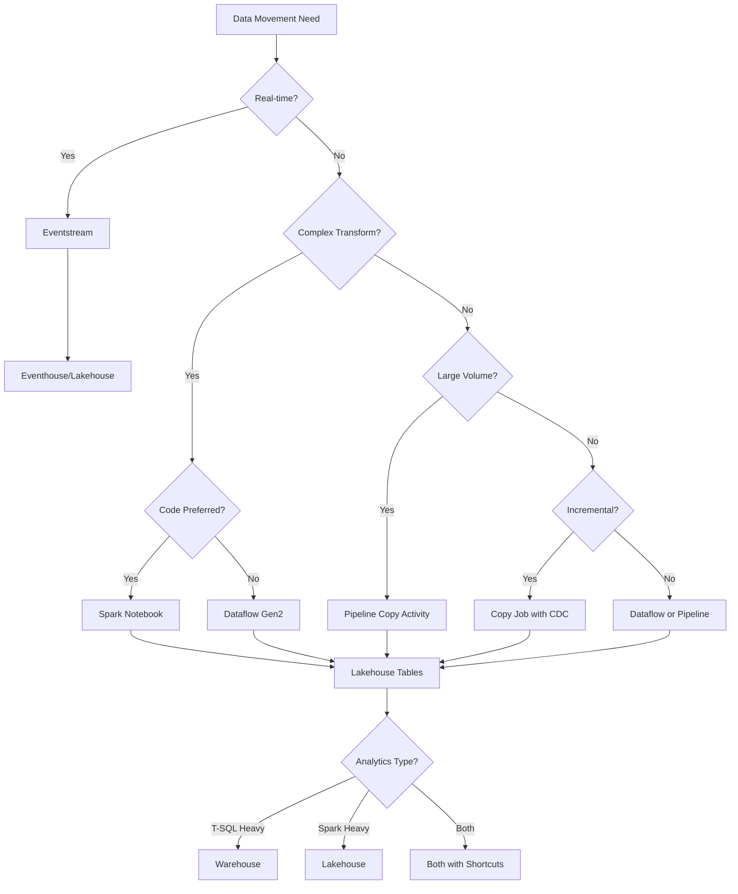

# Microsoft Fabric Best Practices Guide

> **Home > Documentation > Best Practices**

---

## Overview

This comprehensive guide provides best practices for all aspects of Microsoft Fabric implementation. Whether you're setting up workspaces, designing data pipelines, optimizing Spark jobs, or migrating from Oracle/SQL Server, this guide covers proven patterns and recommendations based on Microsoft's official guidance.

---

## Guide Index

| Document | Description |
|----------|-------------|
| [Workspaces & Naming Conventions](./01_WORKSPACES_NAMING.md) | Workspace organization, domains, naming standards |
| [Data Gateway Optimization](./02_DATA_GATEWAY.md) | Gateway sizing, parallel connections, performance tuning |
| [Pipelines & Data Movement](./03_PIPELINES_DATA_MOVEMENT.md) | ETL vs ELT, copy activity optimization, load patterns |
| [Metadata-Driven Pipelines](./04_METADATA_DRIVEN_PIPELINES.md) | Dynamic expressions, parameterization, configuration-driven ETL |
| [Spark & Notebooks](./05_SPARK_NOTEBOOKS.md) | Spark optimization, notebook best practices, library management |
| [Dataflows Gen2](./06_DATAFLOWS.md) | Query folding, staging, fast copy, modern evaluator |
| [Lakehouse Setup](./07_LAKEHOUSE_SETUP.md) | Delta Lake tables, medallion architecture, table maintenance |
| [Warehouse Configuration](./08_WAREHOUSE_SETUP.md) | Schema design, statistics, query optimization |
| [Oracle & SQL Server Patterns](./09_SOURCE_SPECIFIC_PATTERNS.md) | Large table loads, parallel extraction, incremental patterns |
| [Decision Guide](./10_DECISION_GUIDE.md) | When to use pipeline vs dataflow vs Spark vs lakehouse vs warehouse |
| [Oracle Gateway Troubleshooting](./11_ORACLE_GATEWAY_TROUBLESHOOTING.md) | Gateway config, ForEach parallelism, Oracle optimization |

---

## Quick Reference: Key Principles

### 1. Workspace Organization
- Separate workspaces by environment (Dev/Test/Prod)
- Use domains for logical grouping
- Implement consistent naming conventions
- Assign dedicated capacities for isolation

### 2. Data Movement Strategy
- Use **Pipelines** for high-volume, scheduled ETL
- Use **Dataflows** for low-code transformations
- Use **Spark** for complex transformations and ML
- Use **Eventstreams** for real-time ingestion

### 3. Performance Optimization
- Enable parallel copy with partitioning
- Optimize file sizes (100MB-1GB)
- Use Delta Lake for all analytical tables
- Implement incremental loads where possible

### 4. Medallion Architecture
```
Bronze (Raw) -> Silver (Cleansed) -> Gold (Curated)
```

---

## Architecture Decision Tree



---

## Capacity Planning Quick Reference

| Workload Profile | Recommended SKU | Use Case |
|------------------|-----------------|----------|
| Development | F2-F4 | Prototyping, testing |
| Small Team (< 10 users) | F4-F8 | Departmental analytics |
| Medium Team (10-50 users) | F16-F32 | Business unit analytics |
| Enterprise (50+ users) | F64+ | Organization-wide platform |

---

## Performance Targets

| Metric | Target | Optimization Strategy |
|--------|--------|----------------------|
| Query latency (P95) | < 5 seconds | Optimize Delta, use statistics |
| Ingestion throughput | > 100K records/min | Parallel copy, optimal file sizes |
| Pipeline duration | Minimize | Parallel activities, partitioning |
| Semantic model refresh | < 15 minutes | Incremental refresh, Direct Lake |

---

## Document Conventions

Throughout this guide:
- **Recommended** - Best practice, use by default
- **Consider** - Situational, evaluate for your use case
- **Avoid** - Anti-pattern, may cause issues
- Code examples are provided for both UI and programmatic approaches

---

## Related Resources

- [Microsoft Fabric Documentation](https://learn.microsoft.com/en-us/fabric/)
- [Fabric Capacity Calculator](https://www.microsoft.com/microsoft-fabric/capacity-estimator)
- [Fabric Community](https://community.fabric.microsoft.com/)

---

[Back to Documentation](../index.md)
