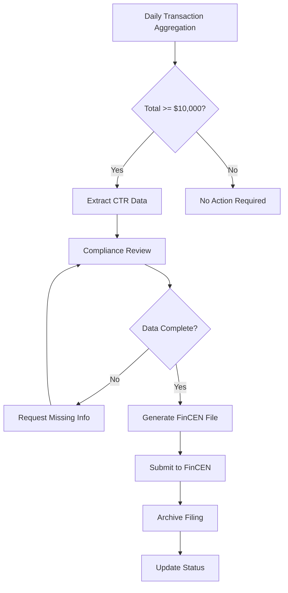

# Currency Transaction Report (CTR) Template

> **Compliance > CTR Template**

---

## Overview

This template documents the data requirements and format for Currency Transaction Reports (CTR) as required by the Bank Secrecy Act (BSA) and FinCEN regulations. CTRs must be filed for cash transactions exceeding $10,000.

---

## Regulatory Requirements

- **Threshold:** $10,000 in cash (single transaction or aggregated daily)
- **Filing Deadline:** 15 days from transaction date
- **Retention:** 5 years minimum
- **Authority:** FinCEN Form 112

---

## Data Fields Required

### Part I - Person Involved in Transaction

| Field | Source Table | Source Column | Transformation |
|-------|--------------|---------------|----------------|
| Last Name | dim_player | last_name | Direct |
| First Name | dim_player | first_name | Direct |
| Middle Name | dim_player | middle_name | Direct |
| Date of Birth | dim_player | date_of_birth | Format: YYYYMMDD |
| SSN/TIN | dim_player | ssn_encrypted | Decrypt for filing |
| Address | dim_player | address_line1, city, state, zip | Concatenate |
| ID Type | dim_player | id_type | Map to FinCEN codes |
| ID Number | dim_player | id_number_encrypted | Decrypt for filing |
| ID State | dim_player | id_state | Direct |

### Part II - Transaction Information

| Field | Source Table | Source Column | Transformation |
|-------|--------------|---------------|----------------|
| Transaction Date | bronze_financial_transactions | transaction_timestamp | Extract date |
| Transaction Amount | bronze_financial_transactions | amount | Sum if aggregated |
| Transaction Type | bronze_financial_transactions | transaction_type | Map to FinCEN codes |
| Cash In | bronze_financial_transactions | amount (where type=CASH_IN) | Sum |
| Cash Out | bronze_financial_transactions | amount (where type=CASH_OUT) | Sum |

### Part III - Casino/Card Club Information

| Field | Value |
|-------|-------|
| Legal Name | [Casino Legal Name] |
| Trade Name | [Casino DBA Name] |
| EIN | [Casino EIN] |
| Address | [Casino Address] |
| Filing Institution Contact | [Compliance Officer Name/Phone] |

---

## SQL Query for CTR Data Extraction

```sql
-- CTR Data Extraction Query
-- Run daily to identify reportable transactions

WITH daily_cash_activity AS (
    SELECT
        player_id,
        CAST(transaction_timestamp AS DATE) AS transaction_date,
        SUM(CASE WHEN transaction_type = 'CASH_IN' THEN amount ELSE 0 END) AS cash_in,
        SUM(CASE WHEN transaction_type = 'CASH_OUT' THEN amount ELSE 0 END) AS cash_out,
        SUM(amount) AS total_cash,
        COUNT(*) AS transaction_count
    FROM bronze_financial_transactions
    WHERE transaction_type IN ('CASH_IN', 'CASH_OUT')
        AND transaction_timestamp >= CURRENT_DATE - INTERVAL 1 DAY
        AND transaction_timestamp < CURRENT_DATE
    GROUP BY player_id, CAST(transaction_timestamp AS DATE)
),

ctr_candidates AS (
    SELECT
        d.*,
        p.first_name,
        p.last_name,
        p.date_of_birth,
        p.address_line1,
        p.city,
        p.state,
        p.zip_code,
        p.id_type,
        p.id_state
    FROM daily_cash_activity d
    JOIN dim_player p ON d.player_id = p.player_id
    WHERE d.total_cash >= 10000
)

SELECT
    player_id,
    transaction_date,
    first_name,
    last_name,
    date_of_birth,
    address_line1 || ', ' || city || ', ' || state || ' ' || zip_code AS full_address,
    id_type,
    id_state,
    cash_in,
    cash_out,
    total_cash,
    transaction_count,
    CASE
        WHEN total_cash >= 10000 THEN 'CTR_REQUIRED'
        ELSE 'BELOW_THRESHOLD'
    END AS filing_status
FROM ctr_candidates
ORDER BY transaction_date, total_cash DESC;
```

---

## PySpark Implementation

```python
from pyspark.sql.functions import *
from pyspark.sql.window import Window
from datetime import datetime, timedelta

def extract_ctr_candidates(process_date: str = None):
    """
    Extract CTR candidates for a given date.

    Args:
        process_date: Date to process (YYYY-MM-DD), defaults to yesterday
    """
    if process_date is None:
        process_date = (datetime.now() - timedelta(days=1)).strftime("%Y-%m-%d")

    # Read financial transactions
    df_transactions = spark.table("bronze_financial_transactions") \
        .filter(col("transaction_type").isin(["CASH_IN", "CASH_OUT"])) \
        .filter(to_date("transaction_timestamp") == process_date)

    # Aggregate by player and date
    df_daily = df_transactions.groupBy(
        "player_id",
        to_date("transaction_timestamp").alias("transaction_date")
    ).agg(
        sum(when(col("transaction_type") == "CASH_IN", col("amount")).otherwise(0)).alias("cash_in"),
        sum(when(col("transaction_type") == "CASH_OUT", col("amount")).otherwise(0)).alias("cash_out"),
        sum("amount").alias("total_cash"),
        count("*").alias("transaction_count")
    )

    # Filter CTR threshold
    df_ctr = df_daily.filter(col("total_cash") >= 10000)

    # Join with player dimension
    df_player = spark.table("dim_player") \
        .filter(col("is_current") == True) \
        .select(
            "player_id", "first_name", "last_name", "date_of_birth",
            "address_line1", "city", "state", "zip_code",
            "id_type", "id_state"
        )

    df_ctr_report = df_ctr.join(df_player, "player_id", "left")

    # Add metadata
    df_ctr_report = df_ctr_report \
        .withColumn("filing_status", lit("CTR_REQUIRED")) \
        .withColumn("report_generated_at", current_timestamp()) \
        .withColumn("filing_deadline", date_add(col("transaction_date"), 15))

    return df_ctr_report

# Execute
ctr_data = extract_ctr_candidates()
ctr_data.write.format("delta").mode("append").saveAsTable("compliance_ctr_filings")
print(f"CTR candidates extracted: {ctr_data.count()}")
```

---

## FinCEN Filing Format

```json
{
  "ctrReport": {
    "reportingInstitution": {
      "legalName": "[Casino Legal Name]",
      "tradeName": "[Casino Trade Name]",
      "ein": "[EIN]",
      "address": {
        "street": "[Address]",
        "city": "[City]",
        "state": "[State]",
        "zip": "[ZIP]"
      }
    },
    "transactions": [
      {
        "transactionDate": "2024-01-15",
        "personInvolved": {
          "lastName": "Smith",
          "firstName": "John",
          "middleName": "A",
          "dateOfBirth": "19750315",
          "ssnOrTin": "XXX-XX-1234",
          "address": "123 Main St, Las Vegas, NV 89101",
          "identification": {
            "type": "01",
            "number": "D12345678",
            "state": "NV"
          }
        },
        "cashIn": 15000.00,
        "cashOut": 0.00,
        "totalCash": 15000.00
      }
    ]
  }
}
```

---

## Filing Workflow



---

## Compliance Checklist

- [ ] Daily CTR threshold monitoring automated
- [ ] Player identification data complete
- [ ] Transaction details accurate
- [ ] Filing submitted within 15 days
- [ ] Copy retained for 5 years
- [ ] Compliance officer review documented

---

[Back to Compliance Templates](./README.md)
