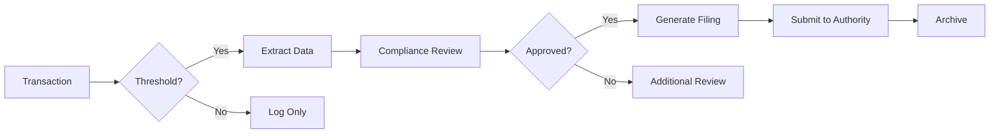

# Compliance Report Templates

> **Home > Documentation > Compliance Templates**

---

## Overview

This directory contains templates and data extraction scripts for gaming regulatory compliance reports. These templates are designed to meet the requirements of various gaming commissions and federal regulations.

---

## Template Index

| Template | Regulation | Authority | Filing Deadline |
|----------|------------|-----------|-----------------|
| [CTR Template](./CTR_TEMPLATE.md) | Title 31 / BSA | FinCEN | 15 days |
| [W-2G Template](./W2G_TEMPLATE.md) | IRS Gaming | IRS | Jan 31 / Mar 31 |
| [SAR Template](./SAR_TEMPLATE.md) | BSA | FinCEN | 30 days |
| [NIGC MICS](./MICS_TEMPLATE.md) | NIGC Regulations | NIGC | Varies |

---

## Regulatory Framework

### Federal Requirements

| Regulation | Description | Threshold |
|------------|-------------|-----------|
| **CTR** | Currency Transaction Report | Cash > $10,000 |
| **SAR** | Suspicious Activity Report | Suspicious patterns |
| **W-2G** | Gambling Winnings | Slots >= $1,200 |
| **1042-S** | Foreign Person Winnings | NRA winnings |

### State Requirements

Gaming regulations vary by jurisdiction. Common requirements include:

- Daily revenue reports
- Jackpot logs
- Patron dispute records
- Self-exclusion compliance
- Responsible gaming reports

---

## Data Sources

All compliance reports draw from these platform tables:

| Table | Purpose |
|-------|---------|
| `bronze_financial_transactions` | Cash transactions |
| `silver_slot_telemetry` | Jackpots, large wins |
| `dim_player` | Player identification |
| `gold.compliance_ctr_filings` | CTR staging |
| `gold.compliance_w2g_filings` | W-2G staging |

---

## Automation

### Daily Compliance Checks

```python
# Run daily to identify compliance events
def daily_compliance_check():
    # CTR threshold monitoring
    check_ctr_thresholds()

    # W-2G jackpot identification
    identify_reportable_jackpots()

    # SAR pattern detection
    run_sar_detection_rules()

    # Self-exclusion compliance
    verify_self_exclusion_compliance()
```

### Filing Workflow



---

## Best Practices

1. **Automate Threshold Monitoring** - Use real-time queries to flag reportable events
2. **Maintain Audit Trail** - Log all compliance decisions and filings
3. **Secure PII** - Encrypt sensitive player data
4. **Regular Testing** - Validate extraction queries quarterly
5. **Document Exceptions** - Record any manual overrides or adjustments

---

## Contact

**Compliance Questions:** compliance@casino.com
**Technical Support:** data-engineering@casino.com

---

[Back to Documentation](../index.md)
