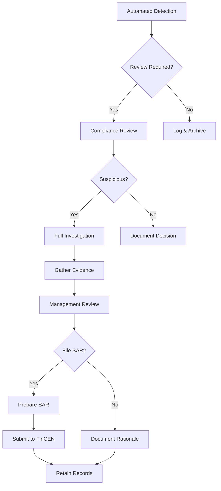

# Suspicious Activity Report (SAR) Template

> **Home > Documentation > Compliance Templates > SAR**

---

## Overview

This template provides guidance for identifying, documenting, and filing Suspicious Activity Reports (SARs) as required by the Bank Secrecy Act (BSA) and FinCEN regulations.

---

## Regulatory Requirements

| Requirement | Details |
|-------------|---------|
| **Authority** | FinCEN / Bank Secrecy Act |
| **Form** | FinCEN SAR (Form 111) |
| **Filing Deadline** | 30 days from detection |
| **Retention** | 5 years |
| **Threshold** | No minimum - pattern-based |

---

## Suspicious Activity Indicators

### Structuring Patterns

| Pattern | Description | Detection Query |
|---------|-------------|-----------------|
| **Structuring** | Multiple transactions just below $10K | Sum within 24hrs approaching $10K |
| **Smurfing** | Multiple people depositing for one player | Same beneficiary, multiple sources |
| **Chip Walking** | Converting cash to chips, cashing out without play | High buy-in, minimal play, quick cashout |
| **Minimal Gaming** | Large transactions with little actual gaming | Coin-in/buy-in ratio < 10% |

### Behavioral Indicators

- Reluctance to provide identification
- Multiple transactions in short time periods
- Unusual nervousness during transactions
- Transactions inconsistent with player profile
- Use of multiple player cards
- Cash purchases of chips followed by immediate cashout

---

## Data Extraction Query

### PySpark - Identify SAR Candidates

```python
from pyspark.sql import SparkSession
from pyspark.sql.functions import *
from pyspark.sql.window import Window

spark = SparkSession.builder.getOrCreate()

def identify_sar_candidates(lookback_days: int = 30):
    """
    Identify transactions requiring SAR review.

    Patterns detected:
    1. Structuring: Multiple transactions $8K-$9.9K within 24 hours
    2. Minimal gaming: High buy-in with < 10% play-through
    3. Rapid cashout: Cashout within 30 minutes of buy-in
    """

    df_transactions = spark.table("bronze_financial_transactions")
    df_slots = spark.table("silver_slot_telemetry")
    df_player = spark.table("dim_player")

    # Pattern 1: Structuring detection
    window_24h = Window.partitionBy("player_id").orderBy("transaction_timestamp").rangeBetween(-86400, 0)

    df_structuring = df_transactions \
        .filter(col("transaction_type").isin(["CASH_IN", "CHIP_PURCHASE"])) \
        .filter(col("amount").between(8000, 9999)) \
        .withColumn("rolling_24h_count", count("*").over(window_24h)) \
        .withColumn("rolling_24h_sum", sum("amount").over(window_24h)) \
        .filter(
            (col("rolling_24h_count") >= 2) |
            (col("rolling_24h_sum") >= 9000)
        ) \
        .withColumn("sar_reason", lit("STRUCTURING"))

    # Pattern 2: Minimal gaming ratio
    df_gaming = df_transactions \
        .filter(col("transaction_type") == "CHIP_PURCHASE") \
        .alias("t") \
        .join(
            df_slots.groupBy("player_id", to_date("event_timestamp").alias("play_date"))
                .agg(sum("bet_amount").alias("total_wagered")),
            (col("t.player_id") == col("player_id")) &
            (to_date("t.transaction_timestamp") == col("play_date")),
            "left"
        ) \
        .withColumn("play_ratio",
            coalesce(col("total_wagered") / col("amount"), lit(0))
        ) \
        .filter(
            (col("amount") >= 5000) &
            (col("play_ratio") < 0.10)
        ) \
        .select(
            col("t.player_id"),
            col("t.transaction_id"),
            col("t.transaction_timestamp"),
            col("t.amount"),
            col("play_ratio"),
            lit("MINIMAL_GAMING").alias("sar_reason")
        )

    # Pattern 3: Rapid cashout (buy-in followed by cashout < 30 min)
    df_buy = df_transactions.filter(col("transaction_type") == "CHIP_PURCHASE") \
        .select(
            col("player_id"),
            col("transaction_timestamp").alias("buy_time"),
            col("amount").alias("buy_amount")
        )

    df_cash = df_transactions.filter(col("transaction_type") == "CHIP_REDEMPTION") \
        .select(
            col("player_id"),
            col("transaction_timestamp").alias("cash_time"),
            col("amount").alias("cash_amount")
        )

    df_rapid = df_buy.join(df_cash, "player_id") \
        .filter(
            (col("cash_time") > col("buy_time")) &
            (col("cash_time") < col("buy_time") + expr("INTERVAL 30 MINUTES")) &
            (col("buy_amount") >= 5000)
        ) \
        .withColumn("sar_reason", lit("RAPID_CASHOUT"))

    # Combine all patterns
    df_candidates = df_structuring.select(
        "player_id", "transaction_id", "transaction_timestamp", "amount", "sar_reason"
    ).union(
        df_gaming.select(
            "player_id", "transaction_id", "transaction_timestamp", "amount", "sar_reason"
        )
    )

    # Enrich with player details
    df_enriched = df_candidates.join(
        df_player.select("player_id", "first_name", "last_name", "date_of_birth", "ssn_hash"),
        "player_id",
        "left"
    )

    return df_enriched

# Run detection
sar_candidates = identify_sar_candidates()
print(f"SAR candidates identified: {sar_candidates.count()}")
sar_candidates.show(20)
```

### SQL - Daily SAR Screening

```sql
-- Daily SAR candidate screening
WITH transaction_patterns AS (
    SELECT
        player_id,
        transaction_date,
        COUNT(*) as transaction_count,
        SUM(amount) as daily_total,
        COUNT(CASE WHEN amount BETWEEN 8000 AND 9999 THEN 1 END) as near_threshold_count,
        MAX(amount) as max_single_transaction,
        MIN(amount) as min_single_transaction
    FROM bronze_financial_transactions
    WHERE transaction_type IN ('CASH_IN', 'CHIP_PURCHASE')
      AND transaction_date >= DATEADD(day, -1, CURRENT_DATE)
    GROUP BY player_id, transaction_date
),
flagged_players AS (
    SELECT
        player_id,
        transaction_date,
        transaction_count,
        daily_total,
        near_threshold_count,
        CASE
            WHEN near_threshold_count >= 2 THEN 'STRUCTURING'
            WHEN daily_total >= 9000 AND transaction_count >= 3 THEN 'POTENTIAL_STRUCTURING'
            WHEN max_single_transaction - min_single_transaction < 500
                 AND transaction_count >= 3 THEN 'CONSISTENT_AMOUNTS'
            ELSE 'REVIEW'
        END as flag_reason
    FROM transaction_patterns
    WHERE near_threshold_count >= 2
       OR (daily_total >= 9000 AND transaction_count >= 3)
)
SELECT
    f.*,
    p.first_name,
    p.last_name,
    p.loyalty_tier,
    p.account_open_date
FROM flagged_players f
JOIN dim_player p ON f.player_id = p.player_id
ORDER BY f.daily_total DESC;
```

---

## SAR Filing Data Elements

### Part I - Subject Information

| Field | Source Table | Column |
|-------|--------------|--------|
| Last Name | dim_player | last_name |
| First Name | dim_player | first_name |
| Middle Name | dim_player | middle_name |
| SSN | dim_player | ssn (encrypted) |
| Date of Birth | dim_player | date_of_birth |
| Address | dim_player | address_line_1, city, state, zip |
| ID Type/Number | dim_player | id_type, id_number |
| Phone | dim_player | phone_number |
| Occupation | dim_player | occupation |
| Email | dim_player | email |

### Part II - Suspicious Activity Information

| Field | Source |
|-------|--------|
| Date of suspicious activity | Transaction timestamp range |
| Amount involved | Sum of flagged transactions |
| Type of suspicious activity | Detection pattern code |
| Instrument type | CHIPS, CASH, CHECK, etc. |
| How activity was detected | Automated screening / Employee report |

### Part III - Narrative

The narrative should include:
1. Who conducted the activity
2. What suspicious activity occurred
3. When it occurred
4. Where it occurred (property, cage, table, etc.)
5. Why it is suspicious
6. How it was conducted

---

## Investigation Workflow



---

## Automated Alerts Configuration

### Real-Time KQL Alert

```kql
// Real-time structuring alert for Eventhouse
FinancialTransactions
| where TransactionType in ("CASH_IN", "CHIP_PURCHASE")
| where Amount between (8000 .. 9999)
| summarize
    TransactionCount = count(),
    TotalAmount = sum(Amount),
    Transactions = make_list(pack("id", TransactionId, "amount", Amount, "time", TransactionTimestamp))
    by PlayerId, bin(TransactionTimestamp, 24h)
| where TransactionCount >= 2 or TotalAmount >= 18000
| extend AlertSeverity = case(
    TransactionCount >= 3, "HIGH",
    TotalAmount >= 25000, "HIGH",
    "MEDIUM"
)
| project
    AlertTime = now(),
    PlayerId,
    TransactionCount,
    TotalAmount,
    AlertSeverity,
    Transactions
```

---

## Record Retention

| Record Type | Retention Period |
|-------------|------------------|
| SAR filing | 5 years from filing date |
| Supporting documentation | 5 years from filing date |
| Investigation notes | 5 years from filing date |
| Negative decisions | 5 years from review date |
| Training records | 5 years |

---

## Quality Checklist

- [ ] All subject identification verified
- [ ] Transaction records attached
- [ ] Narrative complete (who, what, when, where, why, how)
- [ ] Supervisor review completed
- [ ] Filed within 30 days of detection
- [ ] Supporting documentation archived
- [ ] No tip-off to subject

---

## Contact

**BSA Officer:** bsa-officer@casino.com
**Compliance Hotline:** compliance@casino.com
**FinCEN E-Filing:** https://bsaefiling.fincen.treas.gov

---

[Back to Compliance Templates](./README.md)
