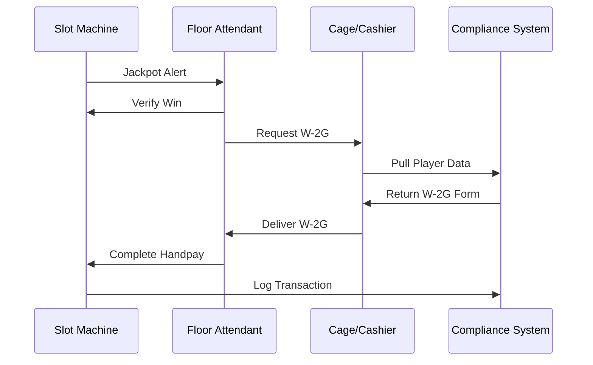

# W-2G Gaming Winnings Report Template

> **Compliance > W-2G Template**

---

## Overview

IRS Form W-2G reports certain gambling winnings to the IRS. Casinos must file W-2G forms for slot machine winnings of $1,200 or more, and withhold taxes when required.

---

## Reporting Thresholds

| Game Type | W-2G Threshold | Withholding Threshold |
|-----------|----------------|----------------------|
| Slot Machines | $1,200+ | $5,000+ (or no TIN provided) |
| Keno | $1,500+ | $5,000+ |
| Poker Tournaments | $5,000+ | Net winnings basis |
| Bingo | $1,200+ | $5,000+ |
| Other | $600+ (if 300:1 odds) | $5,000+ |

---

## Data Fields Required

### Winner Information (Boxes 1-14)

| Box | Field | Source | Notes |
|-----|-------|--------|-------|
| 1 | Gross Winnings | win_amount | Pre-tax amount |
| 2 | Date Won | event_timestamp | Date of jackpot |
| 3 | Type of Wager | event_type | Slot, Poker, etc. |
| 4 | Federal Tax Withheld | calculated | 24% if required |
| 5 | Transaction/Ticket | session_id | Unique identifier |
| 6 | Race/Game | machine_id | Machine or table |
| 7 | Winnings from Identical Wagers | - | Usually N/A for slots |
| 8-11 | State Tax Info | calculated | State-specific |
| 12 | Winner's TIN | player.ssn | Required |
| 13 | Winner's Name/Address | player.* | Full details |
| 14 | Payer's Info | casino.* | Casino details |

---

## SQL Query for W-2G Data

```sql
-- W-2G Data Extraction
-- Identifies jackpots requiring W-2G filing

SELECT
    s.event_id AS transaction_id,
    s.event_timestamp AS win_date,
    s.machine_id,
    s.casino_id,
    s.player_id,
    s.win_amount AS gross_winnings,
    -- Federal withholding (24% if no SSN or winnings > $5000)
    CASE
        WHEN s.win_amount >= 5000 OR p.ssn_last_four IS NULL
        THEN s.win_amount * 0.24
        ELSE 0
    END AS federal_withholding,
    -- State withholding varies by state
    CASE p.state
        WHEN 'NV' THEN 0  -- Nevada has no state income tax
        WHEN 'CA' THEN s.win_amount * 0.07
        WHEN 'NJ' THEN s.win_amount * 0.03
        ELSE 0
    END AS state_withholding,
    p.first_name,
    p.last_name,
    p.ssn_last_four,
    p.address_line1,
    p.city,
    p.state,
    p.zip_code,
    s.denomination,
    'Slot Machine' AS wager_type
FROM silver_slot_telemetry s
JOIN dim_player p ON s.player_id = p.player_id AND p.is_current = TRUE
WHERE s.win_amount >= 1200
    AND s.event_type IN ('JACKPOT', 'WIN')
    AND s.event_timestamp >= CURRENT_DATE - INTERVAL 1 DAY
    AND s.event_timestamp < CURRENT_DATE
ORDER BY s.win_amount DESC;
```

---

## PySpark Implementation

```python
from pyspark.sql.functions import *
from pyspark.sql.types import *
from datetime import datetime, timedelta

def extract_w2g_candidates(process_date: str = None):
    """
    Extract W-2G candidates for jackpots >= $1,200.
    """
    if process_date is None:
        process_date = (datetime.now() - timedelta(days=1)).strftime("%Y-%m-%d")

    # Read silver slot data
    df_slots = spark.table("silver_slot_telemetry") \
        .filter(col("is_large_win") == True) \
        .filter(to_date("event_timestamp") == process_date)

    # Join with player dimension
    df_player = spark.table("dim_player") \
        .filter(col("is_current") == True)

    df_w2g = df_slots.join(df_player, "player_id", "left")

    # Calculate withholding
    df_w2g = df_w2g \
        .withColumn("requires_withholding",
            (col("win_amount") >= 5000) | col("ssn_last_four").isNull()) \
        .withColumn("federal_withholding",
            when(col("requires_withholding"), col("win_amount") * 0.24)
            .otherwise(0)) \
        .withColumn("state_withholding",
            when(col("state") == "NV", 0)
            .when(col("state") == "CA", col("win_amount") * 0.07)
            .when(col("state") == "NJ", col("win_amount") * 0.03)
            .otherwise(0)) \
        .withColumn("net_payment",
            col("win_amount") - col("federal_withholding") - col("state_withholding"))

    # Select W-2G fields
    df_w2g_report = df_w2g.select(
        col("event_id").alias("transaction_id"),
        col("event_timestamp").alias("win_date"),
        col("machine_id"),
        col("casino_id"),
        col("player_id"),
        col("win_amount").alias("gross_winnings"),
        col("federal_withholding"),
        col("state_withholding"),
        col("net_payment"),
        col("first_name"),
        col("last_name"),
        col("address_line1"),
        col("city"),
        col("state"),
        col("zip_code"),
        lit("Slot Machine").alias("wager_type"),
        current_timestamp().alias("report_generated_at")
    )

    return df_w2g_report

# Execute
w2g_data = extract_w2g_candidates()
w2g_data.write.format("delta").mode("append").saveAsTable("compliance_w2g_filings")
print(f"W-2G records extracted: {w2g_data.count()}")
```

---

## Handpay Process

When a jackpot >= $1,200 is hit:



---

## Filing Requirements

1. **To IRS:** File Copy A by February 28 (paper) or March 31 (electronic)
2. **To Winner:** Provide Copy B and C by January 31
3. **Retain:** Keep Copy D for 4 years

---

## W-2G Form Fields Mapping

```json
{
  "form": "W-2G",
  "taxYear": 2024,
  "payer": {
    "name": "[Casino Name]",
    "address": "[Casino Address]",
    "tin": "[Casino EIN]",
    "telephoneNumber": "[Casino Phone]"
  },
  "winner": {
    "tin": "[Player SSN]",
    "name": "[Player Name]",
    "address": "[Player Address]"
  },
  "boxes": {
    "box1_grossWinnings": 5000.00,
    "box2_dateWon": "2024-01-15",
    "box3_typeOfWager": "Slot Machine",
    "box4_federalIncomeTaxWithheld": 1200.00,
    "box5_transaction": "TXN-12345",
    "box6_race": "Machine SLT-4567",
    "box7_identicalWagers": 0,
    "box13_statePayerStateId": "[State ID]",
    "box14_stateIncome": 5000.00,
    "box15_stateTaxWithheld": 0
  }
}
```

---

[Back to Compliance Templates](./README.md)
