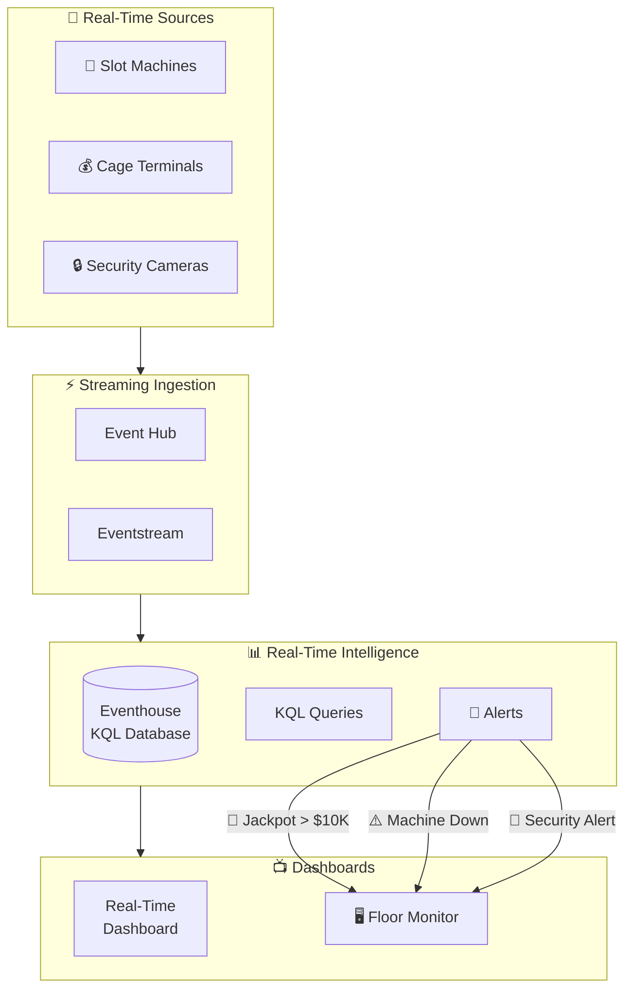
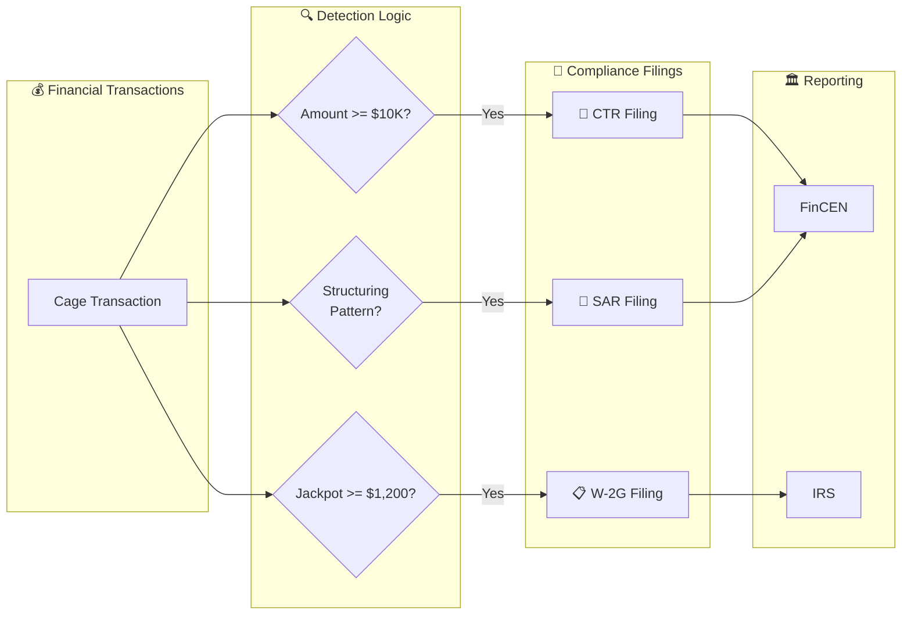
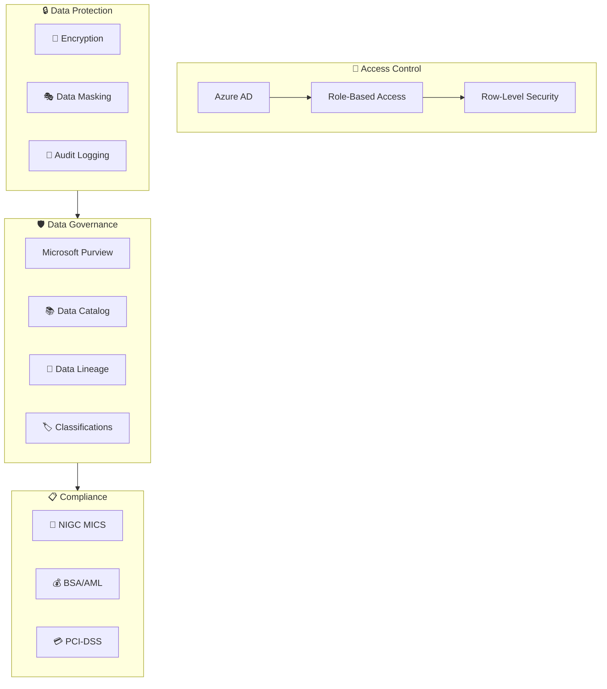
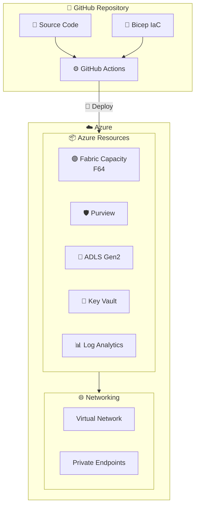

# 📊 Architecture Diagrams

> 🏠 [Home](../../README.md) > 📚 [Docs](../) > 📊 Architecture Diagrams

**Last Updated:** `2025-01-21` | **Version:** 1.0.0

---

## 📑 Table of Contents

- [🏛️ High-Level Architecture](#️-high-level-architecture)
- [🎰 Data Flow - Slot Telemetry](#-data-flow---slot-telemetry)
- [⚡ Real-Time Architecture](#-real-time-architecture)
- [📋 Compliance Data Flow](#-compliance-data-flow)
- [🔐 Security & Governance](#-security--governance)
- [🚀 Deployment Architecture](#-deployment-architecture)
- [🤖 Machine Learning Pipeline](#-machine-learning-pipeline)
- [🛠️ How to Use These Diagrams](#️-how-to-use-these-diagrams)

---

## 🏛️ High-Level Architecture

This diagram shows the complete data flow from source systems through the medallion architecture to analytics.

```mermaid
flowchart TB
    subgraph Sources["🎰 Data Sources"]
        SAS["🎰 Slot Machines<br/>SAS Protocol"]
        TG["🃏 Table Games<br/>RFID/Terminals"]
        LMS["👤 Loyalty System"]
        CAGE["💰 Cage Operations"]
        SEC["🔒 Security/Surveillance"]
        COMP["📋 Compliance Systems"]
    end

    subgraph Ingestion["📥 Ingestion Layer"]
        ES["⚡ Eventstreams<br/>Real-Time"]
        DF["📊 Dataflows Gen2<br/>Batch"]
        PIPE["🔧 Data Pipelines"]
    end

    subgraph Fabric["☁️ Microsoft Fabric"]
        subgraph Bronze["🥉 Bronze Layer"]
            B_SLOT[bronze_slot_telemetry]
            B_TABLE[bronze_table_games]
            B_PLAYER[bronze_player_profile]
            B_FIN[bronze_financial_txn]
            B_SEC[bronze_security_events]
            B_COMP[bronze_compliance]
        end

        subgraph Silver["🥈 Silver Layer"]
            S_SLOT[silver_slot_cleansed]
            S_TABLE[silver_table_enriched]
            S_PLAYER[silver_player_master]
            S_FIN[silver_financial_reconciled]
            S_SEC[silver_security_enriched]
            S_COMP[silver_compliance_validated]
        end

        subgraph Gold["🥇 Gold Layer"]
            G_SLOT[gold_slot_performance]
            G_TABLE[gold_table_analytics]
            G_PLAYER[gold_player_360]
            G_FIN[gold_financial_summary]
            G_SEC[gold_security_dashboard]
            G_COMP[gold_compliance_reporting]
        end

        subgraph Analytics["📈 Analytics"]
            DL["🔗 Direct Lake<br/>Semantic Model"]
            PBI["📊 Power BI<br/>Reports"]
            RTD["⏱️ Real-Time<br/>Dashboards"]
        end
    end

    subgraph Governance["🛡️ Governance"]
        PV["Microsoft Purview"]
    end

    Sources --> Ingestion
    Ingestion --> Bronze
    Bronze --> Silver
    Silver --> Gold
    Gold --> Analytics
    Fabric --> Governance

    style Bronze fill:#CD7F32,color:#000
    style Silver fill:#C0C0C0,color:#000
    style Gold fill:#FFD700,color:#000
```

> ℹ️ **Note:** The medallion architecture (Bronze > Silver > Gold) provides progressive data refinement with clear separation of concerns.

---

## 🎰 Data Flow - Slot Telemetry

This diagram illustrates the complete journey of slot machine data through all layers.

```mermaid
flowchart LR
    subgraph Source["🎰 Slot Machine"]
        SM["SAS Protocol<br/>Events"]
    end

    subgraph Bronze["🥉 Bronze Layer"]
        B1["📥 Raw Events"]
        B2["🏷️ Add Metadata"]
        B3[("bronze_slot_telemetry")]
    end

    subgraph Silver["🥈 Silver Layer"]
        S1["✅ Schema Validation"]
        S2["🔍 Data Quality"]
        S3["🔄 Deduplication"]
        S4[("silver_slot_cleansed")]
    end

    subgraph Gold["🥇 Gold Layer"]
        G1["📊 Daily Aggregation"]
        G2["📈 KPI Calculation"]
        G3[("gold_slot_performance")]
    end

    subgraph BI["📊 Analytics"]
        PBI["Power BI Dashboard"]
    end

    SM --> B1 --> B2 --> B3
    B3 --> S1 --> S2 --> S3 --> S4
    S4 --> G1 --> G2 --> G3
    G3 --> PBI

    style Bronze fill:#CD7F32,color:#000
    style Silver fill:#C0C0C0,color:#000
    style Gold fill:#FFD700,color:#000
```

### Transformation Summary

| Layer | Transformations | Output |
|-------|-----------------|--------|
| 🥉 Bronze | Add metadata (`_ingested_at`, `_source_file`) | Raw events preserved |
| 🥈 Silver | Validate schema, deduplicate, quality checks | Cleansed records |
| 🥇 Gold | Aggregate to machine/day, calculate KPIs | Performance metrics |

---

## ⚡ Real-Time Architecture

This diagram shows the real-time data ingestion and processing flow for live floor monitoring.

### Alert Configuration

| Alert Type | Condition | Action |
|------------|-----------|--------|
| 🎰 Jackpot Alert | Amount >= $10,000 | Notify floor manager |
| ⚠️ Machine Down | No events > 5 min | Create maintenance ticket |
| 🚨 Security Alert | Anomaly detected | Alert security team |

---

## 📋 Compliance Data Flow

This diagram shows how financial transactions are monitored for regulatory compliance.

### Regulatory Thresholds

| Report | Threshold | Deadline | Regulatory Body |
|--------|-----------|----------|-----------------|
| 📄 CTR | $10,000+ cash | 15 days | FinCEN |
| 🚨 SAR | Suspicious pattern | 30 days | FinCEN |
| 📋 W-2G | $1,200+ (slots), $600+ (keno) | At payout | IRS |

> ⚠️ **Warning:** Failure to file required reports can result in significant penalties. Ensure automated detection is validated regularly.

---

## 🔐 Security & Governance

This diagram illustrates the security and governance framework.

### Security Controls Matrix

| Layer | Controls | Tools |
|-------|----------|-------|
| 🔑 Identity | SSO, MFA, Conditional Access | Azure AD |
| 🔒 Data | Encryption, Masking, Tokenization | Key Vault, Purview |
| 📝 Audit | Activity logs, Access logs | Log Analytics |
| 📋 Compliance | Policy enforcement, Reporting | Purview, Custom |

---

## 🚀 Deployment Architecture

This diagram shows the CI/CD pipeline and infrastructure deployment flow.

### Deployment Environments

| Environment | SKU | Auto-pause | Private Endpoints |
|-------------|-----|------------|-------------------|
| 🔧 Development | F2/F4 | Yes | Optional |
| 🧪 Staging | F16/F32 | Yes | Recommended |
| 🏭 Production | F64+ | No | Required |

---

## 🤖 Machine Learning Pipeline

This diagram shows the ML workflow for player analytics and predictions.

```mermaid
flowchart LR
    subgraph Data["📊 Data Preparation"]
        GOLD["🥇 Gold Layer"]
        FEAT["🔧 Feature Engineering"]
    end

    subgraph Training["🎯 Model Training"]
        SPLIT["📊 Train/Test Split"]
        TRAIN["🤖 Model Training"]
        EVAL["📈 Evaluation"]
    end

    subgraph MLOps["⚙️ MLOps"]
        MLFLOW["📦 MLflow Registry"]
        VERSION["🏷️ Model Versioning"]
    end

    subgraph Inference["🔮 Inference"]
        BATCH["📥 Batch Scoring"]
        SCORES["📊 Predictions"]
    end

    GOLD --> FEAT --> SPLIT
    SPLIT --> TRAIN --> EVAL
    EVAL --> MLFLOW --> VERSION
    VERSION --> BATCH --> SCORES
```

### ML Use Cases

| Use Case | Model Type | Input Features | Output |
|----------|------------|----------------|--------|
| 🎯 Player Churn | Classification | Activity, spend, tenure | Churn probability |
| 💰 LTV Prediction | Regression | Historical spend, frequency | Lifetime value |
| 🎁 Offer Response | Classification | Player profile, history | Response likelihood |
| 🚨 Fraud Detection | Anomaly | Transaction patterns | Risk score |

---

## 🛠️ How to Use These Diagrams

### In Documentation

Copy Mermaid code blocks into any markdown renderer that supports Mermaid:

- GitHub (native support)
- GitLab (native support)
- VS Code (with Mermaid extension)
- Notion (with code blocks)

### In Power BI

1. Export diagrams as PNG/SVG from [Mermaid Live Editor](https://mermaid.live)
2. Embed images in Power BI reports
3. Use for documentation pages

### In Presentations

1. Open [Mermaid Live Editor](https://mermaid.live)
2. Paste diagram code
3. Export as PNG or SVG
4. Import into PowerPoint/Google Slides

### In Purview

Reference these diagrams for lineage documentation in Microsoft Purview data catalog.

---

## 🔧 Diagram Tools

| Tool | Description | Link |
|------|-------------|------|
| Mermaid Live Editor | Online editor and export | [mermaid.live](https://mermaid.live) |
| VS Code Extension | Preview in editor | [Marketplace](https://marketplace.visualstudio.com/items?itemName=bierner.markdown-mermaid) |
| GitHub | Native rendering | [Blog Post](https://github.blog/2022-02-14-include-diagrams-markdown-files-mermaid/) |

---

## 📚 Related Documentation

| Document | Description |
|----------|-------------|
| [🏗️ Architecture](../ARCHITECTURE.md) | Full architecture documentation |
| [🚀 Deployment Guide](../DEPLOYMENT.md) | Infrastructure deployment |
| [🔐 Security Guide](../SECURITY.md) | Security controls |

---

[⬆️ Back to top](#-architecture-diagrams)

---

> 📖 **Documentation maintained by:** Microsoft Fabric POC Team
> 🔗 **Repository:** [Supercharge_Microsoft_Fabric](https://github.com/fgarofalo56/Supercharge_Microsoft_Fabric)
