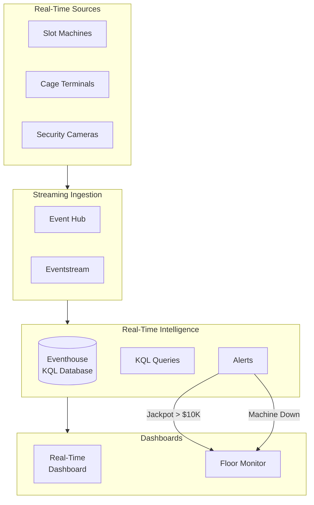
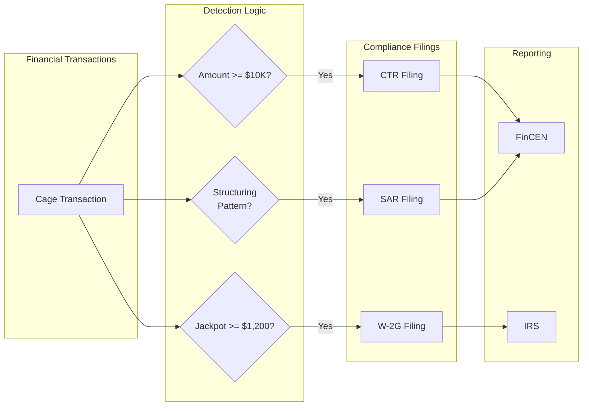
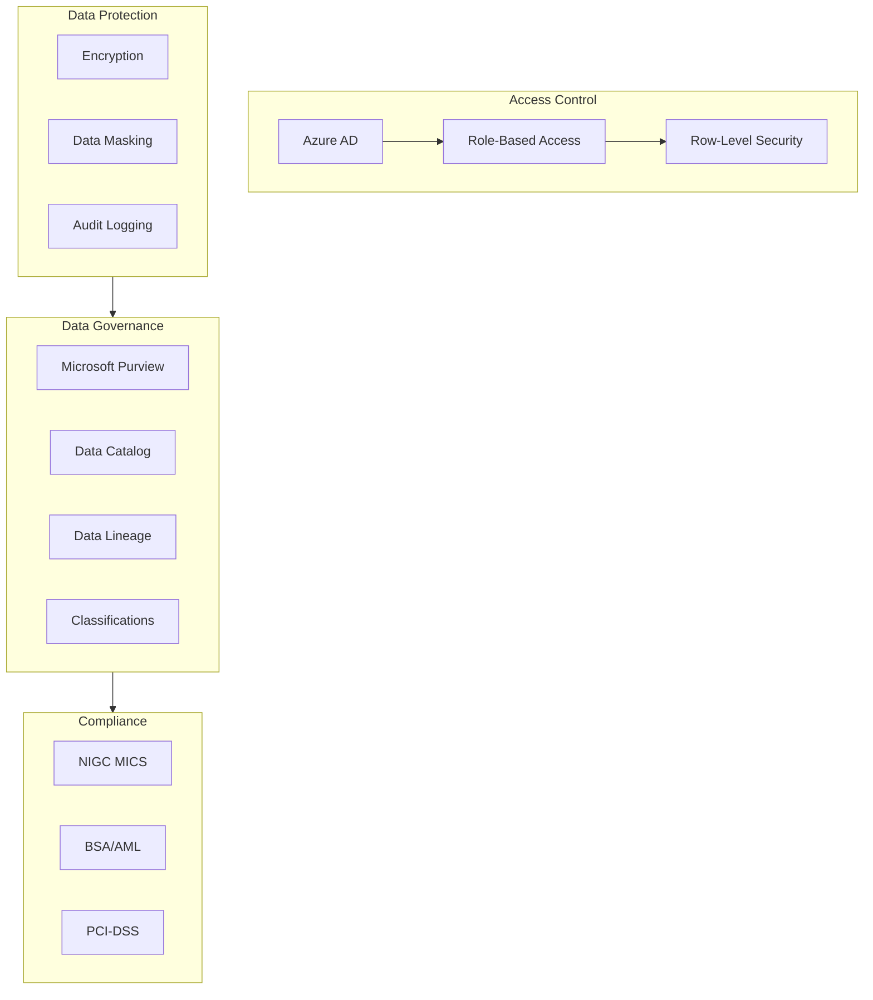
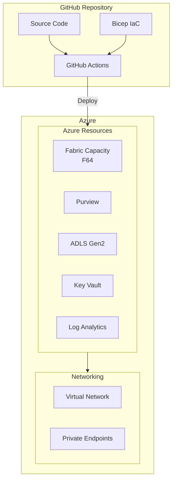
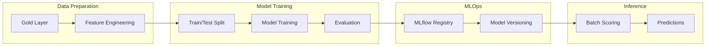

# Architecture Diagrams

This document contains Mermaid diagrams for the Casino Fabric POC architecture.

## High-Level Architecture

```mermaid
flowchart TB
    subgraph Sources["Data Sources"]
        SAS[Slot Machines<br/>SAS Protocol]
        TG[Table Games<br/>RFID/Terminals]
        LMS[Loyalty System]
        CAGE[Cage Operations]
        SEC[Security/Surveillance]
        COMP[Compliance Systems]
    end

    subgraph Ingestion["Ingestion Layer"]
        ES[Eventstreams<br/>Real-Time]
        DF[Dataflows Gen2<br/>Batch]
        PIPE[Data Pipelines]
    end

    subgraph Fabric["Microsoft Fabric"]
        subgraph Bronze["Bronze Layer"]
            B_SLOT[bronze_slot_telemetry]
            B_TABLE[bronze_table_games]
            B_PLAYER[bronze_player_profile]
            B_FIN[bronze_financial_txn]
            B_SEC[bronze_security_events]
            B_COMP[bronze_compliance]
        end

        subgraph Silver["Silver Layer"]
            S_SLOT[silver_slot_cleansed]
            S_TABLE[silver_table_enriched]
            S_PLAYER[silver_player_master]
            S_FIN[silver_financial_reconciled]
            S_SEC[silver_security_enriched]
            S_COMP[silver_compliance_validated]
        end

        subgraph Gold["Gold Layer"]
            G_SLOT[gold_slot_performance]
            G_TABLE[gold_table_analytics]
            G_PLAYER[gold_player_360]
            G_FIN[gold_financial_summary]
            G_SEC[gold_security_dashboard]
            G_COMP[gold_compliance_reporting]
        end

        subgraph Analytics["Analytics"]
            DL[Direct Lake<br/>Semantic Model]
            PBI[Power BI<br/>Reports]
            RTD[Real-Time<br/>Dashboards]
        end
    end

    subgraph Governance["Governance"]
        PV[Microsoft Purview]
    end

    Sources --> Ingestion
    Ingestion --> Bronze
    Bronze --> Silver
    Silver --> Gold
    Gold --> Analytics
    Fabric --> Governance

    style Bronze fill:#CD7F32
    style Silver fill:#C0C0C0
    style Gold fill:#FFD700
```

## Data Flow - Slot Telemetry

```mermaid
flowchart LR
    subgraph Source["Slot Machine"]
        SM[SAS Protocol<br/>Events]
    end

    subgraph Bronze["Bronze Layer"]
        B1[Raw Events]
        B2[Add Metadata]
        B3[bronze_slot_telemetry]
    end

    subgraph Silver["Silver Layer"]
        S1[Schema Validation]
        S2[Data Quality]
        S3[Deduplication]
        S4[silver_slot_cleansed]
    end

    subgraph Gold["Gold Layer"]
        G1[Daily Aggregation]
        G2[KPI Calculation]
        G3[gold_slot_performance]
    end

    subgraph BI["Analytics"]
        PBI[Power BI Dashboard]
    end

    SM --> B1 --> B2 --> B3
    B3 --> S1 --> S2 --> S3 --> S4
    S4 --> G1 --> G2 --> G3
    G3 --> PBI
```

## Real-Time Architecture

## Compliance Data Flow

## Security & Governance

## Deployment Architecture

## Machine Learning Pipeline

## How to Use These Diagrams

1. **In Documentation**: Copy Mermaid code blocks into any markdown renderer that supports Mermaid
2. **In Power BI**: Export as images and embed in reports
3. **In Presentations**: Use online Mermaid editors to export as PNG/SVG
4. **In Purview**: Reference for lineage documentation

## Diagram Tools

- [Mermaid Live Editor](https://mermaid.live)
- [VS Code Mermaid Extension](https://marketplace.visualstudio.com/items?itemName=bierner.markdown-mermaid)
- [GitHub Native Support](https://github.blog/2022-02-14-include-diagrams-markdown-files-mermaid/)
