# Cost Breakdown Diagrams

> [Home](../../index.md) > [Docs](../) > [Diagrams](./) > Cost Breakdown

**Last Updated:** `2025-01-21` | **Version:** 1.0.0

---

## Table of Contents

- [Production POC Cost Distribution](#production-poc-cost-distribution)
- [Cost Comparison by Environment](#cost-comparison-by-environment)
- [Fabric SKU Cost Comparison](#fabric-sku-cost-comparison)
- [Cost Optimization Opportunities](#cost-optimization-opportunities)
- [Monthly Cost Forecast](#monthly-cost-forecast)

---

## Production POC Cost Distribution

Distribution of monthly costs for a full production POC deployment (F64, 24/7).

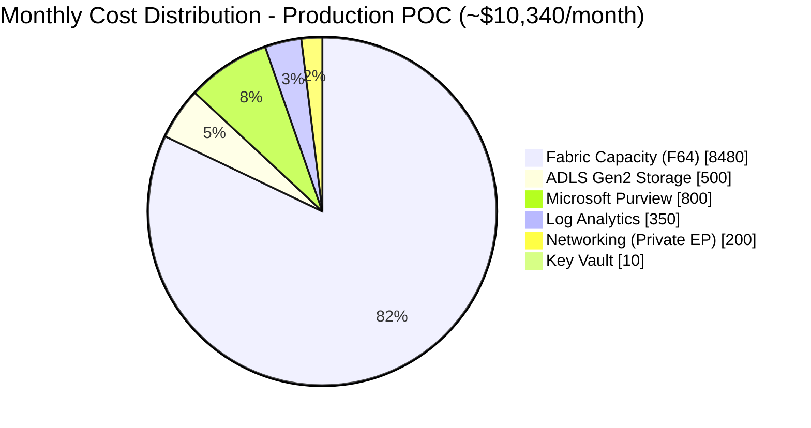

### Key Insights

- **Fabric Capacity** represents approximately **82%** of total costs
- Storage and governance combined represent **13%** of costs
- Monitoring and security infrastructure represent **5%** of costs

---

## Cost Comparison by Environment

Comparison of monthly costs across different deployment environments.

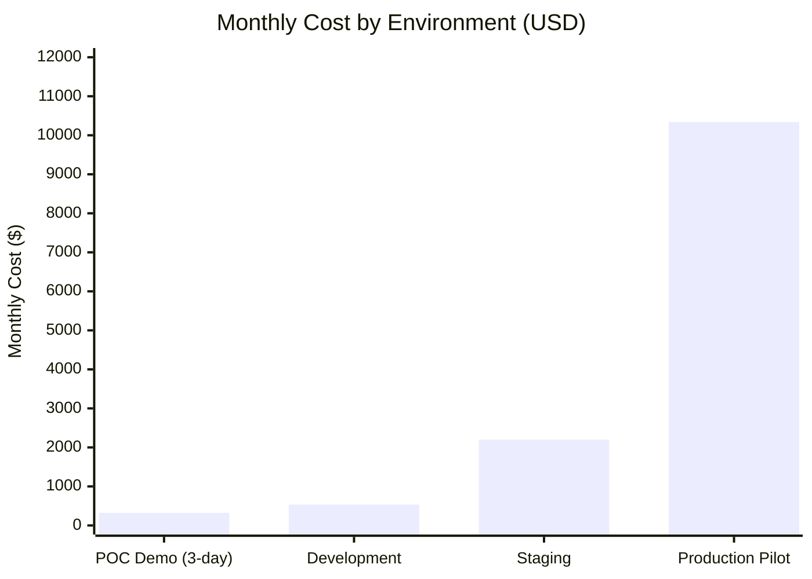

### Environment Cost Breakdown

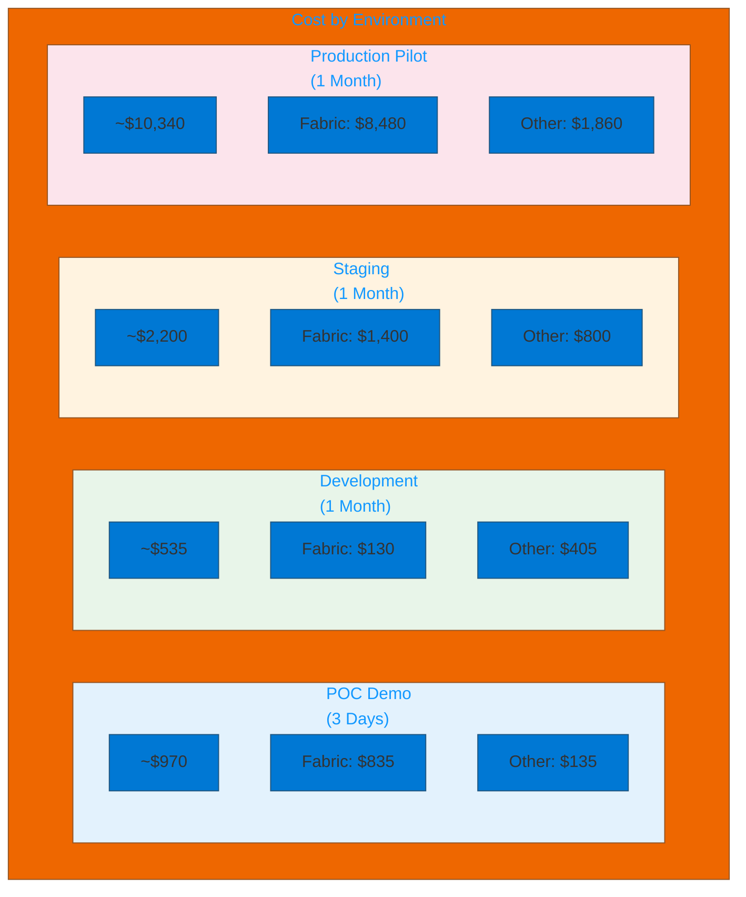

---

## Fabric SKU Cost Comparison

Comparison of Fabric capacity SKUs by monthly cost at different usage patterns.

```mermaid
xychart-beta
    title "Fabric SKU Monthly Costs by Usage Pattern"
    x-axis ["F2", "F4", "F8", "F16", "F32", "F64"]
    y-axis "Monthly Cost ($)" 0 --> 9000
    bar "24/7" [265, 530, 1060, 2120, 4240, 8480]
    bar "12hr/day" [133, 265, 530, 1060, 2120, 4240]
    bar "8hr/day (weekdays)" [88, 176, 353, 706, 1413, 2827]
```

### SKU Selection Decision Tree

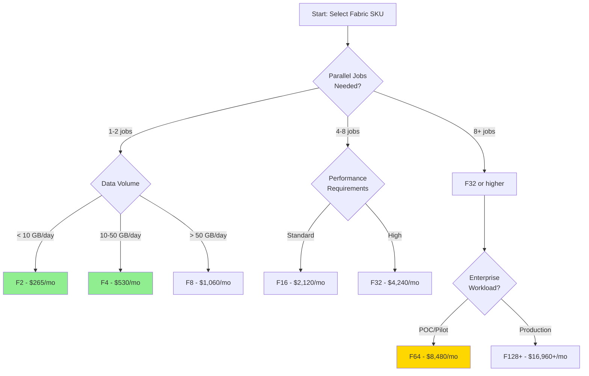

---

## Cost Optimization Opportunities

Visualization of potential savings through optimization strategies.

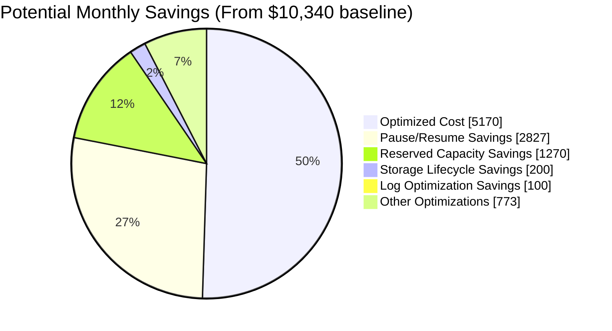

### Optimization Strategy Flow

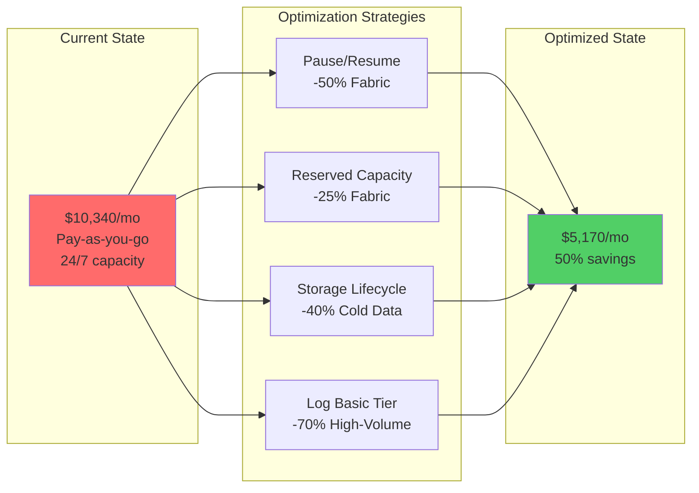

### Savings Breakdown by Strategy

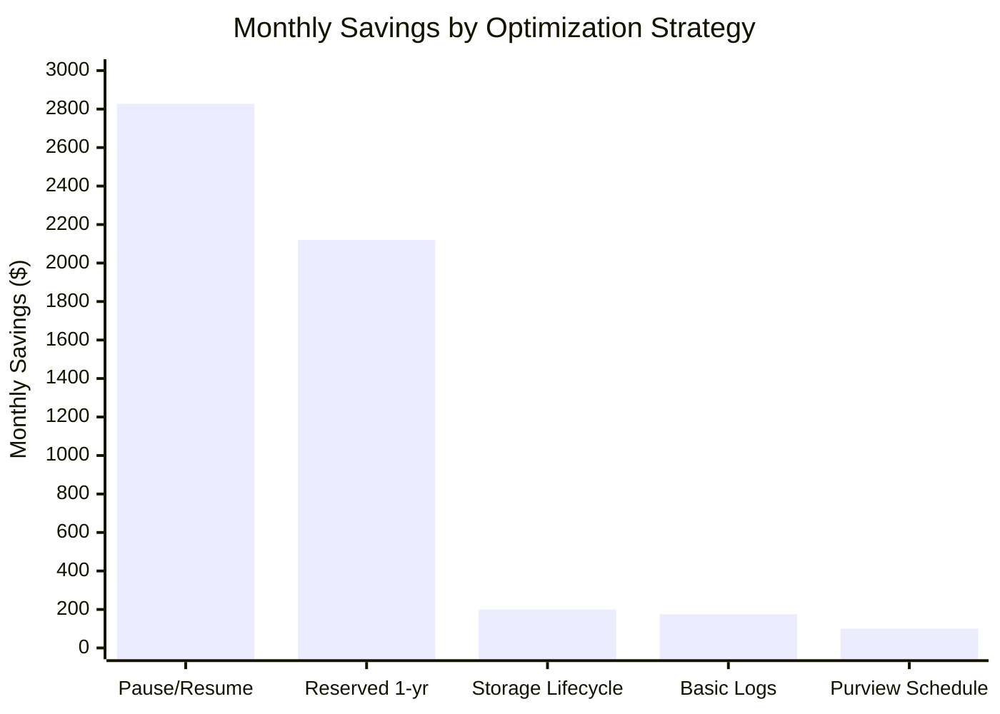

---

## Monthly Cost Forecast

Projected costs over a 6-month POC timeline.

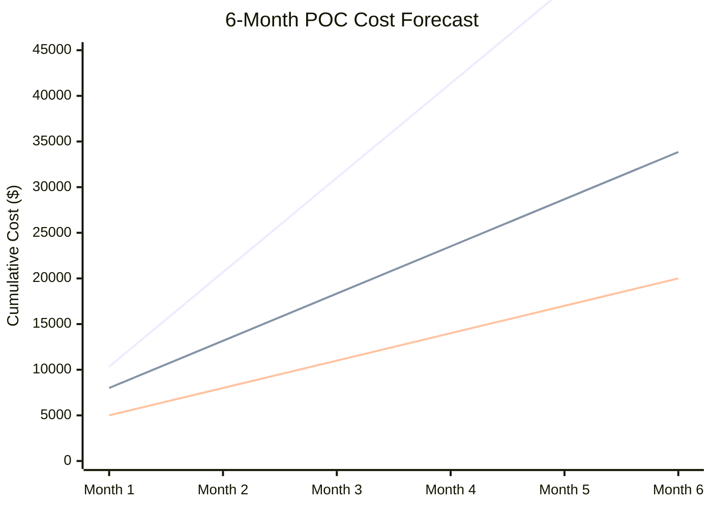

### Cost Timeline with Milestones

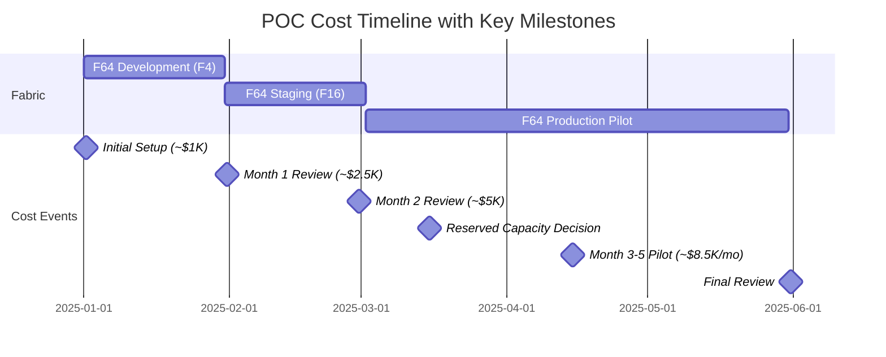

---

## Resource Cost Heat Map

Visual representation of cost intensity by resource type and activity.

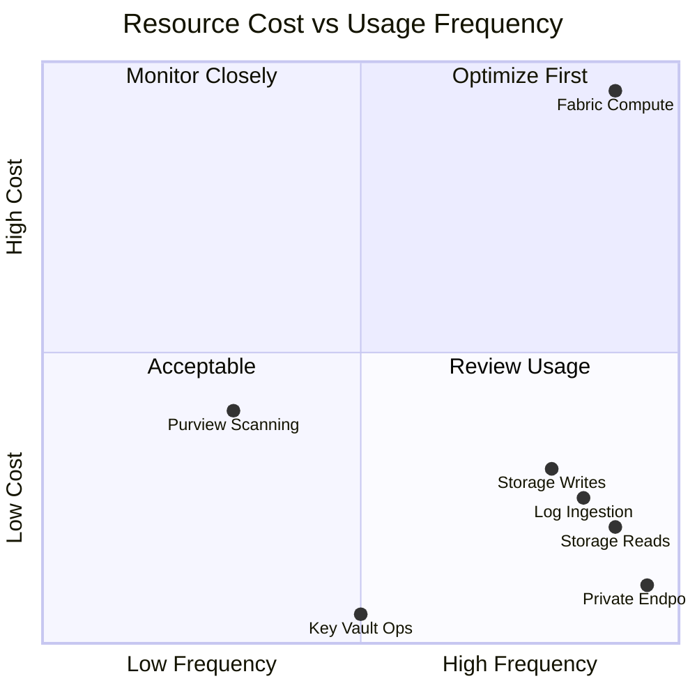

---

## Component Cost Relationship

How different components contribute to total cost.

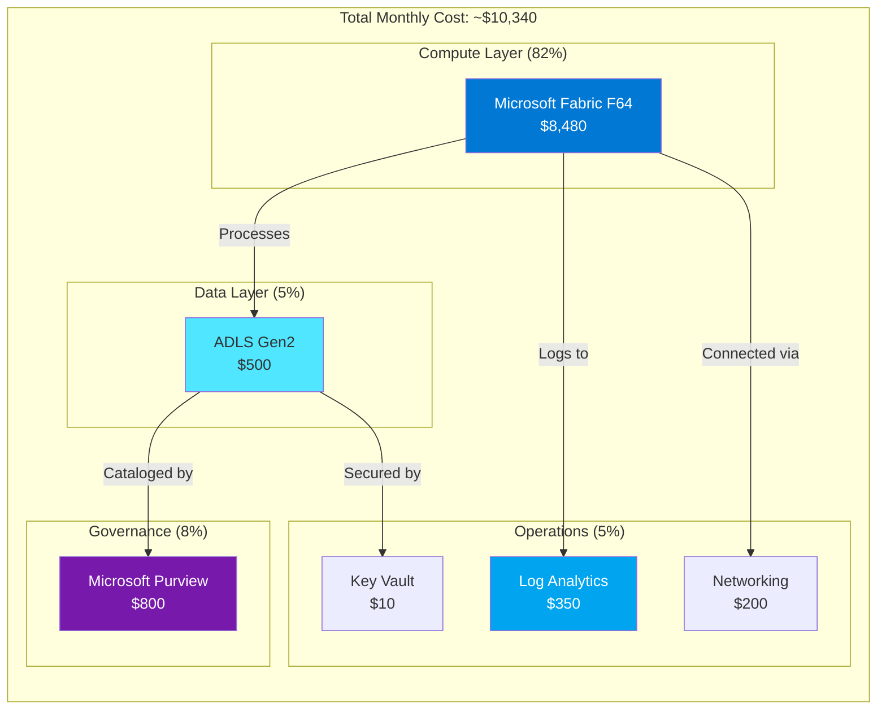

---

## Related Documentation

| Document | Description |
|----------|-------------|
| [Cost Estimation Guide](../COST_ESTIMATION.md) | Detailed cost breakdown and scenarios |
| [Architecture Overview](architecture-overview.md) | System architecture diagrams |
| [Deployment Guide](../DEPLOYMENT.md) | Infrastructure deployment instructions |

---

[Back to top](#cost-breakdown-diagrams)

---

> **Documentation maintained by:** Microsoft Fabric POC Team
> **Repository:** [Supercharge_Microsoft_Fabric](https://github.com/fgarofalo56/Supercharge_Microsoft_Fabric)
