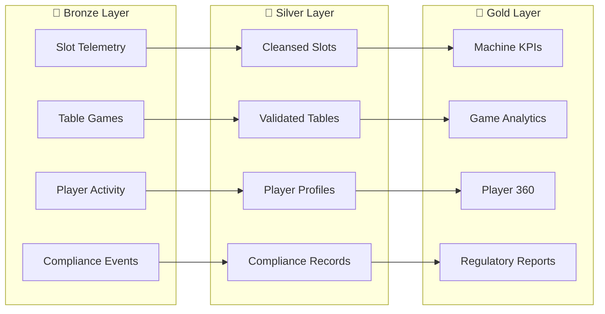

# 🎰 Supercharge Microsoft Fabric

<div class="hero" markdown>

**Transform your casino operations with enterprise-grade analytics powered by Microsoft Fabric**

*Real-time insights • Medallion Architecture • Regulatory Compliance • Direct Lake BI*

[🚀 Quick Start](PREREQUISITES.md){ .md-button .md-button--primary }
[📖 Tutorials](tutorials/README.md){ .md-button }

</div>

---

## 🎯 Overview

This repository provides a **complete, production-ready proof-of-concept** environment for Microsoft Fabric, purpose-built for the casino and gaming industry.

<div class="grid" markdown>

<div class="card" markdown>

### 🏛️ Medallion Architecture

Bronze/Silver/Gold Lakehouse pattern with Delta Lake tables

</div>

<div class="card" markdown>

### ⚡ Real-Time Intelligence

Casino floor monitoring with Eventstreams and Eventhouse

</div>

<div class="card" markdown>

### 📊 Direct Lake

Sub-second Power BI analytics with semantic models

</div>

<div class="card" markdown>

### 🔐 Data Governance

Microsoft Purview integration for compliance

</div>

</div>

---

## 👥 Target Audience

| Role | Focus Areas |
|:-----|:------------|
| 🏗️ **Data Architects** | System design, medallion pattern, scalability |
| 💻 **Data Engineers** | PySpark notebooks, pipelines, ETL |
| 📊 **BI Developers** | Direct Lake, Power BI, DAX |
| 🔐 **Security/Compliance** | Purview, MICS, regulatory reporting |
| 💼 **Solution Architects** | End-to-end integration, infrastructure |

---

## 🚀 Quick Start

### Prerequisites

- Azure subscription with Fabric capacity (F64 or trial)
- Azure CLI and Bicep tools
- Power BI Desktop

### One-Click Deployment

```bash
# Clone the repository
git clone https://github.com/fgarofalo56/Suppercharge_Microsoft_Fabric.git
cd Suppercharge_Microsoft_Fabric

# Deploy infrastructure
az deployment sub create \
  --location eastus2 \
  --template-file infra/main.bicep \
  --parameters infra/environments/dev/dev.bicepparam
```

[➡️ Full Deployment Guide](DEPLOYMENT.md){ .md-button }

---

## 📂 Documentation Structure

| Section | Description |
|:--------|:------------|
| [📖 Getting Started](PREREQUISITES.md) | Prerequisites, setup, and configuration |
| [🏗️ Architecture](ARCHITECTURE.md) | System design and component overview |
| [📚 Tutorials](tutorials/README.md) | 14 hands-on learning modules |
| [📅 POC Agenda](poc-agenda/README.md) | 3-day workshop materials |
| [📊 Reference](GLOSSARY.md) | FAQ, glossary, and standards |
| [🛠️ Infrastructure](infra/README.md) | Bicep IaC modules |

---

## 📊 3-Day POC Agenda

| Day | Focus | Topics |
|:---:|:------|:-------|
| 1️⃣ | **Foundation** | Medallion architecture, Bronze layer, ingestion patterns |
| 2️⃣ | **Transformation** | Silver/Gold layers, real-time analytics, Eventstreams |
| 3️⃣ | **BI & Governance** | Direct Lake, Power BI, Purview, database mirroring |

[📅 View Full Agenda](poc-agenda/README.md){ .md-button }

---

## 🎰 Casino/Gaming Data Domains



---

## 📜 Compliance Frameworks

This POC addresses key gaming industry regulations:

| Framework | Coverage |
|:----------|:---------|
| **NIGC MICS** | Minimal Internal Control Standards |
| **Title 31/BSA** | Anti-money laundering, CTR/SAR |
| **IRS Gaming** | W-2G, 1042-S reporting |
| **State Gaming Commissions** | Jurisdiction-specific requirements |

[🛡️ Security Documentation](SECURITY.md){ .md-button }

---

## 📚 Tutorials

| # | Tutorial | Duration |
|:-:|:---------|:--------:|
| 00 | [Environment Setup](tutorials/00-environment-setup/README.md) | ~1 hour |
| 01 | [Bronze Layer](tutorials/01-bronze-layer/README.md) | ~2 hours |
| 02 | [Silver Layer](tutorials/02-silver-layer/README.md) | ~2 hours |
| 03 | [Gold Layer](tutorials/03-gold-layer/README.md) | ~2 hours |
| 04 | [Real-Time Analytics](tutorials/04-real-time-analytics/README.md) | ~2 hours |
| 05 | [Direct Lake & Power BI](tutorials/05-direct-lake-powerbi/README.md) | ~2 hours |
| 06 | [Data Pipelines](tutorials/06-data-pipelines/README.md) | ~2 hours |
| 07 | [Governance & Purview](tutorials/07-governance-purview/README.md) | ~2 hours |
| 08 | [Database Mirroring](tutorials/08-database-mirroring/README.md) | ~2 hours |
| 09 | [Advanced AI/ML](tutorials/09-advanced-ai-ml/README.md) | ~3 hours |
| 10 | [Teradata Migration](tutorials/10-teradata-migration/README.md) | ~2 hours |
| 11 | [SAS Connectivity](tutorials/11-sas-connectivity/README.md) | ~2 hours |
| 12 | [CI/CD & DevOps](tutorials/12-cicd-devops/README.md) | ~2 hours |
| 13 | [Migration Planning](tutorials/13-migration-planning/README.md) | ~2 hours |

---

## 💰 Cost Estimation

| Component | Monthly Cost (F64) |
|:----------|-------------------:|
| Fabric Capacity (F64) | ~$5,700 |
| Azure Storage | ~$200 |
| Purview | ~$500 |
| **Total Estimate** | **~$6,400/month** |

[💰 Detailed Cost Analysis](COST_ESTIMATION.md){ .md-button }

---

## 🔗 Quick Links

<div class="grid" markdown>

<div class="card" markdown>

### [:fontawesome-brands-github: GitHub Repository](https://github.com/fgarofalo56/Suppercharge_Microsoft_Fabric)

Source code and issues

</div>

<div class="card" markdown>

### [:material-file-document: Documentation](index.md)

Complete documentation index

</div>

<div class="card" markdown>

### [:material-school: Tutorials](tutorials/README.md)

Hands-on learning path

</div>

<div class="card" markdown>

### [:material-cog: Infrastructure](infra/README.md)

Bicep IaC modules

</div>

</div>

---

<div align="center" markdown>

**License:** MIT | **Maintained by:** Microsoft Fabric POC Team

[:material-github: View on GitHub](https://github.com/fgarofalo56/Suppercharge_Microsoft_Fabric){ .md-button }

</div>
