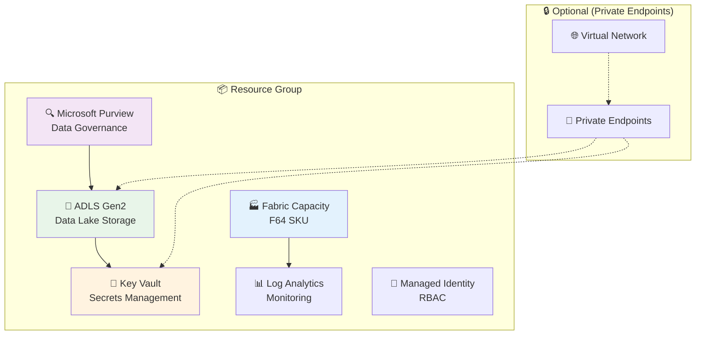
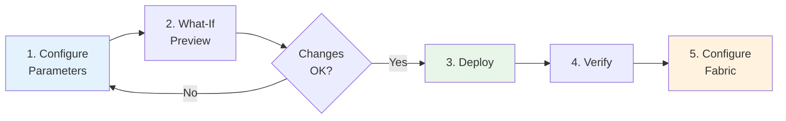

# 🏗️ Infrastructure as Code

> 🏠 [Home](../README.md) > 📚 [Docs](../docs/index.md) > 🏗️ Infrastructure

**Last Updated:** 2025-01-28 | **Version:** 1.0.0

---

## 📑 Table of Contents

- [🎯 Overview](#-overview)
- [📁 Structure](#-structure)
- [🚀 Quick Start](#-quick-start)
- [📋 Prerequisites](#-prerequisites)
- [⚙️ Configuration](#️-configuration)
- [🔧 Deployment](#-deployment)
- [💰 Cost Estimation](#-cost-estimation)
- [🔐 Security](#-security)
- [🧹 Cleanup](#-cleanup)
- [❓ Troubleshooting](#-troubleshooting)

---

## 🎯 Overview

This directory contains Azure Bicep templates for deploying the complete Microsoft Fabric Casino/Gaming POC infrastructure.

### What Gets Deployed



---

## 📁 Structure

```
infra/
├── main.bicep              # 🎯 Main orchestration template
├── main.bicepparam         # 📝 Default parameters
├── main.json               # 📦 Compiled ARM template
├── cost-tags.bicep         # 💰 Cost allocation tags
├── environments/           # 🌍 Environment-specific configs
│   ├── dev/               #    Development
│   ├── staging/           #    Staging
│   └── prod/              #    Production
└── modules/                # 🧩 Reusable Bicep modules
    ├── fabric/            #    Fabric Capacity
    ├── governance/        #    Purview & policies
    ├── monitoring/        #    Log Analytics
    ├── networking/        #    VNet & endpoints
    ├── security/          #    Key Vault & RBAC
    └── storage/           #    ADLS Gen2
```

---

## 🚀 Quick Start

### Option 1: Azure CLI (Recommended)

```bash
# 1. Login to Azure
az login

# 2. Set subscription
az account set --subscription "YOUR_SUBSCRIPTION_ID"

# 3. What-If (Preview changes)
az deployment sub what-if \
  --location eastus2 \
  --template-file infra/main.bicep \
  --parameters infra/environments/dev/dev.bicepparam

# 4. Deploy
az deployment sub create \
  --location eastus2 \
  --template-file infra/main.bicep \
  --parameters infra/environments/dev/dev.bicepparam \
  --name "fabric-poc-$(date +%Y%m%d)"
```

### Option 2: PowerShell

```powershell
# 1. Login to Azure
Connect-AzAccount

# 2. Set subscription
Set-AzContext -Subscription "YOUR_SUBSCRIPTION_ID"

# 3. What-If (Preview changes)
New-AzSubscriptionDeployment `
  -Location eastus2 `
  -TemplateFile infra/main.bicep `
  -TemplateParameterFile infra/environments/dev/dev.bicepparam `
  -WhatIf

# 4. Deploy
New-AzSubscriptionDeployment `
  -Location eastus2 `
  -TemplateFile infra/main.bicep `
  -TemplateParameterFile infra/environments/dev/dev.bicepparam `
  -Name "fabric-poc-$(Get-Date -Format yyyyMMdd)"
```

---

## 📋 Prerequisites

### Required

| Requirement | Details |
|-------------|---------|
| **Azure Subscription** | With Fabric capacity enabled |
| **Azure CLI** | v2.50+ (`az --version`) |
| **Bicep CLI** | v0.22+ (`az bicep version`) |
| **Permissions** | Subscription Contributor + User Access Administrator |

### Verify Prerequisites

```bash
# Check Azure CLI version
az --version | grep "azure-cli"

# Check Bicep version
az bicep version

# Check permissions
az role assignment list --assignee $(az ad signed-in-user show --query id -o tsv) --query "[].roleDefinitionName" -o tsv
```

---

## ⚙️ Configuration

### Parameters Reference

| Parameter | Type | Default | Description |
|-----------|------|---------|-------------|
| `environment` | string | `dev` | Environment name (dev, staging, prod) |
| `location` | string | `eastus2` | Azure region |
| `projectPrefix` | string | `fabricpoc` | Resource naming prefix (3-10 chars) |
| `fabricCapacitySku` | string | `F64` | Fabric capacity SKU |
| `fabricAdminEmail` | string | *required* | Admin email for Fabric |
| `enablePrivateEndpoints` | bool | `false` | Enable private networking |
| `logRetentionDays` | int | `90` | Log retention (30-730 days) |
| `costCenter` | string | `""` | Cost allocation tag |
| `owner` | string | `""` | Owner tag |

### Environment Files

Edit the appropriate environment file before deployment:

```bash
# Development
infra/environments/dev/dev.bicepparam

# Staging
infra/environments/staging/staging.bicepparam

# Production
infra/environments/prod/prod.bicepparam
```

### Example Parameter File

```bicep
using '../main.bicep'

param environment = 'dev'
param location = 'eastus2'
param projectPrefix = 'casinopoc'
param fabricCapacitySku = 'F64'
param fabricAdminEmail = 'admin@contoso.com'
param enablePrivateEndpoints = false
param logRetentionDays = 90
param costCenter = 'IT-Analytics'
param owner = 'Data Platform Team'
```

---

## 🔧 Deployment

### Step-by-Step Deployment



### 1. Configure Parameters

```bash
# Copy and edit parameter file
cp infra/environments/dev/dev.bicepparam infra/environments/dev/my-config.bicepparam
code infra/environments/dev/my-config.bicepparam
```

### 2. Preview Changes (What-If)

```bash
az deployment sub what-if \
  --location eastus2 \
  --template-file infra/main.bicep \
  --parameters infra/environments/dev/my-config.bicepparam
```

### 3. Deploy

```bash
az deployment sub create \
  --location eastus2 \
  --template-file infra/main.bicep \
  --parameters infra/environments/dev/my-config.bicepparam \
  --name "fabric-poc-deploy"
```

### 4. Verify Deployment

```bash
# Check deployment status
az deployment sub show --name "fabric-poc-deploy" --query "properties.provisioningState"

# List created resources
az resource list --resource-group "rg-fabricpoc-dev" --output table
```

### 5. Configure Fabric Workspace

After infrastructure deployment, create your Fabric workspace:

1. Navigate to [Microsoft Fabric](https://app.fabric.microsoft.com)
2. Create a new workspace
3. Assign it to the deployed capacity
4. Enable OneLake integration

---

## 💰 Cost Estimation

### Monthly Estimates by SKU

| SKU | Compute Units | Est. Monthly Cost | Best For |
|-----|---------------|-------------------|----------|
| **F2** | 2 CU | ~$262 | Development/Testing |
| **F4** | 4 CU | ~$524 | Small POC |
| **F8** | 8 CU | ~$1,049 | Standard POC |
| **F64** | 64 CU | ~$8,389 | **Production POC** ✅ |
| **F128** | 128 CU | ~$16,778 | Enterprise |

> 💡 **Tip:** Use F2/F4 for development, scale to F64 for POC demos.

### Cost Optimization

- ⏸️ **Pause capacity** when not in use (saves ~70%)
- 📊 **Use auto-scale** for variable workloads
- 🏷️ **Tag resources** for cost allocation
- 📅 **Schedule capacity** for business hours only

```bash
# Pause Fabric capacity (saves costs)
az fabric capacity suspend --resource-group "rg-fabricpoc-dev" --capacity-name "fc-fabricpoc-dev"

# Resume capacity
az fabric capacity resume --resource-group "rg-fabricpoc-dev" --capacity-name "fc-fabricpoc-dev"
```

---

## 🔐 Security

### Security Features

| Feature | Status | Description |
|---------|--------|-------------|
| **Managed Identity** | ✅ Enabled | System-assigned identity for RBAC |
| **Key Vault** | ✅ Enabled | Centralized secrets management |
| **RBAC** | ✅ Enabled | Role-based access control |
| **Private Endpoints** | ⚙️ Optional | Private networking for enhanced security |
| **Encryption** | ✅ Enabled | Data encrypted at rest and in transit |
| **Audit Logs** | ✅ Enabled | Sent to Log Analytics |

### Enable Private Endpoints (Production)

```bicep
param enablePrivateEndpoints = true
```

This creates:
- Virtual Network with subnets
- Private endpoints for ADLS, Key Vault
- Private DNS zones

---

## 🧹 Cleanup

### Delete All Resources

```bash
# Delete resource group (removes all resources)
az group delete --name "rg-fabricpoc-dev" --yes --no-wait

# Verify deletion
az group show --name "rg-fabricpoc-dev" 2>/dev/null || echo "Resource group deleted"
```

### Partial Cleanup (Keep Data)

```bash
# Delete only Fabric capacity (keep storage)
az fabric capacity delete --resource-group "rg-fabricpoc-dev" --capacity-name "fc-fabricpoc-dev"
```

---

## ❓ Troubleshooting

### Common Issues

<details>
<summary><b>❌ "Fabric capacity not available in region"</b></summary>

**Solution:** Use a supported region:
- `eastus2` ✅
- `westus2` ✅
- `northeurope` ✅
- `westeurope` ✅

```bash
# Check available regions
az provider show --namespace Microsoft.Fabric --query "resourceTypes[?resourceType=='capacities'].locations" -o tsv
```
</details>

<details>
<summary><b>❌ "Insufficient quota for Fabric capacity"</b></summary>

**Solution:** Request quota increase:
1. Go to Azure Portal → Subscriptions → Usage + quotas
2. Search for "Microsoft Fabric"
3. Request increase for desired SKU
</details>

<details>
<summary><b>❌ "Permission denied during deployment"</b></summary>

**Solution:** Ensure you have required roles:
- Subscription Contributor
- User Access Administrator

```bash
# Check current roles
az role assignment list --assignee $(az ad signed-in-user show --query id -o tsv) --output table
```
</details>

<details>
<summary><b>❌ "Bicep compilation error"</b></summary>

**Solution:** Update Bicep CLI:
```bash
az bicep upgrade
az bicep build --file infra/main.bicep
```
</details>

---

## 📚 Related Documentation

| Document | Description |
|----------|-------------|
| [📋 Prerequisites](../docs/PREREQUISITES.md) | Full prerequisites guide |
| [🚀 Deployment Guide](../docs/DEPLOYMENT.md) | Complete deployment walkthrough |
| [💰 Cost Estimation](../docs/COST_ESTIMATION.md) | Detailed cost analysis |
| [🔐 Security Guide](../docs/SECURITY.md) | Security best practices |

---

[⬆️ Back to top](#️-infrastructure-as-code) | [🏠 Home](../README.md)

