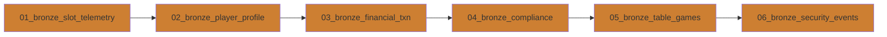

# [Home](../../README.md) > [Notebooks](../README.md) > Bronze Layer

## 🥉 Bronze Layer Notebooks

> **Purpose**: Raw data ingestion from casino source systems with minimal transformation. Append-only landing zone preserving original data fidelity.

The Bronze layer captures raw data from slot machines, player systems, financial transactions, table games, and security systems. Data arrives in its original format with only metadata enrichment (ingestion timestamp, source system, batch ID).

---

## 📚 Notebook Inventory

| Notebook | Purpose | Input | Output |
|----------|---------|-------|--------|
| `01_bronze_slot_telemetry.py` | Ingest slot machine events (spins, wins, errors) | Slot machine event streams | `bronze.slot_telemetry` |
| `02_bronze_player_profile.py` | Load player registration and demographic data | Player management system | `bronze.player_profile` |
| `03_bronze_financial_txn.py` | Capture all financial transactions | POS, cage, ATM systems | `bronze.financial_transactions` |
| `04_bronze_compliance.py` | Ingest compliance-related events | Compliance monitoring system | `bronze.compliance_events` |
| `05_bronze_table_games.py` | Load table game session data | Table management system | `bronze.table_games` |
| `06_bronze_security_events.py` | Capture security and surveillance events | Security systems, CCTV | `bronze.security_events` |

---

## ⚡ Execution Order



> **Note**: Notebooks can run in parallel if source systems are independent. Sequential execution ensures consistent timestamps for lineage tracking.

---

## 🔧 Key Transformations

| Transformation | Description |
|----------------|-------------|
| **Metadata Enrichment** | Add `_ingested_at`, `_source_system`, `_batch_id` columns |
| **Schema Preservation** | Maintain original field names and data types |
| **Append-Only Writes** | Never update/delete; always append new records |
| **Partition Strategy** | Partition by `_ingested_date` for efficient querying |
| **Format Conversion** | Convert source formats (JSON, CSV, XML) to Delta Lake |

### Common Bronze Patterns

```python
# Standard Bronze ingestion pattern
df = (spark.read
    .format("json")
    .load(source_path)
    .withColumn("_ingested_at", current_timestamp())
    .withColumn("_source_system", lit("slot_machines"))
    .withColumn("_batch_id", lit(batch_id))
)

df.write.format("delta").mode("append").saveAsTable("bronze.slot_telemetry")
```

---

## 📋 Dependencies

| Dependency | Type | Description |
|------------|------|-------------|
| **Fabric Lakehouse** | Infrastructure | Bronze lakehouse must be provisioned |
| **Source Connections** | Data | Connections to source systems configured |
| **sample-data/** | Development | Sample data files for testing |
| **Spark Runtime** | Compute | Fabric Spark pool with Delta Lake support |

### Pre-requisites Checklist

- [ ] Fabric workspace created
- [ ] Bronze lakehouse provisioned
- [ ] Source system credentials configured in Key Vault
- [ ] Sample data uploaded to `Files/raw/` folder

---

## ✅ Validation Steps

### Data Quality Checks

| Check | Query | Expected |
|-------|-------|----------|
| **Record Count** | `SELECT COUNT(*) FROM bronze.slot_telemetry` | > 0 records |
| **Null Primary Keys** | `SELECT COUNT(*) WHERE machine_id IS NULL` | 0 |
| **Ingestion Timestamp** | `SELECT MAX(_ingested_at)` | Within last batch window |
| **Schema Drift** | Compare schema to baseline | No unexpected columns |

### Validation Commands

```python
# Verify table exists and has data
display(spark.sql("SELECT COUNT(*) as record_count FROM bronze.slot_telemetry"))

# Check for recent ingestion
display(spark.sql("""
    SELECT 
        DATE(_ingested_at) as ingestion_date,
        COUNT(*) as records
    FROM bronze.slot_telemetry
    GROUP BY DATE(_ingested_at)
    ORDER BY ingestion_date DESC
    LIMIT 7
"""))

# Validate no null keys
assert spark.sql("SELECT COUNT(*) FROM bronze.slot_telemetry WHERE machine_id IS NULL").first()[0] == 0
```

---

## 📖 Related Resources

- **Tutorial**: [Day 1: Bronze Ingestion Tutorial](../../tutorials/day1-bronze-ingestion/README.md)
- **Architecture**: [Medallion Architecture Overview](../../docs/architecture/medallion-architecture.md)
- **Data Generation**: [Bronze Data Generators](../../data-generation/generators/)
- **Next Layer**: [Silver Layer Notebooks](../silver/README.md)

---

## 🎰 Casino Domain Context

### Slot Telemetry Data Points

| Field | Description | Compliance Impact |
|-------|-------------|-------------------|
| `machine_id` | Unique slot machine identifier | NIGC MICS requirement |
| `spin_timestamp` | Exact time of each spin | Audit trail |
| `wager_amount` | Amount wagered per spin | Financial reporting |
| `payout_amount` | Amount won (if any) | W-2G threshold tracking |
| `denomination` | Machine denomination ($0.01-$100) | RTP calculations |

### Regulatory Considerations

- **NIGC MICS**: Minimum Internal Control Standards require complete audit trails
- **W-2G Threshold**: Track wins ≥ $1,200 for IRS reporting
- **SAR Patterns**: Preserve raw data for suspicious activity detection
- **Data Retention**: 5+ years for compliance requirements

---

> **Next Steps**: After Bronze layer completes successfully, proceed to [Silver Layer](../silver/README.md) for data cleansing and validation.
