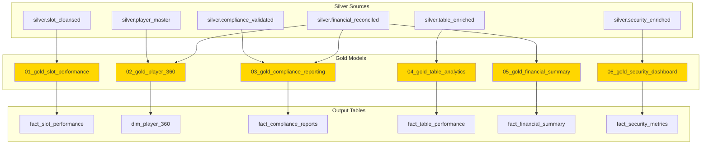

# [Home](../../README.md) > [Notebooks](../README.md) > Gold Layer

## 🥇 Gold Layer Notebooks

> **Purpose**: Business-level aggregations, KPIs, star schema models, and analytics-ready datasets optimized for Direct Lake connectivity and Power BI consumption.

The Gold layer transforms cleansed Silver data into business intelligence assets. This layer creates dimensional models, calculates KPIs, builds aggregated views, and prepares compliance reports for regulatory submission.

---

## 📚 Notebook Inventory

| Notebook | Purpose | Input | Output |
|----------|---------|-------|--------|
| `01_gold_slot_performance.py` | Slot machine KPIs, RTP, hold percentages | `silver.slot_cleansed` | `gold.fact_slot_performance`, `gold.dim_machine` |
| `02_gold_player_360.py` | Customer 360 view, lifetime value, segments | `silver.player_master`, `silver.financial_reconciled` | `gold.dim_player_360` |
| `03_gold_compliance_reporting.py` | CTR, SAR, W-2G regulatory reports | `silver.compliance_validated`, `silver.financial_reconciled` | `gold.fact_compliance_reports` |
| `04_gold_table_analytics.py` | Table game profitability, dealer performance | `silver.table_enriched` | `gold.fact_table_performance` |
| `05_gold_financial_summary.py` | Revenue, drop, cage operations summary | `silver.financial_reconciled` | `gold.fact_financial_summary` |
| `06_gold_security_dashboard.py` | Security incidents, response times, zone analysis | `silver.security_enriched` | `gold.fact_security_metrics` |

---

## ⚡ Execution Order



> **Note**: Gold notebooks can run in parallel after Silver layer completes. Order shown is for logical grouping only.

---

## 🔧 Key Transformations

| Transformation | Description | Business Value |
|----------------|-------------|----------------|
| **Star Schema** | Fact and dimension tables | Optimized for BI tools |
| **KPI Calculation** | Pre-aggregated metrics | Dashboard performance |
| **Segmentation** | Player tiers, machine categories | Marketing targeting |
| **Time Intelligence** | Period-over-period calculations | Trend analysis |
| **Compliance Aggregation** | Regulatory report formats | FinCEN submission |
| **Direct Lake Optimization** | Delta Lake with V-Order | Power BI performance |

### Common Gold Patterns

```python
# Star Schema - Fact Table Pattern
from pyspark.sql.functions import sum, avg, count, date_trunc

fact_slot_performance = (spark.table("silver.slot_cleansed")
    # Aggregate to grain (machine, hour)
    .groupBy(
        col("machine_id"),
        date_trunc("hour", col("spin_timestamp")).alias("hour_key"),
        col("denomination")
    )
    .agg(
        count("*").alias("total_spins"),
        sum("wager_amount").alias("total_coin_in"),
        sum("payout_amount").alias("total_coin_out"),
        (sum("wager_amount") - sum("payout_amount")).alias("net_win"),
        avg("session_duration_seconds").alias("avg_session_duration")
    )
    # Calculate KPIs
    .withColumn("hold_percentage", 
        (col("net_win") / col("total_coin_in") * 100).cast("decimal(5,2)"))
    .withColumn("theoretical_rtp",
        (col("total_coin_out") / col("total_coin_in") * 100).cast("decimal(5,2)"))
)

# Write with V-Order optimization for Direct Lake
fact_slot_performance.write \
    .format("delta") \
    .option("delta.parquet.vorder.enabled", "true") \
    .mode("overwrite") \
    .saveAsTable("gold.fact_slot_performance")
```

### Dimension Table Pattern

```python
# SCD Type 1 Dimension with Business Attributes
dim_player_360 = (spark.table("silver.player_master")
    .select(
        col("player_id").alias("player_key"),
        col("player_id"),
        col("first_name"),
        col("last_name"),
        col("player_tier"),
        col("enrollment_date"),
        col("preferred_denomination"),
        col("home_casino")
    )
    # Add calculated attributes
    .join(lifetime_value_df, "player_id", "left")
    .join(visit_frequency_df, "player_id", "left")
    .withColumn("player_segment", 
        when(col("lifetime_value") > 100000, "VIP")
        .when(col("lifetime_value") > 10000, "HIGH")
        .when(col("lifetime_value") > 1000, "MEDIUM")
        .otherwise("CASUAL"))
)
```

---

## 📋 Dependencies

| Dependency | Type | Description |
|------------|------|-------------|
| **Silver Layer** | Data | All Silver tables must be validated |
| **Date Dimension** | Reference | `gold.dim_date` calendar table |
| **Business Rules** | Config | KPI formulas, threshold definitions |
| **Direct Lake Semantic Model** | BI | Power BI workspace connection |

### Pre-requisites Checklist

- [ ] Silver layer validation passed
- [ ] Date dimension table created
- [ ] Power BI workspace provisioned
- [ ] Direct Lake semantic model configured

---

## ✅ Validation Steps

### Data Quality Checks

| Check | Table | Query | Expected |
|-------|-------|-------|----------|
| **KPI Ranges** | `fact_slot_performance` | `hold_percentage BETWEEN 0 AND 20` | 100% |
| **Referential Integrity** | `fact_*` | All dimension keys exist | 0 orphans |
| **Completeness** | `fact_financial_summary` | Sum matches Silver totals | ± 0.01% |
| **Timeliness** | All Gold tables | Last refresh timestamp | Within SLA |
| **Compliance Accuracy** | `fact_compliance_reports` | CTR count vs manual audit | Match |

### Validation Commands

```python
# Validate KPI calculations
kpi_validation = spark.sql("""
    SELECT 
        SUM(CASE WHEN hold_percentage < 0 OR hold_percentage > 20 THEN 1 ELSE 0 END) as invalid_hold,
        SUM(CASE WHEN theoretical_rtp < 80 OR theoretical_rtp > 100 THEN 1 ELSE 0 END) as invalid_rtp
    FROM gold.fact_slot_performance
""").first()
assert kpi_validation.invalid_hold == 0, "Invalid hold percentages found!"
assert kpi_validation.invalid_rtp == 0, "Invalid RTP values found!"

# Verify totals match Silver layer
gold_total = spark.sql("SELECT SUM(total_coin_in) FROM gold.fact_slot_performance").first()[0]
silver_total = spark.sql("SELECT SUM(wager_amount) FROM silver.slot_cleansed").first()[0]
variance = abs(gold_total - silver_total) / silver_total
assert variance < 0.0001, f"Variance {variance:.4%} exceeds threshold!"

# Check Direct Lake compatibility
from delta import DeltaTable
dt = DeltaTable.forName(spark, "gold.fact_slot_performance")
history = dt.history(1).select("operationMetrics").first()
print(f"Files: {history.operationMetrics.get('numFiles', 'N/A')}")
```

---

## 📖 Related Resources

- **Tutorial**: [Day 2: Gold Aggregation Tutorial](../../tutorials/day2-gold-aggregation/README.md)
- **Previous Layer**: [Silver Layer Notebooks](../silver/README.md)
- **Power BI**: [Direct Lake Semantic Model Setup](../../docs/powerbi/direct-lake-setup.md)
- **Dashboards**: [Power BI Report Templates](../../reports/)

---

## 🎰 Casino Domain Context

### Key Performance Indicators

| KPI | Formula | Business Use |
|-----|---------|--------------|
| **Hold %** | (Coin In - Coin Out) / Coin In × 100 | Machine profitability |
| **Theoretical RTP** | Coin Out / Coin In × 100 | Regulatory compliance |
| **Theoretical Win** | Coin In × Theoretical Hold % | Revenue forecasting |
| **Actual Win** | Coin In - Coin Out | P&L reporting |
| **ADT (Average Daily Theoretical)** | Avg bet × Hands/Hr × Hours × House Edge | Player valuation |

### Player 360 Metrics

| Metric | Description | Segmentation Use |
|--------|-------------|------------------|
| **Lifetime Value** | Total net win from player | VIP identification |
| **Visit Frequency** | Visits per month | Engagement scoring |
| **Average Bet** | Mean wager per session | Risk assessment |
| **Game Preference** | Most played game type | Marketing targeting |
| **Comp Ratio** | Comps given / Theoretical win | Reinvestment tracking |

### Compliance Reporting Tables

```sql
-- CTR Summary for FinCEN
SELECT 
    report_date,
    player_id,
    player_name,
    ssn_hash,
    total_cash_in,
    total_cash_out,
    transaction_count,
    filing_status
FROM gold.fact_compliance_reports
WHERE report_type = 'CTR'
  AND total_cash_in >= 10000

-- W-2G Summary for IRS
SELECT 
    tax_year,
    player_id,
    game_type,
    win_amount,
    federal_withholding,
    state_withholding
FROM gold.fact_compliance_reports
WHERE report_type = 'W2G'
```

### Star Schema Diagram

```
                          ┌─────────────────┐
                          │   dim_date      │
                          ├─────────────────┤
                          │ date_key (PK)   │
                          │ calendar_date   │
                          │ day_of_week     │
                          │ fiscal_period   │
                          └────────┬────────┘
                                   │
┌─────────────────┐       ┌────────┴────────┐       ┌─────────────────┐
│  dim_machine    │       │ fact_slot_perf  │       │  dim_player_360 │
├─────────────────┤       ├─────────────────┤       ├─────────────────┤
│ machine_key (PK)│◄──────│ machine_key(FK) │       │ player_key (PK) │
│ machine_id      │       │ date_key (FK)   │──────►│ player_id       │
│ denomination    │       │ player_key (FK) │       │ player_tier     │
│ manufacturer    │       │ total_spins     │       │ lifetime_value  │
│ floor_location  │       │ total_coin_in   │       │ player_segment  │
└─────────────────┘       │ hold_percentage │       └─────────────────┘
                          └─────────────────┘
```

---

## 🔌 Direct Lake Integration

### Optimization for Power BI

```python
# Enable V-Order for optimal Direct Lake performance
spark.conf.set("spark.databricks.delta.properties.defaults.parquet.vorder.enabled", "true")

# Optimize file sizes (target 128MB-256MB)
spark.sql("OPTIMIZE gold.fact_slot_performance ZORDER BY (date_key, machine_key)")

# Vacuum old versions (maintain 7 days for time travel)
spark.sql("VACUUM gold.fact_slot_performance RETAIN 168 HOURS")
```

### Semantic Model Refresh

Gold tables are configured for automatic refresh to Direct Lake semantic model:
- **Refresh Frequency**: Every 15 minutes for operational dashboards
- **Full Refresh**: Nightly at 2:00 AM for historical recalculations

---

> **Next Steps**: After Gold layer completes, configure [Direct Lake semantic model](../../docs/powerbi/direct-lake-setup.md) and build Power BI reports.
