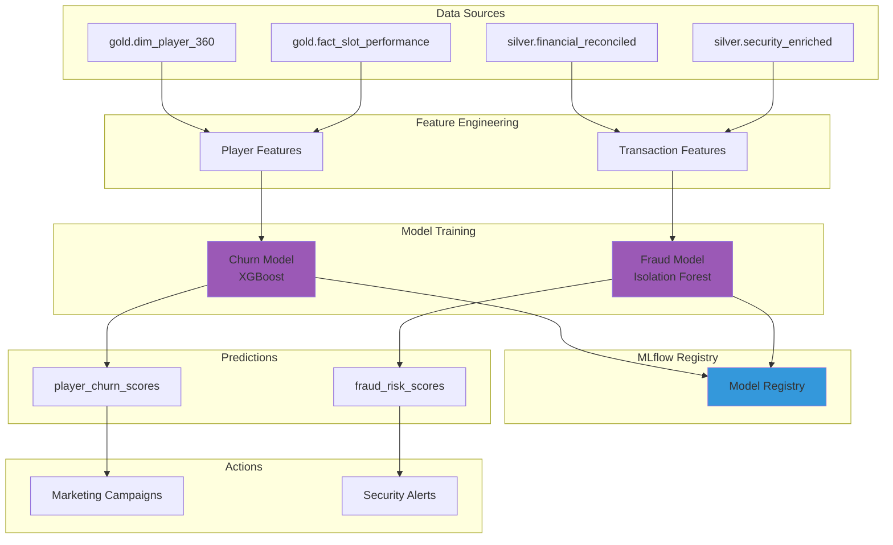
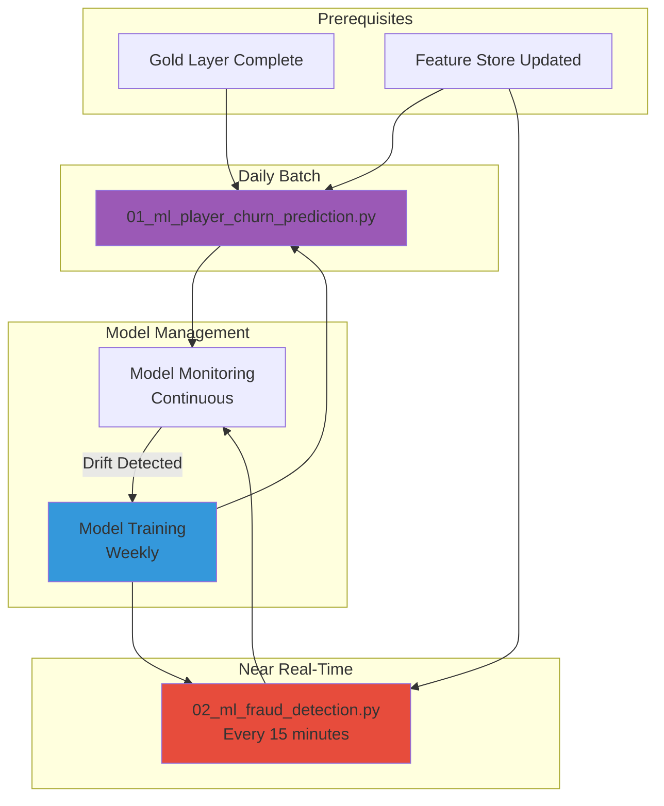

# [Home](../../README.md) > [Notebooks](../README.md) > ML Layer

## 🤖 Machine Learning Notebooks

> **Purpose**: Predictive analytics, anomaly detection, and AI-powered insights for casino operations including player churn prediction and fraud detection.

The ML layer leverages Fabric's integrated data science capabilities to build, train, and deploy machine learning models. Models are trained on Gold layer data and predictions are written back for operational use.

---

## 📚 Notebook Inventory

| Notebook | Purpose | Input | Output |
|----------|---------|-------|--------|
| `01_ml_player_churn_prediction.py` | Predict player churn risk using behavioral features | `gold.dim_player_360`, `gold.fact_slot_performance` | `ml.player_churn_scores` |
| `02_ml_fraud_detection.py` | Detect fraudulent activity patterns and anomalies | `silver.financial_reconciled`, `silver.security_enriched` | `ml.fraud_risk_scores` |

---

## 🏗️ ML Architecture



---

## 📊 Model Details

### Player Churn Prediction (`01_ml_player_churn_prediction.py`)

| Aspect | Details |
|--------|---------|
| **Algorithm** | XGBoost Classifier |
| **Target** | Binary: Churned (no visit in 90 days) |
| **Training Data** | 12 months of player activity |
| **Prediction Frequency** | Daily batch scoring |
| **Output** | Churn probability (0-1), risk tier |

#### Features Used

| Feature | Description | Importance |
|---------|-------------|------------|
| `days_since_last_visit` | Days since last casino visit | High |
| `visit_frequency_trend` | 3-month visit trend (increasing/decreasing) | High |
| `lifetime_value` | Total theoretical win | Medium |
| `avg_session_duration` | Average play time per visit | Medium |
| `game_diversity` | Number of different game types played | Medium |
| `comp_redemption_rate` | % of comps redeemed | Low |
| `tier_tenure_months` | Months at current tier | Low |

#### Model Training Pattern

```python
import mlflow
from xgboost import XGBClassifier
from sklearn.model_selection import train_test_split
from sklearn.metrics import roc_auc_score, precision_recall_curve

# Load feature data
df_features = spark.table("ml.player_churn_features").toPandas()

# Split data
X = df_features.drop(['player_id', 'churned'], axis=1)
y = df_features['churned']
X_train, X_test, y_train, y_test = train_test_split(X, y, test_size=0.2, stratify=y)

# Train with MLflow tracking
with mlflow.start_run(run_name="churn_model_v1"):
    model = XGBClassifier(
        n_estimators=100,
        max_depth=6,
        learning_rate=0.1,
        scale_pos_weight=len(y_train[y_train==0]) / len(y_train[y_train==1])
    )
    model.fit(X_train, y_train)
    
    # Log metrics
    y_pred_proba = model.predict_proba(X_test)[:, 1]
    auc = roc_auc_score(y_test, y_pred_proba)
    mlflow.log_metric("auc_roc", auc)
    
    # Log model
    mlflow.xgboost.log_model(model, "churn_model")
    
    # Register model
    mlflow.register_model(
        f"runs:/{mlflow.active_run().info.run_id}/churn_model",
        "player_churn_model"
    )
```

---

### Fraud Detection (`02_ml_fraud_detection.py`)

| Aspect | Details |
|--------|---------|
| **Algorithm** | Isolation Forest (unsupervised) + Rule-based |
| **Target** | Anomaly score (0-1) |
| **Training Data** | 6 months of transactions |
| **Prediction Frequency** | Near real-time (15-min batch) |
| **Output** | Risk score, anomaly flags, rule triggers |

#### Detection Patterns

| Pattern | Description | Risk Level |
|---------|-------------|------------|
| **Structuring** | Multiple transactions just under $10K | Critical |
| **Velocity** | Unusual transaction frequency | High |
| **Time Anomaly** | Transactions at unusual hours | Medium |
| **Amount Deviation** | Transaction amounts > 3σ from player norm | Medium |
| **Chip Walking** | Buy chips, minimal play, cash out | High |
| **Collusion** | Coordinated patterns between players | Critical |

#### Fraud Detection Pattern

```python
from sklearn.ensemble import IsolationForest
from sklearn.preprocessing import StandardScaler
import numpy as np

# Load transaction features
df_txn = spark.table("ml.transaction_features").toPandas()

# Feature engineering for fraud detection
features = [
    'transaction_amount',
    'transactions_per_hour',
    'unique_machines_per_session',
    'cash_to_chip_ratio',
    'time_between_transactions',
    'deviation_from_player_avg'
]

X = df_txn[features]
scaler = StandardScaler()
X_scaled = scaler.fit_transform(X)

# Train Isolation Forest
with mlflow.start_run(run_name="fraud_model_v1"):
    model = IsolationForest(
        n_estimators=200,
        contamination=0.01,  # Expected fraud rate
        max_samples='auto',
        random_state=42
    )
    model.fit(X_scaled)
    
    # Score transactions
    anomaly_scores = -model.decision_function(X_scaled)  # Higher = more anomalous
    anomaly_scores_normalized = (anomaly_scores - anomaly_scores.min()) / (anomaly_scores.max() - anomaly_scores.min())
    
    df_txn['fraud_risk_score'] = anomaly_scores_normalized
    df_txn['is_anomaly'] = model.predict(X_scaled) == -1
    
    # Apply rule-based flags
    df_txn['structuring_flag'] = (
        (df_txn['transaction_amount'] >= 8000) & 
        (df_txn['transaction_amount'] < 10000) &
        (df_txn['transactions_per_day'] > 1)
    )
    
    mlflow.sklearn.log_model(model, "fraud_model")
```

---

## ⚡ Execution Order



---

## 📋 Dependencies

| Dependency | Type | Description |
|------------|------|-------------|
| **Gold Layer** | Data | Player 360, financial summaries |
| **Silver Layer** | Data | Transaction details for fraud |
| **MLflow** | Tracking | Experiment tracking and model registry |
| **Feature Store** | Features | Pre-computed ML features |
| **Spark ML** | Runtime | Distributed model training |

### Pre-requisites Checklist

- [ ] Gold layer notebooks completed
- [ ] Feature engineering pipeline run
- [ ] MLflow workspace configured
- [ ] Model training compute allocated
- [ ] Scoring tables created

---

## ✅ Validation Steps

### Model Quality Checks

| Model | Metric | Threshold | Current |
|-------|--------|-----------|---------|
| **Churn** | AUC-ROC | ≥ 0.75 | Monitor |
| **Churn** | Precision@10% | ≥ 0.40 | Monitor |
| **Fraud** | Precision | ≥ 0.80 | Monitor |
| **Fraud** | Recall (critical patterns) | ≥ 0.95 | Monitor |

### Validation Commands

```python
# Verify churn predictions distribution
churn_dist = spark.sql("""
    SELECT 
        CASE 
            WHEN churn_probability < 0.3 THEN 'LOW'
            WHEN churn_probability < 0.7 THEN 'MEDIUM'
            ELSE 'HIGH'
        END as risk_tier,
        COUNT(*) as player_count,
        AVG(churn_probability) as avg_probability
    FROM ml.player_churn_scores
    GROUP BY 1
""")
display(churn_dist)

# Verify fraud scores
fraud_stats = spark.sql("""
    SELECT 
        COUNT(*) as total_transactions,
        SUM(CASE WHEN is_anomaly THEN 1 ELSE 0 END) as anomalies,
        SUM(CASE WHEN structuring_flag THEN 1 ELSE 0 END) as structuring_flags,
        AVG(fraud_risk_score) as avg_risk_score
    FROM ml.fraud_risk_scores
    WHERE score_timestamp > current_timestamp() - INTERVAL 24 HOURS
""")
display(fraud_stats)

# Model drift detection
from evidently import ColumnMapping
from evidently.report import Report
from evidently.metrics import DataDriftPreset

reference_data = spark.table("ml.churn_features_baseline").toPandas()
current_data = spark.table("ml.player_churn_features").toPandas()

report = Report(metrics=[DataDriftPreset()])
report.run(reference_data=reference_data, current_data=current_data)
report.save_html("drift_report.html")
```

---

## 📖 Related Resources

- **Tutorial**: [Day 3: ML Integration Tutorial](../../tutorials/day3-ml/README.md)
- **Feature Engineering**: [Feature Store Documentation](../../docs/ml/feature-store.md)
- **MLflow Guide**: [MLflow on Fabric](../../docs/ml/mlflow-setup.md)
- **Model Monitoring**: [Drift Detection Guide](../../docs/ml/model-monitoring.md)

---

## 🎰 Casino Domain Context

### Churn Risk Actions

| Risk Tier | Score Range | Recommended Action |
|-----------|-------------|-------------------|
| **Critical** | 0.8 - 1.0 | Personal host outreach within 24 hours |
| **High** | 0.6 - 0.8 | Targeted offer email + bonus credits |
| **Medium** | 0.4 - 0.6 | Loyalty program reminder |
| **Low** | 0.0 - 0.4 | Standard marketing cadence |

### Fraud Response Matrix

| Flag | Risk Level | Response | Timeline |
|------|------------|----------|----------|
| **Structuring** | Critical | Compliance review, potential SAR | Immediate |
| **High Anomaly Score** | High | Security review, surveillance pull | < 1 hour |
| **Velocity Alert** | Medium | Transaction hold, manager approval | < 15 min |
| **Pattern Match** | Variable | Add to watchlist | Next shift |

### Model Business Value

| Model | Metric | Baseline | With ML | Improvement |
|-------|--------|----------|---------|-------------|
| **Churn** | Retention rate | 65% | 78% | +13% |
| **Churn** | Marketing ROI | 2.1x | 3.4x | +62% |
| **Fraud** | Detection rate | 45% | 89% | +44% |
| **Fraud** | False positive rate | 15% | 4% | -73% |

---

## 🔄 Model Lifecycle

### Training Schedule

| Model | Training Frequency | Data Window | Trigger |
|-------|-------------------|-------------|---------|
| **Churn** | Weekly | 12 months | Sunday 2 AM |
| **Fraud** | Monthly | 6 months | 1st of month |
| **Both** | On-demand | Variable | Drift alert |

### Scoring Schedule

| Model | Frequency | Latency Target | Output Table |
|-------|-----------|----------------|--------------|
| **Churn** | Daily | < 30 min | `ml.player_churn_scores` |
| **Fraud** | Every 15 min | < 5 min | `ml.fraud_risk_scores` |

### Model Registry

```python
# List registered models
from mlflow import MlflowClient
client = MlflowClient()

for model in client.search_registered_models():
    print(f"Model: {model.name}")
    for version in model.latest_versions:
        print(f"  Version {version.version}: {version.current_stage}")
```

---

## 📊 Feature Store Schema

### Player Churn Features

| Feature | Type | Description | Update Frequency |
|---------|------|-------------|------------------|
| `player_id` | STRING | Primary key | - |
| `days_since_last_visit` | INT | Days since last visit | Daily |
| `visits_last_30d` | INT | Visit count last 30 days | Daily |
| `visits_last_90d` | INT | Visit count last 90 days | Daily |
| `visit_trend` | FLOAT | Slope of visit frequency | Daily |
| `avg_session_duration_mins` | FLOAT | Average session length | Daily |
| `total_lifetime_value` | DECIMAL | Total theoretical win | Daily |
| `games_played_count` | INT | Distinct game types | Daily |
| `comp_redemption_pct` | FLOAT | % of comps used | Daily |

### Fraud Detection Features

| Feature | Type | Description | Update Frequency |
|---------|------|-------------|------------------|
| `transaction_id` | STRING | Primary key | - |
| `transaction_amount` | DECIMAL | Transaction value | Real-time |
| `transactions_per_hour` | FLOAT | Rolling hourly count | 15-min |
| `cash_to_chip_ratio` | FLOAT | Buy-in vs cash-out ratio | 15-min |
| `deviation_from_avg` | FLOAT | Z-score from player mean | 15-min |
| `time_bucket` | STRING | Hour of day bucket | Real-time |
| `velocity_score` | FLOAT | Transaction frequency score | 15-min |

---

> **Next Steps**: After models are trained and validated, configure [real-time scoring endpoints](../../docs/ml/real-time-scoring.md) and integrate with [marketing automation](../../docs/integrations/marketing-integration.md).
