# [Home](../../README.md) > [Notebooks](../README.md) > Real-Time Layer

## ⚡ Real-Time Notebooks

> **Purpose**: Stream processing for live casino floor monitoring, real-time alerts, and immediate operational insights using Fabric Eventstreams and Eventhouse (KQL).

The Real-Time layer processes streaming data from slot machines, table games, and security systems. Events flow through Eventstreams for transformation and land in Eventhouse for KQL-based analytics and alerting.

---

## 📚 Notebook Inventory

| Notebook | Purpose | Input | Output |
|----------|---------|-------|--------|
| `01_realtime_slot_streaming.py` | Process live slot machine events, detect anomalies | Eventstream: `es-slot-telemetry` | Eventhouse: `slot_events_live` |
| `02_kql_casino_floor.kql` | KQL queries for floor monitoring dashboards | Eventhouse tables | Real-Time Dashboard |

---

## 🏗️ Architecture

```mermaid
graph LR
    subgraph Sources
        SM[🎰 Slot Machines]
        TG[🃏 Table Games]
        SEC[📹 Security Systems]
    end
    
    subgraph Fabric Eventstreams
        ES1[es-slot-telemetry]
        ES2[es-table-games]
        ES3[es-security-events]
    end
    
    subgraph Processing
        NB[01_realtime_slot_streaming.py]
    end
    
    subgraph Eventhouse
        EH1[(slot_events_live)]
        EH2[(table_events_live)]
        EH3[(security_events_live)]
    end
    
    subgraph Outputs
        DASH[📊 Real-Time Dashboard]
        ALERT[🚨 Activator Alerts]
    end
    
    SM --> ES1 --> NB --> EH1
    TG --> ES2 --> EH2
    SEC --> ES3 --> EH3
    
    EH1 --> DASH
    EH2 --> DASH
    EH3 --> DASH
    EH1 --> ALERT
    
    style NB fill:#ff6b6b
    style DASH fill:#4ecdc4
    style ALERT fill:#ffe66d
```



---

## ⚡ Execution Order

| Step | Component | Description |
|------|-----------|-------------|
| 1 | **Eventstream Setup** | Configure `es-slot-telemetry` with Event Hub source |
| 2 | **Eventhouse Tables** | Create destination tables with proper schema |
| 3 | **Streaming Job** | Deploy `01_realtime_slot_streaming.py` as continuous job |
| 4 | **KQL Dashboards** | Import `02_kql_casino_floor.kql` queries |
| 5 | **Activator Rules** | Configure real-time alerts |

> **Note**: Streaming notebook runs continuously. Use Fabric job scheduling for automatic restart on failure.

---

## 🔧 Key Transformations

### Streaming Notebook (`01_realtime_slot_streaming.py`)

| Transformation | Description | Latency Target |
|----------------|-------------|----------------|
| **Schema Validation** | Enforce event schema at ingestion | < 100ms |
| **Timestamp Normalization** | Convert to UTC with timezone handling | < 50ms |
| **Jackpot Detection** | Flag wins exceeding thresholds | < 200ms |
| **Machine Health** | Detect error patterns and downtime | < 500ms |
| **Anomaly Scoring** | ML-based unusual activity detection | < 1s |

```python
# Streaming ingestion pattern
from pyspark.sql.functions import from_json, col, window
from pyspark.sql.types import StructType, StringType, DoubleType, TimestampType

# Define event schema
slot_event_schema = StructType() \
    .add("machine_id", StringType()) \
    .add("event_type", StringType()) \
    .add("wager_amount", DoubleType()) \
    .add("payout_amount", DoubleType()) \
    .add("event_timestamp", TimestampType())

# Read from Eventstream
df_stream = (spark
    .readStream
    .format("eventhub")
    .options(**eventhub_config)
    .load()
    .select(from_json(col("body").cast("string"), slot_event_schema).alias("event"))
    .select("event.*")
)

# Real-time aggregations (1-minute windows)
df_windowed = (df_stream
    .withWatermark("event_timestamp", "30 seconds")
    .groupBy(
        window(col("event_timestamp"), "1 minute"),
        col("machine_id")
    )
    .agg(
        count("*").alias("spin_count"),
        sum("wager_amount").alias("coin_in"),
        sum("payout_amount").alias("coin_out")
    )
)

# Write to Eventhouse
df_windowed.writeStream \
    .format("kusto") \
    .option("kustoCluster", eventhouse_uri) \
    .option("kustoDatabase", "casino_realtime") \
    .option("kustoTable", "slot_events_live") \
    .option("checkpointLocation", checkpoint_path) \
    .start()
```

### KQL Queries (`02_kql_casino_floor.kql`)

```kusto
// Real-time floor overview - Last 5 minutes
slot_events_live
| where event_timestamp > ago(5m)
| summarize 
    total_spins = count(),
    total_coin_in = sum(wager_amount),
    total_coin_out = sum(payout_amount),
    active_machines = dcount(machine_id)
| extend hold_percentage = (total_coin_in - total_coin_out) / total_coin_in * 100

// Jackpot alerts - Wins over $1,200
slot_events_live
| where event_timestamp > ago(1h)
| where payout_amount >= 1200
| project 
    event_timestamp,
    machine_id,
    payout_amount,
    alert_level = case(
        payout_amount >= 10000, "HIGH",
        payout_amount >= 5000, "MEDIUM",
        "LOW"
    )
| order by event_timestamp desc

// Machine health monitoring
slot_events_live
| where event_type == "ERROR"
| where event_timestamp > ago(15m)
| summarize error_count = count() by machine_id, bin(event_timestamp, 1m)
| where error_count > 5
| project machine_id, error_count, alert = "NEEDS_ATTENTION"
```

---

## 📋 Dependencies

| Dependency | Type | Description |
|------------|------|-------------|
| **Event Hub** | Infrastructure | Source for slot machine events |
| **Fabric Eventstream** | Service | Event routing and transformation |
| **Fabric Eventhouse** | Storage | KQL database for real-time queries |
| **Activator** | Alerting | Real-time alert triggers |

### Pre-requisites Checklist

- [ ] Event Hub namespace provisioned
- [ ] Eventstream `es-slot-telemetry` created
- [ ] Eventhouse database `casino_realtime` created
- [ ] Destination tables created with proper schema
- [ ] Checkpoint storage configured
- [ ] Activator workspace connected

---

## ✅ Validation Steps

### Streaming Health Checks

| Check | Method | Expected |
|-------|--------|----------|
| **Eventstream Active** | Fabric portal | "Running" status |
| **Events Flowing** | KQL query | Records in last 5 min |
| **Latency** | Eventstream metrics | < 5 seconds end-to-end |
| **Checkpoint** | Storage account | Recent checkpoint files |
| **No Data Loss** | Compare counts | Source ≈ Destination |

### Validation Queries

```kusto
// Check data freshness
slot_events_live
| summarize max_timestamp = max(event_timestamp)
| extend lag_seconds = datetime_diff('second', now(), max_timestamp)
| where lag_seconds > 60
| project status = "STALE DATA", lag_seconds

// Verify event counts (compare with source)
slot_events_live
| where event_timestamp between (ago(1h) .. now())
| count

// Check for schema issues
slot_events_live
| where isempty(machine_id) or isnull(wager_amount)
| count
| project invalid_records = Count
```

### Streaming Job Monitoring

```python
# Check streaming query status
for query in spark.streams.active:
    print(f"Query: {query.name}")
    print(f"  Status: {query.status}")
    print(f"  Recent Progress: {query.recentProgress}")
    print(f"  Is Active: {query.isActive}")
```

---

## 📖 Related Resources

- **Tutorial**: [Day 3: Real-Time Intelligence Tutorial](../../tutorials/day3-realtime/README.md)
- **Eventstream Setup**: [Eventstream Configuration Guide](../../docs/real-time/eventstream-setup.md)
- **KQL Reference**: [KQL Query Patterns](../../docs/real-time/kql-patterns.md)
- **Activator Alerts**: [Alert Configuration Guide](../../docs/real-time/activator-setup.md)

---

## 🎰 Casino Domain Context

### Real-Time Monitoring Use Cases

| Use Case | Metric | Alert Threshold | Response |
|----------|--------|-----------------|----------|
| **Jackpot Notification** | `payout_amount` | ≥ $1,200 | Dispatch attendant |
| **Machine Down** | `event_type = 'ERROR'` | > 5 in 15 min | Technician dispatch |
| **Hot Machine** | `coin_in` rate | > 200% of avg | Floor manager review |
| **Cold Machine** | `coin_in` rate | < 20% of avg | Relocation consideration |
| **Fill Required** | `hopper_level` | < 20% | Cage notification |

### Compliance Real-Time Triggers

| Event | Detection | Action |
|-------|-----------|--------|
| **Large Win (W-2G)** | `payout_amount >= 1200` | Auto-generate W-2G form |
| **CTR Trigger** | Rolling 24hr cash > $10K | Flag player for CTR |
| **Structuring Pattern** | Multiple $8K-$9.9K transactions | SAR alert |

### Floor Layout Visualization

```kusto
// Generate floor heatmap data
slot_events_live
| where event_timestamp > ago(5m)
| join kind=inner (
    machine_locations
    | project machine_id, floor_section, x_coord, y_coord
) on machine_id
| summarize 
    activity_level = count(),
    coin_in = sum(wager_amount)
by floor_section, x_coord, y_coord
| extend heat_score = activity_level / 100.0
```

---

## 🚨 Activator Alert Configuration

### Sample Activator Rules

| Alert Name | Condition | Action |
|------------|-----------|--------|
| `Jackpot-High` | `payout_amount >= 10000` | Teams notification + SMS |
| `Machine-Critical` | `error_count > 10` in 5 min | Email to maintenance |
| `Floor-Anomaly` | `total_coin_in` deviation > 3σ | Dashboard highlight |

### Alert Latency Targets

| Severity | Detection | Notification | Response |
|----------|-----------|--------------|----------|
| **Critical** | < 10 sec | < 30 sec | < 2 min |
| **High** | < 30 sec | < 1 min | < 5 min |
| **Medium** | < 1 min | < 5 min | < 15 min |
| **Low** | < 5 min | < 15 min | Next shift |

---

> **Next Steps**: After real-time pipeline is operational, configure [Activator alerts](../../docs/real-time/activator-setup.md) and build [Real-Time Dashboards](../../reports/realtime/).
