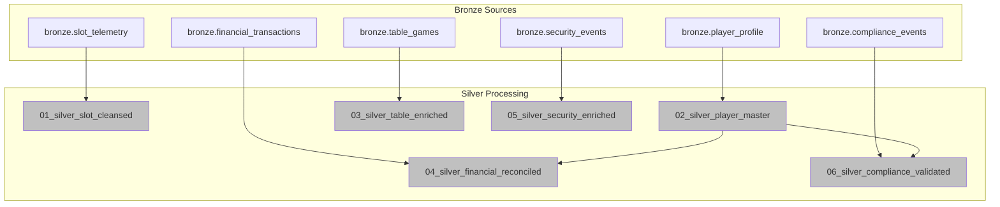

# [Home](../../README.md) > [Notebooks](../README.md) > Silver Layer

## 🥈 Silver Layer Notebooks

> **Purpose**: Data cleansing, validation, deduplication, and standardization. Enforces schema contracts and business rules while maintaining referential integrity.

The Silver layer transforms raw Bronze data into cleansed, validated datasets. This layer applies data quality rules, resolves duplicates, enriches with reference data, and enforces compliance constraints (PII masking, SSN hashing).

---

## 📚 Notebook Inventory

| Notebook | Purpose | Input | Output |
|----------|---------|-------|--------|
| `01_silver_slot_cleansed.py` | Cleanse slot telemetry, validate ranges, dedupe | `bronze.slot_telemetry` | `silver.slot_cleansed` |
| `02_silver_player_master.py` | Create player master with SCD Type 2, hash PII | `bronze.player_profile` | `silver.player_master` |
| `03_silver_table_enriched.py` | Enrich table games with dealer/pit info | `bronze.table_games` | `silver.table_enriched` |
| `04_silver_financial_reconciled.py` | Reconcile transactions, detect anomalies | `bronze.financial_transactions` | `silver.financial_reconciled` |
| `05_silver_security_enriched.py` | Enrich security events with location/zone data | `bronze.security_events` | `silver.security_enriched` |
| `06_silver_compliance_validated.py` | Validate compliance rules, flag violations | `bronze.compliance_events` | `silver.compliance_validated` |

---

## ⚡ Execution Order



> **Note**: `02_silver_player_master` must complete before `04_silver_financial_reconciled` and `06_silver_compliance_validated` (player key dependency).

---

## 🔧 Key Transformations

| Transformation | Description | Example |
|----------------|-------------|---------|
| **Deduplication** | Remove duplicate records by business key | Dedupe by `(machine_id, spin_timestamp)` |
| **Data Type Enforcement** | Cast to proper types with validation | `wager_amount` → DECIMAL(10,2) |
| **Null Handling** | Apply default values or flag for review | `player_tier` → 'UNKNOWN' if null |
| **PII Masking** | Hash SSN, mask card numbers | `SSN` → SHA-256 hash |
| **Range Validation** | Validate business rules | `wager_amount` between 0 and max denomination |
| **Referential Integrity** | Validate foreign keys exist | `player_id` exists in `silver.player_master` |
| **SCD Type 2** | Track historical changes | Player address, tier changes |

### Common Silver Patterns

```python
# Standard Silver cleansing pattern
from pyspark.sql.functions import sha2, regexp_replace, when, col

df_cleansed = (spark.table("bronze.player_profile")
    # Deduplicate by business key
    .dropDuplicates(["player_id", "_ingested_at"])
    
    # Hash SSN for privacy
    .withColumn("ssn_hash", sha2(col("ssn"), 256))
    .drop("ssn")
    
    # Mask card numbers (keep last 4)
    .withColumn("card_masked", regexp_replace(col("card_number"), r"\d(?=\d{4})", "*"))
    
    # Validate and default null tiers
    .withColumn("player_tier", when(col("player_tier").isNull(), "BRONZE").otherwise(col("player_tier")))
    
    # Add processing metadata
    .withColumn("_processed_at", current_timestamp())
    .withColumn("_is_valid", lit(True))
)

df_cleansed.write.format("delta").mode("overwrite").saveAsTable("silver.player_master")
```

---

## 📋 Dependencies

| Dependency | Type | Description |
|------------|------|-------------|
| **Bronze Layer** | Data | All Bronze tables must be populated |
| **Reference Data** | Lookup | Denomination codes, player tiers, zone mappings |
| **Compliance Rules** | Config | CTR thresholds, W-2G limits |
| **Schema Registry** | Governance | Expected schema definitions |

### Pre-requisites Checklist

- [ ] Bronze layer notebooks completed successfully
- [ ] Reference data tables loaded
- [ ] Compliance threshold configurations set
- [ ] Schema validation rules defined

---

## ✅ Validation Steps

### Data Quality Checks

| Check | Table | Query | Expected |
|-------|-------|-------|----------|
| **No Duplicates** | `slot_cleansed` | Count vs distinct by key | Equal counts |
| **Valid Ranges** | `slot_cleansed` | `wager_amount > 0` | 100% |
| **PII Masked** | `player_master` | `ssn IS NULL` | All records |
| **Referential Integrity** | `financial_reconciled` | Orphan player_ids | 0 |
| **Compliance Flags** | `compliance_validated` | CTR flagged ≥ $10,000 | Correct flagging |

### Validation Commands

```python
# Check for duplicates
slot_count = spark.sql("SELECT COUNT(*) FROM silver.slot_cleansed").first()[0]
distinct_count = spark.sql("""
    SELECT COUNT(*) FROM (
        SELECT DISTINCT machine_id, spin_timestamp 
        FROM silver.slot_cleansed
    )
""").first()[0]
assert slot_count == distinct_count, "Duplicates detected!"

# Validate PII masking
pii_exposed = spark.sql("""
    SELECT COUNT(*) 
    FROM silver.player_master 
    WHERE ssn IS NOT NULL OR LENGTH(card_number) = 16
""").first()[0]
assert pii_exposed == 0, "PII not properly masked!"

# Check referential integrity
orphans = spark.sql("""
    SELECT COUNT(*) 
    FROM silver.financial_reconciled f
    LEFT JOIN silver.player_master p ON f.player_id = p.player_id
    WHERE p.player_id IS NULL
""").first()[0]
assert orphans == 0, f"Found {orphans} orphan records!"
```

### Great Expectations Integration

```python
# Run Great Expectations checkpoint
import great_expectations as gx

context = gx.get_context()
result = context.run_checkpoint(checkpoint_name="silver_checkpoint")
assert result.success, "Data quality checks failed!"
```

---

## 📖 Related Resources

- **Tutorial**: [Day 2: Silver Transformation Tutorial](../../tutorials/day2-silver-transformation/README.md)
- **Previous Layer**: [Bronze Layer Notebooks](../bronze/README.md)
- **Next Layer**: [Gold Layer Notebooks](../gold/README.md)
- **Data Quality**: [Great Expectations Config](../../validation/great_expectations/)

---

## 🎰 Casino Domain Context

### Compliance Thresholds

| Rule | Threshold | Action |
|------|-----------|--------|
| **CTR (Currency Transaction Report)** | ≥ $10,000 | Auto-flag for FinCEN reporting |
| **Structuring Detection** | Multiple $8K-$9.9K transactions | Flag for SAR review |
| **W-2G (Gambling Winnings)** | Slots ≥ $1,200, Keno ≥ $600, Poker ≥ $5,000 | IRS reporting required |
| **Title 31** | Cash transactions by known players | Enhanced due diligence |

### PII Handling Requirements

| Field | Treatment | Storage |
|-------|-----------|---------|
| `SSN` | SHA-256 hash | Only hash stored |
| `Card Number` | Mask (show last 4) | `****-****-****-1234` |
| `Date of Birth` | Keep full date | Required for age verification |
| `Address` | Encrypt at rest | Delta Lake encryption |
| `Phone/Email` | Tokenize | Lookup table with restricted access |

### Player Master SCD Type 2

```python
# Track player tier changes over time
player_history = spark.sql("""
    SELECT 
        player_id,
        player_tier,
        effective_from,
        effective_to,
        is_current
    FROM silver.player_master_history
    WHERE player_id = 'PLY-12345'
    ORDER BY effective_from
""")
```

---

> **Next Steps**: After Silver layer validation passes, proceed to [Gold Layer](../gold/README.md) for business aggregations and analytics.
