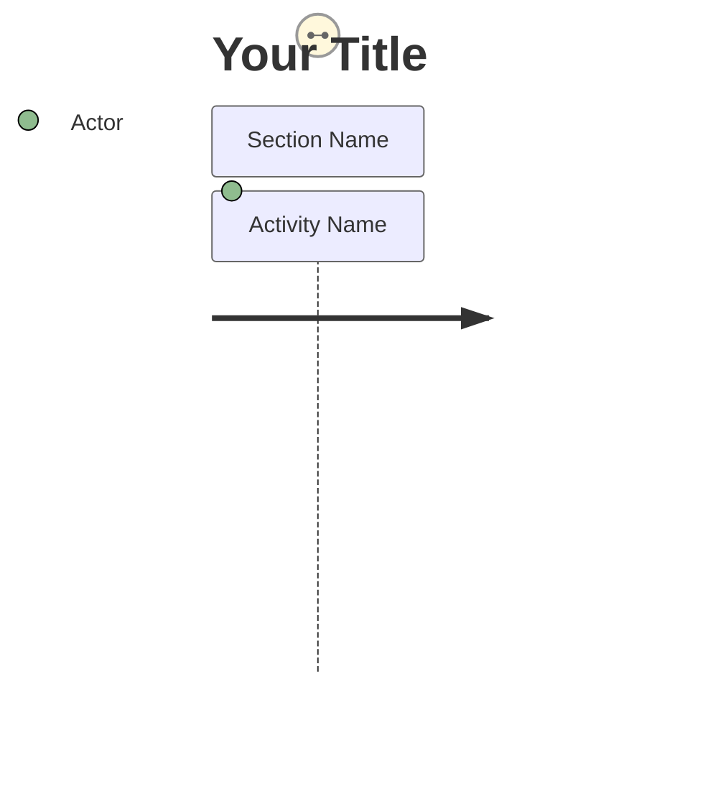
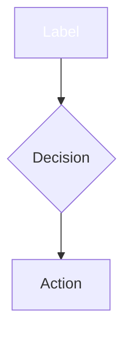
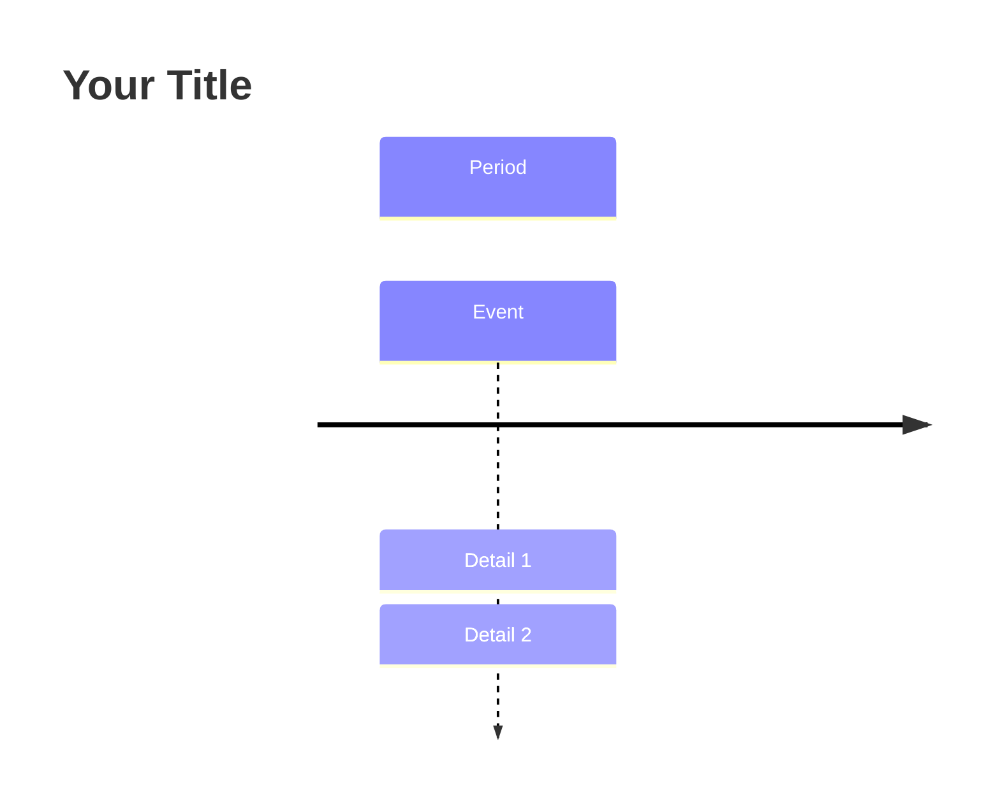

# 📊 Mermaid Diagram Guide for POC Agenda

This document provides an overview of the Mermaid diagrams added to the POC agenda files.

---

## 🎯 Overview

All POC agenda documents now include professional Mermaid diagrams that visualize the workshop flow, timing, and participant experience.

### Color Scheme

Consistent with the repository's medallion architecture theme:

| Color | Hex Code | Usage |
|-------|----------|-------|
| **Bronze** | `#CD7F32` | Bronze layer activities |
| **Silver** | `#C0C0C0` | Silver layer activities |
| **Gold** | `#FFD700` | Gold layer activities |
| **Success** | `#4CAF50` | Completions, achievements |
| **Info** | `#2196F3` | Breaks, informational sections |

---

## 📄 Diagram Details

### 1. README.md - Gantt Chart

**Purpose:** High-level 3-day workshop timeline

**Diagram Type:** `gantt`

**Key Features:**
- Shows all sessions across 3 days
- Time-based visualization (9:00 AM - 5:00 PM)
- Breaks and lunches highlighted
- Milestone markers for day completions
- Section-based organization (Day 1, Day 2, Day 3)

**When to View:**
- Planning workshop logistics
- Understanding overall time commitment
- Identifying break periods
- Viewing session dependencies

**Visual Indicators:**
- 🟩 Green bars = Active sessions
- 🟥 Red bars = Breaks/lunch (crit)
- 💎 Diamonds = Milestones

---

### 2. day1-medallion-foundation.md - Journey Diagram

**Purpose:** Participant experience and satisfaction throughout Day 1

**Diagram Type:** `journey`

**Key Features:**
- Emotional journey through activities
- Satisfaction scores (3-5 scale)
- Section-based time periods
- Participant perspective

**Sections:**
1. **Morning - Setup** (9:00-10:30)
2. **Late Morning - Bronze** (10:45-12:30)
3. **Afternoon - More Bronze** (13:30-15:00)
4. **Late Afternoon - Silver Start** (15:15-16:45)

**Score Interpretation:**
- 😄 **5** = Excellent experience (achievements, milestones)
- 🙂 **4** = Good experience (engaging hands-on work)
- 😐 **3** = Challenging but achievable (learning curves)

**When to View:**
- Understanding participant engagement
- Identifying potential difficulty points
- Planning support and assistance
- Adjusting pacing if needed

---

### 3. day2-transformations-realtime.md - Flowchart

**Purpose:** Learning path and decision flow for Day 2

**Diagram Type:** `flowchart TB` (top-to-bottom)

**Key Features:**
- Visual progression through layers
- Decision nodes for each major section
- Parallel learning tracks
- Custom medallion colors

**Flow Structure:**
```
Start → Review → Silver Layer (3 tracks) → Break → 
Gold Layer (3 tracks) → Lunch → Real-Time (sequential) → Complete
```

**Color-Coded Nodes:**
- 🟢 Start/Complete: `#4CAF50` (Success green)
- ⚪ Silver Complete: `#C0C0C0` (Silver)
- 🟡 Gold Complete: `#FFD700` (Gold)
- 🔵 Breaks: `#2196F3` (Info blue)

**When to View:**
- Understanding learning objectives
- Seeing how topics connect
- Planning hands-on exercises
- Tracking progress through the day

---

### 4. day3-bi-governance-mirroring.md - Timeline

**Purpose:** Session progression with audience expansion

**Diagram Type:** `timeline`

**Key Features:**
- Chronological session flow
- Audience counts in headers
- Detailed activity breakdowns
- Multi-level sub-tasks
- Custom color scale

**Timeline Structure:**

| Session | Time | Audience | Activities |
|---------|------|----------|------------|
| Morning 1 | 9:00-10:30 | 6 people | Semantic Model, DAX |
| Morning 2 | 10:45-12:30 | 6 people | Power BI Reports |
| Afternoon 3 | 13:30-15:00 | 10+ people | Purview Governance |
| Afternoon 4 | 15:15-16:30 | 10+ people | Database Mirroring |
| Wrap-up | 16:30-17:00 | All | POC Summary |

**Color Scale:**
- `cScale0`: `#4CAF50` - Success indicators
- `cScale1`: `#2196F3` - Session activities
- `cScale2`: `#FFD700` - Gold highlights
- `cScale3`: `#CD7F32` - Bronze accents
- `cScale4`: `#C0C0C0` - Silver accents

**When to View:**
- Understanding audience expansion
- Coordinating with multiple teams
- Planning room setup changes
- Scheduling stakeholder attendance

---

## 🔧 Rendering Instructions

### GitHub Rendering

All diagrams are optimized for GitHub's Mermaid renderer. They will automatically render when viewing the markdown files on GitHub.

### Local Rendering

To view diagrams locally, use one of these tools:

1. **VS Code with Mermaid Extension**
   - Install: Markdown Preview Mermaid Support
   - Open markdown file
   - Use preview pane (Ctrl+Shift+V)

2. **Mermaid Live Editor**
   - Visit: https://mermaid.live
   - Copy/paste diagram code
   - Export as PNG/SVG if needed

3. **Obsidian**
   - Built-in Mermaid support
   - Just open the markdown files

### Export Options

To create standalone images:

1. **PNG Export**: Right-click diagram in GitHub → Save image
2. **SVG Export**: Use Mermaid Live Editor
3. **PDF**: Print to PDF from browser preview

---

## 🎨 Customization Guide

### Modifying the Gantt Chart

To adjust timing or add sessions:

```mermaid
gantt
    title Your Title
    dateFormat HH:mm
    axisFormat %H:%M
    
    section Day X
    New Session   :tag, start, duration
```

**Duration format:**
- `30m` = 30 minutes
- `1h` = 1 hour
- `1h30m` = 1 hour 30 minutes

**Tags:**
- `:done` = Completed (green)
- `:active` = In progress (blue)
- `:crit` = Critical/break (red)
- `:milestone` = Milestone marker

### Modifying the Journey Diagram

To change scores or add activities:



**Score range:** 1-5 (1=worst, 5=best)

### Modifying the Flowchart

To add nodes or change flow:



### Modifying the Timeline

To add timeline entries:



---

## 📱 Responsive Design

All diagrams are designed to:
- Scale appropriately on different screen sizes
- Maintain readability on mobile devices
- Print clearly on paper
- Export cleanly to presentations

---

## ♿ Accessibility

Accessibility features included:
- High contrast colors (WCAG AA compliant)
- Clear, descriptive labels
- Logical flow direction
- Text alternatives (surrounding documentation)
- Semantic structure

---

## 🐛 Troubleshooting

### Diagram Not Rendering

**Issue:** Blank space where diagram should be

**Solutions:**
1. Check GitHub's Mermaid version compatibility
2. Validate syntax at https://mermaid.live
3. Clear browser cache
4. Check for special characters in labels

### Colors Not Showing

**Issue:** Diagram renders but colors are wrong

**Solutions:**
1. Verify theme initialization syntax
2. Check hex color format (`#RRGGBB`)
3. Ensure GitHub supports custom themes
4. Use style directives for specific nodes

### Layout Issues

**Issue:** Nodes overlap or misaligned

**Solutions:**
1. Adjust node label length
2. Use `<br/>` for line breaks in labels
3. Switch flowchart direction (TB vs LR)
4. Increase spacing with empty nodes

---

## 📚 Additional Resources

### Mermaid Documentation
- Official Docs: https://mermaid.js.org/
- Syntax Reference: https://mermaid.js.org/intro/syntax-reference.html
- Live Editor: https://mermaid.live

### GitHub Documentation
- Mermaid in GitHub: https://github.blog/2022-02-14-include-diagrams-markdown-files-mermaid/

### Video Tutorials
- Mermaid Crash Course: Search YouTube for "Mermaid diagram tutorial"
- GitHub Markdown: GitHub Skills courses

---

## 💡 Best Practices

1. **Keep It Simple**
   - Avoid overcrowding diagrams
   - Use clear, concise labels
   - Limit colors to 3-5 per diagram

2. **Consistency**
   - Use same color scheme across all diagrams
   - Maintain consistent terminology
   - Follow the same node shape conventions

3. **Accessibility**
   - Provide text descriptions
   - Use high-contrast colors
   - Include legends/keys

4. **Maintenance**
   - Update diagrams when agenda changes
   - Version control diagram code
   - Document custom styling

---

## 📞 Support

For questions about the diagrams:
- Check Mermaid documentation first
- Open an issue in the repository
- Contact the POC team

---

<div align="center">

**Happy Visualizing! 📊**

[← Back to POC Agenda](./README.md)

</div>
