# 🎰 3-Day POC Agenda

> 🏠 Home > 📆 POC Agenda

---

## Casino/Gaming Microsoft Fabric POC Workshop

**Date:** `[INSERT DATE]`
**Location:** `[INSERT LOCATION]`
**Duration:** 3 Days (8 hours/day)

This 3-day hands-on workshop guides participants through building a complete data platform using Microsoft Fabric with a casino/gaming industry focus.

---

## 📊 POC Progress Tracker

```
Overall POC:  ░░░░░░░░░░ 0% Complete
─────────────────────────────────────
Day 1:        ░░░░░░░░░░ 0%  🏗️ Foundation
Day 2:        ░░░░░░░░░░ 0%  ⚡ Transformations
Day 3:        ░░░░░░░░░░ 0%  📊 BI & Governance
```

---

## 🗓️ Workshop Overview

| 📅 Day | 🎯 Icon | 🎓 Focus Area | 📦 Key Deliverables |
|:------:|:-------:|:-------------|:-------------------|
| **1** | 🏗️ | **Foundation** | Workspace, Bronze/Silver layers |
| **2** | ⚡ | **Transformation** | Gold layer, Real-time analytics |
| **3** | 📊 | **Analytics & Governance** | Power BI, Purview, Mirroring |

### 3-Day Workshop Timeline

```mermaid
gantt
    title Casino/Gaming Microsoft Fabric POC - 3-Day Workshop
    dateFormat HH:mm
    axisFormat %H:%M

    section Day 1 🏗️
    Welcome & Overview           :done, d1s1, 09:00, 30m
    Environment Setup            :done, d1s2, 09:30, 1h
    Break                        :crit, d1b1, 10:30, 15m
    Bronze Layer Part 1          :active, d1s3, 10:45, 1h45m
    Lunch                        :crit, d1l, 12:30, 1h
    Bronze Layer Part 2          :d1s4, 13:30, 1h30m
    Break                        :crit, d1b2, 15:00, 15m
    Silver Layer Start           :d1s5, 15:15, 1h30m
    Day 1 Wrap-up               :milestone, d1m, 16:45, 15m

    section Day 2 ⚡
    Day 1 Review                 :d2s1, 09:00, 15m
    Silver Layer Complete        :d2s2, 09:15, 1h15m
    Break                        :crit, d2b1, 10:30, 15m
    Gold Layer                   :d2s3, 10:45, 1h45m
    Lunch                        :crit, d2l, 12:30, 1h
    Real-Time Analytics Setup    :d2s4, 13:30, 1h30m
    Break                        :crit, d2b2, 15:00, 15m
    Real-Time Dashboards         :d2s5, 15:15, 1h30m
    Day 2 Wrap-up               :milestone, d2m, 16:45, 15m

    section Day 3 📊
    Day 2 Review                 :d3s1, 09:00, 15m
    Direct Lake Setup            :d3s2, 09:15, 1h15m
    Break                        :crit, d3b1, 10:30, 15m
    Power BI Reports             :d3s3, 10:45, 1h45m
    Lunch                        :crit, d3l, 12:30, 1h
    Purview Governance           :d3s4, 13:30, 1h30m
    Break                        :crit, d3b2, 15:00, 15m
    Database Mirroring           :d3s5, 15:15, 1h15m
    POC Summary & Next Steps     :milestone, d3m, 16:30, 30m
```



**Legend:**
- 🟩 **Green bars**: Hands-on sessions
- 🟥 **Red bars**: Breaks and lunch
- 💎 **Milestones**: Day wrap-ups and completion

---

## 👥 Audience & Participants

| 📅 Day | 👤 Participants | 🔢 Count | 🎯 Session Focus |
|:------:|:---------------|:--------:|:----------------|
| Day 1-2 | Data Architects & Engineers | 4 | Technical Implementation |
| Day 3 (AM) | + BI Developers | 6 | Analytics & Reporting |
| Day 3 (PM) | + All Stakeholders | 10+ | Governance & Roadmap |

---

## ✅ Prerequisites Checklist

All participants should have:

- [ ] Azure account with Fabric access
- [ ] Completed pre-work modules (online)
- [ ] Laptop with Azure CLI installed
- [ ] Access to workshop workspace
- [ ] Microsoft Teams for collaboration

---

## 📅 Day 1: Medallion Foundation

> 🏗️ **Focus:** Establish the core data architecture

### 🌅 Morning Schedule

| ⏰ Time | ⏱️ Duration | 📋 Session | 🎭 Type | 👤 Facilitator |
|:-------|:-----------:|:----------|:-------:|:--------------|
| 9:00-9:30 | 30 min | **Welcome & Overview** | 🎤 | Lead Architect |
| 9:30-10:30 | 1 hr | **Environment Setup** | 👥 | Hands-on |
| 10:30-10:45 | 15 min | ☕ *Break* | — | — |
| 10:45-12:30 | 1 hr 45 min | **Bronze Layer Part 1** | 👥 | Hands-on |

### ☀️ Afternoon Schedule

| ⏰ Time | ⏱️ Duration | 📋 Session | 🎭 Type | 👤 Facilitator |
|:-------|:-----------:|:----------|:-------:|:--------------|
| 12:30-13:30 | 1 hr | 🍽️ *Lunch* | — | — |
| 13:30-15:00 | 1 hr 30 min | **Bronze Layer Part 2** | 👥 | Hands-on |
| 15:00-15:15 | 15 min | ☕ *Break* | — | — |
| 15:15-16:45 | 1 hr 30 min | **Silver Layer Start** | 👥 | Hands-on |
| 16:45-17:00 | 15 min | **Day 1 Wrap-up** | 💬 | Discussion |

### 🎯 Day 1 Learning Objectives

By end of Day 1, participants will have:

<table>
<tr>
<td width="33%">

**1. Workspace Configuration**
- Created Fabric workspace
- Configured capacity settings
- Created three Lakehouses (Bronze/Silver/Gold)

</td>
<td width="34%">

**2. Bronze Layer Complete**
- Ingested slot machine telemetry
- Ingested player profiles
- Ingested financial transactions
- Ingested table games data
- Ingested security events
- Ingested compliance records

</td>
<td width="33%">

**3. Silver Layer Started**
- Understood data quality requirements
- Implemented basic cleansing patterns

</td>
</tr>
</table>

### 📚 Day 1 Materials

- [Tutorial 00: Environment Setup](../tutorials/00-environment-setup/README.md)
- [Tutorial 01: Bronze Layer](../tutorials/01-bronze-layer/README.md)
- [**Day 1 Detailed Guide**](./day1-medallion-foundation.md)

---

## 📅 Day 2: Transformations & Real-Time

> ⚡ **Focus:** Data quality, aggregations, and streaming

### 🌅 Morning Schedule

| ⏰ Time | ⏱️ Duration | 📋 Session | 🎭 Type | 👤 Facilitator |
|:-------|:-----------:|:----------|:-------:|:--------------|
| 9:00-9:15 | 15 min | **Day 1 Review** | 💬 | Lead Architect |
| 9:15-10:30 | 1 hr 15 min | **Silver Layer Complete** | 👥 | Hands-on |
| 10:30-10:45 | 15 min | ☕ *Break* | — | — |
| 10:45-12:30 | 1 hr 45 min | **Gold Layer** | 👥 | Hands-on |

### ☀️ Afternoon Schedule

| ⏰ Time | ⏱️ Duration | 📋 Session | 🎭 Type | 👤 Facilitator |
|:-------|:-----------:|:----------|:-------:|:--------------|
| 12:30-13:30 | 1 hr | 🍽️ *Lunch* | — | — |
| 13:30-15:00 | 1 hr 30 min | **Real-Time Analytics Setup** | 👥 | Hands-on |
| 15:00-15:15 | 15 min | ☕ *Break* | — | — |
| 15:15-16:45 | 1 hr 30 min | **Real-Time Dashboards** | 👥 | Hands-on |
| 16:45-17:00 | 15 min | **Day 2 Wrap-up** | 💬 | Discussion |

### 🎯 Day 2 Learning Objectives

By end of Day 2, participants will have:

<table>
<tr>
<td width="33%">

**1. Silver Layer Complete**
- Data cleansing and validation
- SCD Type 2 for player master
- Deduplication patterns
- Schema enforcement

</td>
<td width="34%">

**2. Gold Layer Complete**
- Slot performance aggregations
- Player 360 view
- Compliance reporting tables
- KPI calculations

</td>
<td width="33%">

**3. Real-Time Intelligence**
- Eventhouse configured
- Eventstream ingestion
- KQL queries for monitoring
- Real-time dashboard

</td>
</tr>
</table>

### 📚 Day 2 Materials

- [Tutorial 02: Silver Layer](../tutorials/02-silver-layer/README.md)
- [Tutorial 03: Gold Layer](../tutorials/03-gold-layer/README.md)
- [Tutorial 04: Real-Time Analytics](../tutorials/04-real-time-analytics/README.md)
- [**Day 2 Detailed Guide**](./day2-transformations-realtime.md)

---

## 📅 Day 3: BI, Governance & Advanced

> 📊 **Focus:** Analytics, compliance, and enterprise features

### 🌅 Morning Schedule

| ⏰ Time | ⏱️ Duration | 📋 Session | 🎭 Type | 👤 Facilitator |
|:-------|:-----------:|:----------|:-------:|:--------------|
| 9:00-9:15 | 15 min | **Day 2 Review** | 💬 | Lead Architect |
| 9:15-10:30 | 1 hr 15 min | **Direct Lake Setup** | 👥 | Hands-on |
| 10:30-10:45 | 15 min | ☕ *Break* | — | — |
| 10:45-12:30 | 1 hr 45 min | **Power BI Reports** | 👥 | Hands-on |

### ☀️ Afternoon Schedule

| ⏰ Time | ⏱️ Duration | 📋 Session | 🎭 Type | 👤 Facilitator |
|:-------|:-----------:|:----------|:-------:|:--------------|
| 12:30-13:30 | 1 hr | 🍽️ *Lunch* | — | — |
| 13:30-15:00 | 1 hr 30 min | **Purview Governance** | 🎤👥 | Demo + Hands-on |
| 15:00-15:15 | 15 min | ☕ *Break* | — | — |
| 15:15-16:30 | 1 hr 15 min | **Database Mirroring** | 🎤 | Demo |
| 16:30-17:00 | 30 min | **POC Summary & Next Steps** | 💬 | All |

### 🎯 Day 3 Learning Objectives

By end of Day 3, participants will have:

<table>
<tr>
<td width="33%">

**1. Direct Lake & Power BI**
- Semantic model created
- DAX measures implemented
- Executive dashboard
- Operational reports

</td>
<td width="34%">

**2. Purview Governance**
- Data catalog populated
- Lineage visualization
- Classification applied
- Glossary terms defined

</td>
<td width="33%">

**3. Database Mirroring** (Demo)
- SQL Server mirroring concept
- Snowflake integration overview
- Near real-time sync patterns

</td>
</tr>
</table>

### 📚 Day 3 Materials

- [Tutorial 05: Direct Lake & Power BI](../tutorials/05-direct-lake-powerbi/README.md)
- [Tutorial 07: Governance & Purview](../tutorials/07-governance-purview/README.md)
- [Tutorial 08: Database Mirroring](../tutorials/08-database-mirroring/README.md)
- [**Day 3 Detailed Guide**](./day3-bi-governance-mirroring.md)

---

## 📦 Workshop Deliverables

Upon completion, the team will have:

### Technical Assets

- [ ] Fully configured Fabric workspace
- [ ] Complete medallion architecture (Bronze/Silver/Gold)
- [ ] Real-time analytics pipeline
- [ ] Power BI semantic model and reports
- [ ] Purview data catalog integration

### Documentation

- [ ] Architecture diagram
- [ ] Data dictionary
- [ ] Deployment runbook
- [ ] Operational procedures

### Knowledge Transfer

- [ ] Recorded sessions (if applicable)
- [ ] Q&A documentation
- [ ] Best practices guide

---

## 🎯 Success Criteria

| 📊 Metric | 🎯 Target | ✅ Status |
|:----------|:---------|:--------:|
| Bronze tables populated | 6 tables, 500K+ records | ⬜ |
| Silver transformations | All data cleansed | ⬜ |
| Gold aggregations | KPIs calculated | ⬜ |
| Real-time latency | < 1 minute | ⬜ |
| Report load time | < 3 seconds | ⬜ |
| Governance coverage | 100% tables cataloged | ⬜ |

---

## 🏢 Logistics

### Room Setup

| 📋 Requirement | ✅ Status |
|:--------------|:--------:|
| Projector/large display | ⬜ |
| Whiteboard | ⬜ |
| Power outlets for all laptops | ⬜ |
| Stable internet connection | ⬜ |

### Accounts Required

| 🔑 Account | ✅ Status |
|:----------|:--------:|
| Azure AD accounts for all participants | ⬜ |
| Fabric workspace access | ⬜ |
| Purview access (Day 3) | ⬜ |

### Support

- Technical support contact available
- Backup facilitator identified
- Escalation path documented

---

## 📅 Post-Workshop Roadmap

| 📅 Timeline | 📋 Action Items |
|:-----------|:---------------|
| **Week 1** | Review recordings, practice exercises |
| **Week 2** | Implement with real data (subset) |
| **Week 3** | Production planning meeting |
| **Week 4** | Go/No-Go decision |

---

## 🔗 Quick Links

| 📚 Resource | 🔗 Link |
|:-----------|:-------|
| 📘 Instructor Guide | [View Guide](./instructor-guide/README.md) |
| 📖 Day 1 Details | [Medallion Foundation](./day1-medallion-foundation.md) |
| 📖 Day 2 Details | [Transformations & Real-time](./day2-transformations-realtime.md) |
| 📖 Day 3 Details | [BI & Governance](./day3-bi-governance-mirroring.md) |
| 🌐 Microsoft Fabric Docs | [learn.microsoft.com/fabric](https://learn.microsoft.com/fabric) |

---

## 📞 Support Contact

**Technical Support:** `[INSERT CONTACT]`
**POC Lead:** `[INSERT NAME]`
**Email:** `[INSERT EMAIL]`

---

<div align="center">

**Session Type Legend**

| Icon | Type |
|:----:|------|
| 🎤 | Presentation |
| 👥 | Hands-on Lab |
| 💬 | Discussion |

---

[⬅️ Back to Main](../README.md) | [Day 1 ➡️](./day1-medallion-foundation.md)

</div>
