# 📅 Day 2: Transformations & Real-Time Analytics

> 🏠 Home > 📆 POC Agenda > ⚡ Day 2

---

**Date:** `[INSERT DATE]`
**Duration:** 8 hours (9:00 AM - 5:00 PM)
**Focus:** Complete Silver/Gold layers, implement real-time casino floor monitoring
**Audience:** Data Architects (4 participants)

---

## 📊 Day 2 Progress Tracker

```
Day 2 Progress: ░░░░░░░░░░ 0% Complete
────────────────────────────────────────────
🌅 Morning Session 1:   ░░░░░░░░░░  Silver Layer Complete
🌅 Morning Session 2:   ░░░░░░░░░░  Gold Layer
☀️ Afternoon Session 3: ░░░░░░░░░░  Real-Time Analytics
☀️ Afternoon Session 4: ░░░░░░░░░░  Real-Time Dashboards
```

---

## 📋 Materials Checklist

Before starting, ensure the following are ready:

### Prerequisites from Day 1
- [ ] Bronze layer tables populated
- [ ] Silver layer started (slot_cleansed)
- [ ] All participants have workspace access

### Day 2 Materials
- [ ] Silver layer notebooks prepared
- [ ] Gold layer notebooks prepared
- [ ] Eventstream configuration ready
- [ ] KQL query templates available

### Real-Time Components
- [ ] Streaming data producer script ready
- [ ] Event Hub credentials (if using)
- [ ] Dashboard templates prepared

---

## 🗓️ Daily Schedule At-a-Glance

| Time | Duration | Session | Type |
|:----:|:--------:|---------|:----:|
| 9:00-10:30 | 1.5 hr | 🌅 Silver Layer Complete | 👥 Hands-on |
| 10:30-10:45 | 15 min | ☕ Break | - |
| 10:45-12:30 | 1.75 hr | 🌅 Gold Layer | 👥 Hands-on |
| 12:30-13:30 | 1 hr | 🍽️ Lunch | - |
| 13:30-15:00 | 1.5 hr | ☀️ Real-Time Analytics Setup | 👥 Hands-on |
| 15:00-15:15 | 15 min | ☕ Break | - |
| 15:15-16:45 | 1.5 hr | ☀️ Real-Time Dashboards | 👥 Hands-on |
| 16:45-17:00 | 15 min | 💬 Day 2 Wrap-up | Discussion |

---

### Day 2 Learning Path

```mermaid
%%{init: {'theme':'base', 'themeVariables': { 'primaryColor':'#C0C0C0','primaryTextColor':'#000','primaryBorderColor':'#888','lineColor':'#2196F3','secondaryColor':'#FFD700','tertiaryColor':'#fff', 'fontSize':'14px'}}}%%
flowchart TB
    Start([Day 2 Start<br/>9:00 AM]) --> Review[Review Day 1<br/>Bronze Layer Success]
    
    Review --> Silver{Silver Layer<br/>Complete}
    
    Silver --> SCD[SCD Type 2<br/>Player Master]
    Silver --> Recon[Financial<br/>Reconciliation]
    Silver --> Quality[Data Quality<br/>Framework]
    
    SCD --> SilverDone[✓ Silver Complete]
    Recon --> SilverDone
    Quality --> SilverDone
    
    SilverDone --> Break1[☕ Break]
    
    Break1 --> Gold{Gold Layer<br/>Aggregations}
    
    Gold --> SlotPerf[Slot Performance<br/>KPIs]
    Gold --> Player360[Player 360<br/>View]
    Gold --> Compliance[Compliance<br/>Reporting]
    
    SlotPerf --> GoldDone[✓ Gold Complete]
    Player360 --> GoldDone
    Compliance --> GoldDone
    
    GoldDone --> Lunch[🍽️ Lunch]
    
    Lunch --> RealTime{Real-Time<br/>Intelligence}
    
    RealTime --> Eventhouse[Create<br/>Eventhouse]
    Eventhouse --> Eventstream[Configure<br/>Eventstream]
    Eventstream --> KQL[Write KQL<br/>Queries]
    
    KQL --> Break2[☕ Break]
    
    Break2 --> Dashboard[Build Real-Time<br/>Dashboard]
    Dashboard --> Alerts[Configure<br/>Alerts]
    
    Alerts --> Complete([Day 2 Complete<br/>5:00 PM])
    
    style Start fill:#4CAF50,stroke:#2E7D32,color:#fff
    style Complete fill:#4CAF50,stroke:#2E7D32,color:#fff
    style SilverDone fill:#C0C0C0,stroke:#888,color:#000
    style GoldDone fill:#FFD700,stroke:#CD7F32,color:#000
    style Break1 fill:#2196F3,stroke:#1976D2,color:#fff
    style Break2 fill:#2196F3,stroke:#1976D2,color:#fff
    style Lunch fill:#2196F3,stroke:#1976D2,color:#fff
```



**Learning Path Highlights:**
- 🥈 **Silver Layer**: Data quality, reconciliation, SCD Type 2
- 🥇 **Gold Layer**: Business KPIs, player analytics, compliance
- ⚡ **Real-Time**: Eventhouse, Eventstream, KQL dashboards

---

## 🌅 Morning Session 1: Silver Layer Complete (9:00 - 10:30)

### 🎯 Session Objectives

| Objective | Duration | Status |
|-----------|:--------:|:------:|
| Complete Silver layer transformations | - | ⬜ |
| Implement SCD Type 2 for player master | 45 min | ⬜ |
| Apply reconciliation patterns for financial data | 45 min | ⬜ |

---

### 📝 Activity 5.1: Player Master with SCD Type 2 (45 min)

> 💡 **SCD Type 2** tracks historical changes to player attributes

```python
# Notebook: 02_silver_player_master

from delta.tables import DeltaTable
from pyspark.sql.functions import *

# Read new data from Bronze
df_new = spark.table("lh_bronze.bronze_player_profile") \
    .withColumn("effective_date", current_date()) \
    .withColumn("end_date", lit(None).cast("date")) \
    .withColumn("is_current", lit(True))

# Check if Silver table exists
if spark.catalog.tableExists("lh_silver.silver_player_master"):
    # SCD Type 2 merge logic
    silver_table = DeltaTable.forName(spark, "lh_silver.silver_player_master")

    # Get current records
    df_current = silver_table.toDF().filter(col("is_current") == True)

    # Find changes (compare on key attributes)
    df_changes = df_new.alias("new") \
        .join(df_current.alias("current"), "player_id", "left") \
        .filter(
            (col("current.player_id").isNull()) |  # New player
            (col("new.loyalty_tier") != col("current.loyalty_tier")) |  # Tier change
            (col("new.email") != col("current.email")) |  # Email change
            (col("new.address") != col("current.address"))  # Address change
        )

    if df_changes.count() > 0:
        # Close current records
        silver_table.update(
            condition = (col("player_id").isin(df_changes.select("player_id").collect())) &
                       (col("is_current") == True),
            set = {
                "end_date": current_date(),
                "is_current": lit(False)
            }
        )

        # Insert new versions
        df_changes.select(df_new.columns).write \
            .format("delta") \
            .mode("append") \
            .saveAsTable("lh_silver.silver_player_master")
else:
    # Initial load
    df_new.write \
        .format("delta") \
        .mode("overwrite") \
        .saveAsTable("lh_silver.silver_player_master")

# Verification
spark.sql("""
    SELECT player_id, COUNT(*) as versions
    FROM lh_silver.silver_player_master
    GROUP BY player_id
    HAVING COUNT(*) > 1
    ORDER BY versions DESC
    LIMIT 10
""").show()
```

---

### 📝 Activity 5.2: Financial Reconciliation (45 min)

Implement cage reconciliation patterns:

```python
# Notebook: 03_silver_financial_reconciled

# Read Bronze financial data
df_txn = spark.table("lh_bronze.bronze_financial_txn")

# Reconciliation rules
df_reconciled = df_txn \
    .withColumn("reconciliation_status",
        when(col("source_amount") == col("destination_amount"), "MATCHED")
        .when(abs(col("source_amount") - col("destination_amount")) < 0.01, "MATCHED_ROUNDING")
        .otherwise("VARIANCE")) \
    .withColumn("variance_amount",
        col("source_amount") - col("destination_amount")) \
    .withColumn("variance_pct",
        when(col("source_amount") > 0,
             (col("variance_amount") / col("source_amount")) * 100)
        .otherwise(0))

# Flag high-risk transactions
df_silver = df_reconciled \
    .withColumn("risk_flags",
        array_distinct(
            filter(
                array(
                    when(col("amount") >= 10000, lit("CTR_REQUIRED")),
                    when(col("amount").between(8000, 9999), lit("NEAR_CTR")),
                    when(col("variance_pct") > 1, lit("HIGH_VARIANCE")),
                    when(col("transaction_type") == "MARKER", lit("CREDIT_TRANSACTION"))
                ),
                lambda x: x.isNotNull()
            )
        ))

df_silver.write \
    .format("delta") \
    .mode("overwrite") \
    .partitionBy("transaction_date") \
    .saveAsTable("lh_silver.silver_financial_reconciled")

# Reconciliation summary
spark.sql("""
    SELECT
        reconciliation_status,
        COUNT(*) as transactions,
        SUM(amount) as total_amount,
        AVG(variance_pct) as avg_variance_pct
    FROM lh_silver.silver_financial_reconciled
    GROUP BY reconciliation_status
""").show()
```

**Risk Flag Legend:**

| Flag | Trigger Condition |
|------|-------------------|
| `CTR_REQUIRED` | Amount >= $10,000 |
| `NEAR_CTR` | Amount $8,000 - $9,999 |
| `HIGH_VARIANCE` | Variance > 1% |
| `CREDIT_TRANSACTION` | Marker/Credit |

---

## 🌅 Morning Session 2: Gold Layer (10:45 - 12:30)

### 🎯 Session Objectives

| Objective | Duration | Status |
|-----------|:--------:|:------:|
| Create aggregated Gold layer tables | - | ⬜ |
| Implement casino KPI calculations | 45 min | ⬜ |
| Build Player 360 view | 45 min | ⬜ |
| Create compliance reporting table | 30 min | ⬜ |

---

### 📝 Activity 6.1: Slot Performance Gold Table (45 min)

```python
# Notebook: 01_gold_slot_performance

# Read Silver slot data
df_silver = spark.table("lh_silver.silver_slot_cleansed")

# Daily aggregations by machine
df_daily = df_silver \
    .withColumn("business_date", to_date("event_timestamp")) \
    .groupBy("machine_id", "zone", "denomination", "business_date") \
    .agg(
        sum("coin_in").alias("total_coin_in"),
        sum("coin_out").alias("total_coin_out"),
        sum("games_played").alias("total_games"),
        sum(when(col("event_type") == "JACKPOT", col("jackpot_amount"))).alias("jackpot_payouts"),
        countDistinct("player_id").alias("unique_players"),
        count("*").alias("total_events"),
        avg("_dq_score").alias("avg_data_quality")
    )

# Calculate KPIs
df_gold = df_daily \
    .withColumn("net_win", col("total_coin_in") - col("total_coin_out")) \
    .withColumn("actual_hold_pct",
        when(col("total_coin_in") > 0,
             (col("net_win") / col("total_coin_in")) * 100)
        .otherwise(0)) \
    .withColumn("avg_bet",
        when(col("total_games") > 0,
             col("total_coin_in") / col("total_games"))
        .otherwise(0)) \
    .withColumn("win_per_unit",
        col("net_win") / 1)  # Per machine per day

# Add theoretical calculations (example: 8% theoretical hold)
df_gold = df_gold \
    .withColumn("theoretical_win", col("total_coin_in") * 0.08) \
    .withColumn("hold_variance", col("net_win") - col("theoretical_win")) \
    .withColumn("hold_variance_pct",
        when(col("theoretical_win") > 0,
             ((col("net_win") - col("theoretical_win")) / col("theoretical_win")) * 100)
        .otherwise(0))

# Write to Gold
df_gold.write \
    .format("delta") \
    .mode("overwrite") \
    .partitionBy("business_date") \
    .saveAsTable("lh_gold.gold_slot_performance")

# OPTIMIZE for Direct Lake
spark.sql("OPTIMIZE lh_gold.gold_slot_performance ZORDER BY (machine_id)")
```

**KPI Definitions:**

| KPI | Formula | Description |
|-----|---------|-------------|
| Net Win | Coin In - Coin Out | Gross gaming revenue |
| Hold % | Net Win / Coin In | Actual retention rate |
| Theo Win | Coin In x 8% | Expected win at par |
| Hold Variance | Actual - Theo | Performance vs expected |

---

### 📝 Activity 6.2: Player 360 Gold Table (45 min)

```python
# Notebook: 02_gold_player_360

# Get current player records
df_players = spark.table("lh_silver.silver_player_master") \
    .filter(col("is_current") == True)

# Aggregate gaming activity
df_slot_activity = spark.table("lh_silver.silver_slot_cleansed") \
    .groupBy("player_id") \
    .agg(
        sum("coin_in").alias("slot_coin_in"),
        sum("coin_out").alias("slot_coin_out"),
        count("*").alias("slot_games_played"),
        max("event_timestamp").alias("last_slot_play")
    )

df_table_activity = spark.table("lh_silver.silver_table_enriched") \
    .groupBy("player_id") \
    .agg(
        sum("buy_in").alias("table_buy_in"),
        sum("cash_out").alias("table_cash_out"),
        sum("hours_played").alias("table_hours_played"),
        max("session_end").alias("last_table_play")
    )

df_financial = spark.table("lh_silver.silver_financial_reconciled") \
    .groupBy("player_id") \
    .agg(
        count("*").alias("total_transactions"),
        sum(when(col("transaction_type") == "CASH_IN", col("amount"))).alias("total_cash_in"),
        sum(when(col("transaction_type") == "MARKER", col("amount"))).alias("total_markers"),
        max("transaction_timestamp").alias("last_transaction")
    )

# Join all activities
df_360 = df_players \
    .join(df_slot_activity, "player_id", "left") \
    .join(df_table_activity, "player_id", "left") \
    .join(df_financial, "player_id", "left")

# Calculate metrics
df_gold = df_360 \
    .withColumn("total_gaming_activity",
        coalesce(col("slot_coin_in"), lit(0)) + coalesce(col("table_buy_in"), lit(0))) \
    .withColumn("total_theo_win",
        (coalesce(col("slot_coin_in"), lit(0)) * 0.08) +
        (coalesce(col("table_hours_played"), lit(0)) * 50)) \
    .withColumn("last_visit",
        greatest(col("last_slot_play"), col("last_table_play"), col("last_transaction"))) \
    .withColumn("days_since_visit",
        datediff(current_date(), col("last_visit"))) \
    .withColumn("churn_risk",
        when(col("days_since_visit") > 90, "High")
        .when(col("days_since_visit") > 30, "Medium")
        .otherwise("Low")) \
    .withColumn("player_value_score",
        (coalesce(col("total_theo_win"), lit(0)) / 1000) +
        (coalesce(col("total_visits"), lit(0)) * 2))

df_gold.write \
    .format("delta") \
    .mode("overwrite") \
    .saveAsTable("lh_gold.gold_player_360")
```

**Churn Risk Thresholds:**

| Risk Level | Days Since Visit |
|------------|:----------------:|
| Low | 0-30 days |
| Medium | 31-90 days |
| High | 90+ days |

---

### 📝 Activity 6.3: Compliance Reporting Gold Table (30 min)

```python
# Notebook: 03_gold_compliance_reporting

df_compliance = spark.table("lh_silver.silver_compliance_validated")
df_financial = spark.table("lh_silver.silver_financial_reconciled")

# Daily compliance summary
df_gold = df_compliance \
    .withColumn("report_date", to_date("filing_timestamp")) \
    .groupBy("report_date") \
    .agg(
        sum(when(col("filing_type") == "CTR", 1).otherwise(0)).alias("ctr_count"),
        sum(when(col("filing_type") == "SAR", 1).otherwise(0)).alias("sar_count"),
        sum(when(col("filing_type") == "W2G", 1).otherwise(0)).alias("w2g_count"),
        sum(when(col("filing_type") == "CTR", col("amount"))).alias("ctr_total_amount"),
        sum(when(col("filing_type") == "W2G", col("amount"))).alias("w2g_total_amount")
    )

# Add potential CTRs from financial (not yet filed)
df_potential_ctr = df_financial \
    .filter(col("amount") >= 10000) \
    .filter(col("ctr_filed") == False) \
    .groupBy(to_date("transaction_timestamp").alias("report_date")) \
    .agg(count("*").alias("pending_ctrs"))

df_gold = df_gold.join(df_potential_ctr, "report_date", "left")

df_gold.write \
    .format("delta") \
    .mode("overwrite") \
    .saveAsTable("lh_gold.gold_compliance_reporting")
```

---

## ☀️ Afternoon Session 3: Real-Time Analytics (13:30 - 15:00)

### 🎯 Session Objectives

| Objective | Duration | Status |
|-----------|:--------:|:------:|
| Create Eventhouse for real-time data | 20 min | ⬜ |
| Configure Eventstreams for slot telemetry | 40 min | ⬜ |
| Write KQL queries for monitoring | 30 min | ⬜ |

---

### 📝 Activity 7.1: Create Eventhouse (20 min)

The Eventhouse provides real-time intelligence capabilities for streaming data analysis.

**Steps:**

1. In workspace, click **+ New** > **Eventhouse**
2. Name: `eh_casino_realtime`
3. Create database: `kdb_floor_monitoring`

---

### 📝 Activity 7.2: Configure Eventstream (40 min)


*Source: [Create an Eventstream in Microsoft Fabric](https://learn.microsoft.com/en-us/fabric/real-time-intelligence/event-streams/create-manage-an-eventstream)*

```
Eventstream: es_slot_telemetry

Source: Custom App (for demo)
  - Later: Event Hub / IoT Hub for production

Transformations:
  1. Parse JSON
  2. Add timestamp
  3. Filter for relevant events

Destination: KQL Database
  - Table: slot_events
```

**Create streaming table in KQL:**

```kql
.create table slot_events (
    machine_id: string,
    event_type: string,
    event_timestamp: datetime,
    coin_in: decimal,
    coin_out: decimal,
    games_played: int,
    jackpot_amount: decimal,
    zone: string,
    denomination: decimal,
    player_id: string
)

.create table slot_events ingestion json mapping 'slot_events_mapping' '[{"column":"machine_id","path":"$.machine_id"},{"column":"event_type","path":"$.event_type"},{"column":"event_timestamp","path":"$.event_timestamp"},{"column":"coin_in","path":"$.coin_in"},{"column":"coin_out","path":"$.coin_out"},{"column":"games_played","path":"$.games_played"},{"column":"jackpot_amount","path":"$.jackpot_amount"},{"column":"zone","path":"$.zone"},{"column":"denomination","path":"$.denomination"},{"column":"player_id","path":"$.player_id"}]'
```

---

### 📝 Activity 7.3: KQL Monitoring Queries (30 min)

**Real-time floor summary:**

```kql
// Current floor activity (last 5 minutes)
slot_events
| where event_timestamp > ago(5m)
| summarize
    active_machines = dcount(machine_id),
    total_coin_in = sum(coin_in),
    total_games = sum(games_played),
    jackpots = countif(event_type == "JACKPOT")
by zone
| order by total_coin_in desc
```

**Machine performance alerts:**

```kql
// Machines with unusual hold (last hour)
slot_events
| where event_timestamp > ago(1h)
| summarize
    coin_in = sum(coin_in),
    coin_out = sum(coin_out)
by machine_id, zone
| extend
    net_win = coin_in - coin_out,
    hold_pct = (coin_in - coin_out) / coin_in * 100
| where hold_pct < 2 or hold_pct > 15
| project machine_id, zone, coin_in, net_win, hold_pct
| order by hold_pct asc
```

**Jackpot tracking:**

```kql
// Recent jackpots
slot_events
| where event_type == "JACKPOT"
| where event_timestamp > ago(24h)
| project
    event_timestamp,
    machine_id,
    zone,
    jackpot_amount,
    player_id
| order by event_timestamp desc
| take 50
```

---

## ☀️ Afternoon Session 4: Real-Time Dashboards (15:15 - 17:00)

### 🎯 Session Objectives

| Objective | Duration | Status |
|-----------|:--------:|:------:|
| Create real-time dashboard in Fabric | 45 min | ⬜ |
| Implement auto-refresh | 15 min | ⬜ |
| Build alert rules | 30 min | ⬜ |

---

### 📝 Activity 8.1: Create Real-Time Dashboard (45 min)

1. In Eventhouse, click **New dashboard**
2. Name: `Casino Floor Monitor`

**Tile 1: Active Machines**

```kql
slot_events
| where event_timestamp > ago(5m)
| summarize active = dcount(machine_id)
| project active
```

- Visual: **Card**

**Tile 2: Coin In by Zone (5 min)**

```kql
slot_events
| where event_timestamp > ago(5m)
| summarize coin_in = sum(coin_in) by zone
| order by coin_in desc
```

- Visual: **Bar chart**

**Tile 3: Hourly Trend**

```kql
slot_events
| where event_timestamp > ago(24h)
| summarize coin_in = sum(coin_in) by bin(event_timestamp, 1h)
| order by event_timestamp asc
```

- Visual: **Line chart**

**Tile 4: Jackpot Feed**

```kql
slot_events
| where event_type == "JACKPOT"
| where event_timestamp > ago(1h)
| project event_timestamp, machine_id, zone, jackpot_amount
| order by event_timestamp desc
| take 10
```

- Visual: **Table**

---

### 📝 Activity 8.2: Configure Alerts (30 min)

**Alert: Large Jackpot**

```kql
slot_events
| where event_type == "JACKPOT"
| where jackpot_amount >= 10000
| where event_timestamp > ago(5m)
```

- Action: Email to floor manager

**Alert: Machine Down (No Events)**

```kql
// Machines that went silent
let active_machines = slot_events
| where event_timestamp > ago(1h) and event_timestamp <= ago(10m)
| distinct machine_id;
let current_machines = slot_events
| where event_timestamp > ago(10m)
| distinct machine_id;
active_machines
| where machine_id !in (current_machines)
```

---

### 📝 Activity 8.3: Streaming Data Producer (30 min)

Create a simple Python producer for testing:

```python
# streaming_producer.py
import json
import time
import random
from datetime import datetime
from azure.eventhub import EventHubProducerClient, EventData

# For demo: using local file stream
# Production: use Event Hub connection string

def generate_event():
    return {
        "machine_id": f"SLOT-{random.randint(1000, 9999)}",
        "event_type": random.choices(
            ["GAME_PLAY", "JACKPOT", "DOOR_OPEN", "METER_UPDATE"],
            weights=[85, 2, 3, 10]
        )[0],
        "event_timestamp": datetime.utcnow().isoformat(),
        "coin_in": round(random.uniform(1, 100), 2),
        "coin_out": round(random.uniform(0, 80), 2),
        "games_played": random.randint(1, 5),
        "jackpot_amount": round(random.uniform(100, 50000), 2) if random.random() < 0.02 else 0,
        "zone": random.choice(["North", "South", "East", "West", "VIP"]),
        "denomination": random.choice([0.01, 0.05, 0.25, 1.00, 5.00]),
        "player_id": f"P{random.randint(10000, 99999)}" if random.random() > 0.3 else None
    }

# Generate events
while True:
    event = generate_event()
    print(json.dumps(event))
    time.sleep(0.1)  # 10 events per second
```

---

## ✅ Day 2 Validation Checklist

### Silver Layer

| Table | Criteria | Status |
|-------|----------|:------:|
| `silver_player_master` | SCD Type 2 working | ⬜ |
| `silver_financial_reconciled` | Reconciliation status | ⬜ |
| All Silver tables | Partitioned appropriately | ⬜ |

### Gold Layer

| Table | Criteria | Status |
|-------|----------|:------:|
| `gold_slot_performance` | KPIs calculated | ⬜ |
| `gold_player_360` | Player metrics | ⬜ |
| `gold_compliance_reporting` | Summary complete | ⬜ |

### Real-Time

| Component | Criteria | Status |
|-----------|----------|:------:|
| Eventhouse | `eh_casino_realtime` created | ⬜ |
| KQL Database | `slot_events` table | ⬜ |
| Eventstream | Configured | ⬜ |
| Dashboard | 4+ tiles | ⬜ |
| Alerts | At least one configured | ⬜ |

---

## 📚 Homework / Preparation for Day 3

### Required Reading

1. **Review Direct Lake Tutorial** (Tutorial 05)

### Exploration Tasks

2. **Explore KQL:**
   - Write 3 additional monitoring queries
   - Try different visualizations

3. **Prepare for Power BI:**
   - Think about executive dashboard requirements
   - Identify key metrics for compliance reporting

### Background Reading

4. **Read About:**
   - Direct Lake mode vs Import mode
   - DAX best practices
   - Purview classifications

---

## 📘 Instructor Notes

### Common Issues & Solutions

<table>
<tr>
<th>Issue</th>
<th>Solution</th>
</tr>
<tr>
<td>

**SCD Type 2 Not Working**

</td>
<td>

- Verify Delta Lake merge syntax
- Check join conditions

</td>
</tr>
<tr>
<td>

**Eventstream Not Flowing**

</td>
<td>

- Verify source connection
- Check KQL mapping

</td>
</tr>
<tr>
<td>

**KQL Queries Slow**

</td>
<td>

- Add time filters first
- Use summarize before project

</td>
</tr>
</table>

### Key Discussion Points

- When to use SCD Type 1 vs Type 2
- Real-time vs near-real-time trade-offs
- KQL vs Spark SQL for analytics

---

## 🔗 Quick Links

| Resource | Link |
|----------|------|
| Tutorial 02 | [Silver Layer](../tutorials/02-silver-layer/README.md) |
| Tutorial 03 | [Gold Layer](../tutorials/03-gold-layer/README.md) |
| Tutorial 04 | [Real-Time Analytics](../tutorials/04-real-time-analytics/README.md) |

---

<div align="center">

**Day 2 Complete!**

```
Day 2: ██████████ 100% Complete
Overall POC: ██████░░░░ 66% Complete
```

---

[⬅️ Day 1: Foundation](./day1-medallion-foundation.md) | [Day 3: BI & Governance ➡️](./day3-bi-governance-mirroring.md)

</div>
