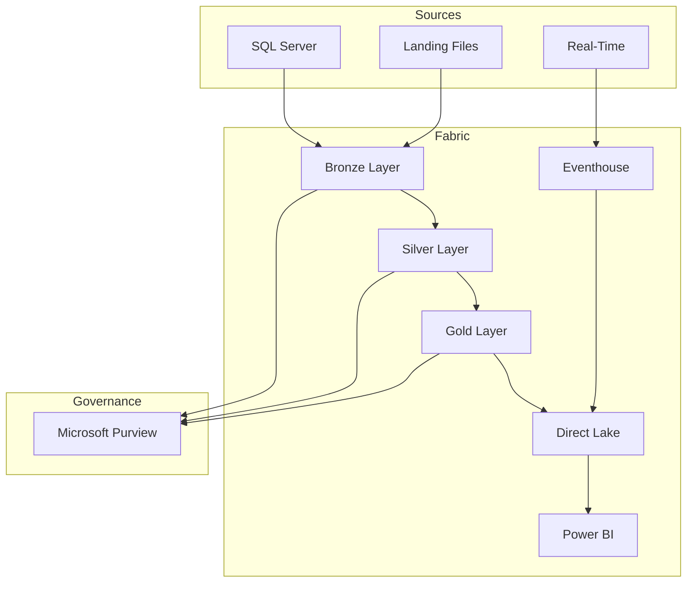

# 📅 Day 3: BI, Governance & Database Mirroring

> 🏠 Home > 📆 POC Agenda > 📊 Day 3

---

**Date:** `[INSERT DATE]`
**Duration:** 8 hours (9:00 AM - 5:00 PM)
**Focus:** Direct Lake Power BI, Purview governance, Database Mirroring
**Audience:** Data Architects (4) + BI Developers (2) + Data Governance (4+)

---

## 📊 Day 3 Progress Tracker

```
Day 3 Progress: ░░░░░░░░░░ 0% Complete
────────────────────────────────────────────
🌅 Morning Session 1:   ░░░░░░░░░░  Direct Lake & Power BI
🌅 Morning Session 2:   ░░░░░░░░░░  Power BI Reports
☀️ Afternoon Session 3: ░░░░░░░░░░  Purview Governance
☀️ Afternoon Session 4: ░░░░░░░░░░  Database Mirroring
```

---

## 📋 Materials Checklist

Before starting, ensure the following are ready:

### Prerequisites from Day 2
- [ ] Gold layer tables populated and optimized
- [ ] Real-time analytics operational
- [ ] All participants have workspace access

### Day 3 Materials
- [ ] DAX measure templates prepared
- [ ] Report layout templates available
- [ ] Purview account configured
- [ ] SQL Server source (if available for mirroring demo)

### Expanded Audience
- [ ] BI Developers notified for 9:00 AM start
- [ ] Governance team notified for 1:30 PM start
- [ ] All stakeholders notified for final session

---

## 🗓️ Daily Schedule At-a-Glance

| Time | Duration | Session | Type | Audience |
|:----:|:--------:|---------|:----:|----------|
| 9:00-10:30 | 1.5 hr | 🌅 Direct Lake & Power BI | 👥 Hands-on | 6 |
| 10:30-10:45 | 15 min | ☕ Break | - | - |
| 10:45-12:30 | 1.75 hr | 🌅 Power BI Reports | 👥 Hands-on | 6 |
| 12:30-13:30 | 1 hr | 🍽️ Lunch | - | - |
| 13:30-15:00 | 1.5 hr | ☀️ Purview Governance | 🎤👥 Demo + Hands-on | 10+ |
| 15:00-15:15 | 15 min | ☕ Break | - | - |
| 15:15-16:30 | 1.25 hr | ☀️ Database Mirroring | 🎤 Demo | 10+ |
| 16:30-17:00 | 30 min | 💬 POC Summary & Next Steps | Discussion | All |

---

## 👥 Audience Expansion Schedule

```
┌─────────────────────────────────────────────────────────────────┐
│  9:00 AM ────────────────────────────────────────────── 5:00 PM │
├─────────────────────────────────────────────────────────────────┤
│  Data Architects (4)  ████████████████████████████████████████  │
│  BI Developers (2)    ████████████████████████████████████████  │
│  Governance Team (4+) ░░░░░░░░░░░░░░░░██████████████████████████│
│                                       ↑                         │
│                                    1:30 PM                      │
└─────────────────────────────────────────────────────────────────┘
```

---

## 🌅 Morning Session 1: Direct Lake & Power BI (9:00 - 10:30)

### 🎯 Session Objectives

| Objective | Duration | Status |
|-----------|:--------:|:------:|
| Create Direct Lake semantic model | 30 min | ⬜ |
| Define relationships in star schema | 15 min | ⬜ |
| Implement DAX measures for casino KPIs | 45 min | ⬜ |

---

### 📝 Activity 9.1: Create Semantic Model (30 min)

**Steps:**

1. Open `lh_gold` Lakehouse
2. Click **New semantic model**
3. Select tables:
   - `gold_slot_performance`
   - `gold_player_360`
   - `gold_compliance_reporting`
4. Name: `Casino Analytics Model`

**Verify Direct Lake Mode:**

- Open model settings
- Confirm "Storage mode: **Direct Lake**"
- Note: No scheduled refresh needed

> 💡 **Direct Lake Advantage:** Data is read directly from Delta tables with no import or refresh required.

---

### 📝 Activity 9.2: Define Relationships (15 min)

Create star schema relationships:

```
┌──────────────────┐
│   dim_date       │
│   (date_key)     │
└────────┬─────────┘
         │
         │ 1:M
         ▼
┌──────────────────────┐     ┌──────────────────┐
│ gold_slot_performance│────▶│   dim_machine    │
│   (business_date)    │ M:1 │   (machine_id)   │
└──────────────────────┘     └──────────────────┘
         │
         │ 1:M
         ▼
┌──────────────────────┐
│  gold_player_360     │
│    (player_id)       │
└──────────────────────┘
```

---

### 📝 Activity 9.3: Create DAX Measures (45 min)

#### Slot Performance Measures

```dax
// Total Coin In
Total Coin In = SUM(gold_slot_performance[total_coin_in])

// Total Coin Out
Total Coin Out = SUM(gold_slot_performance[total_coin_out])

// Net Win
Net Win = [Total Coin In] - [Total Coin Out]

// Hold Percentage
Hold % = DIVIDE([Net Win], [Total Coin In], 0) * 100

// Theoretical Win (assuming 8% hold)
Theoretical Win = [Total Coin In] * 0.08

// Hold Variance
Hold Variance = [Net Win] - [Theoretical Win]

// Win Per Machine Per Day
Win Per Machine =
DIVIDE(
    [Net Win],
    DISTINCTCOUNT(gold_slot_performance[machine_id]),
    0
)

// Games Played
Total Games = SUM(gold_slot_performance[total_games])

// Average Bet
Avg Bet = DIVIDE([Total Coin In], [Total Games], 0)
```

#### Player Measures

```dax
// Total Players
Total Players = COUNTROWS(gold_player_360)

// VIP Players
VIP Players =
CALCULATE(
    COUNTROWS(gold_player_360),
    gold_player_360[loyalty_tier] IN {"Platinum", "Diamond"}
)

// High Churn Risk
High Churn Risk Players =
CALCULATE(
    COUNTROWS(gold_player_360),
    gold_player_360[churn_risk] = "High"
)

// Average Player Value
Avg Player Value = AVERAGE(gold_player_360[player_value_score])

// Active Players (30 days)
Active Players 30D =
CALCULATE(
    COUNTROWS(gold_player_360),
    gold_player_360[days_since_visit] <= 30
)
```

#### Time Intelligence Measures

```dax
// Coin In MTD
Coin In MTD = TOTALMTD([Total Coin In], dim_date[date_key])

// Coin In YTD
Coin In YTD = TOTALYTD([Total Coin In], dim_date[date_key])

// Net Win vs Prior Month
Net Win PM =
CALCULATE(
    [Net Win],
    DATEADD(dim_date[date_key], -1, MONTH)
)

// Net Win Growth %
Net Win Growth % =
DIVIDE(
    [Net Win] - [Net Win PM],
    [Net Win PM],
    0
) * 100

// 7-Day Rolling Average
Coin In 7D Avg =
AVERAGEX(
    DATESINPERIOD(dim_date[date_key], MAX(dim_date[date_key]), -7, DAY),
    [Total Coin In]
)
```

---

## 🌅 Morning Session 2: Power BI Reports (10:45 - 12:30)

### 🎯 Session Objectives

| Objective | Duration | Status |
|-----------|:--------:|:------:|
| Build executive dashboard | 45 min | ⬜ |
| Create operational floor report | 45 min | ⬜ |
| Implement player analytics report | 30 min | ⬜ |

---

### 📝 Activity 10.1: Executive Dashboard (45 min)

**Page Layout:**

```
┌────────────────────────────────────────────────────────────┐
│  CASINO EXECUTIVE DASHBOARD              [Date Slicer]     │
├──────────┬──────────┬──────────┬──────────┬───────────────┤
│ Net Win  │ Hold %   │ Players  │ Games    │ [Zone Slicer] │
│  $2.5M   │   8.2%   │  12,450  │  1.2M    │               │
├──────────┴──────────┴──────────┴──────────┴───────────────┤
│                    NET WIN TREND                           │
│  [Line Chart - Daily Net Win with comparison]             │
├───────────────────────────┬────────────────────────────────┤
│   ZONE PERFORMANCE        │   TOP 10 MACHINES              │
│   [Bar Chart]             │   [Table]                      │
├───────────────────────────┼────────────────────────────────┤
│   PLAYER TIER MIX         │   COMPLIANCE SUMMARY           │
│   [Donut Chart]           │   CTR: 45  SAR: 12  W2G: 234  │
└───────────────────────────┴────────────────────────────────┘
```

**Create Visuals:**

| Visual | Type | Data |
|--------|------|------|
| KPI Cards | Card | Net Win, Hold %, Unique Players, Total Games |
| Net Win Trend | Line Chart | Net Win by Date with Prior Period |
| Zone Performance | Bar Chart | Net Win by Zone |
| Top Machines | Table | machine_id, zone, net_win, hold_% |
| Player Tier Mix | Donut Chart | Players by Loyalty Tier |
| Compliance Summary | Multi-row Card | Filing counts |

---

### 📝 Activity 10.2: Slot Operations Report (45 min)

**Page Layout:**

```
┌────────────────────────────────────────────────────────────┐
│  SLOT OPERATIONS                    [Date] [Zone] [Denom] │
├────────────────────────────────────────────────────────────┤
│                  PERFORMANCE MATRIX                        │
│  [Matrix: Zone rows x Denomination columns]               │
│  Values: Coin In, Net Win, Hold %, Games                  │
├───────────────────────────┬────────────────────────────────┤
│   HOURLY ACTIVITY         │   HOLD VARIANCE ANALYSIS      │
│   [Area Chart by hour]    │   [Scatter: Theo vs Actual]   │
├───────────────────────────┼────────────────────────────────┤
│   MANUFACTURER BREAKDOWN  │   JACKPOT SUMMARY             │
│   [Clustered Bar]         │   [Table with sparklines]     │
└───────────────────────────┴────────────────────────────────┘
```

---

### 📝 Activity 10.3: Player Analytics Report (30 min)

**Page Layout:**

```
┌────────────────────────────────────────────────────────────┐
│  PLAYER ANALYTICS                         [Tier Slicer]   │
├──────────┬──────────┬──────────┬──────────────────────────┤
│  Total   │   VIP    │ At Risk  │  Avg Value Score        │
│ Players  │ Players  │ (Churn)  │                          │
├──────────┴──────────┴──────────┴──────────────────────────┤
│           PLAYER VALUE DISTRIBUTION                        │
│  [Histogram of player_value_score]                        │
├───────────────────────────┬────────────────────────────────┤
│   TIER BREAKDOWN          │   CHURN RISK BY TIER          │
│   [Stacked Column]        │   [100% Stacked Bar]          │
├───────────────────────────┴────────────────────────────────┤
│             TOP 20 PLAYERS BY THEO                         │
│  [Table: player_id, tier, theo, visits, last_visit, risk] │
└────────────────────────────────────────────────────────────┘
```

---

## ☀️ Afternoon Session 3: Purview Integration (13:30 - 15:00)

### 🎯 Session Objectives

| Objective | Duration | Status |
|-----------|:--------:|:------:|
| Connect Purview to Fabric workspace | 20 min | ⬜ |
| Scan and catalog data assets | 20 min | ⬜ |
| Apply classifications and review | 20 min | ⬜ |
| Create glossary terms | 30 min | ⬜ |
| View data lineage | 20 min | ⬜ |

> 👥 **Audience Expansion:** All participants (10+) join for this session

---

### 📝 Activity 11.1: Connect Purview to Fabric (20 min)

**Steps:**

1. Open [Microsoft Purview Portal](https://purview.microsoft.com)
2. Navigate to **Data Map** > **Sources**
3. Click **Register** > **Microsoft Fabric**
4. Configure:
   - Name: `Fabric-Casino-POC`
   - Tenant: Select your tenant
   - Workspace: `casino-fabric-poc`

---

### 📝 Activity 11.2: Create and Run Scan (20 min)

**Steps:**

1. On registered source, click **New scan**
2. Configure:
   - Name: `fabric-full-scan`
   - Scope: All Lakehouses
   - Scan rule set: System default
3. Set trigger: Run once now
4. Click **Save and Run**

---

### 📝 Activity 11.3: Review Auto-Classifications (20 min)

Navigate to scanned tables and verify:

| Table | Column | Expected Classification | Status |
|-------|--------|------------------------|:------:|
| silver_player_master | ssn_hash | Government ID (Hash) | ⬜ |
| silver_player_master | email | Email Address | ⬜ |
| silver_player_master | phone | Phone Number | ⬜ |
| silver_player_master | date_of_birth | Date of Birth | ⬜ |
| bronze_financial_txn | amount | Financial Amount | ⬜ |

---

### 📝 Activity 11.4: Create Glossary Terms (30 min)

**Business Glossary Hierarchy:**

```
Casino Operations
├── Gaming Metrics
│   ├── Coin In
│   ├── Coin Out
│   ├── Net Win
│   ├── Hold Percentage
│   └── Theoretical Win
├── Player Management
│   ├── Player Theo
│   ├── Player LTV
│   └── Churn Risk
└── Compliance
    ├── CTR (Currency Transaction Report)
    ├── SAR (Suspicious Activity Report)
    └── W-2G
```

**Sample Term: Coin In**

```yaml
Name: Coin In
Definition: Total amount wagered by players on gaming devices.
            Represents the handle or total bets placed.
Acronym: CI
Status: Approved
Steward: Casino Analytics Team
Related Terms: Coin Out, Net Win, Hold Percentage
Resources: NIGC MICS Section 543.24
```

---

### 📝 Activity 11.5: View Data Lineage (20 min)

1. Navigate to `gold_slot_performance` in catalog
2. Click **Lineage** tab
3. Observe flow:

```
bronze_slot_telemetry
        ↓
silver_slot_cleansed
        ↓
gold_slot_performance
        ↓
Casino Analytics Model
        ↓
Executive Dashboard
```

4. Click on each node to see transformation details
5. Use **Impact Analysis** to understand downstream effects

---

## ☀️ Afternoon Session 4: Database Mirroring (15:15 - 17:00)

### 🎯 Session Objectives

| Objective | Duration | Status |
|-----------|:--------:|:------:|
| Understand Database Mirroring concepts | 20 min | ⬜ |
| Configure SQL Server mirroring (demo) | 40 min | ⬜ |
| Review Snowflake and Cosmos DB options | 20 min | ⬜ |
| POC Summary and Next Steps | 30 min | ⬜ |

---

### 📝 Activity 12.1: Mirroring Overview (20 min)

**What is Database Mirroring?**

```
Source Database → Change Data Capture → OneLake → Delta Tables
      │                    │                │           │
   SQL Server         Continuous         Automatic   Query with
   Snowflake          Replication        Conversion   Spark/SQL
   Cosmos DB
```

**Benefits:**

| Benefit | Description |
|---------|-------------|
| Near real-time | Data available within seconds |
| No ETL code | Automatic replication |
| Auto sync | Schema changes propagate |
| Delta format | Native Lakehouse integration |

---

### 📝 Activity 12.2: SQL Server Mirroring Demo (40 min)

**Prerequisites (if available):**
- SQL Server 2016+ or Azure SQL Database
- CDC enabled on source

**Enable CDC on Source:**

```sql
-- Enable CDC on database
EXEC sys.sp_cdc_enable_db;

-- Enable CDC on tables
EXEC sys.sp_cdc_enable_table
    @source_schema = N'gaming',
    @source_name = N'slot_transactions',
    @role_name = NULL,
    @supports_net_changes = 1;
```

**Create Mirrored Database in Fabric:**

1. Open workspace `casino-fabric-poc`
2. Click **+ New** > **Mirrored database**
3. Select **Azure SQL Database**
4. Configure connection:
   - Server: `your-sql-server.database.windows.net`
   - Database: `CasinoOperational`
   - Authentication: SQL or Azure AD
5. Select tables to mirror
6. Click **Mirror database**

**Monitor Replication:**

1. Open mirrored database
2. View **Replication status**
3. Check:
   - Initial snapshot progress
   - Ongoing replication lag
   - Table sync status

---

### 📝 Activity 12.3: Query Mirrored Data (20 min)

```python
# Read mirrored table
df = spark.table("lh_mirrored.slot_transactions")

# Join with Gold layer
df_enriched = df.join(
    spark.table("lh_gold.gold_player_360"),
    "player_id",
    "left"
)

# Real-time analysis
df.filter(col("transaction_time") > "2024-01-01") \
  .groupBy("machine_id") \
  .agg(sum("amount").alias("total_amount")) \
  .orderBy(col("total_amount").desc()) \
  .show(10)
```

---

### 📝 Activity 12.4: Snowflake & Cosmos DB Overview (20 min)

**Snowflake Mirroring:**
- Connect to Snowflake account
- Select databases/schemas/tables
- Automatic data type mapping

**Cosmos DB Mirroring:**
- Uses Change Feed
- Handles nested documents
- Arrays become separate rows
- Schema inference automatic

**Hybrid Architecture Pattern:**

```
┌─────────────────────────────────────────────────────────────┐
│                     HYBRID ARCHITECTURE                      │
├─────────────────────────────────────────────────────────────┤
│                                                              │
│   Operational Sources              Fabric OneLake           │
│                                                              │
│   ┌──────────┐                    ┌──────────────┐          │
│   │SQL Server│─── Mirroring ────▶│ lh_mirrored  │          │
│   └──────────┘                    └──────┬───────┘          │
│                                          │                   │
│   ┌──────────┐                    ┌──────▼───────┐          │
│   │Snowflake │─── Mirroring ────▶│  Medallion   │          │
│   └──────────┘                    │  Architecture│          │
│                                   └──────┬───────┘          │
│   ┌──────────┐                          │                   │
│   │Cosmos DB │─── Mirroring ────▶       ▼                   │
│   └──────────┘                    ┌──────────────┐          │
│                                   │ Power BI     │          │
│                                   │ Direct Lake  │          │
│                                   └──────────────┘          │
│                                                              │
└─────────────────────────────────────────────────────────────┘
```

---

## ✅ Day 3 Validation Checklist

### Direct Lake & Power BI

| Checkpoint | Criteria | Status |
|------------|----------|:------:|
| Semantic Model | Created in Direct Lake mode | ⬜ |
| DAX Measures | All calculating correctly | ⬜ |
| Executive Dashboard | Complete | ⬜ |
| Slot Operations Report | Complete | ⬜ |
| Player Analytics Report | Complete | ⬜ |

### Purview Governance

| Checkpoint | Criteria | Status |
|------------|----------|:------:|
| Purview Connection | Connected to Fabric workspace | ⬜ |
| Scan | Completed successfully | ⬜ |
| Classifications | Verified on player data | ⬜ |
| Glossary Terms | 5+ terms created | ⬜ |
| Lineage | Visible for Gold tables | ⬜ |

### Database Mirroring

| Checkpoint | Criteria | Status |
|------------|----------|:------:|
| Concepts | Mirroring understood | ⬜ |
| SQL Server Demo | Completed (if source available) | ⬜ |
| Mirrored Data | Queryable | ⬜ |
| Hybrid Architecture | Understood | ⬜ |

---

## 🏆 POC Completion Summary

### What We Built

| Component | Status | Details |
|-----------|:------:|---------|
| Bronze Layer | ✅ | 6 tables, raw data preservation |
| Silver Layer | ✅ | SCD Type 2, reconciliation, quality |
| Gold Layer | ✅ | KPIs, star schema, optimized |
| Real-Time | ✅ | Eventhouse, KQL, dashboards |
| Power BI | ✅ | Direct Lake, 3 reports |
| Governance | ✅ | Purview, lineage, glossary |
| Mirroring | ✅ | SQL Server demo |

### Architecture Delivered



### Key Metrics Demonstrated

| Metric | Value |
|--------|-------|
| Data Volume | ~1 GB |
| Tables Created | 15+ |
| DAX Measures | 20+ |
| KQL Queries | 10+ |
| Reports | 3 |
| Glossary Terms | 10+ |

---

## 🚀 Next Steps & Recommendations

### Immediate (Week 1-2)

| Priority | Action |
|:--------:|--------|
| 1 | Connect production data sources |
| 2 | Expand data generators for more volume |
| 3 | Add additional compliance reports |

### Short-Term (Month 1)

| Priority | Action |
|:--------:|--------|
| 1 | Implement AI/ML models (Tutorial 09) |
| 2 | Add more real-time use cases |
| 3 | Configure alerting and monitoring |

### Long-Term (Quarter 1)

| Priority | Action |
|:--------:|--------|
| 1 | Production deployment planning |
| 2 | Security hardening (RLS, DLP) |
| 3 | Cost optimization review |
| 4 | Training program rollout |

---

## 📚 Resources & Documentation

### Tutorials

| Tutorial | Topic | Link |
|----------|-------|------|
| 00 | Environment Setup | [View](../tutorials/00-environment-setup/) |
| 01 | Bronze Layer | [View](../tutorials/01-bronze-layer/) |
| 02 | Silver Layer | [View](../tutorials/02-silver-layer/) |
| 03 | Gold Layer | [View](../tutorials/03-gold-layer/) |
| 04 | Real-Time Analytics | [View](../tutorials/04-real-time-analytics/) |
| 05 | Direct Lake & Power BI | [View](../tutorials/05-direct-lake-powerbi/) |
| 06 | Data Pipelines | [View](../tutorials/06-data-pipelines/) |
| 07 | Governance & Purview | [View](../tutorials/07-governance-purview/) |
| 08 | Database Mirroring | [View](../tutorials/08-database-mirroring/) |
| 09 | Advanced AI/ML | [View](../tutorials/09-advanced-ai-ml/) |

### Microsoft Documentation

| Resource | Link |
|----------|------|
| Microsoft Fabric Docs | [learn.microsoft.com/fabric](https://learn.microsoft.com/fabric/) |
| Direct Lake Overview | [Direct Lake Mode](https://learn.microsoft.com/fabric/data-warehouse/direct-lake-mode) |
| Microsoft Purview | [Purview Docs](https://learn.microsoft.com/purview/) |
| Database Mirroring | [Mirroring Docs](https://learn.microsoft.com/fabric/database/mirrored-database/) |

### Support Contacts

| Role | Name | Contact |
|------|------|---------|
| POC Lead | `[Name]` | `[Email]` |
| Microsoft Technical Contact | `[Name]` | `[Email]` |
| Partner Support | `[Name]` | `[Email]` |

---

<div align="center">

**POC Complete!**

```
Day 3:       ██████████ 100% Complete
Overall POC: ██████████ 100% Complete

🎉 Congratulations! 🎉
```

---

[⬅️ Day 2: Transformations](./day2-transformations-realtime.md) | [🏠 POC Overview](./README.md)

</div>
