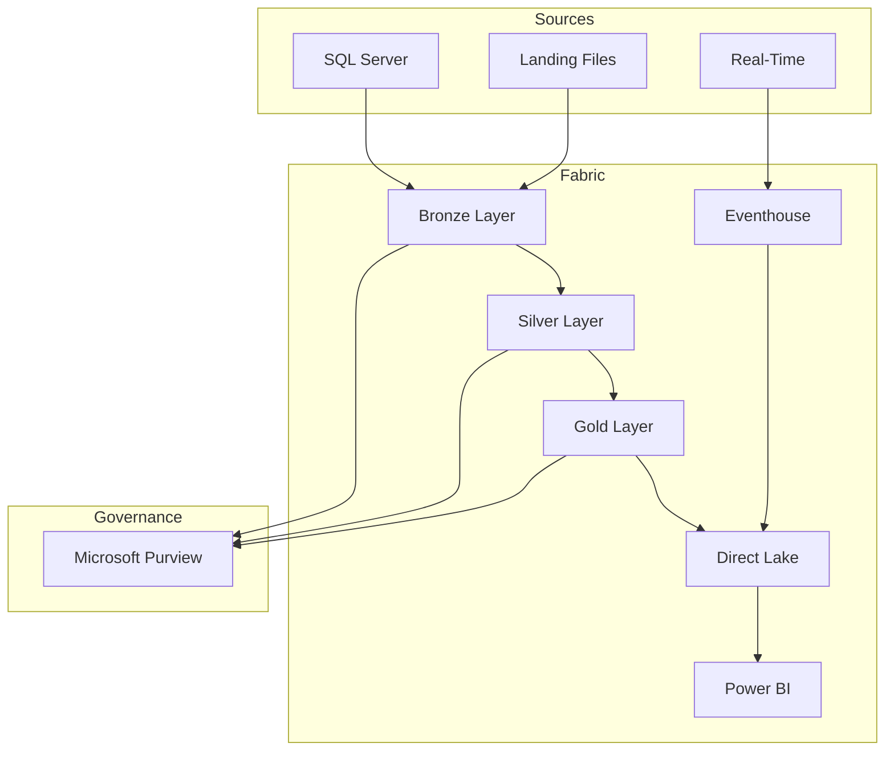

# Day 3: BI, Governance & Database Mirroring

## Overview

**Duration:** 8 hours
**Focus:** Direct Lake Power BI, Purview governance, Database Mirroring
**Audience:** Data Architects (4) + BI Developers (2) + Data Governance (4+)

---

## Morning Session 1: Direct Lake & Power BI (9:00 - 10:30)

### Objectives

- Create Direct Lake semantic model
- Define DAX measures for casino KPIs
- Understand Direct Lake benefits and limitations

### Audience Expansion

Data Architects (4) + BI Developers (2) = 6 participants

### 9.1 Create Semantic Model (30 min)

1. Open `lh_gold` Lakehouse
2. Click **New semantic model**
3. Select tables:
   - `gold_slot_performance`
   - `gold_player_360`
   - `gold_compliance_reporting`
4. Name: `Casino Analytics Model`

**Verify Direct Lake Mode:**
- Open model settings
- Confirm "Storage mode: Direct Lake"
- Note: No scheduled refresh needed

### 9.2 Define Relationships (15 min)

Create star schema relationships:

```
┌──────────────────┐
│   dim_date       │
│   (date_key)     │
└────────┬─────────┘
         │
         │ 1:M
         ▼
┌──────────────────────┐     ┌──────────────────┐
│ gold_slot_performance│────▶│   dim_machine    │
│   (business_date)    │ M:1 │   (machine_id)   │
└──────────────────────┘     └──────────────────┘
         │
         │ 1:M
         ▼
┌──────────────────────┐
│  gold_player_360     │
│    (player_id)       │
└──────────────────────┘
```

### 9.3 Create DAX Measures (45 min)

**Slot Performance Measures:**

```dax
// Total Coin In
Total Coin In = SUM(gold_slot_performance[total_coin_in])

// Total Coin Out
Total Coin Out = SUM(gold_slot_performance[total_coin_out])

// Net Win
Net Win = [Total Coin In] - [Total Coin Out]

// Hold Percentage
Hold % = DIVIDE([Net Win], [Total Coin In], 0) * 100

// Theoretical Win (assuming 8% hold)
Theoretical Win = [Total Coin In] * 0.08

// Hold Variance
Hold Variance = [Net Win] - [Theoretical Win]

// Win Per Machine Per Day
Win Per Machine =
DIVIDE(
    [Net Win],
    DISTINCTCOUNT(gold_slot_performance[machine_id]),
    0
)

// Games Played
Total Games = SUM(gold_slot_performance[total_games])

// Average Bet
Avg Bet = DIVIDE([Total Coin In], [Total Games], 0)
```

**Player Measures:**

```dax
// Total Players
Total Players = COUNTROWS(gold_player_360)

// VIP Players
VIP Players =
CALCULATE(
    COUNTROWS(gold_player_360),
    gold_player_360[loyalty_tier] IN {"Platinum", "Diamond"}
)

// High Churn Risk
High Churn Risk Players =
CALCULATE(
    COUNTROWS(gold_player_360),
    gold_player_360[churn_risk] = "High"
)

// Average Player Value
Avg Player Value = AVERAGE(gold_player_360[player_value_score])

// Active Players (30 days)
Active Players 30D =
CALCULATE(
    COUNTROWS(gold_player_360),
    gold_player_360[days_since_visit] <= 30
)
```

**Time Intelligence:**

```dax
// Coin In MTD
Coin In MTD = TOTALMTD([Total Coin In], dim_date[date_key])

// Coin In YTD
Coin In YTD = TOTALYTD([Total Coin In], dim_date[date_key])

// Net Win vs Prior Month
Net Win PM =
CALCULATE(
    [Net Win],
    DATEADD(dim_date[date_key], -1, MONTH)
)

// Net Win Growth %
Net Win Growth % =
DIVIDE(
    [Net Win] - [Net Win PM],
    [Net Win PM],
    0
) * 100

// 7-Day Rolling Average
Coin In 7D Avg =
AVERAGEX(
    DATESINPERIOD(dim_date[date_key], MAX(dim_date[date_key]), -7, DAY),
    [Total Coin In]
)
```

---

## Morning Session 2: Power BI Reports (10:45 - 12:30)

### Objectives

- Build executive dashboard
- Create operational floor report
- Implement compliance reporting

### 10.1 Executive Dashboard (45 min)

**Page Layout:**

```
┌────────────────────────────────────────────────────────────┐
│  CASINO EXECUTIVE DASHBOARD              [Date Slicer]     │
├──────────┬──────────┬──────────┬──────────┬───────────────┤
│ Net Win  │ Hold %   │ Players  │ Games    │ [Zone Slicer] │
│  $2.5M   │   8.2%   │  12,450  │  1.2M    │               │
├──────────┴──────────┴──────────┴──────────┴───────────────┤
│                    NET WIN TREND                           │
│  [Line Chart - Daily Net Win with comparison]             │
├───────────────────────────┬────────────────────────────────┤
│   ZONE PERFORMANCE        │   TOP 10 MACHINES              │
│   [Bar Chart]             │   [Table]                      │
├───────────────────────────┼────────────────────────────────┤
│   PLAYER TIER MIX         │   COMPLIANCE SUMMARY           │
│   [Donut Chart]           │   CTR: 45  SAR: 12  W2G: 234  │
└───────────────────────────┴────────────────────────────────┘
```

**Create Visuals:**

1. **KPI Cards:** Net Win, Hold %, Unique Players, Total Games
2. **Line Chart:** Net Win by Date with Prior Period
3. **Bar Chart:** Net Win by Zone
4. **Table:** Top 10 Machines (machine_id, zone, net_win, hold_%)
5. **Donut Chart:** Players by Loyalty Tier
6. **Multi-row Card:** Compliance filing counts

### 10.2 Slot Operations Report (45 min)

**Page Layout:**

```
┌────────────────────────────────────────────────────────────┐
│  SLOT OPERATIONS                    [Date] [Zone] [Denom] │
├────────────────────────────────────────────────────────────┤
│                  PERFORMANCE MATRIX                        │
│  [Matrix: Zone rows x Denomination columns]               │
│  Values: Coin In, Net Win, Hold %, Games                  │
├───────────────────────────┬────────────────────────────────┤
│   HOURLY ACTIVITY         │   HOLD VARIANCE ANALYSIS      │
│   [Area Chart by hour]    │   [Scatter: Theo vs Actual]   │
├───────────────────────────┼────────────────────────────────┤
│   MANUFACTURER BREAKDOWN  │   JACKPOT SUMMARY             │
│   [Clustered Bar]         │   [Table with sparklines]     │
└───────────────────────────┴────────────────────────────────┘
```

### 10.3 Player Analytics Report (30 min)

**Page Layout:**

```
┌────────────────────────────────────────────────────────────┐
│  PLAYER ANALYTICS                         [Tier Slicer]   │
├──────────┬──────────┬──────────┬──────────────────────────┤
│  Total   │   VIP    │ At Risk  │  Avg Value Score        │
│ Players  │ Players  │ (Churn)  │                          │
├──────────┴──────────┴──────────┴──────────────────────────┤
│           PLAYER VALUE DISTRIBUTION                        │
│  [Histogram of player_value_score]                        │
├───────────────────────────┬────────────────────────────────┤
│   TIER BREAKDOWN          │   CHURN RISK BY TIER          │
│   [Stacked Column]        │   [100% Stacked Bar]          │
├───────────────────────────┴────────────────────────────────┤
│             TOP 20 PLAYERS BY THEO                         │
│  [Table: player_id, tier, theo, visits, last_visit, risk] │
└────────────────────────────────────────────────────────────┘
```

---

## Afternoon Session 3: Purview Integration (13:30 - 15:00)

### Objectives

- Connect Purview to Fabric workspace
- Scan and catalog data assets
- Apply classifications and glossary terms
- View data lineage

### Audience Expansion

All participants (10+)

### 11.1 Connect Purview to Fabric (20 min)

1. Open [Microsoft Purview Portal](https://purview.microsoft.com)
2. Navigate to **Data Map** > **Sources**
3. Click **Register** > **Microsoft Fabric**
4. Configure:
   - Name: `Fabric-Casino-POC`
   - Tenant: Select your tenant
   - Workspace: `casino-fabric-poc`

### 11.2 Create and Run Scan (20 min)

1. On registered source, click **New scan**
2. Configure:
   - Name: `fabric-full-scan`
   - Scope: All Lakehouses
   - Scan rule set: System default
3. Set trigger: Run once now
4. Click **Save and Run**

### 11.3 Review Auto-Classifications (20 min)

Navigate to scanned tables and verify:

| Table | Column | Expected Classification |
|-------|--------|------------------------|
| silver_player_master | ssn_hash | Government ID (Hash) |
| silver_player_master | email | Email Address |
| silver_player_master | phone | Phone Number |
| silver_player_master | date_of_birth | Date of Birth |
| bronze_financial_txn | amount | Financial Amount |

### 11.4 Create Glossary Terms (30 min)

**Business Glossary Hierarchy:**

```
Casino Operations
├── Gaming Metrics
│   ├── Coin In
│   ├── Coin Out
│   ├── Net Win
│   ├── Hold Percentage
│   └── Theoretical Win
├── Player Management
│   ├── Player Theo
│   ├── Player LTV
│   └── Churn Risk
└── Compliance
    ├── CTR (Currency Transaction Report)
    ├── SAR (Suspicious Activity Report)
    └── W-2G
```

**Sample Term: Coin In**

```yaml
Name: Coin In
Definition: Total amount wagered by players on gaming devices.
            Represents the handle or total bets placed.
Acronym: CI
Status: Approved
Steward: Casino Analytics Team
Related Terms: Coin Out, Net Win, Hold Percentage
Resources: NIGC MICS Section 543.24
```

### 11.5 View Data Lineage (20 min)

1. Navigate to `gold_slot_performance` in catalog
2. Click **Lineage** tab
3. Observe flow:

```
bronze_slot_telemetry
        ↓
silver_slot_cleansed
        ↓
gold_slot_performance
        ↓
Casino Analytics Model
        ↓
Executive Dashboard
```

4. Click on each node to see transformation details
5. Use **Impact Analysis** to understand downstream effects

---

## Afternoon Session 4: Database Mirroring (15:15 - 17:00)

### Objectives

- Understand Database Mirroring concepts
- Configure SQL Server mirroring (demo)
- Review Snowflake and Cosmos DB options

### 12.1 Mirroring Overview (20 min)

**What is Database Mirroring?**

```
Source Database → Change Data Capture → OneLake → Delta Tables
      │                    │                │           │
   SQL Server         Continuous         Automatic   Query with
   Snowflake          Replication        Conversion   Spark/SQL
   Cosmos DB
```

**Benefits:**
- Near real-time data availability
- No ETL code required
- Automatic schema synchronization
- Delta Lake format in OneLake

### 12.2 SQL Server Mirroring Demo (40 min)

**Prerequisites (if available):**
- SQL Server 2016+ or Azure SQL Database
- CDC enabled on source

**Enable CDC on Source:**

```sql
-- Enable CDC on database
EXEC sys.sp_cdc_enable_db;

-- Enable CDC on tables
EXEC sys.sp_cdc_enable_table
    @source_schema = N'gaming',
    @source_name = N'slot_transactions',
    @role_name = NULL,
    @supports_net_changes = 1;
```

**Create Mirrored Database in Fabric:**

1. Open workspace `casino-fabric-poc`
2. Click **+ New** > **Mirrored database**
3. Select **Azure SQL Database**
4. Configure connection:
   - Server: `your-sql-server.database.windows.net`
   - Database: `CasinoOperational`
   - Authentication: SQL or Azure AD
5. Select tables to mirror
6. Click **Mirror database**

**Monitor Replication:**

1. Open mirrored database
2. View **Replication status**
3. Check:
   - Initial snapshot progress
   - Ongoing replication lag
   - Table sync status

### 12.3 Query Mirrored Data (20 min)

```python
# Read mirrored table
df = spark.table("lh_mirrored.slot_transactions")

# Join with Gold layer
df_enriched = df.join(
    spark.table("lh_gold.gold_player_360"),
    "player_id",
    "left"
)

# Real-time analysis
df.filter(col("transaction_time") > "2024-01-01") \
  .groupBy("machine_id") \
  .agg(sum("amount").alias("total_amount")) \
  .orderBy(col("total_amount").desc()) \
  .show(10)
```

### 12.4 Snowflake & Cosmos DB Overview (20 min)

**Snowflake Mirroring:**
- Connect to Snowflake account
- Select databases/schemas/tables
- Automatic data type mapping

**Cosmos DB Mirroring:**
- Uses Change Feed
- Handles nested documents
- Arrays become separate rows
- Schema inference automatic

**Hybrid Architecture Pattern:**

```
┌─────────────────────────────────────────────────────────────┐
│                     HYBRID ARCHITECTURE                      │
├─────────────────────────────────────────────────────────────┤
│                                                              │
│   Operational Sources              Fabric OneLake           │
│                                                              │
│   ┌──────────┐                    ┌──────────────┐          │
│   │SQL Server│─── Mirroring ────▶│ lh_mirrored  │          │
│   └──────────┘                    └──────┬───────┘          │
│                                          │                   │
│   ┌──────────┐                    ┌──────▼───────┐          │
│   │Snowflake │─── Mirroring ────▶│  Medallion   │          │
│   └──────────┘                    │  Architecture│          │
│                                   └──────┬───────┘          │
│   ┌──────────┐                          │                   │
│   │Cosmos DB │─── Mirroring ────▶       ▼                   │
│   └──────────┘                    ┌──────────────┐          │
│                                   │ Power BI     │          │
│                                   │ Direct Lake  │          │
│                                   └──────────────┘          │
│                                                              │
└─────────────────────────────────────────────────────────────┘
```

---

## Day 3 Validation Checklist

### Direct Lake & Power BI
- [ ] Semantic model created in Direct Lake mode
- [ ] All DAX measures calculating correctly
- [ ] Executive dashboard complete
- [ ] Slot operations report complete
- [ ] Player analytics report complete

### Purview Governance
- [ ] Purview connected to Fabric workspace
- [ ] Scan completed successfully
- [ ] Classifications verified on player data
- [ ] Glossary terms created (5+ terms)
- [ ] Lineage visible for Gold tables

### Database Mirroring
- [ ] Mirroring concepts understood
- [ ] SQL Server demo completed (if source available)
- [ ] Mirrored data queryable
- [ ] Hybrid architecture understood

---

## POC Completion Summary

### What We Built

| Component | Status | Details |
|-----------|--------|---------|
| Bronze Layer | ✅ | 6 tables, raw data preservation |
| Silver Layer | ✅ | SCD Type 2, reconciliation, quality |
| Gold Layer | ✅ | KPIs, star schema, optimized |
| Real-Time | ✅ | Eventhouse, KQL, dashboards |
| Power BI | ✅ | Direct Lake, 3 reports |
| Governance | ✅ | Purview, lineage, glossary |
| Mirroring | ✅ | SQL Server demo |

### Architecture Delivered



### Key Metrics Demonstrated

| Metric | Value |
|--------|-------|
| Data Volume | ~1 GB |
| Tables Created | 15+ |
| DAX Measures | 20+ |
| KQL Queries | 10+ |
| Reports | 3 |
| Glossary Terms | 10+ |

---

## Next Steps & Recommendations

### Immediate (Week 1-2)
1. Connect production data sources
2. Expand data generators for more volume
3. Add additional compliance reports

### Short-Term (Month 1)
1. Implement AI/ML models (Tutorial 09)
2. Add more real-time use cases
3. Configure alerting and monitoring

### Long-Term (Quarter 1)
1. Production deployment planning
2. Security hardening (RLS, DLP)
3. Cost optimization review
4. Training program rollout

---

## Resources & Documentation

### Tutorials
- [Tutorial 00: Environment Setup](../tutorials/00-environment-setup/)
- [Tutorial 01: Bronze Layer](../tutorials/01-bronze-layer/)
- [Tutorial 02: Silver Layer](../tutorials/02-silver-layer/)
- [Tutorial 03: Gold Layer](../tutorials/03-gold-layer/)
- [Tutorial 04: Real-Time Analytics](../tutorials/04-real-time-analytics/)
- [Tutorial 05: Direct Lake & Power BI](../tutorials/05-direct-lake-powerbi/)
- [Tutorial 06: Data Pipelines](../tutorials/06-data-pipelines/)
- [Tutorial 07: Governance & Purview](../tutorials/07-governance-purview/)
- [Tutorial 08: Database Mirroring](../tutorials/08-database-mirroring/)
- [Tutorial 09: Advanced AI/ML](../tutorials/09-advanced-ai-ml/)

### Microsoft Documentation
- [Microsoft Fabric Documentation](https://learn.microsoft.com/fabric/)
- [Direct Lake Overview](https://learn.microsoft.com/fabric/data-warehouse/direct-lake-mode)
- [Microsoft Purview](https://learn.microsoft.com/purview/)
- [Database Mirroring](https://learn.microsoft.com/fabric/database/mirrored-database/)

### Support Contacts
- POC Lead: [Name]
- Microsoft Technical Contact: [Name]
- Partner Support: [Name]
