# Tutorial 00: Environment Setup

> **🏠 [Home](../../README.md)** > **📖 [Tutorials](../README.md)** > **⚙️ Environment Setup**

---

## 🎓 Tutorial 00: Environment Setup

| | |
|---|---|
| **Difficulty** | ⭐ Beginner |
| **Time** | ⏱️ 30-45 minutes |
| **Prerequisites** | Azure subscription with Fabric enabled |

---

### 📍 Progress Tracker

```
╔════════╦════════╦════════╦════════╦════════╦════════╦════════╦════════╦════════╦════════╗
║   00   ║   01   ║   02   ║   03   ║   04   ║   05   ║   06   ║   07   ║   08   ║   09   ║
║ SETUP  ║ BRONZE ║ SILVER ║  GOLD  ║  RT    ║  PBI   ║ PIPES  ║  GOV   ║ MIRROR ║  AI/ML ║
╠════════╬════════╬════════╬════════╬════════╬════════╬════════╬════════╬════════╬════════╣
║   ●    ║   ○    ║   ○    ║   ○    ║   ○    ║   ○    ║   ○    ║   ○    ║   ○    ║   ○    ║
╚════════╩════════╩════════╩════════╩════════╩════════╩════════╩════════╩════════╩════════╝
     ▲
     │
 YOU ARE HERE
```

| Navigation | |
|---|---|
| **Previous** | N/A - This is the first tutorial |
| **Next** | [01-Bronze Layer](../01-bronze-layer/README.md) |

---

## 📖 Overview

This tutorial guides you through setting up your Microsoft Fabric environment for the Casino/Gaming POC. You will create the foundational workspace and Lakehouse infrastructure needed for the medallion architecture.

```mermaid
graph LR
    subgraph "What We're Building"
        A[Azure Subscription] --> B[Fabric Workspace]
        B --> C[🥉 lh_bronze]
        B --> D[🥈 lh_silver]
        B --> E[🥇 lh_gold]
    end
```



---

## 🎯 Learning Objectives

By the end of this tutorial, you will be able to:

- [ ] Understand Microsoft Fabric workspace structure
- [ ] Create and configure a Fabric workspace
- [ ] Create Lakehouses for the medallion architecture
- [ ] Connect to Azure Data Lake Storage
- [ ] Configure workspace settings and access

---

## 📋 Prerequisites

Before starting, ensure you have:

- [ ] Azure subscription with Fabric enabled
- [ ] Fabric capacity (F64 recommended, F2 minimum for POC)
- [ ] Azure CLI installed locally (optional)
- [ ] Access to Fabric portal (app.fabric.microsoft.com)

> ℹ️ **Note:** If you don't have a Fabric capacity, you can start a free trial at [app.fabric.microsoft.com](https://app.fabric.microsoft.com).

---

## 🛠️ Step 1: Access Microsoft Fabric

1. Navigate to [Microsoft Fabric](https://app.fabric.microsoft.com)
2. Sign in with your Azure AD / Entra ID account
3. Verify you see the Fabric home page

### Verify Capacity Access

1. Click on **Settings** (gear icon) in the top right
2. Select **Admin portal** (if you have admin access)
3. Navigate to **Capacity settings**
4. Confirm your Fabric capacity is available and running

> ⚠️ **Warning:** If your capacity is paused, notebooks and data processing will not work. Ensure the capacity is in "Active" state before proceeding.

---

## 🛠️ Step 2: Create Workspace

### Create a New Workspace

1. In the left navigation, click **Workspaces**
2. Click **+ New workspace**
3. Configure the workspace:

   | Setting | Value |
   |---------|-------|
   | Name | `casino-fabric-poc` |
   | Description | Casino/Gaming Fabric POC - Medallion Architecture |
   | License mode | Fabric capacity |
   | Capacity | Select your Fabric capacity |

4. Click **Apply**

### Configure Workspace Settings

1. Open workspace settings (three dots > Settings)
2. Configure the following:

   **General:**
   - Contact list: Add team members
   - Default storage format: Delta

   **Premium/Fabric:**
   - License mode: Fabric capacity
   - Default storage format: Delta/Parquet

> ℹ️ **Note:** Using Delta format enables time travel, ACID transactions, and schema evolution - all critical features for our medallion architecture.

---

## 🛠️ Step 3: Create Lakehouses

We'll create three Lakehouses for the medallion architecture.

```mermaid
graph TB
    subgraph "Medallion Architecture"
        direction LR
        B[🥉 lh_bronze<br/>Raw Data] --> S[🥈 lh_silver<br/>Cleansed Data]
        S --> G[🥇 lh_gold<br/>Business Ready]
    end
```



### 🥉 Bronze Lakehouse (Raw Data)

1. In your workspace, click **+ New** > **Lakehouse**
2. Name: `lh_bronze`
3. Click **Create**

### 🥈 Silver Lakehouse (Cleansed Data)

1. Click **+ New** > **Lakehouse**
2. Name: `lh_silver`
3. Click **Create**

### 🥇 Gold Lakehouse (Business Ready)

1. Click **+ New** > **Lakehouse**
2. Name: `lh_gold`
3. Click **Create**

### Verify Lakehouses

Your workspace should now contain:

```
casino-fabric-poc/
├── 🥉 lh_bronze
├── 🥈 lh_silver
└── 🥇 lh_gold
```

---

## 🛠️ Step 4: Connect to External Storage (Optional)

If you deployed the ADLS Gen2 storage account via Bicep, connect it as a shortcut.

### Create OneLake Shortcut to ADLS

1. Open `lh_bronze`
2. In the **Explorer** pane, right-click on **Files**
3. Select **New shortcut**
4. Choose **Azure Data Lake Storage Gen2**
5. Enter connection details:

   | Setting | Value |
   |---------|-------|
   | URL | Your ADLS DFS endpoint |
   | Connection | Create new |
   | Authentication | Organizational account |

6. Browse to the `landing` container
7. Name the shortcut: `landing_zone`
8. Click **Create**

> ℹ️ **Note:** Shortcuts allow you to access external data without copying it, reducing storage costs and keeping data in sync.

---

## 🛠️ Step 5: Configure Workspace Access

### Add Team Members

1. Open workspace settings
2. Navigate to **Access**
3. Add users with appropriate roles:

   | Role | Who | Permissions |
   |------|-----|-------------|
   | Admin | Workspace owners | Full control |
   | Member | Data engineers | Edit all items |
   | Contributor | Developers | Create/edit |
   | Viewer | Business users | Read only |

> ⚠️ **Warning:** Be careful when assigning Admin roles. Admins can delete the workspace and all its contents.

---

## 🛠️ Step 6: Install Local Tools (Optional)

For local development and data generation, install these tools:

### Required Tools

| Tool | Purpose | Installation |
|------|---------|--------------|
| Python 3.10+ | Data generation scripts | [python.org](https://python.org) |
| VS Code | Code editor | [code.visualstudio.com](https://code.visualstudio.com) |
| Azure CLI | Azure management | [docs.microsoft.com](https://docs.microsoft.com/cli/azure/install-azure-cli) |

### Python Environment Setup

```bash
# Create virtual environment
python -m venv .venv

# Activate (Windows)
.venv\Scripts\activate

# Activate (macOS/Linux)
source .venv/bin/activate

# Install dependencies (if requirements.txt exists)
pip install -r requirements.txt
```

---

## ✅ Step 7: Verify Setup

### Run Verification Checks

1. **Workspace accessible:** Can see all three Lakehouses
2. **Capacity assigned:** Workspace shows "Premium" or "Fabric" badge
3. **Shortcuts working:** Can browse landing zone (if configured)
4. **Permissions correct:** Team members can access

### Create a Test Table

1. Open `lh_bronze`
2. Click **Open notebook** > **New notebook**
3. Run this test code:

```python
# Test Lakehouse connectivity
from pyspark.sql import SparkSession

# Create test data
data = [("test", 1), ("data", 2)]
df = spark.createDataFrame(data, ["name", "value"])

# Write to Bronze Lakehouse
df.write.format("delta").mode("overwrite").save("Tables/test_connection")

print("✅ Success! Lakehouse is configured correctly.")
```

4. Verify the `test_connection` table appears in the Tables folder
5. Delete the test table when done:

```python
# Clean up test table
spark.sql("DROP TABLE IF EXISTS test_connection")
print("✅ Test table cleaned up.")
```

---

## ✅ Validation Checklist

Before proceeding to the next tutorial, verify:

- [ ] Workspace `casino-fabric-poc` created
- [ ] All three Lakehouses created (lh_bronze, lh_silver, lh_gold)
- [ ] Capacity assigned correctly
- [ ] ADLS shortcut configured (if applicable)
- [ ] Team access permissions set
- [ ] Test notebook executed successfully
- [ ] Test table created and deleted

---

## 🔧 Troubleshooting

### Workspace Creation Fails

| Issue | Solution |
|-------|----------|
| "Fabric not enabled" | Contact your tenant admin to enable Fabric |
| "No capacity available" | Start a trial or provision a capacity |
| "Permission denied" | Ensure your account has workspace creation rights |

### Shortcut Connection Fails

| Issue | Solution |
|-------|----------|
| "Cannot connect" | Verify ADLS account exists and is accessible |
| "Firewall blocked" | Check firewall/private endpoint settings |
| "Access denied" | Ensure you have Storage Blob Data Reader role |

### Notebook Won't Run

| Issue | Solution |
|-------|----------|
| "Capacity not available" | Verify capacity is running (not paused) |
| "Spark pool error" | Wait 2-3 minutes for first-time Spark startup |
| "Out of memory" | Reduce data size or upgrade capacity |

---

## 🎉 Summary

Congratulations! You have successfully:

- ✅ Created a Microsoft Fabric workspace for the Casino POC
- ✅ Set up the medallion architecture with Bronze, Silver, and Gold Lakehouses
- ✅ Configured external storage connectivity (optional)
- ✅ Verified the environment is ready for data ingestion

Your environment is now ready to start building the data platform!

---

## ➡️ Next Steps

Continue to **[Tutorial 01: Bronze Layer](../01-bronze-layer/README.md)** to start ingesting raw data into the Bronze layer.

---

## 📚 Resources

- [Microsoft Fabric Documentation](https://learn.microsoft.com/fabric/)
- [Lakehouse Overview](https://learn.microsoft.com/fabric/data-engineering/lakehouse-overview)
- [Workspace Management](https://learn.microsoft.com/fabric/get-started/workspaces)
- [OneLake Shortcuts](https://learn.microsoft.com/fabric/onelake/onelake-shortcuts)

---

## 🧭 Navigation

| Previous | Up | Next |
|----------|-----|------|
| N/A | [📖 Tutorials Index](../README.md) | [01-Bronze Layer](../01-bronze-layer/README.md) ➡️ |

---

> 💬 **Questions or issues?** Open an issue in the [GitHub repository](https://github.com/your-repo/issues).
