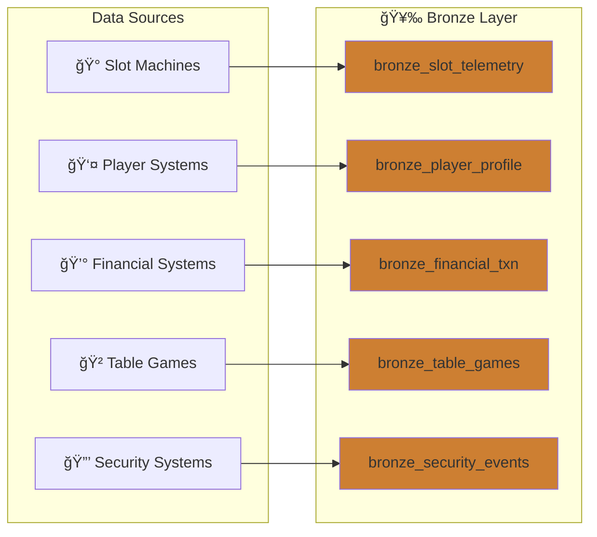

# Tutorial 01: Bronze Layer

> **🏠 [Home](../../README.md)** > **📖 [Tutorials](../README.md)** > **🥉 Bronze Layer**

---

## 🎓 Tutorial 01: Bronze Layer - Raw Data Ingestion

| | |
|---|---|
| **Difficulty** | ⭐ Beginner |
| **Time** | ⏱️ 45-60 minutes |
| **Layer** | 🥉 Bronze (Raw Data) |
| **Prerequisites** | Tutorial 00 completed |

---

### 📍 Progress Tracker

```
╔════════╦════════╦════════╦════════╦════════╦════════╦════════╦════════╦════════╦════════╗
║   00   ║   01   ║   02   ║   03   ║   04   ║   05   ║   06   ║   07   ║   08   ║   09   ║
║ SETUP  ║ BRONZE ║ SILVER ║  GOLD  ║  RT    ║  PBI   ║ PIPES  ║  GOV   ║ MIRROR ║  AI/ML ║
╠════════╬════════╬════════╬════════╬════════╬════════╬════════╬════════╬════════╬════════╣
║   ✓    ║   ●    ║   ○    ║   ○    ║   ○    ║   ○    ║   ○    ║   ○    ║   ○    ║   ○    ║
╚════════╩════════╩════════╩════════╩════════╩════════╩════════╩════════╩════════╩════════╝
              ▲
              │
         YOU ARE HERE
```

| Navigation | |
|---|---|
| **Previous** | [00-Environment Setup](../00-environment-setup/README.md) |
| **Next** | [02-Silver Layer](../02-silver-layer/README.md) |

---

## 📖 Overview

This tutorial covers implementing the Bronze layer of the medallion architecture - raw data ingestion with minimal transformation. The Bronze layer is the foundation that preserves all source data in its original form, ensuring data lineage and enabling reprocessing when needed.



---

## 🎯 Learning Objectives

By the end of this tutorial, you will be able to:

- [ ] Understand Bronze layer principles and schema-on-read
- [ ] Ingest slot machine telemetry data
- [ ] Ingest player profile data
- [ ] Ingest financial transaction data
- [ ] Implement metadata tracking columns for data lineage
- [ ] Configure Delta Lake tables with proper options

---

## 🥉 Bronze Layer Principles

The Bronze layer is the foundation of the medallion architecture. Understanding these principles is critical for building a robust data platform.

| Principle | Description | Why It Matters |
|-----------|-------------|----------------|
| **Raw Data** | Store data as-is from source systems | Enables reprocessing if business logic changes |
| **Append-Only** | Never update or delete; always append | Maintains complete audit trail |
| **Full Fidelity** | Preserve all source fields | No data loss, even for unused fields |
| **Metadata** | Track ingestion time, source, batch | Enables lineage and debugging |
| **Schema-on-Read** | Minimal schema enforcement at ingestion | Reduces ingestion failures |

> ℹ️ **Note:** The Bronze layer is often called the "raw" or "landing" layer. Its purpose is to capture everything exactly as received from source systems.

### Schema-on-Read Explained

Unlike traditional databases that enforce schema at write time (schema-on-write), the Bronze layer uses schema-on-read:


**Benefits of Schema-on-Read:**
- No data loss from validation failures
- Source schema changes don't break ingestion
- Can reprocess data with new transformations
- Faster ingestion (no validation overhead)

---

## 📋 Prerequisites

Before starting, ensure you have:

- [ ] Completed [Tutorial 00: Environment Setup](../00-environment-setup/README.md)
- [ ] Generated sample data (see [Data Generation](../../data-generation/README.md))
- [ ] Access to `lh_bronze` Lakehouse

> ⚠️ **Warning:** If you haven't generated sample data yet, do so before continuing. The notebooks in this tutorial expect data files to exist.

---

## 🛠️ Step 1: Upload Sample Data

### Option A: Generate and Upload via Fabric UI

1. Generate sample data locally:
   ```bash
   cd data-generation
   python generate.py --all --days 30 --output ./output
   ```

2. In Fabric, open `lh_bronze`
3. In **Files** section, click **Upload** > **Upload folder**
4. Upload the `output` folder

### Option B: Use Shortcut to ADLS

If you configured ADLS shortcut in Tutorial 00:
1. Copy generated files to your ADLS landing zone
2. Files will be accessible via the shortcut

### Expected Files

After upload, your Files section should contain:

```
Files/
├── output/
│   ├── bronze_slot_telemetry.parquet
│   ├── bronze_player_profile.parquet
│   ├── bronze_financial_txn.parquet
│   ├── bronze_table_games.parquet
│   ├── bronze_security_events.parquet
│   └── bronze_compliance.parquet
```

> ℹ️ **Note:** File names may vary based on your data generation configuration. Adjust the notebook paths accordingly.

---

## 🛠️ Step 2: Slot Machine Telemetry Ingestion

This is our primary data source - high-volume telemetry from slot machines on the casino floor.

### Create the Notebook

1. In `lh_bronze`, click **Open notebook** > **New notebook**
2. Name it: `01_bronze_slot_telemetry`

### Understanding the Data

Slot machine telemetry includes:
- Machine events (spins, wins, errors)
- Performance metrics
- Player session data
- Timestamps for each event

### Notebook Code

```python
# Cell 1: Configuration
# =====================
# 🥉 Bronze Layer - Slot Machine Telemetry Ingestion
# This notebook ingests raw slot machine telemetry data

from pyspark.sql import SparkSession
from pyspark.sql.functions import current_timestamp, lit, input_file_name
from pyspark.sql.types import *
from datetime import datetime

# Configuration
SOURCE_PATH = "Files/output/bronze_slot_telemetry.parquet"
TARGET_TABLE = "bronze_slot_telemetry"
BATCH_ID = datetime.now().strftime("%Y%m%d_%H%M%S")

print(f"🥉 Bronze Layer Ingestion")
print(f"   Source: {SOURCE_PATH}")
print(f"   Target: {TARGET_TABLE}")
print(f"   Batch:  {BATCH_ID}")
```

```python
# Cell 2: Read Source Data
# ========================

# Read parquet file - schema-on-read means we accept whatever schema exists
df_raw = spark.read.parquet(SOURCE_PATH)

print(f"📊 Source Statistics:")
print(f"   Records: {df_raw.count():,}")
print(f"   Columns: {len(df_raw.columns)}")
print(f"\n📋 Source Schema:")
df_raw.printSchema()
```

```python
# Cell 3: Add Metadata Columns
# ============================
# These columns enable data lineage and debugging

df_bronze = df_raw \
    .withColumn("_bronze_ingested_at", current_timestamp()) \
    .withColumn("_bronze_source_file", input_file_name()) \
    .withColumn("_bronze_batch_id", lit(BATCH_ID))

print("✅ Added metadata columns:")
print(f"   • _bronze_ingested_at  - When the data was ingested")
print(f"   • _bronze_source_file  - Source file path for lineage")
print(f"   • _bronze_batch_id     - Batch identifier: {BATCH_ID}")
```

> ℹ️ **Note:** The `_bronze_` prefix clearly identifies metadata columns added during Bronze layer processing. This convention helps distinguish system columns from source data.

```python
# Cell 4: Write to Delta Table
# ============================
# Using append mode - Bronze layer is append-only

df_bronze.write \
    .format("delta") \
    .mode("append") \
    .option("mergeSchema", "true") \
    .saveAsTable(TARGET_TABLE)

print(f"✅ Successfully wrote {df_bronze.count():,} records to {TARGET_TABLE}")
```

```python
# Cell 5: Verify Ingestion
# ========================

# Read back and verify
df_verify = spark.table(TARGET_TABLE)

print(f"\n📊 Table Statistics:")
print(f"   Total records: {df_verify.count():,}")
print(f"   Columns: {len(df_verify.columns)}")

# Show sample with key columns
print(f"\n📋 Sample Records:")
df_verify.select(
    "event_id", "machine_id", "event_type",
    "event_timestamp", "_bronze_ingested_at"
).show(5, truncate=False)
```

```python
# Cell 6: Table Metadata & History
# ================================
# Delta Lake automatically tracks all changes

from delta.tables import DeltaTable

delta_table = DeltaTable.forName(spark, TARGET_TABLE)

print("📜 Delta Table History:")
delta_table.history(5).select(
    "version", "timestamp", "operation", "operationMetrics"
).show(truncate=False)
```

### Run the Notebook

1. Click **Run all** to execute all cells
2. Verify the table appears in the **Tables** section of `lh_bronze`
3. Check the row count matches expected

---

## 🛠️ Step 3: Player Profile Ingestion

Player profile data contains customer information - handle with care as it may contain PII.

### Create Notebook

Create notebook: `02_bronze_player_profile`

```python
# Cell 1: Configuration
# =====================
# 🥉 Bronze Layer - Player Profile Ingestion

from pyspark.sql.functions import current_timestamp, lit, input_file_name
from datetime import datetime

SOURCE_PATH = "Files/output/bronze_player_profile.parquet"
TARGET_TABLE = "bronze_player_profile"
BATCH_ID = datetime.now().strftime("%Y%m%d_%H%M%S")

print(f"🥉 Bronze Layer - Player Profile Ingestion")
print(f"   Batch ID: {BATCH_ID}")
```

```python
# Cell 2: Read and Add Metadata
# =============================

df_raw = spark.read.parquet(SOURCE_PATH)
print(f"📊 Source records: {df_raw.count():,}")

# Add metadata columns
df_bronze = df_raw \
    .withColumn("_bronze_ingested_at", current_timestamp()) \
    .withColumn("_bronze_source_file", input_file_name()) \
    .withColumn("_bronze_batch_id", lit(BATCH_ID))
```

```python
# Cell 3: Write to Delta Table
# ============================

df_bronze.write \
    .format("delta") \
    .mode("append") \
    .option("mergeSchema", "true") \
    .saveAsTable(TARGET_TABLE)

print(f"✅ Wrote {df_bronze.count():,} player records to {TARGET_TABLE}")
```

> ⚠️ **Warning:** Player profile data may contain PII (names, addresses, etc.). Ensure proper access controls are in place and data handling complies with regulations.

---

## 🛠️ Step 4: Financial Transaction Ingestion

Financial transactions require special attention for audit compliance.

### Create Notebook

Create notebook: `03_bronze_financial_txn`

```python
# Cell 1: Configuration
# =====================
# 🥉 Bronze Layer - Financial Transaction Ingestion
# Note: Financial data requires strict audit trail

from pyspark.sql.functions import current_timestamp, lit, input_file_name
from datetime import datetime

SOURCE_PATH = "Files/output/bronze_financial_txn.parquet"
TARGET_TABLE = "bronze_financial_txn"
BATCH_ID = datetime.now().strftime("%Y%m%d_%H%M%S")
```

```python
# Cell 2: Read Source Data
# ========================

df_raw = spark.read.parquet(SOURCE_PATH)
print(f"📊 Source records: {df_raw.count():,}")
print(f"📋 Columns: {df_raw.columns}")
```

```python
# Cell 3: Add Metadata
# ====================

df_bronze = df_raw \
    .withColumn("_bronze_ingested_at", current_timestamp()) \
    .withColumn("_bronze_source_file", input_file_name()) \
    .withColumn("_bronze_batch_id", lit(BATCH_ID))
```

```python
# Cell 4: Write to Table
# ======================

df_bronze.write \
    .format("delta") \
    .mode("append") \
    .saveAsTable(TARGET_TABLE)

print(f"✅ Wrote {df_bronze.count():,} financial transactions")
```

> ℹ️ **Note:** Delta Lake's ACID transactions ensure financial data is never partially written. This is critical for audit compliance.

---

## 🛠️ Step 5: Ingest Remaining Data

Repeat the pattern for the remaining data sources:

| Notebook | Source File | Target Table |
|----------|-------------|--------------|
| `04_bronze_table_games` | `bronze_table_games.parquet` | `bronze_table_games` |
| `05_bronze_security_events` | `bronze_security_events.parquet` | `bronze_security_events` |
| `06_bronze_compliance` | `bronze_compliance.parquet` | `bronze_compliance` |

Each notebook follows the same pattern:
1. Read source file (schema-on-read)
2. Add metadata columns (`_bronze_*`)
3. Write to Delta table (append mode)
4. Verify counts

### Template for Additional Tables

```python
# 🥉 Bronze Layer Ingestion Template
# ==================================

from pyspark.sql.functions import current_timestamp, lit, input_file_name
from datetime import datetime

# Configuration - UPDATE THESE VALUES
SOURCE_PATH = "Files/output/bronze_TABLE_NAME.parquet"
TARGET_TABLE = "bronze_TABLE_NAME"
BATCH_ID = datetime.now().strftime("%Y%m%d_%H%M%S")

# Read source
df_raw = spark.read.parquet(SOURCE_PATH)
print(f"📊 Source records: {df_raw.count():,}")

# Add metadata
df_bronze = df_raw \
    .withColumn("_bronze_ingested_at", current_timestamp()) \
    .withColumn("_bronze_source_file", input_file_name()) \
    .withColumn("_bronze_batch_id", lit(BATCH_ID))

# Write to Delta
df_bronze.write \
    .format("delta") \
    .mode("append") \
    .option("mergeSchema", "true") \
    .saveAsTable(TARGET_TABLE)

print(f"✅ Wrote {df_bronze.count():,} records to {TARGET_TABLE}")
```

---

## 🛠️ Step 6: Create Bronze Layer Verification

### Create Verification Notebook

Create notebook: `99_bronze_verification`

```python
# 🥉 Bronze Layer Verification
# ============================
# Run this notebook to verify all Bronze tables are populated

tables = [
    "bronze_slot_telemetry",
    "bronze_player_profile",
    "bronze_financial_txn",
    "bronze_table_games",
    "bronze_security_events",
    "bronze_compliance"
]

print("=" * 70)
print("🥉 BRONZE LAYER VERIFICATION REPORT")
print("=" * 70)

total_records = 0
results = []

for table in tables:
    try:
        count = spark.table(table).count()
        total_records += count
        status = "✅"
        message = f"{count:>12,} records"
    except Exception as e:
        status = "❌"
        message = f"Error: {str(e)[:30]}"
        count = 0

    results.append((status, table, message))
    print(f"{status} {table:35} {message}")

print("-" * 70)
print(f"   {'TOTAL':35} {total_records:>12,} records")
print("=" * 70)

# Summary
passed = sum(1 for r in results if r[0] == "✅")
failed = len(results) - passed

if failed == 0:
    print("\n🎉 All Bronze tables verified successfully!")
else:
    print(f"\n⚠️  {failed} table(s) need attention.")
```

### Expected Output

```
======================================================================
🥉 BRONZE LAYER VERIFICATION REPORT
======================================================================
✅ bronze_slot_telemetry                    1,000,000 records
✅ bronze_player_profile                       50,000 records
✅ bronze_financial_txn                       250,000 records
✅ bronze_table_games                         100,000 records
✅ bronze_security_events                      75,000 records
✅ bronze_compliance                           25,000 records
----------------------------------------------------------------------
   TOTAL                                    1,500,000 records
======================================================================

🎉 All Bronze tables verified successfully!
```

---

## ✅ Validation Checklist

Before proceeding to Silver layer, verify:

- [ ] All 6 Bronze tables created
- [ ] Row counts match source data
- [ ] Metadata columns present (`_bronze_ingested_at`, `_bronze_source_file`, `_bronze_batch_id`)
- [ ] Delta format confirmed (can see table history)
- [ ] No schema errors during ingestion
- [ ] Verification notebook shows all tables passing

---

## 📘 Best Practices

### Schema Evolution

Enable schema evolution for changing source schemas:

```python
df.write \
    .option("mergeSchema", "true") \
    .saveAsTable(table_name)
```

> ℹ️ **Note:** `mergeSchema` allows new columns to be added automatically. This is especially useful when source systems add fields over time.

### Partitioning for Large Tables

For large tables (millions of rows), consider partitioning:

```python
df.write \
    .partitionBy("event_date") \
    .format("delta") \
    .saveAsTable(table_name)
```

**When to partition:**
- Tables > 1 million rows
- Queries frequently filter by the partition column
- Data naturally partitions by date or category

### Table Optimization

After ingestion, optimize tables for better query performance:

```python
# Compact small files
spark.sql(f"OPTIMIZE {table_name}")

# Remove old files (default 7-day retention)
spark.sql(f"VACUUM {table_name}")
```

> ⚠️ **Warning:** VACUUM removes old files. Ensure no long-running queries are accessing old versions before running.

### Data Quality Considerations

While Bronze layer doesn't enforce quality, you should still:

1. **Log anomalies** - Record unexpected nulls, formats
2. **Track row counts** - Compare source vs. ingested
3. **Monitor batch sizes** - Alert on unusual volumes
4. **Check file timestamps** - Detect late-arriving data

---

## 🔧 Troubleshooting

### File Not Found

| Symptom | Cause | Solution |
|---------|-------|----------|
| `Path does not exist` | Wrong file path | Check Files section in Lakehouse |
| `No such file` | Upload incomplete | Re-upload the data files |
| `Permission denied` | Access issue | Verify Lakehouse permissions |

### Schema Mismatch

| Symptom | Cause | Solution |
|---------|-------|----------|
| `Schema mismatch` | Source schema changed | Use `mergeSchema` option |
| `Column not found` | Different column names | Check source file schema |
| `Type mismatch` | Data type differences | Let Bronze ingest as-is, fix in Silver |

### Performance Issues

| Symptom | Cause | Solution |
|---------|-------|----------|
| Slow ingestion | Large file size | Consider partitioning |
| Out of memory | Too much data | Reduce batch size |
| Spark timeouts | Capacity issues | Check capacity CU utilization |

---

## 🎉 Summary

Congratulations! You have successfully:

- ✅ Understood Bronze layer principles and schema-on-read concepts
- ✅ Ingested raw slot machine telemetry into the Bronze layer
- ✅ Created player profile and financial transaction tables
- ✅ Implemented metadata tracking columns for data lineage
- ✅ Verified the Bronze layer is ready for transformation

The Bronze layer now contains all raw data from source systems, preserved in its original form with full lineage tracking.

---

## ➡️ Next Steps

Continue to **[Tutorial 02: Silver Layer](../02-silver-layer/README.md)** to learn how to cleanse, validate, and transform Bronze data into the Silver layer.

---

## 📚 Resources

- [Delta Lake in Fabric](https://learn.microsoft.com/fabric/data-engineering/delta-lake)
- [Lakehouse Tables](https://learn.microsoft.com/fabric/data-engineering/lakehouse-overview)
- [PySpark DataFrame API](https://spark.apache.org/docs/latest/api/python/)
- [Medallion Architecture](https://learn.microsoft.com/azure/databricks/lakehouse/medallion)

---

## 🧭 Navigation

| Previous | Up | Next |
|----------|-----|------|
| [⬅️ 00-Environment Setup](../00-environment-setup/README.md) | [📖 Tutorials Index](../README.md) | [02-Silver Layer](../02-silver-layer/README.md) ➡️ |

---

> 💬 **Questions or issues?** Open an issue in the [GitHub repository](https://github.com/your-repo/issues).
